# Clase 02 - Semana 02 - Introducción a UML, Draw.io y Mermaid

- Unidad 01: **Introducción a POO**
- Fecha: Martes 19 de agosto, 2025.
- Horario: 10:50 - 13:30
- Docente: Diego Obando

## 🎯 Objetivos de la Clase

Al finalizar la clase seras capaz de:

- Comprender los conceptos básicos de UML (Lenguaje de Modelado Unificado).
- Utilizar Draw.io para crear diagramas UML.
- Utilizar Mermaid para generar diagramas a partir de código (Diagram as Code).
- Aplicar UML en el diseño de sistemas orientados a objetos.

## Fundamentos UML

### ¿Qué es UML? 🤔

**UML** (**Unified Modeling Language** o **Lenguaje de Modelado Unificado**) es un lenguaje gráfico estándar para **visualizar**, **especificar**, **construir** y **documentar** sistemas de software.

> 💡 **Piénsalo así:** UML es como los **planos de un arquitecto** para construir una casa, pero para sistemas de software. Antes de construir, necesitas planificar.

#### **Historia Rápida**

- **1990s**: Múltiples notaciones competían (Booch, OMT, OOSE)
- **1997**: Se unificaron en UML 1.0
- **Hoy**: UML 2.5 es el estándar internacional (ISO/IEC 19505)

### ¿Por qué es Importante UML? 🎯

#### **Para el Análisis de Sistemas:**

- 📋 **Capturar requerimientos** de forma visual y clara
- 🤝 **Comunicación** efectiva entre stakeholders (cliente, analistas, desarrolladores)
- 📊 **Documentar procesos** de negocio y flujos de trabajo
- ✅ **Validar** que entendimos correctamente lo que el cliente necesita

#### **Para el Desarrollo de Software:**

- 🏗️ **Diseñar la arquitectura** antes de codificar
- 🧩 **Planificar las clases** y sus relaciones
- 🔄 **Visualizar interacciones** entre componentes
- 🛠️ **Generar código** automáticamente (en algunas herramientas)
- 📚 **Mantener documentación** actualizada del sistema

#### **Para la Carrera Profesional:**

- 🌍 **Estándar internacional** reconocido en toda la industria
- 💼 **Requerido en muchas empresas** para análisis y desarrollo
- 🎓 **Base para certificaciones** profesionales
- 🚀 **Mejora tu empleabilidad** como programador o analista

### Tipos de Diagramas UML 📊

UML define **14 tipos de diagramas** organizados en dos categorías principales:

#### **1. Diagramas Estructurales** (¿Cómo está organizado?)

Muestran la **estructura estática** del sistema:

| Diagrama        | Propósito                                     | ¿Cuándo usarlo?                             |
| --------------- | --------------------------------------------- | ------------------------------------------- |
| **Clases**      | Estructura de clases y relaciones             | ✅ **Siempre** - Base del diseño OO         |
| **Objetos**     | Instancias específicas en tiempo de ejecución | Cuando necesitas mostrar ejemplos concretos |
| **Componentes** | Organización de módulos y dependencias        | En sistemas grandes con muchos módulos      |
| **Despliegue**  | Hardware y distribución del software          | Para aplicaciones web/móviles/distribuidas  |
| **Paquetes**    | Organización de elementos en grupos lógicos   | Proyectos grandes con múltiples módulos     |

#### **2. Diagramas Comportamentales** (¿Cómo funciona?)

Muestran la **dinámica** del sistema:

| Diagrama         | Propósito                                         | ¿Cuándo usarlo?                               |
| ---------------- | ------------------------------------------------- | --------------------------------------------- |
| **Casos de Uso** | Funcionalidades desde perspectiva del usuario     | ✅ **Siempre** - Para capturar requerimientos |
| **Secuencia**    | Intercambio de mensajes en el tiempo              | Para diseñar APIs y flujos complejos          |
| **Actividades**  | Procesos de negocio y flujos de trabajo           | Para documentar procedimientos                |
| **Estados**      | Cambios de estado de un objeto                    | Objetos con comportamiento complejo           |
| **Comunicación** | Interacción entre objetos (énfasis en estructura) | Alternativa a diagramas de secuencia          |

### UML en el Contexto de POO 🔗

UML fue diseñado específicamente para el **paradigma orientado a objetos**, por lo que se alinea perfectamente con los conceptos que ya conoces:

#### **Los 4 Pilares de POO en UML:**

1. **🔒 Encapsulamiento**

   ```
   📝 En UML: Modificadores de visibilidad
   + público
   - privado
   # protegido
   ~ paquete
   ```

2. **🎭 Abstracción**

   ```
   📝 En UML: Clases abstractas e interfaces
   <<abstract>> Clase
   <<interface>> Interface
   ```

3. **👪 Herencia**

   ```
   📝 En UML: Flecha con triángulo vacío
   ClaseHija ──▷ ClasePadre
   ```

4. **🎨 Polimorfismo**
   ```
   📝 En UML: Múltiples clases implementando la misma interfaz
   Clase1 ┊┈┈┈▷ <<interface>>
   Clase2 ┊┈┈┈▷ Interface
   ```

### UML en la Industria Real 🏢

#### **¿Dónde se Usa UML?**

- 🏦 **Bancos**: Para diseñar sistemas financieros complejos
- 🏥 **Hospitales**: Para modelar flujos de atención al paciente
- 🏪 **E-commerce**: Para arquitecturas de tiendas online
- 🎮 **Videojuegos**: Para diseñar mecánicas y personajes
- 📱 **Apps móviles**: Para planificar la experiencia de usuario

#### **Roles que Usan UML:**

- 🎯 **Analistas de Sistemas**: Capturan y documentan requerimientos
- 🏗️ **Arquitectos de Software**: Diseñan la estructura general
- 👨‍💻 **Desarrolladores**: Planifican antes de codificar
- 🧪 **Testers**: Entienden el sistema para crear pruebas
- 📊 **Product Managers**: Comunican visión del producto

#### **Herramientas Empresariales:**

- 💰 **Comerciales**: Enterprise Architect, IBM Rational Rose, Visual Paradigm
- 🆓 **Gratuitas**: Draw.io, PlantUML, Lucidchart
- ⚡ **Ágiles**: Miro, Figma, Mermaid (Diagram as Code)

### Ventajas y Desventajas de UML ⚖️

#### **✅ Ventajas:**

- **Estándar universal** - Todos los desarrolladores lo entienden
- **Visualización clara** - Una imagen vale más que mil líneas de código
- **Comunicación efectiva** - Entre técnicos y no técnicos
- **Detección temprana de errores** - Mejor arreglar en el diseño que en código
- **Documentación viva** - Se puede mantener actualizada

#### **⚠️ Desventajas:**

- **Curva de aprendizaje** - Requiere tiempo dominarlo bien
- **Puede ser excesivo** - Para proyectos pequeños puede ser overkill
- **Mantenimiento** - Si no se actualiza, se vuelve obsoleto
- **No ejecutable** - Los diagramas no se pueden "correr" directamente

### Principios Fundamentales de UML 📚

#### **1. Separación de Preocupaciones**

```
🎯 Cada diagrama tiene un propósito específico
- Casos de Uso → ¿QUÉ hace el sistema?
- Clases → ¿CÓMO está estructurado?
- Secuencia → ¿CUÁNDO ocurren las interacciones?
```

#### **2. Abstracción por Niveles**

```
🔍 Diferentes niveles de detalle según la audiencia
- Alta abstracción → Para gerentes y clientes
- Media abstracción → Para analistas y arquitectos
- Baja abstracción → Para desarrolladores
```

#### **3. Consistencia**

```
✅ Los mismos elementos deben representarse igual
- Una clase "Usuario" debe verse igual en todos los diagramas
- Las relaciones deben ser consistentes entre diagramas
```

### ¿Cuándo NO Usar UML? 🚫

Aunque UML es poderoso, no siempre es la mejor opción:

- **Proyectos muy pequeños** (menos de 100 líneas de código)
- **Prototipos rápidos** donde el código cambia constantemente
- **Scripts simples** o tareas de automatización básicas
- **Cuando el equipo no lo conoce** y no hay tiempo para capacitarse
- **Proyectos con deadlines muy ajustados** donde documentar demora

### 🎯 Puntos Clave para Recordar

1. **UML es un LENGUAJE**, no una herramienta específica
2. **No necesitas usar TODOS los diagramas** - selecciona los que agreguen valor
3. **La COMUNICACIÓN es más importante** que la perfección técnica
4. **Empieza simple** - puedes agregar detalle gradualmente
5. **Mantén los diagramas ACTUALIZADOS** o perderán su valor
6. **UML es una HERRAMIENTA**, no un fin en sí mismo

### 💡 Reflexión Importante

> **"El mejor diagrama UML es el que tu equipo entiende y usa para comunicarse mejor. Un diagrama perfecto que nadie mira no sirve de nada."**

UML debe **facilitar tu trabajo**, no complicarlo. Si un diagrama no te ayuda a entender mejor el sistema o comunicarte mejor con tu equipo, probablemente no lo necesitas.

---

### 🚀 ¿Listo para la Práctica?

En las siguientes secciones vamos a **aprender las herramientas** (Draw.io y Mermaid) para crear estos diagramas, y luego **practicar** con ejemplos reales.

**Pregunta rápida de reflexión:** _¿En qué proyectos que has trabajado te habría ayudado tener diagramas UML antes de empezar a codificar?_ 🤔

## Herramientas Prácticas

Ahora que entendemos **qué es UML** y **por qué es importante**, es hora de aprender **cómo crear** estos diagramas. Vamos a explorar dos herramientas complementarias que te permitirán crear diagramas UML de manera efectiva.

### 🎯 ¿Por Qué Estas Dos Herramientas?

- **Draw.io**: Perfecto para **principiantes** y **presentaciones** - interfaz visual intuitiva
- **Mermaid**: Ideal para **programadores** y **documentación** - código que genera diagramas

**Juntas te dan flexibilidad total** para cualquier situación profesional.

---

## Draw.io (Diagrams.net) 🎨

### ¿Qué es Draw.io?

**Draw.io** (ahora llamado **diagrams.net**) es una herramienta **gratuita**, **basada en web** y **open source** para crear todo tipo de diagramas, con excelente soporte para UML.

#### **🌟 Ventajas Clave:**

- ✅ **100% Gratuito** - Sin límites ni marcas de agua
- ✅ **No requiere instalación** - Funciona en el navegador
- ✅ **Plantillas UML** incluidas
- ✅ **Colaboración en tiempo real**
- ✅ **Integración con Google Drive, OneDrive, GitHub**
- ✅ **Exporta en múltiples formatos** (PNG, SVG, PDF, etc.)

### Setup y Primeros Pasos 🚀

#### **Paso 1: Acceso**

```
🌐 Opción 1: Web - https://app.diagrams.net/
💻 Opción 2: Desktop - Descargar desde diagrams.net
📱 Opción 3: Integrado - En VS Code, Notion, Confluence
```

#### **Paso 2: Crear Nuevo Diagrama**

1. **Ir a app.diagrams.net**
2. **"Create New Diagram"**
3. **Seleccionar plantilla "UML"**
4. **Elegir donde guardar** (local, Google Drive, etc.)

#### **Paso 3: Familiarizarse con la Interfaz**

```
📋 Panel Izquierdo: Biblioteca de formas UML
🎨 Canvas Central: Área de trabajo
⚙️ Panel Derecho: Propiedades y formato
🔧 Toolbar Superior: Herramientas de edición
```

### Interfaz Detallada 🖥️

#### **Panel de Formas UML (Izquierda)**

```
📁 UML Sections disponibles:
├── 📊 Class Diagram
├── 🎭 Use Case
├── 🔄 Activity Diagram
├── ⚡ Sequence Diagram
├── 🏗️ Component Diagram
└── 📦 Deployment Diagram
```

#### **Formas Básicas para Diagramas de Clases:**

- **🏛️ Class**: Rectángulo con 3 secciones
- **🔗 Association**: Línea simple
- **👪 Inheritance**: Flecha con triángulo vacío
- **🔌 Implementation**: Línea punteada con triángulo vacío
- **💎 Composition**: Línea con diamante sólido
- **◇ Aggregation**: Línea con diamante vacío

#### **Propiedades Importantes (Panel Derecho):**

- **Style**: Colores, grosor de línea, fuente
- **Text**: Formato del texto dentro de las formas
- **Arrange**: Capas, alineación, distribución

### Plantillas UML Incluidas 📝

Draw.io incluye plantillas predefinidas para cada tipo de diagrama:

#### **🏛️ Class Diagram Template:**

- Clases con secciones bien definidas
- Relaciones ya configuradas
- Ejemplos de diferentes tipos de relaciones
- Leyenda con simbolos UML

#### **👤 Use Case Template:**

- Actores predefinidos (stick figures)
- Casos de uso (óvalos)
- Límites del sistema (rectángulo)
- Relaciones típicas

#### **⚡ Sequence Diagram Template:**

- Objetos participantes
- Líneas de vida
- Mensajes entre objetos
- Notas explicativas

---

## Mermaid (Diagram as Code) 💻

> ⚠️ **Importante para GitHub**: Los diagramas han sido optimizados para renderizar correctamente tanto en VS Code como en GitHub. Se evitaron notaciones avanzadas que podrían no ser compatibles con el renderizador de GitHub.
> 🛠️ **Compatibilidad GitHub**: Evitamos en los diagramas: valores por defecto (= 0, = now()), sufijos especiales en tipos (ej: string\*), tipos poco estándar (Map, Function) y estereotipos fuera de `<<interface>>` y `<<abstract>>`. Si necesitas más detalle, añádelo como nota de texto, no dentro de la clase.

### ¿Qué es Mermaid?

**Mermaid** es una herramienta que permite crear diagramas escribiendo **código en lugar de arrastrando elementos**. El concepto se llama **"Diagram as Code"**.

#### **🌟 Ventajas de Diagram as Code:**

- ✅ **Control de versiones** - Los diagramas van en Git junto al código
- ✅ **Velocidad** - Más rápido que herramientas gráficas para programadores
- ✅ **Consistencia** - Formato automático, sin preocuparse por alineación
- ✅ **Mantenibilidad** - Fácil actualizar con cambios en el código
- ✅ **Integración** - Se embebe en Markdown, GitHub, GitLab, VS Code
- ✅ **Reproducibilidad** - Mismo código = mismo diagrama siempre

### Sintaxis Básica de Mermaid 📝

#### **Estructura General:**

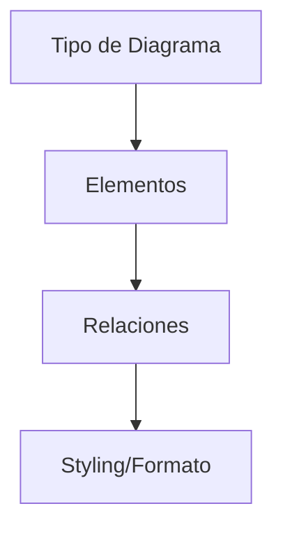

### Diagramas de Clases en Mermaid 🏛️

#### **Sintaxis Base:**

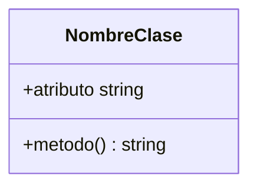

#### **Ejemplo Completo:**

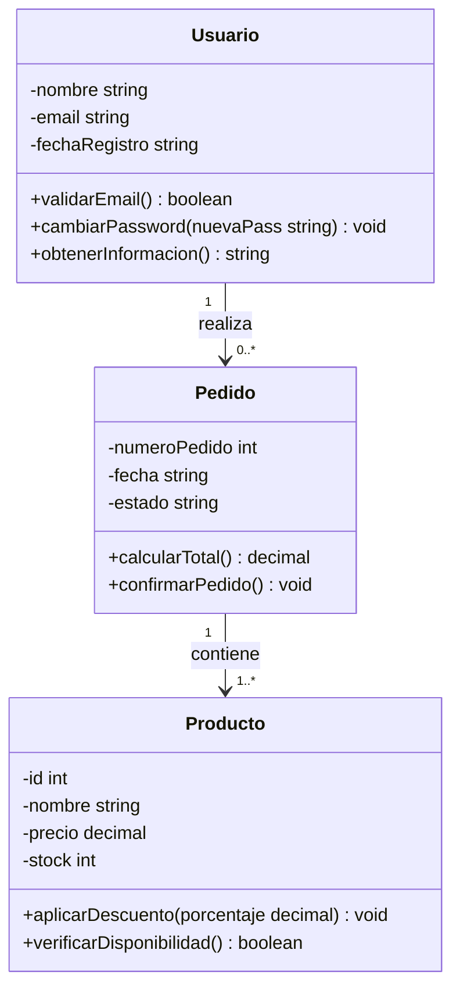

#### **Modificadores de Visibilidad:**

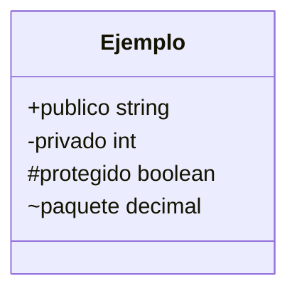

#### **Tipos de Relaciones:**

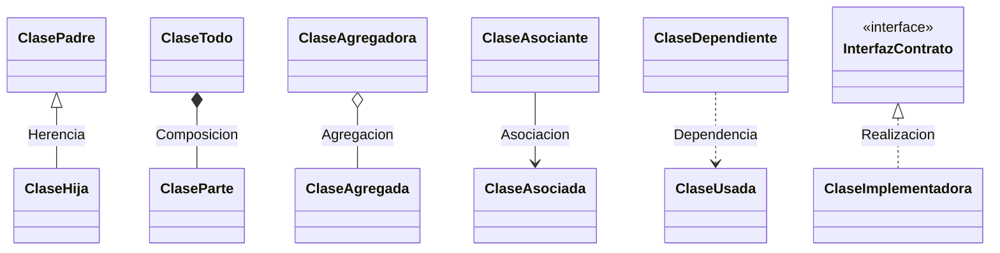

---

## Comparación: Draw.io vs Mermaid ⚖️

### Tabla Comparativa Completa

| Aspecto                       | Draw.io                              | Mermaid                                |
| ----------------------------- | ------------------------------------ | -------------------------------------- |
| **🎯 Curva de Aprendizaje**   | ⭐⭐ Fácil - Drag & Drop             | ⭐⭐⭐ Moderada - Requiere sintaxis    |
| **⚡ Velocidad de Creación**  | ⭐⭐⭐ Rápida para diagramas simples | ⭐⭐⭐⭐ Muy rápida para programadores |
| **🎨 Personalización Visual** | ⭐⭐⭐⭐⭐ Total control visual      | ⭐⭐⭐ Limitada pero consistente       |
| **📚 Control de Versiones**   | ⭐⭐ Archivos binarios pesados       | ⭐⭐⭐⭐⭐ Texto plano, Git-friendly   |
| **🤝 Colaboración**           | ⭐⭐⭐⭐ Tiempo real, comentarios    | ⭐⭐⭐ Via Git/GitHub                  |
| **📖 Documentación**          | ⭐⭐ Archivo separado                | ⭐⭐⭐⭐⭐ Embebido en docs            |

### ¿Cuándo Usar Cada Una? 🤔

#### **Usa Draw.io cuando:**

- 🎨 **Necesitas control visual total** (colores específicos, logos, etc.)
- 👥 **Trabajas con no-programadores** (clientes, gerentes, analistas)
- 📊 **Creas presentaciones** o documentos formales
- 🎯 **Necesitas tipos de diagrama** que Mermaid no soporta bien

#### **Usa Mermaid cuando:**

- 💻 **Eres programador** y prefieres código que drag & drop
- 📚 **Documentas código** en GitHub/GitLab
- 🔄 **El diagrama cambia frecuentemente** (refactoring, nuevas features)
- ⚡ **Necesitas velocidad** sobre perfección visual

---

## Ejercicio Práctico: Primer Diagrama 🛠️

### Sistema a Modelar: "Sistema de Biblioteca Básico"

#### **Clases requeridas:**

- **Libro**: título, autor, ISBN, disponible
- **Usuario**: nombre, email, fechaRegistro
- **Prestamo**: fechaInicio, fechaVencimiento, devuelto

### Parte A: Crear en Draw.io (15 min)

1. **Ir a app.diagrams.net**
2. **Crear nuevo diagrama UML > Class Diagram**
3. **Agregar las 3 clases** con sus atributos
4. **Conectar con las relaciones** apropiadas

### Parte B: Crear en Mermaid (10 min)

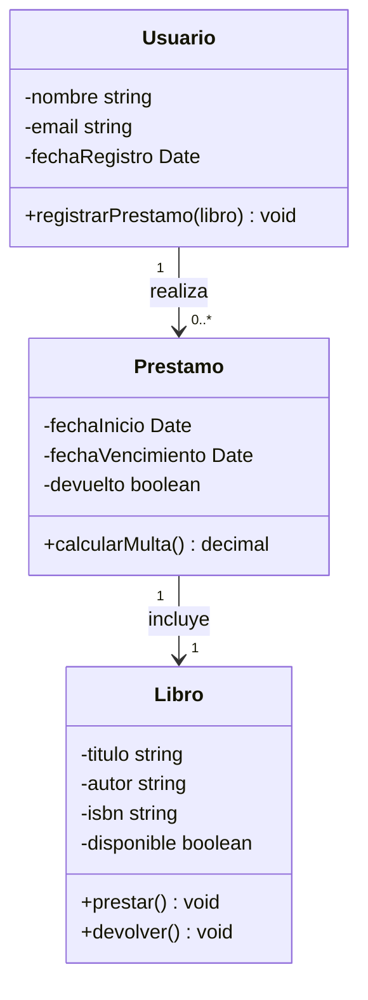

¡Ahora que conoces ambas herramientas, estás listo para crear diagramas UML profesionales! 🚀

---

## Diagramas de Clases UML - Guía Completa 🏛️

Los **diagramas de clases** son el **corazón de UML** y la herramienta más importante para diseñar sistemas orientados a objetos. Son la base sobre la que se construye todo el análisis y diseño de software.

### 🎯 ¿Por Qué Son Tan Importantes?

- 📐 **Planifican la estructura** antes de escribir una línea de código
- 🤝 **Comunican el diseño** entre todo el equipo de desarrollo
- 🔍 **Detectan problemas** de diseño antes de la implementación
- 📚 **Documentan la arquitectura** de manera visual y clara
- 🔄 **Facilitan el mantenimiento** y evolución del sistema

---

## Anatomía de una Clase en UML 🔬

### Estructura Básica de una Clase

Una clase en UML se representa como un **rectángulo dividido en 3 secciones**:

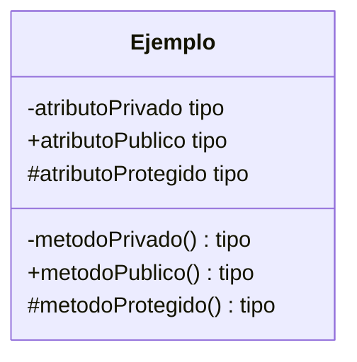

### Sección 1: Nombre de la Clase 📝

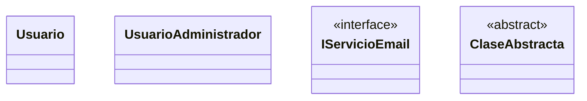

#### **Convenciones de Nomenclatura:**

- ✅ **PascalCase**: `Usuario`, `CuentaBancaria`, `ServicioEmail`
- ✅ **Nombres significativos**: `Producto` > `Item`, `Cliente` > `Person`
- ✅ **Sustantivos**: Representan "cosas" del dominio
- ✅ **Singular**: `Usuario` no `Usuarios`

#### **Estereotipos Comunes:**

- `<<interface>>` - Para interfaces
- `<<abstract>>` - Para clases abstractas
- `<<enumeration>>` - Para enums
- `<<utility>>` - Para clases de utilidad
- `<<entity>>` - Para entidades de negocio

### Sección 2: Atributos 🏷️

#### **Sintaxis Completa:**

```
[visibilidad] nombre : tipo [multiplicidad] [= valorPorDefecto] {propiedades}
```

#### **Modificadores de Visibilidad:**

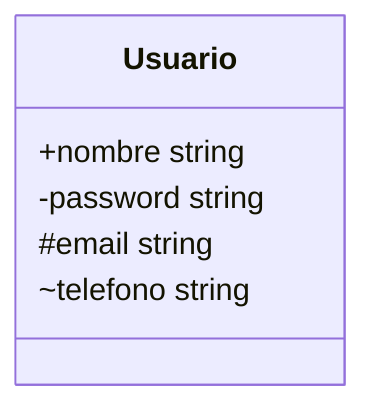

| Símbolo | Significado   | ¿Cuándo usar?                        |
| ------- | ------------- | ------------------------------------ |
| **+**   | **Público**   | Accesible desde cualquier parte      |
| **-**   | **Privado**   | Solo accesible desde la misma clase  |
| **#**   | **Protegido** | Accesible desde la clase y sus hijas |
| **~**   | **Paquete**   | Accesible desde el mismo paquete     |

#### **Tipos de Datos Comunes:**

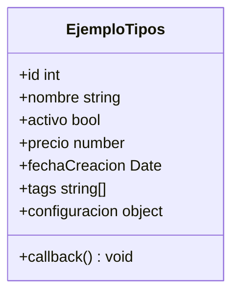

#### **Multiplicidad y Valores por Defecto:**

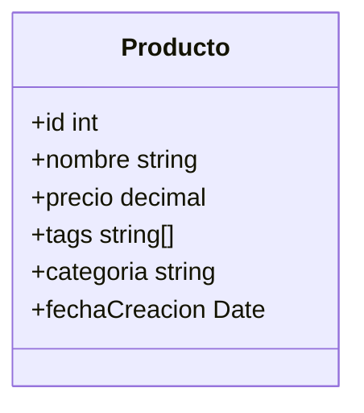

#### **Propiedades Especiales:**

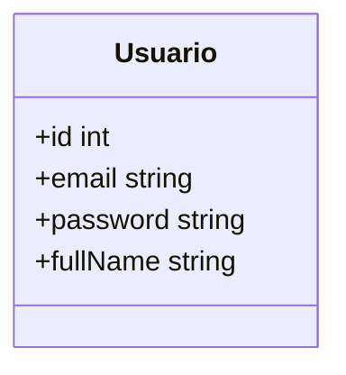

**Notas sobre las propiedades:**

- `id`: readonly - No se puede modificar después de la creación
- `email`: unique - Debe ser único en el sistema
- `password`: derived - Se calcula/hashea automáticamente
- `fullName`: computed - Se computa desde nombre + apellido

### Sección 3: Métodos ⚙️

#### **Sintaxis Completa:**

```
[visibilidad] nombre(parámetros) : tipoRetorno {propiedades}
```

#### **Ejemplos Completos:**

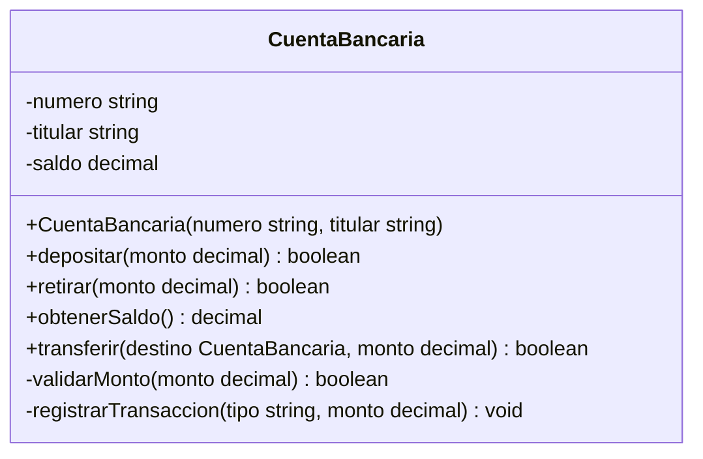

#### **Tipos de Métodos:**

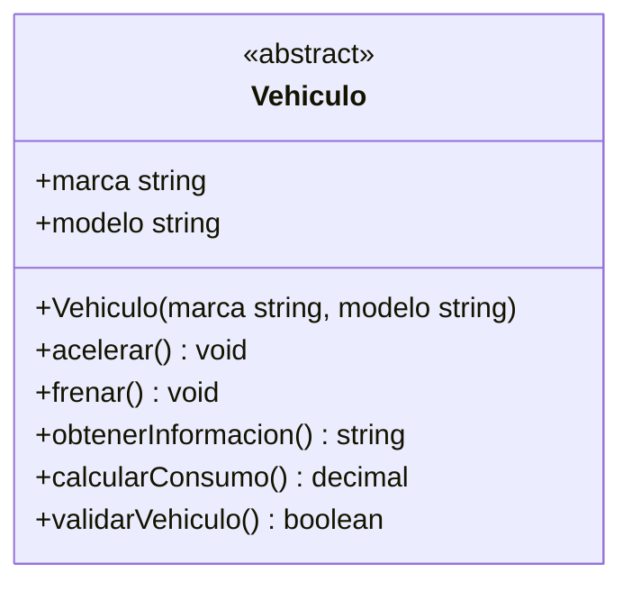

| Notación       | Significado      | Ejemplo             | Nota en GitHub                   |
| -------------- | ---------------- | ------------------- | -------------------------------- |
| **nombre()**   | Método normal    | `acelerar()`        | ✅ Soportado                     |
| **nombre()\*** | Método abstracto | `calcularConsumo()` | ⚠️ Use `<<abstract>>` en clase   |
| **nombre()$**  | Método estático  | `validarVehiculo()` | ⚠️ Use `<<static>>` o comentario |
| **~nombre()**  | Destructor       | `~Vehiculo()`       | ✅ Soportado                     |

---

## Relaciones entre Clases 🔗

Las **relaciones** son lo que hace poderosos a los diagramas de clases. Definen **cómo interactúan** las clases entre sí.

### 1. Asociación (Association) ↔️

**Definición:** Relación básica entre dos clases que indica que **existe algún tipo de conexión**.

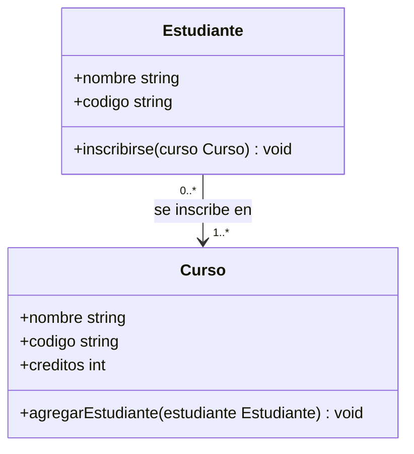

#### **Características:**

- ✅ **Independencia**: Los objetos pueden existir por separado
- ✅ **Bidireccional**: Ambas clases se "conocen"
- ✅ **Temporal**: La relación puede cambiar en el tiempo

#### **Ejemplo del Mundo Real:**

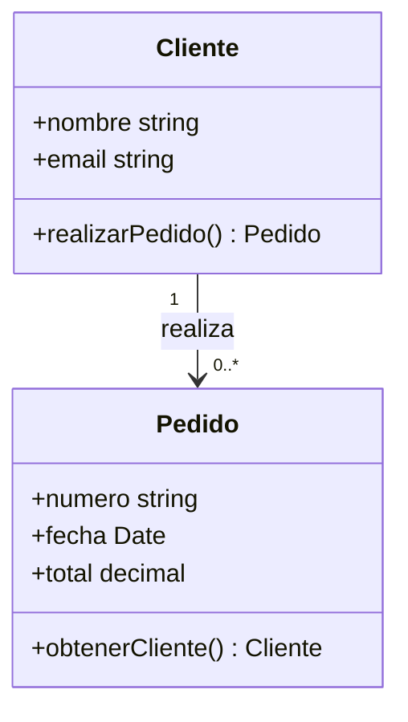

### 2. Agregación (Aggregation) ◇

**Definición:** Relación "**tiene-un**" donde una clase es **parte** de otra, pero pueden existir independientemente.

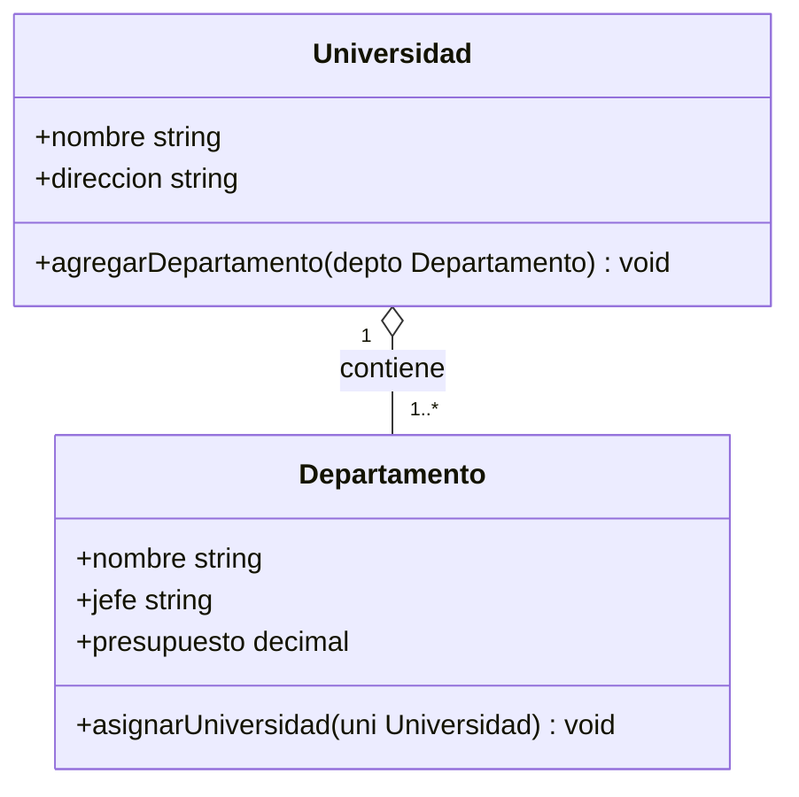

#### **Características:**

- ◇ **Relación "tiene-un" débil**
- ◇ **Independencia**: Las partes pueden existir sin el todo
- ◇ **Compartible**: Una parte puede pertenecer a múltiples todos

#### **Ejemplo Práctico:**

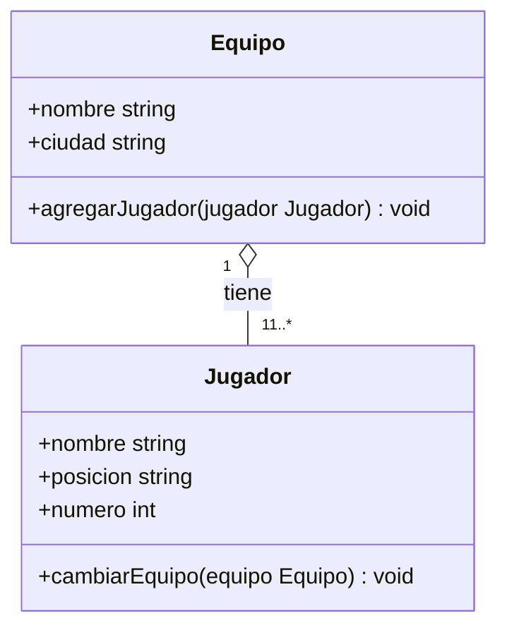

### 3. Composición (Composition) ♦️

**Definición:** Relación "**es-parte-de**" muy fuerte donde las partes **NO pueden existir** sin el todo.

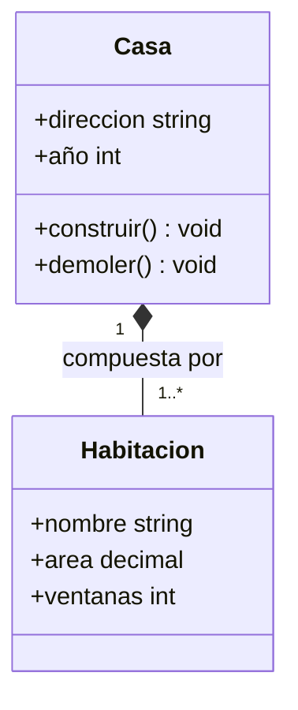

#### **Características:**

- ♦️ **Relación "es-parte-de" fuerte**
- ♦️ **Dependencia total**: Las partes mueren con el todo
- ♦️ **No compartible**: Una parte pertenece a UN solo todo
- ♦️ **Creación/Destrucción**: El todo crea y destruye las partes

#### **Ejemplo del Código:**

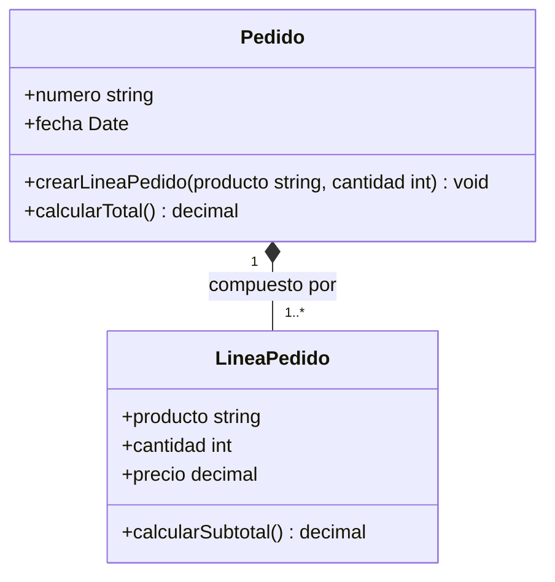

### 4. Herencia (Inheritance) ▷

**Definición:** Relación "**es-un-tipo-de**" donde una clase hija hereda características de la clase padre.

```mermaid
classDiagram
    class Vehiculo {
        <<abstract>>
        #marca string
        #modelo string
        #año int

        +acelerar() void
        +frenar() void
        +obtenerInfo() string
        +calcularImpuesto() decimal
    }

    class Automovil {
        -numeroPuertas int
        -tipoTransmision string

        +abrirPuertas() void
        +calcularImpuesto() decimal
    }

    class Motocicleta {
        -cilindrada int
        -tipoManillar string

        +hacerCaballito() void
        +calcularImpuesto() decimal
    }

    Vehiculo <|-- Automovil
    Vehiculo <|-- Motocicleta
```

#### **Características:**

- ▷ **Relación "es-un-tipo-de"**
- ▷ **Herencia**: La hija obtiene todo lo público/protegido del padre
- ▷ **Polimorfismo**: Puedes usar la hija donde se espera el padre
- ▷ **Especialización**: La hija agrega o modifica comportamiento

### 5. Realización/Implementación (Realization) ▷

**Definición:** Una clase **implementa** una interfaz o contrato.

```mermaid
classDiagram
    class Volador {
        <<interface>>
        +volar() void
        +aterrizar() void
        +obtenerAltitudMaxima() int
    }

    class Ave {
        +nombre string
        +envergadura decimal
        +volar() void
        +aterrizar() void
        +obtenerAltitudMaxima() int
        +ponerHuevos() void
    }

    class Avion {
        +modelo string
        +capacidadPasajeros int
        +volar() void
        +aterrizar() void
        +obtenerAltitudMaxima() int
        +cargarCombustible() void
    }

    Volador <|.. Ave
    Volador <|.. Avion
```

### 6. Dependencia (Dependency) -->

**Definición:** Una clase **usa** temporalmente otra clase (como parámetro, variable local, etc.).

```mermaid
classDiagram
    class ServicioEmail {
        +enviarEmail(destinatario string, mensaje string) boolean
        +validarEmail(email string) boolean
    }

    class Usuario {
        +email string
        +nombre string
        +notificarCambioPassword() void
    }

    class ConfiguracionSMTP {
        +servidor string
        +puerto int
        +usuario string
    }

    Usuario ..> ServicioEmail : usa
    ServicioEmail ..> ConfiguracionSMTP : usa
```

---

## Multiplicidad y Navegabilidad 🧭

### Multiplicidad (Cardinality)

**Define cuántos objetos** pueden participar en la relación:

```mermaid
classDiagram
    class Cliente {
        +nombre string
    }

    class Pedido {
        +numero string
        +fecha Date
    }

    class Producto {
        +nombre string
        +precio decimal
    }

    Cliente "1" --> "0..*" Pedido : realiza
    Pedido "1" --> "1..*" Producto : contiene
```

#### **Notaciones de Multiplicidad:**

| Notación           | Significado     | Ejemplo                                   |
| ------------------ | --------------- | ----------------------------------------- |
| **1**              | Exactamente uno | Un pedido tiene exactamente un cliente    |
| **0..1**           | Cero o uno      | Un usuario puede tener cero o un avatar   |
| **1..\***          | Uno o más       | Un pedido tiene uno o más productos       |
| **0..\*** o **\*** | Cero o más      | Un cliente puede tener cero o más pedidos |
| **2..5**           | Entre 2 y 5     | Un equipo tiene entre 2 y 5 jugadores     |
| **3**              | Exactamente 3   | Un triángulo tiene exactamente 3 vértices |

### Navegabilidad (Navigability)

**Define la dirección** de la relación:

```mermaid
classDiagram
    class ClaseUno {
        +referenciaDos ClaseDos
    }

    class ClaseDos {
        +nombre string
    }

    class ClaseTres {
        +referenciaCuatro ClaseCuatro
        +obtenerCuatro() ClaseCuatro
    }

    class ClaseCuatro {
        +referenciaTres ClaseTres
        +obtenerTres() ClaseTres
    }

    class ClaseCinco {
        +nombre string
    }

    class ClaseSeis {
        +nombre string
    }

    ClaseUno --> ClaseDos : navegacion unidireccional
    ClaseTres <--> ClaseCuatro : navegacion bidireccional
    ClaseCinco --- ClaseSeis : sin navegabilidad especificada
```

#### **Tipos de Navegabilidad:**

- **A → B**: Solo A conoce a B
- **A ← B**: Solo B conoce a A
- **A ↔ B**: Ambos se conocen
- **A — B**: Navegabilidad no especificada

---

## Ejemplo Completo: Sistema de E-Learning 🎓

Vamos a crear un sistema complejo paso a paso, aplicando todos los conceptos:

### Paso 1: Identificar las Clases Principales

```mermaid
classDiagram
    class Usuario {
        +id int
        +nombre string
        +email string
        +fechaRegistro Date
        +login(password string) boolean
        +logout() void
    }

    class Estudiante {
        +codigoEstudiante string
        +carrera string
        +inscribirseEnCurso(curso Curso) boolean
    }

    class Profesor {
        +codigoEmpleado string
        +departamento string
        +especialidades string[]
        +crearCurso(nombre string) Curso
    }

    class Administrador {
        +nivel string
        +permisos string[]
        +gestionarUsuarios() void
    }

    Usuario <|-- Estudiante
    Usuario <|-- Profesor
    Usuario <|-- Administrador
```

### Paso 2: Agregar el Sistema de Cursos

```mermaid
classDiagram
    class Usuario {
        +id int
        +nombre string
        +email string
        +fechaRegistro Date
        +login(password string) boolean
        +logout() void
    }

    class Estudiante {
        +codigoEstudiante string
        +carrera string
        +inscribirseEnCurso(curso Curso) boolean
        +obtenerCalificacion(curso Curso) decimal
    }

    class Profesor {
        +codigoEmpleado string
        +departamento string
        +especialidades string[]
        +crearCurso(nombre string) Curso
        +calificarEstudiante(estudiante Estudiante, nota decimal) void
    }

    class Curso {
        +id int
        +nombre string
        +descripcion string
        +creditos int
        +fechaInicio Date
        +fechaFin Date
        +inscribirEstudiante(estudiante Estudiante) boolean
        +agregarContenido(contenido Contenido) void
    }

    class Inscripcion {
        +fecha Date
        +calificacionFinal decimal
        +estado EstadoInscripcion
        +calcularProgreso() decimal
    }

    Usuario <|-- Estudiante
    Usuario <|-- Profesor

    Profesor "1" --> "0..*" Curso : enseña
    Estudiante "0..*" <--> "0..*" Curso : se inscribe en
    Estudiante "1" --> "0..*" Inscripcion : tiene
    Curso "1" --> "0..*" Inscripcion : contiene
```

### Paso 3: Sistema de Contenidos

```mermaid
classDiagram
    class Curso {
        +id int
        +nombre string
        +descripcion string
        +creditos int
        +fechaInicio Date
        +fechaFin Date
    }

    class Modulo {
        +numero int
        +titulo string
        +descripcion string
        +orden int
        +fechaPublicacion Date
    }

    class Contenido {
        <<abstract>>
        +id int
        +titulo string
        +descripcion string
        +fechaCreacion Date
        +esVisible boolean
    +obtenerTipo() string
    }

    class Video {
        +duracion int
        +url string
        +calidad string
        +reproducir() void
        +obtenerTipo() string
    }

    class Documento {
        +tipoArchivo string
        +tamañoMB decimal
        +rutaArchivo string
        +descargar() void
        +obtenerTipo() string
    }

    class Evaluacion {
        +tipoEvaluacion string
        +puntuacionMaxima decimal
        +tiempoLimite int
        +intentosPermitidos int
        +calificar(respuestas string[]) decimal
        +obtenerTipo() string
    }

    Curso "1" *-- "1..*" Modulo : contiene
    Modulo "1" *-- "0..*" Contenido : incluye

    Contenido <|-- Video
    Contenido <|-- Documento
    Contenido <|-- Evaluacion
```

### Paso 4: Sistema Completo con Todas las Relaciones

```mermaid
classDiagram
    %% Usuarios
    class Usuario {
        +id int
        +nombre string
        +email string
        +password string
        +fechaRegistro Date
        +ultimoAcceso Date
        +activo boolean

        +login(password string) boolean
        +logout() void
        +cambiarPassword(nueva string) boolean
        +obtenerPerfil() PerfilUsuario
    }

    class Estudiante {
        +codigoEstudiante string
        +carrera string
        +semestre int
        +promedio decimal

        +inscribirseEnCurso(curso Curso) boolean
        +entregarTarea(tarea Evaluacion, respuestas string[]) void
        +consultarNotas() Calificacion[]
    }

    class Profesor {
        +codigoEmpleado string
        +departamento string
        +especialidades string[]
        +añosExperiencia int

        +crearCurso(datos DatosCurso) Curso
        +calificarEvaluacion(evaluacion Evaluacion, estudiante Estudiante, nota decimal) void
        +generarReporte() ReporteCurso
    }

    %% Cursos y Contenido
    class Curso {
        +id int
        +codigo string
        +nombre string
        +descripcion string
        +creditos int
        +cupoMaximo int
        +fechaInicio Date
        +fechaFin Date

        +inscribirEstudiante(estudiante Estudiante) boolean
        +publicarModulo(modulo Modulo) void
        +obtenerEstadisticas() EstadisticasCurso
    }

    class Modulo {
        +id int
        +numero int
        +titulo string
        +descripcion string
        +fechaPublicacion Date
        +orden int

        +publicar() void
        +agregarContenido(contenido Contenido) void
    }

    class Contenido {
        <<abstract>>
        +id int
        +titulo string
        +descripcion string
        +fechaCreacion Date
        +esVisible boolean

        +mostrar() void
    +obtenerTipo() string
        +registrarAcceso(usuario Usuario) void
    }

    class Video {
        +duracion int
        +url string
        +calidad string
        +subtitulos boolean

        +reproducir() void
        +obtenerTipo() string
    }

    class Documento {
        +tipoArchivo string
        +tamañoMB decimal
        +rutaArchivo string

        +descargar() void
        +obtenerTipo() string
    }

    class Evaluacion {
        +tipo TipoEvaluacion
        +puntuacionMaxima decimal
        +tiempoLimite int
        +intentosPermitidos int
        +fechaVencimiento Date

        +iniciarIntento(estudiante Estudiante) Intento
        +calificar(respuestas string[]) decimal
        +obtenerTipo() string
    }

    %% Evaluaciones y Calificaciones
    class Intento {
        +id int
        +fechaInicio Date
        +fechaFin Date
        +respuestas string[]
        +puntuacion decimal
        +completado boolean

        +guardarRespuesta(pregunta int, respuesta string) void
        +finalizar() void
    }

    class Calificacion {
        +puntuacion decimal
        +fechaCalificacion Date
        +comentarios string
        +esAprobado boolean

        +calcularPorcentaje() decimal
    }

    %% Relaciones
    Usuario <|-- Estudiante
    Usuario <|-- Profesor

    Profesor "1" --> "0..*" Curso : enseña
    Curso "1" *-- "1..*" Modulo : contiene
    Modulo "1" *-- "0..*" Contenido : incluye

    Contenido <|-- Video
    Contenido <|-- Documento
    Contenido <|-- Evaluacion

    Estudiante "0..*" --> "0..*" Curso : inscrito en
    Evaluacion "1" --> "0..*" Intento : genera
    Estudiante "1" --> "1..*" Intento : realiza
    Intento "1" --> "1" Calificacion : produce

    %% Multiplicidades detalladas
    Curso "1" --> "20..100" Estudiante : máximo estudiantes
    Estudiante "1" --> "1..8" Curso : cursos por semestre
```

---

## Ejercicios Prácticos Guiados 🛠️

### Ejercicio 1: Sistema de Biblioteca Digital (15 min)

**Contexto:** Una biblioteca universitaria quiere digitalizar su sistema de préstamos.

#### **Requerimientos:**

1. **Usuarios:** Estudiantes, Profesores, Bibliotecarios
2. **Recursos:** Libros físicos, E-books, Revistas, Videos
3. **Operaciones:** Reservar, prestar, devolver, renovar
4. **Restricciones:** Límites por tipo de usuario, multas, etc.

#### **Tu Tarea:**

Crea el diagrama de clases paso a paso:

```mermaid
classDiagram
    %% Completa este diagrama
    class Usuario {
        +id int
        +nombre string
        +email string
        %% Agregar más atributos y métodos
    }

    class Recurso {
        <<abstract>>
        +id int
        +titulo string
        %% Agregar más atributos y métodos
    }

    %% Agregar más clases y relaciones
```

#### **Pistas:**

- ¿Qué tipos de herencia necesitas?
- ¿Qué relaciones existen entre usuarios y recursos?
- ¿Cómo modelarías los préstamos?

### Ejercicio 2: Sistema de Delivery de Comida (20 min)

**Contexto:** Crear una app como UberEats/Rappi para AIEP.

#### **Requerimientos:**

1. **Actores:** Clientes, Restaurantes, Repartidores, Administradores
2. **Productos:** Platos, Bebidas, Combos
3. **Procesos:** Pedidos, Pagos, Entregas, Calificaciones
4. **Características:** Geolocalización, tiempo real, notificaciones

#### **Código Base:**

```mermaid
classDiagram
    class Usuario {
        +id int
        +nombre string
        +email string
        +telefono string
        +ubicacion Coordenadas
    }

    class Cliente {
        +direcciones Direccion[]
        +tarjetas TarjetaCredito[]
        +realizarPedido() Pedido
    }

    class Restaurante {
        +nombreComercial string
        +categoria string
        +horarioAtencion Horario
        +calificacionPromedio decimal
        +agregarPlato(plato Plato) void
    }

    %% Continúa el diagrama...
```

### Ejercicio 3: Red Social Educativa (25 min)

**Contexto:** Una red social específica para estudiantes y profesores de AIEP.

#### **Funcionalidades:**

- Perfiles de usuarios con información académica
- Posts, comentarios, likes, shares
- Grupos por carrera/curso
- Foros de preguntas y respuestas
- Sistema de mensajería
- Compartir recursos educativos

#### **Desafíos Adicionales:**

- Modelar la herencia múltiple (un usuario puede ser estudiante Y tutor)
- Sistema de notificaciones polimórfico
- Diferentes tipos de contenido (texto, imagen, video, documento)

---

## Tips Profesionales para Diagramas de Clases 💡

### 1. Metodología de Diseño

#### **Proceso Recomendado:**

1. **📋 Identificar sustantivos** → Candidatos a clases
2. **🔍 Identificar verbos** → Candidatos a métodos/relaciones
3. **🏗️ Organizar jerarquías** → Herencia y abstracción
4. **🔗 Definir relaciones** → Asociaciones, composiciones
5. **⚖️ Refinar y simplificar** → Eliminar redundancias

### 2. Principios de Buen Diseño

#### **Cohesión Alta:**

```mermaid
classDiagram
    %% MALO - Baja cohesión
    class UtilGeneral {
        +calcularImpuesto() decimal
        +enviarEmail() void
        +formatearFecha() string
        +conectarBaseDatos() void
    }

    %% BUENO - Alta cohesión
    class CalculadoraImpuestos {
        +calcularIVA() decimal
        +calcularRenta() decimal
        +aplicarDescuentos() decimal
    }

    class ServicioEmail {
        +enviarEmail() void
        +configurarSMTP() void
        +validarDireccion() boolean
    }
```

#### **Acoplamiento Bajo:**

```mermaid
classDiagram
    %% ✅ Uso de interfaces para reducir acoplamiento
    class ServicioPago {
        -procesadorPago IProcesadorPago
        +procesarPago(monto decimal) boolean
    }

    class IProcesadorPago {
        <<interface>>
        +procesar(monto decimal) boolean
        +validar() boolean
    }

    class PayPal {
        +procesar(monto decimal) boolean
        +validar() boolean
    }

    class Stripe {
        +procesar(monto decimal) boolean
        +validar() boolean
    }

    ServicioPago --> IProcesadorPago
    IProcesadorPago <|.. PayPal
    IProcesadorPago <|.. Stripe
```

### 3. Errores Comunes a Evitar

#### **❌ Error: Demasiado Detalle**

```mermaid
classDiagram
    %% Muy detallado para fase inicial
    class Usuario {
        -id int
        -nombre string
        -apellidoPaterno string
        -apellidoMaterno string
        -email string
        -telefono string
        -direccion string
        -ciudad string
        -codigoPostal string
        -fechaNacimiento Date
        -genero string
        -estadoCivil string
        +getId() int
        +setId(id int) void
        +getNombre() string
        +setNombre(nombre string) void
        %% ... 20 getters/setters más
    }
```

#### **✅ Mejor: Nivel Apropiado**

```mermaid
classDiagram
    class Usuario {
        +id int
        +nombre string
        +email string
        +datosPersonales DatosPersonales
        +autenticar(password string) boolean
        +obtenerPerfil() Perfil
    }
```

### 4. Nomenclatura Profesional

#### **✅ Buenas Prácticas:**

- **Clases:** `PascalCase` - `UsuarioAdministrador`
- **Atributos:** `camelCase` - `fechaNacimiento`
- **Métodos:** `camelCase` - `calcularTotal()`
- **Constantes:** `UPPER_CASE` - `MAX_USUARIOS`
- **Interfaces:** Prefijo `I` - `IRepositorio`

### 5. Documentación Efectiva

```mermaid
classDiagram
    class ProcesadorPagos {
        <<service>>
        +procesarPago(monto decimal, tarjeta Tarjeta) ResultadoPago
        +validarTarjeta(tarjeta Tarjeta) boolean
        +calcularComision(monto decimal) decimal
    }

    note for ProcesadorPagos "Servicio central para\nprocesamiento de pagos.\nImplementa patrón Strategy\npara diferentes proveedores."
```

---

## 🎯 Resumen y Próximos Pasos

### Lo que Dominaste Hoy:

- ✅ **Estructura completa** de clases UML
- ✅ **Todos los tipos de relaciones** y cuándo usarlas
- ✅ **Multiplicidad y navegabilidad**
- ✅ **Sintaxis completa de Mermaid** para diagramas de clases
- ✅ **Metodología profesional** de diseño
- ✅ **Errores comunes** y cómo evitarlos

### Para la Próxima Clase:

En la **Clase 3** conectaremos estos diagramas UML con **código TypeScript real**, viendo cómo traducir cada elemento del diagrama a implementación concreta.

### Para Practicar en Casa:

1. **Modela tu proyecto personal** favorito
2. **Analiza apps** que uses diariamente (Instagram, WhatsApp, etc.)
3. **Practica la sintaxis** de Mermaid hasta que sea natural

¡Los diagramas de clases son tu **superpoder** para diseñar software profesional! 🚀💪

---

## Otros Diagramas UML Esenciales 📊

Aunque los **diagramas de clases** son fundamentales, hay otros tipos de diagramas UML que son **igualmente importantes** para el análisis y diseño de sistemas. Vamos a explorar los **3 más utilizados** en la industria.

### 🎯 ¿Por Qué Necesitas Otros Diagramas?

Los diagramas de clases muestran la **estructura estática**, pero los sistemas también tienen **comportamiento dinámico**:

- **🎭 Casos de Uso**: ¿QUÉ hace el sistema? (Requerimientos funcionales)
- **⚡ Secuencia**: ¿CÓMO interactúan los objetos? (Flujo de mensajes)
- **🔄 Actividades**: ¿CUÁL es el proceso? (Flujos de trabajo)

**Juntos te dan una visión completa** del sistema desde múltiples perspectivas.

---

## Diagramas de Casos de Uso 🎭

### ¿Qué son los Casos de Uso?

Los **casos de uso** describen **funcionalidades del sistema** desde la perspectiva del **usuario final**. Son perfectos para **capturar requerimientos** y **comunicar con stakeholders no técnicos**.

#### **Elementos Básicos:**

```mermaid
graph TB
    User((Actor))
    subgraph Sistema["Sistema de Biblioteca"]
        UC1[Buscar Libros]
        UC2[Reservar Libro]
        UC3[Renovar Préstamo]
        UC4[Consultar Historial]
    end

    User --> UC1
    User --> UC2
    User --> UC3
    User --> UC4
```

#### **Componentes Clave:**

- **👤 Actores**: Personas, sistemas externos que interactúan
- **🎯 Casos de Uso**: Funcionalidades específicas del sistema
- **🏛️ Límites del Sistema**: Qué está dentro vs fuera
- **🔗 Relaciones**: Conexiones entre actores y casos de uso

### Ejemplo Completo: Sistema Universitario

```mermaid
graph TB
    Estudiante((Estudiante))
    Profesor((Profesor))
    Administrativo((Administrativo))
    SistemaExterno((Sistema de Pagos))

    subgraph "Sistema Universitario AIEP"
        %% Casos de uso del Estudiante
        UC1[Consultar Oferta Academica]
        UC2[Inscribirse en Curso]
        UC3[Realizar Pago]
        UC4[Ver Calificaciones]
        UC5[Descargar Certificados]

        %% Casos de uso del Profesor
        UC6[Gestionar Estudiantes]
        UC7[Registrar Calificaciones]
        UC8[Crear Evaluaciones]
        UC9[Comunicarse con Estudiantes]

        %% Casos de uso del Administrativo
        UC10[Crear Cursos]
        UC11[Generar Reportes]
        UC12[Gestionar Usuarios]
        UC13[Procesar Pagos]
    end

    %% Relaciones Estudiante
    Estudiante --> UC1
    Estudiante --> UC2
    Estudiante --> UC3
    Estudiante --> UC4
    Estudiante --> UC5

    %% Relaciones Profesor
    Profesor --> UC6
    Profesor --> UC7
    Profesor --> UC8
    Profesor --> UC9

    %% Relaciones Administrativo
    Administrativo --> UC10
    Administrativo --> UC11
    Administrativo --> UC12
    Administrativo --> UC13

    %% Relación Sistema Externo
    SistemaExterno --> UC3
    SistemaExterno --> UC13
```

### Relaciones entre Casos de Uso

#### **1. Include (Incluye)**

Un caso de uso **siempre incluye** otro:

```mermaid
graph TB
    Actor((Usuario))
    subgraph Sistema
        UC1[Realizar Compra]
        UC2[Validar Tarjeta]
        UC3[Procesar Pago]
    end

    Actor --> UC1
    UC1 -.->|<<include>>| UC2
    UC1 -.->|<<include>>| UC3
```

#### **2. Extend (Extiende)**

Un caso de uso **opcionalmente extiende** otro:

```mermaid
graph TB
    Actor((Cliente))
    subgraph Sistema
        UC1[Realizar Pedido]
        UC2[Aplicar Descuento]
        UC3[Programar Entrega]
    end

    Actor --> UC1
    UC2 -.->|<<extend>>| UC1
    UC3 -.->|<<extend>>| UC1
```

#### **3. Generalización**

Casos de uso específicos **heredan** de uno general:

```mermaid
graph TB
    Actor((Usuario))
    subgraph Sistema
        UC1[Autenticarse]
        UC2[Login con Email]
        UC3[Login con Google]
        UC4[Login con Facebook]
    end

    Actor --> UC1
    UC2 -.->|hereda de| UC1
    UC3 -.->|hereda de| UC1
    UC4 -.->|hereda de| UC1
```

### Cuándo Usar Casos de Uso

#### **✅ Perfecto para:**

- **Capturar requerimientos** funcionales
- **Comunicar con clientes** no técnicos
- **Definir alcance** del proyecto
- **Validar** que entendiste las necesidades
- **Planificar desarrollo** por funcionalidades

#### **❌ No usar para:**

- Diseño técnico detallado
- Flujos de datos internos
- Arquitectura de software
- Interacciones entre objetos

---

## Diagramas de Secuencia ⚡

### ¿Qué son los Diagramas de Secuencia?

Muestran **cómo los objetos interactúan** a lo largo del tiempo, enfocándose en el **orden de los mensajes** intercambiados.

#### **Elementos Básicos:**

```mermaid
sequenceDiagram
    participant U as Usuario
    participant S as Sistema
    participant DB as BaseDatos

    Note over U,DB: Proceso de Login

    U->>S: 1. login(email, password)
    activate S

    S->>DB: 2. buscarUsuario(email)
    activate DB
    DB-->>S: 3. datosUsuario
    deactivate DB

    S->>S: 4. validarPassword(password)

    alt Password Válido
        S->>DB: 5. registrarAcceso(userId)
        activate DB
        DB-->>S: 6. OK
        deactivate DB
        S-->>U: 7. loginExitoso(token)
    else Password Inválido
        S-->>U: 7. loginFallido(error)
    end

    deactivate S
```

### Ejemplo Completo: Proceso de Compra E-commerce

```mermaid
sequenceDiagram
    participant C as Cliente
    participant W as WebApp
    participant S as Servidor
    participant I as Inventario
    participant P as ServicioPago
    participant E as EmailService

    Note over C,E: Flujo Completo de Compra

    %% Fase 1: Selección de productos
    C->>W: 1. agregarAlCarrito(productoId)
    W->>S: 2. verificarDisponibilidad(productoId)
    S->>I: 3. consultarStock(productoId)
    I-->>S: 4. stockDisponible
    S-->>W: 5. productoAgregado
    W-->>C: 6. mostrarCarritoActualizado

    %% Fase 2: Proceso de pago
    C->>W: 7. procederAlPago()
    W->>S: 8. iniciarProcesoPago(carritoId)

    %% Validación de inventario
    loop Para cada producto en carrito
        S->>I: 9. reservarProducto(productoId)
        I-->>S: 10. productoReservado
    end

    %% Procesamiento de pago
    S->>P: 11. procesarPago(monto, tarjeta)
    activate P

    alt Pago Exitoso
        P-->>S: 12. pagoAprobado(transactionId)

        %% Confirmación del pedido
        loop Para cada producto
            S->>I: 13. confirmarVenta(productoId)
            I-->>S: 14. ventaConfirmada
        end

        S->>S: 15. crearPedido(clienteId, productos)

        %% Notificaciones
        par Notificación Cliente
            S->>E: 16a. enviarConfirmacion(clienteEmail, pedidoId)
            E-->>C: 17a. emailConfirmacion
        and Notificación Interna
            S->>E: 16b. notificarEquipoVentas(pedidoId)
            E-->>S: 17b. notificacionEnviada
        end

        S-->>W: 18. pedidoCreado(pedidoId)
        W-->>C: 19. mostrarConfirmacion(pedidoId)

    else Pago Fallido
        P-->>S: 12. pagoRechazado(error)

        %% Liberación de reservas
        loop Para cada producto reservado
            S->>I: 13. liberarReserva(productoId)
            I-->>S: 14. reservaLiberada
        end

        S-->>W: 15. pagoFallido(error)
        W-->>C: 16. mostrarError(mensaje)
    end

    deactivate P
```

### Elementos Avanzados de Secuencia

#### **1. Activación y Desactivación**

```mermaid
sequenceDiagram
    participant A as Objeto A
    participant B as Objeto B

    A->>B: mensaje()
    activate B
    Note right of B: Objeto B está "activo"
    B->>B: procesoInterno()
    B-->>A: respuesta
    deactivate B
    Note right of B: Objeto B se "desactiva"
```

#### **2. Bucles y Condiciones**

```mermaid
sequenceDiagram
    participant U as Usuario
    participant S as Sistema
    participant DB as BaseDatos

    U->>S: buscarProductos(criterio)

    opt Si hay criterio de filtro
        S->>DB: aplicarFiltros(criterio)
        DB-->>S: resultadosFiltrados
    end

    loop Para cada resultado
        S->>S: aplicarDescuento(producto)
    end

    alt Hay resultados
        S-->>U: mostrarProductos(lista)
    else Sin resultados
        S-->>U: mostrarMensaje("Sin resultados")
    end
```

#### **3. Llamadas Asíncronas**

```mermaid
sequenceDiagram
    participant U as Usuario
    participant A as App
    participant S as Servidor
    participant N as NotificationService

    U->>A: subirFoto(imagen)
    A->>S: procesarImagen(imagen)

    par Proceso Principal
        S->>S: redimensionar()
        S->>S: aplicarFiltros()
        S-->>A: imagenProcesada
        A-->>U: mostrarResultado
    and Proceso Asíncrono
        S-->>N: programarNotificacion()
        N-->>U: push("Imagen procesada")
    end
```

---

## Diagramas de Actividades 🔄

### ¿Qué son los Diagramas de Actividades?

Representan **flujos de trabajo**, **procesos de negocio** y **algoritmos** de manera visual. Son como **flujogramas mejorados** con capacidades orientadas a objetos.

#### **Elementos Básicos:**

```mermaid
flowchart TD
    Start([Inicio]) --> Decision{¿Condición?}
    Decision -->|Sí| Action1[Acción 1]
    Decision -->|No| Action2[Acción 2]
    Action1 --> End([Fin])
    Action2 --> End
```

### Ejemplo: Proceso de Inscripción Universitaria

```mermaid
flowchart TD
    Start([Iniciar Inscripción]) --> CheckPeriod{¿Período de inscripción activo?}

    CheckPeriod -->|No| ShowError[Mostrar error: Fuera de período]
    ShowError --> End([Fin del Proceso])

    CheckPeriod -->|Sí| SelectCourse[Seleccionar Curso]
    SelectCourse --> ValidatePre{¿Cumple prerrequisitos?}

    ValidatePre -->|No| ShowPreError[Error: Faltan prerrequisitos]
    ShowPreError --> SelectCourse

    ValidatePre -->|Sí| CheckCapacity{¿Hay cupos disponibles?}

    CheckCapacity -->|No| AddToWaitlist[Agregar a lista de espera]
    AddToWaitlist --> NotifyWaitlist[Notificar posición en espera]
    NotifyWaitlist --> End

    CheckCapacity -->|Sí| CheckPayment{¿Pago al día?}

    CheckPayment -->|No| ProcessPayment[Procesar Pago]
    ProcessPayment --> PaymentResult{¿Pago exitoso?}

    PaymentResult -->|No| PaymentError[Error en pago]
    PaymentError --> End

    PaymentResult -->|Sí| CheckPayment
    CheckPayment -->|Sí| Reserve[Reservar Cupo]

    Reserve --> GenerateSchedule[Generar Horario]
    GenerateSchedule --> CheckConflicts{¿Conflictos de horario?}

    CheckConflicts -->|Sí| ShowConflicts[Mostrar conflictos]
    ShowConflicts --> ResolveConflict{¿Resolver conflicto?}

    ResolveConflict -->|No| ReleaseReserve[Liberar reserva]
    ReleaseReserve --> End

    ResolveConflict -->|Sí| SelectCourse
    CheckConflicts -->|No| Confirm[Confirmar Inscripción]

    Confirm --> SendConfirmation[Enviar confirmación]
    SendConfirmation --> UpdateRecords[Actualizar expediente]
    UpdateRecords --> Success([Inscripción Exitosa])
```

### Actividades con Swimlanes (Carriles)

Los **swimlanes** muestran **quién hace qué** en un proceso:

```mermaid
flowchart TD
    subgraph Cliente ["Cliente"]
        C1[Solicitar Préstamo]
        C2[Proporcionar Documentos]
        C3[Firmar Contrato]
    end

    subgraph "Ejecutivo de Cuenta" ["Ejecutivo"]
        E1[Recibir Solicitud]
        E2[Validar Documentos]
        E3[Preparar Contrato]
        E4[Presentar Términos]
    end

    subgraph "Área de Riesgo" ["📊 Análisis de Riesgo"]
        R1[Evaluar Historial Crediticio]
        R2[Calcular Score]
        R3[Aprobar/Rechazar]
    end

    subgraph Sistema ["Sistema Bancario"]
        S1[Registrar Solicitud]
        S2[Generar Número de Préstamo]
        S3[Activar Préstamo]
    end

    C1 --> E1
    E1 --> S1
    S1 --> E2
    E2 --> C2
    C2 --> R1
    R1 --> R2
    R2 --> R3
    R3 -->|Aprobado| E3
    R3 -->|Rechazado| E5[Notificar Rechazo]
    E3 --> E4
    E4 --> C3
    C3 --> S2
    S2 --> S3
    E5 --> C4[Recibir Notificación]
```

### Actividades Concurrentes (Fork/Join)

```mermaid
flowchart TD
    Start([Iniciar Proceso de Pedido]) --> Fork1{{Fork}}

    Fork1 --> Process1[Procesar Inventario]
    Fork1 --> Process2[Procesar Pago]
    Fork1 --> Process3[Enviar Confirmación]

    Process1 --> SubProcess1[Reservar Productos]
    SubProcess1 --> SubProcess2[Verificar Stock]
    SubProcess2 --> Join1

    Process2 --> SubProcess3[Validar Tarjeta]
    SubProcess3 --> SubProcess4[Autorizar Pago]
    SubProcess4 --> Join1

    Process3 --> SubProcess5[Generar Email]
    SubProcess5 --> SubProcess6[Enviar al Cliente]
    SubProcess6 --> Join1

    Join1{{Join}} --> FinalCheck{¿Todo exitoso?}

    FinalCheck -->|Sí| Success[Pedido Confirmado]
    FinalCheck -->|No| Rollback[Rollback Procesos]

    Success --> End([Fin])
    Rollback --> End
```

---

## Cuándo Usar Cada Diagrama 🎯

### Tabla de Decisión Rápida

| Pregunta                                  | Diagrama Recomendado | ¿Por qué?                         |
| ----------------------------------------- | -------------------- | --------------------------------- |
| **¿Qué funcionalidades necesito?**        | 🎭 Casos de Uso      | Define requerimientos funcionales |
| **¿Cómo están estructuradas mis clases?** | 🏛️ Clases            | Muestra arquitectura estática     |
| **¿Cómo interactúan los objetos?**        | ⚡ Secuencia         | Muestra intercambio de mensajes   |
| **¿Cuál es el proceso de negocio?**       | 🔄 Actividades       | Documenta flujos de trabajo       |
| **¿Cómo navega el usuario?**              | 🔄 Actividades       | Experiencia de usuario            |
| **¿Cómo funciona un algoritmo?**          | 🔄 Actividades       | Lógica paso a paso                |

### Estrategia de Modelado Completo

#### **Fase 1: Análisis (¿QUÉ?)**

1. **🎭 Casos de Uso** → Capturar requerimientos
2. **🔄 Actividades** → Entender procesos de negocio

#### **Fase 2: Diseño (¿CÓMO?)**

3. **🏛️ Clases** → Diseñar estructura
4. **⚡ Secuencia** → Diseñar interacciones

#### **Fase 3: Implementación**

5. **Código** → Implementar el diseño

---

## Ejercicio Integrador: Sistema de Delivery 🚚

### Contexto

Diseñar una aplicación de delivery como Uber Eats para la comunidad AIEP.

### Parte 1: Casos de Uso (15 min)

**Tu tarea:** Crear el diagrama de casos de uso identificando:

- **Actores:** Cliente, Restaurante, Repartidor, Administrador
- **Casos de uso principales** para cada actor
- **Relaciones** entre casos de uso

**Código base:**

```mermaid
graph TB
    Cliente((Cliente))
    Restaurante((SRestaurante))
    Repartidor((S Repartidor))
    Admin((SAdmin))

    subgraph "Sistema de Delivery AIEP"
        UC1[Realizar Pedido]
        UC2[Rastrear Pedido]
        %% Agregar más casos de uso...
    end

    Cliente --> UC1
    Cliente --> UC2
    %% Agregar más relaciones...
```

### Parte 2: Diagrama de Secuencia (20 min)

**Tu tarea:** Modelar el flujo "Realizar Pedido" mostrando:

- Interacción Cliente → App → Servidor
- Validaciones necesarias
- Proceso de pago
- Notificaciones a restaurante y repartidor

### Parte 3: Diagrama de Actividades (15 min)

**Tu tarea:** Crear el proceso completo desde que el cliente hace el pedido hasta que lo recibe, incluyendo:

- Decisiones en cada paso
- Procesos concurrentes (preparación + asignación de repartidor)
- Manejo de errores

---

## 💡 Tips para Combinar Diagramas

### 1. Consistencia de Nombres

```mermaid
graph LR
    A[Casos de Uso:<br/>Realizar Pedido] --> B[Secuencia:<br/>Proceso RealizarPedido]
    B --> C[Clases:<br/>Clase Pedido]
    C --> D[Actividades:<br/>Flujo de Pedido]
```

### 2. Trazabilidad

- **Casos de uso** → definen **qué** métodos necesitas en las **clases**
- **Diagramas de secuencia** → muestran **cómo** se llaman esos métodos
- **Diagramas de actividad** → documentan **cuándo** y **por qué**

### 3. Niveles de Detalle

- **🎯 Alto nivel**: Casos de uso para stakeholders
- **🔧 Medio nivel**: Actividades para analistas
- **⚙️ Bajo nivel**: Secuencia y clases para desarrolladores

---

## 🎯 Resumen de la Sección

### Lo que Aprendiste:

- ✅ **Casos de Uso**: Capturar requerimientos funcionales
- ✅ **Diagramas de Secuencia**: Modelar interacciones temporales
- ✅ **Diagramas de Actividades**: Documentar procesos y flujos
- ✅ **Cuándo usar cada uno**: Guía de decisión clara
- ✅ **Sintaxis de Mermaid**: Para todos los tipos de diagramas

### Para Practicar:

1. **Modela un proceso cotidiano** (ej: hacer una transferencia bancaria)
2. **Analiza una app** que uses frecuentemente
3. **Combina los 3 tipos** para un mismo sistema

¡Ahora tienes el toolkit completo de diagramas UML para cualquier proyecto! 🛠️✨
