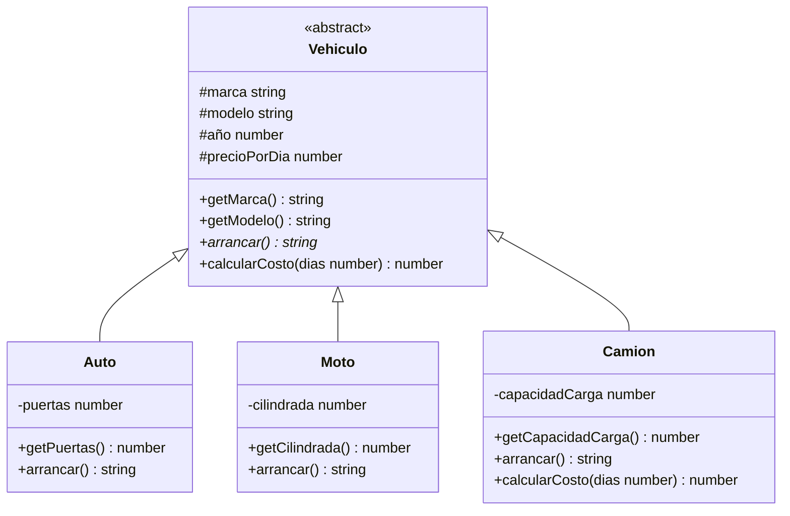
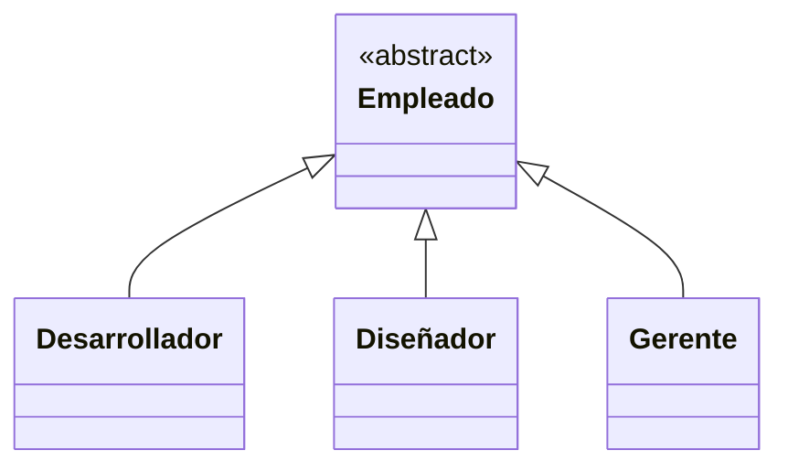

# Clase 03 - Semana 02 - UML aplicado a la POO con TypeScript

- Unidad 01: **Introducción a la POO**
- Fecha Miercoles 20 de Agosto, 2025
- Horario: 10:50 - 13:30
- Docente: Diego Obando

## 🎯 Objetivos de la Clase

Al finalizar esta clase seras capaz de:

- Diagramar clases e implementarlas en TypeScript
- Aplicar principios de diseño de software en la creación de aplicaciones TypeScript
- Utilizar UML para modelar sistemas orientados a objetos
- Comprender la importancia de la documentación en el desarrollo de software
- Comprender mediante UML los pilares de la Programación Orientada a Objetos

## 🔥 Warm-up: Conectando TypeScript y UML (15 minutos)

### 🧠 Repaso Rápido: Lo que Sabemos

Antes de comenzar con la práctica, recordemos los conceptos clave de las clases anteriores:

#### **Del Lunes - TypeScript y POO:**

- ✅ TypeScript = JavaScript + Tipos + POO mejorada
- ✅ Los 4 Pilares: **Encapsulamiento**, **Herencia**, **Polimorfismo**, **Abstracción**
- ✅ Sintaxis de clases: `class`, `interface`, `extends`, `implements`
- ✅ Modificadores de acceso: `private`, `protected`, `public`

#### **Del Martes - UML:**

- ✅ UML = Lenguaje visual para diseñar software
- ✅ Diagramas de clases: representan estructura
- ✅ Herramientas: Draw.io, Mermaid
- ✅ Elementos: clases, atributos, métodos, relaciones

### 🎯 La Conexión: ¿Por qué UML + TypeScript?

> **💡 Pregunta para reflexionar:** _¿Qué sucede si comenzamos a programar directamente sin diseñar primero?_

**El Problema:** Programar sin diseño = 🏠 **Construir una casa sin planos**

- Código desorganizado
- Difícil de mantener
- Errores de arquitectura
- Pérdida de tiempo en refactoring

**La Solución:** UML → TypeScript = 📋 **Planos → Construcción**

- Diseño claro antes de codificar
- Estructura sólida desde el inicio
- Comunicación efectiva en el equipo
- Código más limpio y mantenible

### 🚀 ¿Listos para la Práctica?

En los próximos minutos vamos a:

1. **Diseñar** un sistema completo con diagramas UML
2. **Implementar** ese diseño paso a paso en TypeScript
3. **Aplicar** los 4 pilares de POO que aprendieron
4. **Validar** que nuestro código refleje nuestro diseño

> **🎪 ¡Manos a la obra!** Vamos a construir un **Sistema de Gestión de Biblioteca** desde cero.

## 🛠️ Workshop Principal: Del Diagrama al Código (2 horas)

> **📚 Metodología:** Primero vemos un ejemplo completo juntos, luego ustedes resuelven uno similar

---

## 🎯 **PARTE 1: Ejemplo Guiado - Sistema de Vehículos** (45 minutos)

### 📋 **Paso 1: Análisis del Problema**

**Escenario:** Una empresa de alquiler necesita un sistema para gestionar diferentes tipos de vehículos.

**Requerimientos:**

- Manejar autos, motos y camiones
- Cada vehículo tiene marca, modelo, año y precio por día
- Los autos tienen cantidad de puertas
- Las motos tienen cilindrada
- Los camiones tienen capacidad de carga
- Todos los vehículos pueden arrancar y calcular costo de alquiler

### 🎨 **Paso 2: Diseño UML**



### 💻 **Paso 3: Implementación en TypeScript**

#### **3.1 Clase Base Abstracta:**

```typescript
// Vehiculo.ts - Clase abstracta base
abstract class Vehiculo {
  protected marca: string;
  protected modelo: string;
  protected año: number;
  protected precioPorDia: number;

  constructor(
    marca: string,
    modelo: string,
    año: number,
    precioPorDia: number
  ) {
    this.marca = marca;
    this.modelo = modelo;
    this.año = año;
    this.precioPorDia = precioPorDia;
  }

  // Getters - ENCAPSULAMIENTO
  public getMarca(): string {
    return this.marca;
  }
  public getModelo(): string {
    return this.modelo;
  }
  public getAño(): number {
    return this.año;
  }

  // Método abstracto - ABSTRACCIÓN
  public abstract arrancar(): string;

  // Método común que puede ser sobrescrito - POLIMORFISMO
  public calcularCosto(dias: number): number {
    return this.precioPorDia * dias;
  }

  public getInfo(): string {
    return `${this.marca} ${this.modelo} (${this.año})`;
  }
}
```

#### **3.2 Clases Derivadas:**

```typescript
// Auto.ts - HERENCIA de Vehiculo
class Auto extends Vehiculo {
  private puertas: number;

  constructor(
    marca: string,
    modelo: string,
    año: number,
    precioPorDia: number,
    puertas: number
  ) {
    super(marca, modelo, año, precioPorDia); // Llamada al constructor padre
    this.puertas = puertas;
  }

  public getPuertas(): number {
    return this.puertas;
  }

  // Implementación del método abstracto - ABSTRACCIÓN
  public arrancar(): string {
    return `🚗 El auto ${this.getInfo()} está arrancando...`;
  }
}

// Moto.ts
class Moto extends Vehiculo {
  private cilindrada: number;

  constructor(
    marca: string,
    modelo: string,
    año: number,
    precioPorDia: number,
    cilindrada: number
  ) {
    super(marca, modelo, año, precioPorDia);
    this.cilindrada = cilindrada;
  }

  public getCilindrada(): number {
    return this.cilindrada;
  }

  public arrancar(): string {
    return `🏍️ La moto ${this.getInfo()} está arrancando con ${
      this.cilindrada
    }cc`;
  }
}

// Camion.ts
class Camion extends Vehiculo {
  private capacidadCarga: number;

  constructor(
    marca: string,
    modelo: string,
    año: number,
    precioPorDia: number,
    capacidadCarga: number
  ) {
    super(marca, modelo, año, precioPorDia);
    this.capacidadCarga = capacidadCarga;
  }

  public getCapacidadCarga(): number {
    return this.capacidadCarga;
  }

  public arrancar(): string {
    return `🚛 El camión ${this.getInfo()} está arrancando...`;
  }

  // Sobrescritura de método - POLIMORFISMO
  public calcularCosto(dias: number): number {
    // Los camiones tienen un recargo del 20%
    return super.calcularCosto(dias) * 1.2;
  }
}
```

#### **3.3 Uso del Sistema:**

```typescript
// main.ts - Demostración del sistema
function demostracionSistema(): void {
  console.log("=== DEMO: Sistema de Vehículos ===\n");

  // Crear diferentes vehículos - POLIMORFISMO
  const vehiculos: Vehiculo[] = [
    new Auto("Toyota", "Corolla", 2022, 25000, 4),
    new Moto("Honda", "CBR600", 2021, 15000, 600),
    new Camion("Mercedes", "Actros", 2020, 45000, 10000),
  ];

  // Usar polimorfismo - cada vehículo se comporta diferente
  vehiculos.forEach((vehiculo, index) => {
    console.log(`--- Vehículo ${index + 1} ---`);
    console.log(vehiculo.arrancar());
    console.log(
      `Costo por 3 días: $${vehiculo.calcularCosto(3).toLocaleString()}`
    );
    console.log();
  });
}

// Ejecutar la demostración
demostracionSistema();
```

### 🎯 **Paso 4: Análisis de los Pilares POO**

**🔒 Encapsulamiento:**

- Atributos `protected` en la clase base
- Atributos `private` en clases derivadas
- Métodos `public` para acceso controlado

**🧬 Herencia:**

- `Auto`, `Moto`, `Camion` extienden de `Vehiculo`
- Reutilización de código común
- Constructor `super()` para llamar al padre

**🎭 Polimorfismo:**

- Método `arrancar()` se comporta diferente en cada clase
- Array de `Vehiculo[]` puede contener cualquier tipo
- `calcularCosto()` sobrescrito en `Camion`

**🎨 Abstracción:**

- Clase `Vehiculo` es abstracta - no se puede instanciar
- Método `arrancar()` abstracto - debe implementarse
- Interfaz común para todos los vehículos

---

## 🎯 **PARTE 2: Tu Turno - Sistema de Empleados** (60 minutos)

### 📋 **Escenario del Desafío**

**Una empresa de tecnología necesita un sistema para gestionar diferentes tipos de empleados:**

**Requerimientos Funcionales:**

- Manejar **Desarrolladores**, **Diseñadores** y **Gerentes**
- Todos tienen: nombre, email, salario base, años de experiencia
- **Desarrolladores**: lenguaje principal, nivel (Junior/Mid/Senior)
- **Diseñadores**: herramienta principal, portafolio (URL)
- **Gerentes**: equipo a cargo (número de personas), bono por gestión
- Todos pueden: trabajar(), calcular salario final, obtener información

### 🎨 **Paso 1: Diseña el Diagrama UML** (15 min)

> **🎯 Tu Misión:** Crear un diagrama de clases usando Mermaid

**💡 Pistas para el Diseño:**

```
🤔 Preguntas para guiarte:
- ¿Cuál será la clase base/abstracta?
- ¿Qué atributos son comunes a todos?
- ¿Qué métodos deben ser abstractos?
- ¿Qué relaciones de herencia necesitas?
- ¿Algún método necesita ser sobrescrito?
```

**🔧 Plantilla para empezar:**



### 💻 **Paso 2: Implementa en TypeScript** (35 min)

#### **🏗️ Estructura de Archivos Sugerida:**

```

empleados/
├── Empleado.ts // Clase base abstracta
├── Desarrollador.ts // Clase derivada
├── Diseñador.ts // Clase derivada
├── Gerente.ts // Clase derivada
└── main.ts // Demo del sistema

```

#### **🎯 Requisitos Técnicos:**

**Clase Base `Empleado`:**

- [ ] Debe ser **abstracta**
- [ ] Atributos protegidos: `nombre`, `email`, `salarioBase`, `añosExperiencia`
- [ ] Constructor que inicialice todos los atributos
- [ ] Getters para todos los atributos
- [ ] Método abstracto: `trabajar(): string`
- [ ] Método común: `calcularSalario(): number` (puede ser sobrescrito)
- [ ] Método común: `getInfo(): string`

**Clase `Desarrollador`:**

- [ ] Hereda de `Empleado`
- [ ] Atributos adicionales: `lenguajePrincipal: string`, `nivel: string`
- [ ] Implementa `trabajar()`: retorna mensaje específico para dev
- [ ] Getter para atributos específicos

**Clase `Diseñador`:**

- [ ] Hereda de `Empleado`
- [ ] Atributos adicionales: `herramientaPrincipal: string`, `portafolio: string`
- [ ] Implementa `trabajar()`: retorna mensaje específico para diseñador
- [ ] Getter para atributos específicos

**Clase `Gerente`:**

- [ ] Hereda de `Empleado`
- [ ] Atributos adicionales: `equipoACargo: number`, `bonoGestion: number`
- [ ] Implementa `trabajar()`: retorna mensaje específico para gerente
- [ ] **Sobrescribe** `calcularSalario()`: suma el bono de gestión
- [ ] Getter para atributos específicos

#### **🧩 Hints de Implementación:**

<details>
<summary>💡 <strong>Hint 1: Estructura de la Clase Base</strong></summary>

```typescript
abstract class Empleado {
  protected nombre: string;
  // ¿Qué otros atributos protected necesitas?

  constructor(nombre: string /* otros parámetros */) {
    this.nombre = nombre;
    // Inicializar otros atributos
  }

  // Getters aquí

  public abstract trabajar(): string; // ¡Debe ser implementado!

  public calcularSalario(): number {
    // Lógica base - puede ser sobrescrita
    return this.salarioBase;
  }
}
```

</details>

<details>
<summary>💡 <strong>Hint 2: Ejemplo de Clase Derivada</strong></summary>

```typescript
class Desarrollador extends Empleado {
    private lenguajePrincipal: string;
    private nivel: string;

    constructor(nombre: string, email: string, /* otros params */, lenguaje: string, nivel: string) {
        super(nombre, email /* otros params */);
        this.lenguajePrincipal = lenguaje;
        this.nivel = nivel;
    }

    public trabajar(): string {
        return `💻 ${this.nombre} está programando en ${this.lenguajePrincipal}`;
    }

    // Getters específicos
}
```

</details>

<details>
<summary>💡 <strong>Hint 3: Polimorfismo en main.ts</strong></summary>

```typescript
const empleados: Empleado[] = [
  new Desarrollador(/* parámetros */),
  new Diseñador(/* parámetros */),
  new Gerente(/* parámetros */),
];

empleados.forEach((emp) => {
  console.log(emp.trabajar()); // ¡Polimorfismo en acción!
  console.log(`Salario: $${emp.calcularSalario()}`);
});
```

</details>

### 🎯 **Paso 3: Validación y Testing** (10 min)

**Crea casos de prueba en tu `main.ts`:**

```typescript
function testearSistema(): void {
  console.log("=== TESTING: Sistema de Empleados ===\n");

  // Crear empleados de prueba
  const dev = new Desarrollador(
    "Ana García",
    "ana@tech.com",
    50000,
    3,
    "TypeScript",
    "Mid"
  );
  const diseñador = new Diseñador(
    "Carlos López",
    "carlos@tech.com",
    45000,
    2,
    "Figma",
    "portfolio.com"
  );
  const gerente = new Gerente(
    "María Silva",
    "maria@tech.com",
    80000,
    8,
    15,
    20000
  );

  // Probar funcionalidades
  console.log("--- Test 1: Trabajar (Polimorfismo) ---");
  [dev, diseñador, gerente].forEach((emp) => console.log(emp.trabajar()));

  console.log("\n--- Test 2: Cálculo de Salarios ---");
  console.log(`Dev: $${dev.calcularSalario()}`);
  console.log(`Diseñador: $${diseñador.calcularSalario()}`);
  console.log(`Gerente: $${gerente.calcularSalario()}`); // ¿Incluye el bono?

  console.log("\n--- Test 3: Información General ---");
  console.log(dev.getInfo());
  console.log(
    `Lenguaje: ${dev.getLenguajePrincipal()}, Nivel: ${dev.getNivel()}`
  );
}

testearSistema();
```

### 🏆 **Criterios de Éxito:**

- [ ] **UML completo y correcto** - diagrama claro con todas las clases y relaciones
- [ ] **4 Pilares POO aplicados** - identificables en el código
- [ ] **Compilación sin errores** - código TypeScript válido
- [ ] **Polimorfismo funcional** - mismo método, comportamientos diferentes
- [ ] **Encapsulamiento correcto** - acceso controlado a atributos
- [ ] **Testing exitoso** - todos los casos de prueba pasan

### 🆘 **¿Necesitas Ayuda?**

**Problemas Comunes y Soluciones:**

<details>
<summary>❌ <strong>Error: "Cannot instantiate abstract class"</strong></summary>

**Problema:** Intentas hacer `new Empleado()`
**Solución:** Solo puedes instanciar las clases derivadas: `new Desarrollador()`, etc.

</details>

<details>
<summary>❌ <strong>Error: "Property is private and only accessible within class"</strong></summary>

**Problema:** Intentas acceder a un atributo `private` desde una clase hija
**Solución:** Cambia a `protected` si necesitas acceso desde clases derivadas

</details>

<details>
<summary>❌ <strong>Error: "Class must implement abstract method"</strong></summary>

**Problema:** Olvidaste implementar `trabajar()` en alguna clase derivada
**Solución:** Todas las clases hijas deben implementar métodos abstractos

</details>

---

## 🎖️ **PARTE 3: Extensiones y Desafíos Avanzados** (15 minutos)

### 🚀 **Para los que Terminan Rápido:**

#### **Desafío Extra 1: Agregar Interfaces**

```typescript
interface Evaluable {
  evaluarRendimiento(): string;
}

interface Capacitable {
  recibirCapacitacion(tema: string): void;
}

// ¿Qué clases podrían implementar estas interfaces?
```

#### **Desafío Extra 2: Enum para Niveles**

```typescript
enum NivelDesarrollador {
  JUNIOR = "Junior",
  MID = "Mid",
  SENIOR = "Senior",
  LEAD = "Lead",
}

// Refactoriza tu clase Desarrollador para usar este enum
```

#### **Desafío Extra 3: Sistema de Búsqueda**

```typescript
class GestorEmpleados {
  private empleados: Empleado[] = [];

  public buscarPorSalario(min: number, max: number): Empleado[] {
    // Implementa filtro por rango salarial
  }

  public obtenerEstadisticas(): any {
    // Calcula salario promedio, cantidad por tipo, etc.
  }
}
```

### 🎯 **Reflexión Final: Del UML al Mundo Real**

**💭 Preguntas para Discutir:**

1. **Diseño vs Código:** ¿Qué fue más difícil, diseñar el UML o implementarlo?
2. **Evolución:** ¿Cómo cambiarías el diseño si necesitas agregar "Freelancers"?
3. **Mantenimiento:** ¿Qué pasaría si el cálculo de salario cambia para toda la empresa?
4. **Escalabilidad:** ¿Este diseño funcionaría con 1000 tipos de empleados diferentes?

**🔄 Lecciones Aprendidas:**

- **UML → Código:** El diagrama es tu mapa de navegación
- **POO en Acción:** Los 4 pilares no son teoría, son herramientas prácticas
- **TypeScript Power:** Los tipos previenen errores antes de ejecutar
- **Diseño Importa:** 15 minutos diseñando ahorran horas debuggeando

---

## 📚 **Recursos para Continuar Aprendiendo**

### 🔗 **Herramientas Recomendadas:**

- **Mermaid Live Editor:** [mermaid.live](https://mermaid.live)
- **Draw.io:** [draw.io](https://draw.io)
- **TypeScript Playground:** [typescriptlang.org/play](https://www.typescriptlang.org/play)
- **UML Reference:** Cheat sheets de diagramas de clases

### 📖 **Próximos Pasos:**

1. **Patrones de Diseño:** Singleton, Factory, Observer aplicados con TypeScript
2. **Testing:** Jest con TypeScript para validar tu POO
3. **Arquitectura:** Principios SOLID en sistemas reales
4. **Frameworks:** Angular/React con POO y TypeScript

### 🎪 **Tarea para Casa (Opcional):**

Diseña e implementa un **Sistema de Biblioteca** con:

- Libros, Revistas, DVDs (diferentes tipos de materiales)
- Usuarios: Estudiantes, Profesores, Público General
- Préstamos con reglas diferentes por tipo de usuario
- ¡Incluye tu diagrama UML y código TypeScript!

---

## ✅ **Checklist de la Clase**

**Antes de irte, verifica que puedas:**

- [ ] Explicar por qué UML es útil antes de programar
- [ ] Diseñar un diagrama de clases básico
- [ ] Identificar los 4 pilares POO en código TypeScript
- [ ] Implementar herencia con clases abstractas
- [ ] Usar polimorfismo efectivamente
- [ ] Aplicar encapsulamiento con modificadores de acceso
- [ ] Crear código que refleje fielmente un diseño UML

**🎊 ¡Felicitaciones! Has conectado el diseño con la implementación como un verdadero desarrollador profesional.**
