# Clase 01 - Semana 03 - Repaso POO y UML (Evaluación Miércoles)

- Unidad 01: **Introducción a la POO**
- Fecha: Lunes 25 de Agosto, 2025
- Horario: 10:50 - 13:30
- Docente: Diego Obando

## 🎯 Objetivos de la Clase

**Objetivo principal:** Repasar y practicar intensivamente los conceptos de POO y Diagramas UML que serán evaluados el miércoles.

Al finalizar esta clase, los estudiantes podrán:

1. ✅ **Aplicar los 4 pilares de POO** en ejercicios prácticos
2. ✅ **Crear diagramas de clases UML** a partir de enunciados
3. ✅ **Implementar clases en TypeScript** con herencia y relaciones
4. ✅ **Analizar y corregir** diagramas y código existente

---

## 📚 Repaso Teórico (15 minutos)

### Los 4 Pilares de la POO

**1. Abstracción:** Simplificar la realidad, enfocándose en lo esencial  
**2. Encapsulamiento:** Ocultar detalles internos, exponer solo lo necesario  
**3. Herencia:** Reutilizar código, crear jerarquías de clases  
**4. Polimorfismo:** Un mismo método puede comportarse diferente según la clase

### Elementos de Diagramas UML

- **Clases:** Rectángulos con nombre, atributos y métodos
- **Herencia:** Flecha con triángulo vacío (▷)
- **Asociación:** Línea simple
- **Multiplicidad:** 1, _, 0..1, 1.._

---

## 🔗 Conectores y Relaciones en UML

### 🎯 Tipos de Conectores

**1. Herencia (Inheritance):** `<|--`

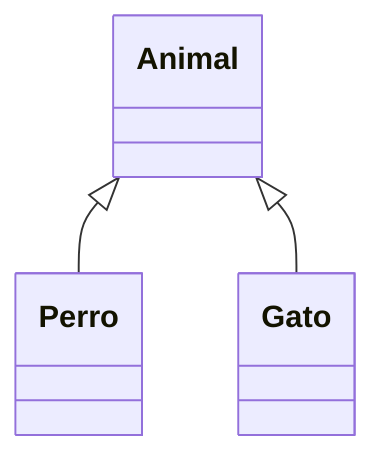

- **Significado:** "Perro ES UN Animal", "Gato ES UN Animal"
- **Uso:** Cuando una clase hereda de otra (extends)

**2. Asociación (Association):** `-->`

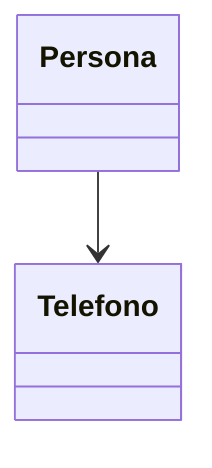

- **Significado:** "Persona TIENE/USA un Teléfono"
- **Uso:** Relación general entre clases

**3. Composición (Composition):** `*--`

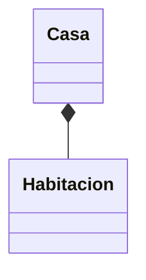

- **Significado:** "Casa ESTÁ COMPUESTA de Habitaciones"
- **Uso:** Relación fuerte - si se destruye Casa, se destruyen las Habitaciones

**4. Agregación (Aggregation):** `o--`

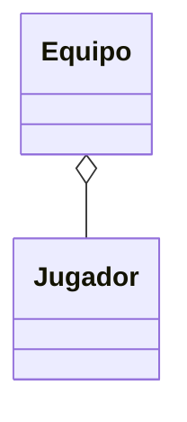

- **Significado:** "Equipo TIENE Jugadores"
- **Uso:** Relación débil - Jugadores pueden existir sin el Equipo

**5. Dependencia (Dependency):** `..>`

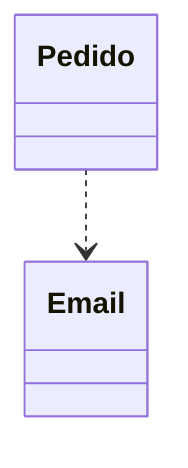

- **Significado:** "Pedido DEPENDE/USA Email temporalmente"
- **Uso:** Una clase usa otra sin tener una relación permanente

### 📊 Cardinalidad / Multiplicidad

La cardinalidad indica **cuántos objetos** pueden participar en una relación:

| Símbolo | Significado     | Ejemplo                                              |
| ------- | --------------- | ---------------------------------------------------- |
| `1`     | Exactamente uno | Un cliente tiene exactamente un carrito              |
| `*`     | Cero o muchos   | Un cliente puede tener muchos pedidos (0, 1, 2, ...) |
| `0..1`  | Cero o uno      | Un empleado puede tener un jefe (opcional)           |
| `1..*`  | Uno o más       | Un pedido debe tener al menos un producto            |
| `0..*`  | Cero o más      | Igual que `*`                                        |

### 🎨 Ejemplo Completo con Cardinalidad

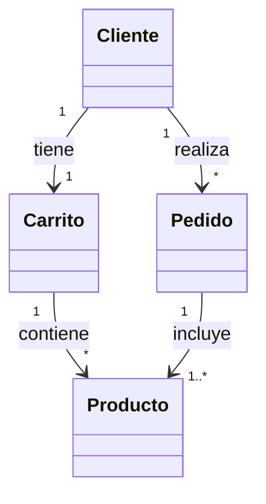

**Interpretación:**

- 1 Cliente tiene exactamente 1 Carrito
- 1 Cliente puede realizar muchos (0 o más) Pedidos
- 1 Carrito puede contener muchos (0 o más) Productos
- 1 Pedido debe incluir al menos 1 Producto (1 o más)

### 💡 Anotaciones Especiales

**Clases Abstractas:** `<<Abstract>>`

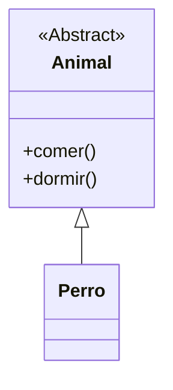

**Interfaces:** `<<Interface>>`

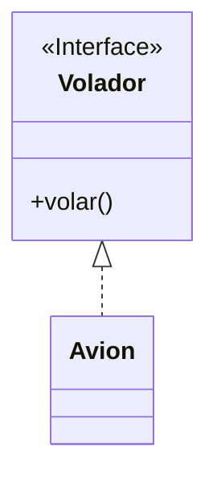

---

## 🔥 Ejercicios Prácticos de Repaso

### 📖 Ejercicio 1: Sistema de Biblioteca

**Enunciado:**
Diseña un sistema para una biblioteca que permita gestionar libros y préstamos.

**Requisitos:**

- Un **Libro** tiene título, autor, ISBN y está disponible o prestado
- Un **Usuario** tiene nombre, email y puede tener múltiples préstamos activos
- Un **Préstamo** relaciona un libro con un usuario, tiene fecha de préstamo y devolución
- Los usuarios pueden ser **Estudiantes** (con carrera) o **Profesores** (con departamento)

#### 🎨 Diagrama de Clases

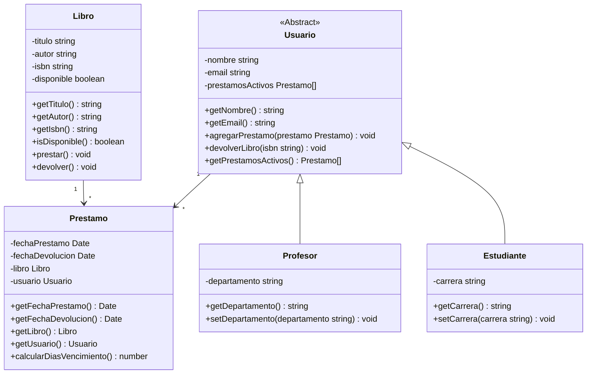

#### 💻 Implementación TypeScript

```typescript
// Clase base Libro
class Libro {
  private titulo: string;
  private autor: string;
  private isbn: string;
  private disponible: boolean;

  constructor(titulo: string, autor: string, isbn: string) {
    this.titulo = titulo;
    this.autor = autor;
    this.isbn = isbn;
    this.disponible = true;
  }

  public getTitulo(): string {
    return this.titulo;
  }

  public getAutor(): string {
    return this.autor;
  }

  public getIsbn(): string {
    return this.isbn;
  }

  public isDisponible(): boolean {
    return this.disponible;
  }

  public prestar(): void {
    if (this.disponible) {
      this.disponible = false;
    } else {
      throw new Error("El libro ya está prestado");
    }
  }

  public devolver(): void {
    this.disponible = true;
  }
}

// Clase base Usuario
abstract class Usuario {
  private nombre: string;
  private email: string;
  private prestamosActivos: Prestamo[];

  constructor(nombre: string, email: string) {
    this.nombre = nombre;
    this.email = email;
    this.prestamosActivos = [];
  }

  public getNombre(): string {
    return this.nombre;
  }

  public getEmail(): string {
    return this.email;
  }

  public agregarPrestamo(prestamo: Prestamo): void {
    this.prestamosActivos.push(prestamo);
  }

  public devolverLibro(isbn: string): void {
    const indice = this.prestamosActivos.findIndex(
      (prestamo) => prestamo.getLibro().getIsbn() === isbn
    );

    if (indice !== -1) {
      const prestamo = this.prestamosActivos[indice];
      prestamo.getLibro().devolver();
      this.prestamosActivos.splice(indice, 1);
    }
  }

  public getPrestamosActivos(): Prestamo[] {
    return this.prestamosActivos;
  }
}

// Clase Estudiante (hereda de Usuario)
class Estudiante extends Usuario {
  private carrera: string;

  constructor(nombre: string, email: string, carrera: string) {
    super(nombre, email);
    this.carrera = carrera;
  }

  public getCarrera(): string {
    return this.carrera;
  }

  public setCarrera(carrera: string): void {
    this.carrera = carrera;
  }
}

// Clase Profesor (hereda de Usuario)
class Profesor extends Usuario {
  private departamento: string;

  constructor(nombre: string, email: string, departamento: string) {
    super(nombre, email);
    this.departamento = departamento;
  }

  public getDepartamento(): string {
    return this.departamento;
  }

  public setDepartamento(departamento: string): void {
    this.departamento = departamento;
  }
}

// Clase Prestamo
class Prestamo {
  private fechaPrestamo: Date;
  private fechaDevolucion: Date;
  private libro: Libro;
  private usuario: Usuario;

  constructor(libro: Libro, usuario: Usuario) {
    this.libro = libro;
    this.usuario = usuario;
    this.fechaPrestamo = new Date();

    // Fecha de devolución: 15 días después
    this.fechaDevolucion = new Date();
    this.fechaDevolucion.setDate(this.fechaDevolucion.getDate() + 15);

    // Realizar el préstamo
    libro.prestar();
    usuario.agregarPrestamo(this);
  }

  public getFechaPrestamo(): Date {
    return this.fechaPrestamo;
  }

  public getFechaDevolucion(): Date {
    return this.fechaDevolucion;
  }

  public getLibro(): Libro {
    return this.libro;
  }

  public getUsuario(): Usuario {
    return this.usuario;
  }

  public calcularDiasVencimiento(): number {
    const hoy = new Date();
    const diferencia = hoy.getTime() - this.fechaDevolucion.getTime();
    return Math.ceil(diferencia / (1000 * 3600 * 24));
  }
}

// Ejemplo de uso
const libro1 = new Libro("Clean Code", "Robert Martin", "978-0132350884");
const estudiante1 = new Estudiante(
  "Ana García",
  "ana@email.com",
  "Ingeniería Informática"
);
const profesor1 = new Profesor("Dr. Smith", "smith@email.com", "Computación");

const prestamo1 = new Prestamo(libro1, estudiante1);

console.log(`Libro prestado: ${libro1.getTitulo()}`);
console.log(`Usuario: ${estudiante1.getNombre()}`);
console.log(`Disponible: ${libro1.isDisponible()}`); // false
```

---

### 🎓 Ejercicio 2: Gestión de Cursos Académicos

**Enunciado:**
Desarrolla un sistema para gestionar cursos en una institución educativa.

**Requisitos:**

- Un **Curso** tiene nombre, código, créditos y cupo máximo
- Un **Estudiante** tiene matrícula, nombre, carrera y puede inscribirse en múltiples cursos
- Un **Profesor** tiene código, nombre, especialidad y puede dictar múltiples cursos
- Una **Inscripción** relaciona un estudiante con un curso, tiene fecha y nota final

#### 🎨 Diagrama de Clases

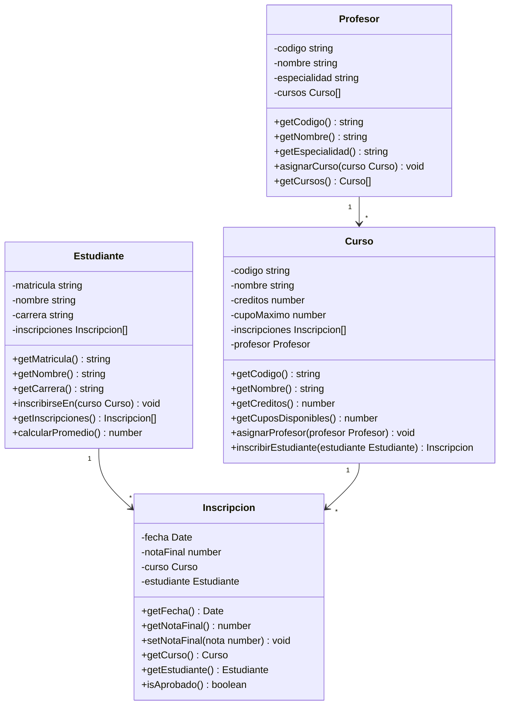

#### 💻 Implementación TypeScript

```typescript
class Curso {
  private codigo: string;
  private nombre: string;
  private creditos: number;
  private cupoMaximo: number;
  private inscripciones: Inscripcion[];
  private profesor?: Profesor;

  constructor(
    codigo: string,
    nombre: string,
    creditos: number,
    cupoMaximo: number
  ) {
    this.codigo = codigo;
    this.nombre = nombre;
    this.creditos = creditos;
    this.cupoMaximo = cupoMaximo;
    this.inscripciones = [];
  }

  public getCodigo(): string {
    return this.codigo;
  }

  public getNombre(): string {
    return this.nombre;
  }

  public getCreditos(): number {
    return this.creditos;
  }

  public getCuposDisponibles(): number {
    return this.cupoMaximo - this.inscripciones.length;
  }

  public asignarProfesor(profesor: Profesor): void {
    this.profesor = profesor;
    profesor.asignarCurso(this);
  }

  public inscribirEstudiante(estudiante: Estudiante): Inscripcion {
    if (this.getCuposDisponibles() <= 0) {
      throw new Error("No hay cupos disponibles");
    }

    const inscripcion = new Inscripcion(this, estudiante);
    this.inscripciones.push(inscripcion);
    return inscripcion;
  }
}

class Estudiante {
  private matricula: string;
  private nombre: string;
  private carrera: string;
  private inscripciones: Inscripcion[];

  constructor(matricula: string, nombre: string, carrera: string) {
    this.matricula = matricula;
    this.nombre = nombre;
    this.carrera = carrera;
    this.inscripciones = [];
  }

  public getMatricula(): string {
    return this.matricula;
  }

  public getNombre(): string {
    return this.nombre;
  }

  public getCarrera(): string {
    return this.carrera;
  }

  public inscribirseEn(curso: Curso): void {
    const inscripcion = curso.inscribirEstudiante(this);
    this.inscripciones.push(inscripcion);
  }

  public getInscripciones(): Inscripcion[] {
    return this.inscripciones;
  }

  public calcularPromedio(): number {
    const inscripcionesConNota = this.inscripciones.filter(
      (i) => i.getNotaFinal() > 0
    );
    if (inscripcionesConNota.length === 0) return 0;

    const suma = inscripcionesConNota.reduce(
      (total, inscripcion) => total + inscripcion.getNotaFinal(),
      0
    );
    return suma / inscripcionesConNota.length;
  }
}

class Profesor {
  private codigo: string;
  private nombre: string;
  private especialidad: string;
  private cursos: Curso[];

  constructor(codigo: string, nombre: string, especialidad: string) {
    this.codigo = codigo;
    this.nombre = nombre;
    this.especialidad = especialidad;
    this.cursos = [];
  }

  public getCodigo(): string {
    return this.codigo;
  }

  public getNombre(): string {
    return this.nombre;
  }

  public getEspecialidad(): string {
    return this.especialidad;
  }

  public asignarCurso(curso: Curso): void {
    if (!this.cursos.includes(curso)) {
      this.cursos.push(curso);
    }
  }

  public getCursos(): Curso[] {
    return this.cursos;
  }
}

class Inscripcion {
  private fecha: Date;
  private notaFinal: number;
  private curso: Curso;
  private estudiante: Estudiante;

  constructor(curso: Curso, estudiante: Estudiante) {
    this.curso = curso;
    this.estudiante = estudiante;
    this.fecha = new Date();
    this.notaFinal = 0; // Sin nota inicialmente
  }

  public getFecha(): Date {
    return this.fecha;
  }

  public getNotaFinal(): number {
    return this.notaFinal;
  }

  public setNotaFinal(nota: number): void {
    if (nota >= 1 && nota <= 7) {
      this.notaFinal = nota;
    } else {
      throw new Error("La nota debe estar entre 1 y 7");
    }
  }

  public getCurso(): Curso {
    return this.curso;
  }

  public getEstudiante(): Estudiante {
    return this.estudiante;
  }

  public isAprobado(): boolean {
    return this.notaFinal >= 4.0;
  }
}

// Ejemplo de uso
const curso1 = new Curso("INF101", "Programación I", 4, 30);
const profesor1 = new Profesor("P001", "María López", "Programación");
const estudiante1 = new Estudiante(
  "2024001",
  "Carlos Ruiz",
  "Ingeniería Informática"
);

curso1.asignarProfesor(profesor1);
estudiante1.inscribirseEn(curso1);

const inscripciones = estudiante1.getInscripciones();
inscripciones[0].setNotaFinal(6.5);

console.log(`Estudiante: ${estudiante1.getNombre()}`);
console.log(`Curso: ${curso1.getNombre()}`);
console.log(`Nota: ${inscripciones[0].getNotaFinal()}`);
console.log(`Aprobado: ${inscripciones[0].isAprobado()}`);
```

---

### 🛒 Ejercicio 3: Tienda Online

**Enunciado:**
Crea un sistema básico para una tienda online que permita gestionar productos, clientes y pedidos.

**Requisitos:**

- Un **Producto** tiene código, nombre, precio y stock disponible
- Un **Cliente** tiene id, nombre, email y dirección de envío
- Un **Carrito** pertenece a un cliente y puede contener múltiples productos
- Un **Pedido** se genera desde un carrito, tiene fecha, total y estado de entrega

#### 🎨 Diagrama de Clases

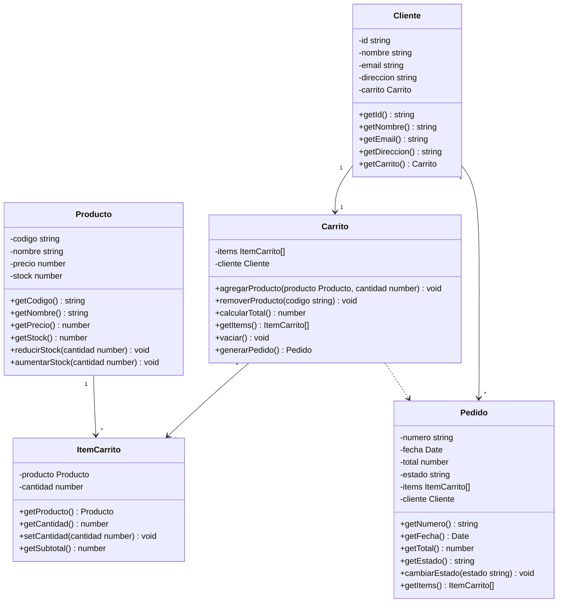

#### 💻 Implementación TypeScript

```typescript
class Producto {
  private codigo: string;
  private nombre: string;
  private precio: number;
  private stock: number;

  constructor(codigo: string, nombre: string, precio: number, stock: number) {
    this.codigo = codigo;
    this.nombre = nombre;
    this.precio = precio;
    this.stock = stock;
  }

  public getCodigo(): string {
    return this.codigo;
  }

  public getNombre(): string {
    return this.nombre;
  }

  public getPrecio(): number {
    return this.precio;
  }

  public getStock(): number {
    return this.stock;
  }

  public reducirStock(cantidad: number): void {
    if (cantidad > this.stock) {
      throw new Error("Stock insuficiente");
    }
    this.stock -= cantidad;
  }

  public aumentarStock(cantidad: number): void {
    this.stock += cantidad;
  }
}

class ItemCarrito {
  private producto: Producto;
  private cantidad: number;

  constructor(producto: Producto, cantidad: number) {
    this.producto = producto;
    this.cantidad = cantidad;
  }

  public getProducto(): Producto {
    return this.producto;
  }

  public getCantidad(): number {
    return this.cantidad;
  }

  public setCantidad(cantidad: number): void {
    if (cantidad <= 0) {
      throw new Error("La cantidad debe ser mayor a 0");
    }
    this.cantidad = cantidad;
  }

  public getSubtotal(): number {
    return this.producto.getPrecio() * this.cantidad;
  }
}

class Carrito {
  private items: ItemCarrito[];
  private cliente: Cliente;

  constructor(cliente: Cliente) {
    this.cliente = cliente;
    this.items = [];
  }

  public agregarProducto(producto: Producto, cantidad: number): void {
    // Verificar stock
    if (cantidad > producto.getStock()) {
      throw new Error("Stock insuficiente");
    }

    // Buscar si el producto ya está en el carrito
    const itemExistente = this.items.find(
      (item) => item.getProducto().getCodigo() === producto.getCodigo()
    );

    if (itemExistente) {
      const nuevaCantidad = itemExistente.getCantidad() + cantidad;
      if (nuevaCantidad > producto.getStock()) {
        throw new Error("Stock insuficiente para la cantidad total");
      }
      itemExistente.setCantidad(nuevaCantidad);
    } else {
      const nuevoItem = new ItemCarrito(producto, cantidad);
      this.items.push(nuevoItem);
    }
  }

  public removerProducto(codigo: string): void {
    const indice = this.items.findIndex(
      (item) => item.getProducto().getCodigo() === codigo
    );

    if (indice !== -1) {
      this.items.splice(indice, 1);
    }
  }

  public calcularTotal(): number {
    return this.items.reduce((total, item) => total + item.getSubtotal(), 0);
  }

  public getItems(): ItemCarrito[] {
    return this.items;
  }

  public vaciar(): void {
    this.items = [];
  }

  public generarPedido(): Pedido {
    if (this.items.length === 0) {
      throw new Error("El carrito está vacío");
    }

    // Reducir stock de productos
    this.items.forEach((item) => {
      item.getProducto().reducirStock(item.getCantidad());
    });

    const pedido = new Pedido(this.cliente, [...this.items]);
    this.vaciar();

    return pedido;
  }
}

class Cliente {
  private id: string;
  private nombre: string;
  private email: string;
  private direccion: string;
  private carrito: Carrito;

  constructor(id: string, nombre: string, email: string, direccion: string) {
    this.id = id;
    this.nombre = nombre;
    this.email = email;
    this.direccion = direccion;
    this.carrito = new Carrito(this);
  }

  public getId(): string {
    return this.id;
  }

  public getNombre(): string {
    return this.nombre;
  }

  public getEmail(): string {
    return this.email;
  }

  public getDireccion(): string {
    return this.direccion;
  }

  public getCarrito(): Carrito {
    return this.carrito;
  }
}

class Pedido {
  private numero: string;
  private fecha: Date;
  private total: number;
  private estado: string;
  private items: ItemCarrito[];
  private cliente: Cliente;

  constructor(cliente: Cliente, items: ItemCarrito[]) {
    this.numero = this.generarNumero();
    this.fecha = new Date();
    this.cliente = cliente;
    this.items = items;
    this.total = items.reduce((total, item) => total + item.getSubtotal(), 0);
    this.estado = "PENDIENTE";
  }

  private generarNumero(): string {
    return "PED-" + Date.now().toString();
  }

  public getNumero(): string {
    return this.numero;
  }

  public getFecha(): Date {
    return this.fecha;
  }

  public getTotal(): number {
    return this.total;
  }

  public getEstado(): string {
    return this.estado;
  }

  public cambiarEstado(estado: string): void {
    const estadosValidos = [
      "PENDIENTE",
      "PROCESANDO",
      "ENVIADO",
      "ENTREGADO",
      "CANCELADO",
    ];
    if (estadosValidos.includes(estado)) {
      this.estado = estado;
    } else {
      throw new Error("Estado inválido");
    }
  }

  public getItems(): ItemCarrito[] {
    return this.items;
  }
}

// Ejemplo de uso
const producto1 = new Producto("LAPTOP001", "Laptop HP", 599990, 10);
const producto2 = new Producto("MOUSE001", "Mouse Gaming", 29990, 25);

const cliente1 = new Cliente(
  "CLI001",
  "Ana Martínez",
  "ana@email.com",
  "Av. Principal 123"
);

// Agregar productos al carrito
cliente1.getCarrito().agregarProducto(producto1, 1);
cliente1.getCarrito().agregarProducto(producto2, 2);

console.log(`Total carrito: $${cliente1.getCarrito().calcularTotal()}`);

// Generar pedido
const pedido1 = cliente1.getCarrito().generarPedido();

console.log(`Pedido generado: ${pedido1.getNumero()}`);
console.log(`Total pedido: $${pedido1.getTotal()}`);
console.log(`Estado: ${pedido1.getEstado()}`);
```

---

### 🚗 Ejercicio 4: Sistema de Vehículos

**Enunciado:**
Desarrolla un sistema para una empresa de alquiler de vehículos.

**Requisitos:**

- **Vehículo** es una clase abstracta con marca, modelo, año y tarifa diaria
- **Auto** y **Moto** heredan de Vehículo, cada uno con características específicas
- Un **Conductor** tiene licencia, nombre, experiencia y puede alquilar vehículos
- Un **Alquiler** relaciona un conductor con un vehículo, tiene fechas y costo total

#### 🎨 Diagrama de Clases

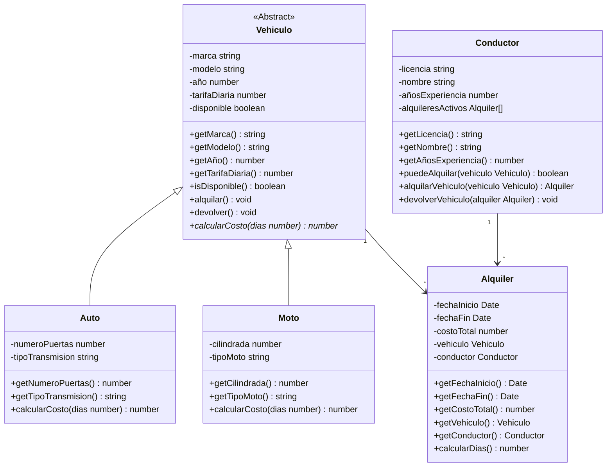

#### 💻 Implementación TypeScript

```typescript
abstract class Vehiculo {
  protected marca: string;
  protected modelo: string;
  protected año: number;
  protected tarifaDiaria: number;
  protected disponible: boolean;

  constructor(
    marca: string,
    modelo: string,
    año: number,
    tarifaDiaria: number
  ) {
    this.marca = marca;
    this.modelo = modelo;
    this.año = año;
    this.tarifaDiaria = tarifaDiaria;
    this.disponible = true;
  }

  public getMarca(): string {
    return this.marca;
  }

  public getModelo(): string {
    return this.modelo;
  }

  public getAño(): number {
    return this.año;
  }

  public getTarifaDiaria(): number {
    return this.tarifaDiaria;
  }

  public isDisponible(): boolean {
    return this.disponible;
  }

  public alquilar(): void {
    if (!this.disponible) {
      throw new Error("El vehículo no está disponible");
    }
    this.disponible = false;
  }

  public devolver(): void {
    this.disponible = true;
  }

  // Método abstracto - debe ser implementado por las clases hijas
  public abstract calcularCosto(dias: number): number;
}

class Auto extends Vehiculo {
  private numeroPuertas: number;
  private tipoTransmision: string;

  constructor(
    marca: string,
    modelo: string,
    año: number,
    tarifaDiaria: number,
    numeroPuertas: number,
    tipoTransmision: string
  ) {
    super(marca, modelo, año, tarifaDiaria);
    this.numeroPuertas = numeroPuertas;
    this.tipoTransmision = tipoTransmision;
  }

  public getNumeroPuertas(): number {
    return this.numeroPuertas;
  }

  public getTipoTransmision(): string {
    return this.tipoTransmision;
  }

  // Implementación específica para Auto
  public calcularCosto(dias: number): number {
    let costo = this.tarifaDiaria * dias;

    // Descuento por alquiler de más de 7 días
    if (dias > 7) {
      costo *= 0.9; // 10% descuento
    }

    // Recargo por transmisión automática
    if (this.tipoTransmision === "Automática") {
      costo *= 1.1; // 10% recargo
    }

    return costo;
  }
}

class Moto extends Vehiculo {
  private cilindrada: number;
  private tipoMoto: string;

  constructor(
    marca: string,
    modelo: string,
    año: number,
    tarifaDiaria: number,
    cilindrada: number,
    tipoMoto: string
  ) {
    super(marca, modelo, año, tarifaDiaria);
    this.cilindrada = cilindrada;
    this.tipoMoto = tipoMoto;
  }

  public getCilindrada(): number {
    return this.cilindrada;
  }

  public getTipoMoto(): string {
    return this.tipoMoto;
  }

  // Implementación específica para Moto
  public calcularCosto(dias: number): number {
    let costo = this.tarifaDiaria * dias;

    // Recargo por alta cilindrada
    if (this.cilindrada > 600) {
      costo *= 1.15; // 15% recargo
    }

    // Descuento por alquiler largo
    if (dias > 5) {
      costo *= 0.95; // 5% descuento
    }

    return costo;
  }
}

class Conductor {
  private licencia: string;
  private nombre: string;
  private añosExperiencia: number;
  private alquileresActivos: Alquiler[];

  constructor(licencia: string, nombre: string, añosExperiencia: number) {
    this.licencia = licencia;
    this.nombre = nombre;
    this.añosExperiencia = añosExperiencia;
    this.alquileresActivos = [];
  }

  public getLicencia(): string {
    return this.licencia;
  }

  public getNombre(): string {
    return this.nombre;
  }

  public getAñosExperiencia(): number {
    return this.añosExperiencia;
  }

  public puedeAlquilar(vehiculo: Vehiculo): boolean {
    // Validación: para motos de alta cilindrada se requiere más experiencia
    if (vehiculo instanceof Moto) {
      if (vehiculo.getCilindrada() > 400 && this.añosExperiencia < 2) {
        return false;
      }
    }

    // No más de 3 alquileres simultáneos
    return this.alquileresActivos.length < 3;
  }

  public alquilarVehiculo(vehiculo: Vehiculo): Alquiler {
    if (!this.puedeAlquilar(vehiculo)) {
      throw new Error("No puede alquilar este vehículo");
    }

    if (!vehiculo.isDisponible()) {
      throw new Error("El vehículo no está disponible");
    }

    vehiculo.alquilar();
    const alquiler = new Alquiler(vehiculo, this);
    this.alquileresActivos.push(alquiler);

    return alquiler;
  }

  public devolverVehiculo(alquiler: Alquiler): void {
    const indice = this.alquileresActivos.indexOf(alquiler);
    if (indice !== -1) {
      alquiler.getVehiculo().devolver();
      this.alquileresActivos.splice(indice, 1);
    }
  }
}

class Alquiler {
  private fechaInicio: Date;
  private fechaFin?: Date;
  private costoTotal: number;
  private vehiculo: Vehiculo;
  private conductor: Conductor;

  constructor(vehiculo: Vehiculo, conductor: Conductor) {
    this.vehiculo = vehiculo;
    this.conductor = conductor;
    this.fechaInicio = new Date();
    this.costoTotal = 0;
  }

  public getFechaInicio(): Date {
    return this.fechaInicio;
  }

  public getFechaFin(): Date | undefined {
    return this.fechaFin;
  }

  public getCostoTotal(): number {
    return this.costoTotal;
  }

  public getVehiculo(): Vehiculo {
    return this.vehiculo;
  }

  public getConductor(): Conductor {
    return this.conductor;
  }

  public calcularDias(): number {
    const fechaFin = this.fechaFin || new Date();
    const diferencia = fechaFin.getTime() - this.fechaInicio.getTime();
    return Math.ceil(diferencia / (1000 * 3600 * 24));
  }

  public finalizarAlquiler(): void {
    this.fechaFin = new Date();
    const dias = this.calcularDias();
    this.costoTotal = this.vehiculo.calcularCosto(dias);
    this.conductor.devolverVehiculo(this);
  }
}

// Ejemplo de uso
const auto1 = new Auto("Toyota", "Corolla", 2023, 35000, 4, "Automática");
const moto1 = new Moto("Honda", "CBR600", 2022, 25000, 600, "Deportiva");

const conductor1 = new Conductor("12345678-9", "Roberto Silva", 5);

// Alquilar un auto
const alquiler1 = conductor1.alquilarVehiculo(auto1);

// Simular 3 días de alquiler
setTimeout(() => {
  alquiler1.finalizarAlquiler();
  console.log(`Alquiler finalizado`);
  console.log(`Vehículo: ${auto1.getMarca()} ${auto1.getModelo()}`);
  console.log(`Días: ${alquiler1.calcularDias()}`);
  console.log(`Costo total: $${alquiler1.getCostoTotal()}`);
}, 100);

// Verificar si puede alquilar una moto de alta cilindrada
const moto2 = new Moto("Yamaha", "R1", 2023, 45000, 1000, "Superbike");
const conductorNovato = new Conductor("98765432-1", "Luis Joven", 1);

console.log(`¿Puede alquilar moto R1? ${conductorNovato.puedeAlquilar(moto2)}`); // false
console.log(`¿Conductor experto puede? ${conductor1.puedeAlquilar(moto2)}`); // true
```

---

## 📝 Puntos Clave para la Evaluación

### ✅ Checklist de Repaso

**Diagramas UML:**

- [ ] Identificar clases, atributos y métodos
- [ ] Reconocer tipos de relaciones (herencia, asociación)
- [ ] Interpretar multiplicidad (1, \*, 0..1, etc.)
- [ ] Diferenciar clases abstractas de concretas

**Código TypeScript:**

- [ ] Crear clases con constructor y métodos
- [ ] Implementar herencia con `extends` y `super`
- [ ] Usar modificadores de acceso (private, protected, public)
- [ ] Aplicar polimorfismo y métodos abstractos

**Conceptos POO:**

- [ ] Explicar abstracción, encapsulamiento, herencia, polimorfismo
- [ ] Identificar estos pilares en código existente
- [ ] Proponer mejoras usando principios POO

¡Recuerda practicar explicando estos conceptos con tus propias palabras y creando ejemplos! 🚀
