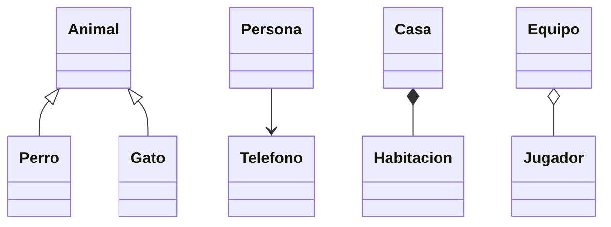
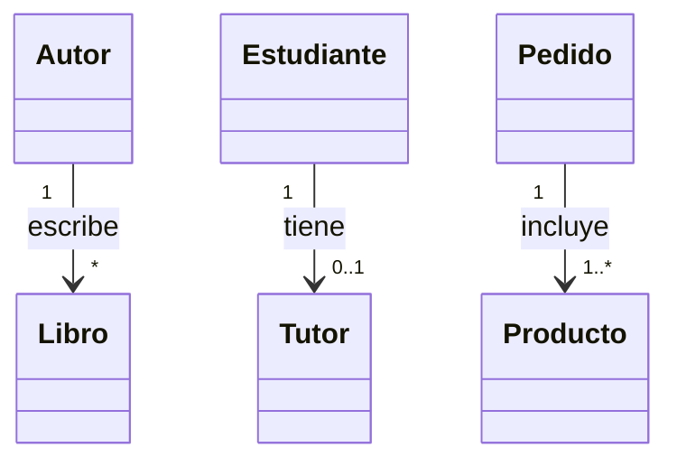
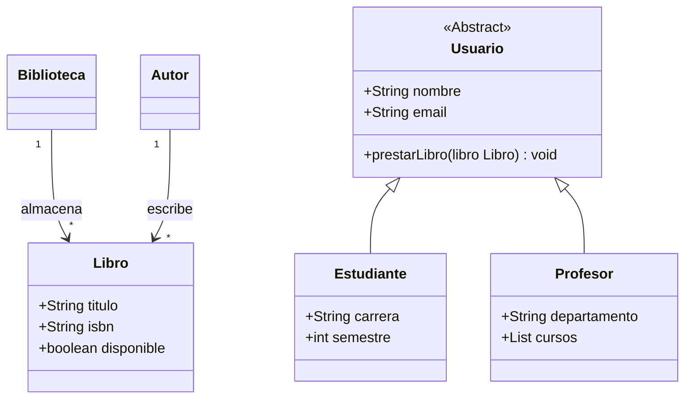

# Clase 02 - Semana 03 - Repaso Final POO y UML (Evaluación Mañana)

- Unidad 01: **Introducción a la POO**
- Fecha: Martes 26 de Agosto, 2025
- Horario: 10:50 - 13:30
- Docente: Diego Obando

## 🎯 Objetivos de la Clase

**Objetivo principal:** Reforzar los temas específicos que aparecen en la evaluación del miércoles, complementando los ejercicios prácticos del lunes.

Al finalizar esta clase, los estudiantes podrán:

1. ✅ **Dominar sintaxis** de clases e interfaces en TypeScript
2. ✅ **Interpretar simbología UML** y tipos de relaciones
3. ✅ **Usar herramientas** como Git, GitHub y draw.io
4. ✅ **Resolver ejercicios** tipo evaluación con confianza

---

## ⚡ Repaso Express (10 minutos)

### Los 4 Pilares de POO

- **Abstracción:** Simplificar la realidad
- **Encapsulamiento:** Ocultar detalles internos
- **Herencia:** Reutilizar código (`extends`, `super`)
- **Polimorfismo:** Múltiples formas del mismo método

### Relaciones UML Básicas

- **Herencia:** `<|--` (ES UN)
- **Asociación:** `-->` (TIENE/USA)
- **Cardinalidad:** `1`, `*`, `0..1`, `1..*`

---

## 📝 Sintaxis y Conceptos Básicos

### 🔧 Definición de Clases en JavaScript/TypeScript

**JavaScript (ES6+):**

```javascript
class MiClase {
  constructor(parametro) {
    this.propiedad = parametro;
  }

  metodo() {
    return "Hola desde JavaScript";
  }
}
```

**TypeScript (con tipos):**

```typescript
class MiClase {
  private propiedad: string;

  constructor(parametro: string) {
    this.propiedad = parametro;
  }

  public metodo(): string {
    return "Hola desde TypeScript";
  }
}
```

### 🎯 **Diferencias Clave:**

- **`class MiClase {}`** ✅ (correcto)
- **`function MiClase() {}`** ❌ (función, no clase)
- **`def MiClase():`** ❌ (Python, no JavaScript)
- **`MiClase = {}`** ❌ (objeto literal, no clase)

### 🔌 Interfaces en TypeScript

**¿Qué es una interface?**
Una interfaz define la **estructura** que debe seguir un objeto o clase.

```typescript
interface Producto {
  nombre: string;
  precio: number;
  categoria?: string; // Opcional
}

// Implementar interface
class ArticuloTienda implements Producto {
  nombre: string;
  precio: number;
  categoria: string;

  constructor(nombre: string, precio: number, categoria: string) {
    this.nombre = nombre;
    this.precio = precio;
    this.categoria = categoria;
  }
}

// Usar interface como tipo
function procesarProducto(producto: Producto): void {
  console.log(`Producto: ${producto.nombre} - $${producto.precio}`);
}
```

### 📚 Arrays y Manejo de Objetos

```typescript
class Inventario {
  productos: Producto[] = []; // Array de productos

  agregarProducto(producto: Producto): void {
    this.productos.push(producto);
  }

  buscarProducto(nombre: string): Producto | undefined {
    return this.productos.find((p) => p.nombre === nombre);
  }

  obtenerTotal(): number {
    return this.productos.reduce((total, p) => total + p.precio, 0);
  }
}
```

---

## 🛠️ Herramientas y Contexto

### 🔄 Git y GitHub

**¿Qué es Git?**

- Sistema de **control de versiones**
- Permite mantener **historial de cambios**
- Facilita **colaboración** entre desarrolladores

**¿Qué es GitHub?**

- Plataforma web que **aloja repositorios Git**
- Permite **compartir código** públicamente o privadamente
- Incluye herramientas de **colaboración** (issues, pull requests)

**Ventajas principales:**

- 📝 Historial completo de cambios
- 👥 Trabajo colaborativo
- 🔙 Posibilidad de volver a versiones anteriores
- 🌐 Respaldo en la nube

### 🎨 draw.io para Diagramas UML

**¿Qué es draw.io?**

- Herramienta **gratuita** para crear diagramas
- Compatible con **diagramas UML**
- Se puede usar **online** (app.diagrams.net)
- **Alternativas:** Lucidchart, Visual Paradigm, PlantUML

**¿Para qué sirve?**

- Crear diagramas de clases UML
- Diseñar arquitectura de software
- Documentar sistemas
- Comunicar ideas visualmente

---

## 🔍 Simbología UML Específica

### 🏹 Tipos de Flechas y Conectores

| Símbolo | Nombre          | Significado  | Ejemplo                      |
| ------- | --------------- | ------------ | ---------------------------- |
| `<\|--` | **Herencia**    | "ES UN"      | Perro ES UN Animal           |
| `-->`   | **Asociación**  | "TIENE/USA"  | Persona TIENE Teléfono       |
| `*--`   | **Composición** | "PARTE DE"   | Motor PARTE DE Auto          |
| `o--`   | **Agregación**  | "CONTIENE"   | Equipo CONTIENE Jugadores    |
| `..>`   | **Dependencia** | "DEPENDE DE" | Clase USA otra temporalmente |

### 🎯 **Pregunta Tipo Evaluación:**

**"¿Qué representa una flecha con punta cerrada en un diagrama de clases UML?"**



**Respuesta:** La flecha con punta cerrada (`<|--`) representa **HERENCIA** ✅

### 📊 Cardinalidad Detallada



**Interpretación:**

- **"1" --> "\*"**: Un autor puede escribir muchos libros (0 o más)
- **"1" --> "0..1"**: Un estudiante puede tener un tutor (opcional)
- **"1" --> "1..\*"**: Un pedido debe incluir al menos un producto

---

## 🔥 Ejercicios de Análisis de Código

### 📋 Ejercicio 1: Análisis con Interfaces

**Analiza el siguiente código TypeScript:**

```typescript
interface Animal {
  nombre: string;
  edad: number;
  emitirSonido(): string;
}

class Perro implements Animal {
  nombre: string;
  edad: number;
  raza: string;

  constructor(nombre: string, edad: number, raza: string) {
    this.nombre = nombre;
    this.edad = edad;
    this.raza = raza;
  }

  emitirSonido(): string {
    return "¡Guau guau!";
  }

  buscarPelota(): string {
    return `${this.nombre} está buscando la pelota`;
  }
}

class Gato implements Animal {
  nombre: string;
  edad: number;

  constructor(nombre: string, edad: number) {
    this.nombre = nombre;
    this.edad = edad;
  }

  emitirSonido(): string {
    return "¡Miau!";
  }
}
```

#### **Preguntas:**

1. **¿Qué representa la interfaz Animal?**
2. **¿Qué método es exclusivo de la clase Perro?**
3. **¿Ambas clases implementan todos los métodos de la interfaz?**

#### **Respuestas:**

1. La interfaz Animal define la estructura que deben seguir las clases que la implementen: propiedades nombre, edad y método emitirSonido()
2. El método buscarPelota() es exclusivo de la clase Perro
3. Sí, ambas clases implementan nombre, edad y emitirSonido() como requiere la interfaz

---

### 📋 Ejercicio 2: Herencia y Super

**Analiza este código:**

```typescript
class Vehiculo {
  marca: string;
  modelo: string;

  constructor(marca: string, modelo: string) {
    this.marca = marca;
    this.modelo = modelo;
  }

  arrancar(): string {
    return `${this.marca} ${this.modelo} ha arrancado`;
  }
}

class Moto extends Vehiculo {
  cilindrada: number;

  constructor(marca: string, modelo: string, cilindrada: number) {
    super(marca, modelo);
    this.cilindrada = cilindrada;
  }

  hacerCaballito(): string {
    return "¡Haciendo caballito!";
  }
}

const moto1 = new Moto("Honda", "CBR", 600);
```

#### **Preguntas:**

1. **¿Qué clase hereda de otra?**
2. **¿Para qué sirve `super` en el constructor?**
3. **¿Qué métodos puede usar `moto1`?**

#### **Respuestas:**

1. La clase Moto hereda de la clase Vehiculo
2. `super(marca, modelo)` llama al constructor de la clase padre para inicializar marca y modelo
3. `moto1` puede usar: arrancar() (heredado), hacerCaballito() (propio), y acceder a propiedades marca, modelo, cilindrada

---

### 📋 Ejercicio 3: Análisis de Diagrama

**Interpreta este diagrama:**



#### **Preguntas:**

1. **¿Qué significa `<<Abstract>>` en la clase Usuario?**
2. **¿Cuántos libros puede tener una biblioteca?**
3. **¿Qué relación existe entre Usuario y Estudiante?**

#### **Respuestas:**

1. `<<Abstract>>` indica que Usuario es una clase abstracta, no se puede instanciar directamente
2. Una biblioteca puede almacenar muchos libros (cardinalidad "\*")
3. La relación es de herencia, Usuario es la clase padre y Estudiante es la clase hija

---

## 🎯 Simulacro de Evaluación

### Sección I: Selección Múltiple

**1. ¿Cuál es la sintaxis correcta para definir una clase en TypeScript?**

- a) `function MiClase() {}`
- b) `class MiClase {}` ✅
- c) `def MiClase():`
- d) `MiClase = {}`

**2. ¿Qué herramienta NO se usa para crear diagramas UML?**

- a) draw.io
- b) PlantUML
- c) Git ✅
- d) Lucidchart

**3. En una relación "Profesor 1 --> \* Curso", ¿qué significa?**

- a) Un curso tiene un profesor
- b) Un profesor puede dictar muchos cursos ✅
- c) Muchos profesores enseñan un curso
- d) Es una relación de herencia

**4. ¿Para qué sirve una interfaz en TypeScript?**

- a) Crear objetos
- b) Definir la estructura que debe seguir una clase ✅
- c) Heredar de otra clase
- d) Ejecutar funciones

**5. ¿Qué representa el símbolo `*--` en UML?**

- a) Herencia
- b) Asociación
- c) Composición ✅
- d) Dependencia

### Sección II: Verdadero o Falso

**6. (V/F)** Una interfaz puede tener métodos y propiedades.
**Respuesta:** Verdadero ✅

**7. (V/F)** `super()` se usa para crear una nueva instancia.
**Respuesta:** Falso ❌ (se usa para llamar al constructor padre)

**8. (V/F)** Git y GitHub son la misma herramienta.
**Respuesta:** Falso ❌ (Git es el sistema, GitHub es la plataforma)

**9. (V/F)** Una clase abstracta no se puede instanciar directamente.
**Respuesta:** Verdadero ✅

**10. (V/F)** En "Cliente 1 --> \* Pedido", un cliente puede tener muchos pedidos.
**Respuesta:** Verdadero ✅

### Sección III: Análisis Rápido

**11. Identifica el error en este código:**

```typescript
interface Producto {
  nombre: string;
  precio: number;
}

class Articulo {
  nombre: string;
  // ¿Falta algo?
}
```

**Respuesta:** Falta implementar la interfaz (`implements Producto`) y la propiedad `precio`

**12. ¿Qué imprime este código?**

```typescript
class Animal {
  nombre = "Animal genérico";
  saludar() {
    return `Hola, soy ${this.nombre}`;
  }
}

class Perro extends Animal {
  nombre = "Rex";
}

const perro = new Perro();
console.log(perro.saludar());
```

**Respuesta:** "Hola, soy Rex"

---

## 📚 Resumen Final y Checklist

### ✅ Checklist de Evaluación

**Sintaxis TypeScript:**

- [ ] Definir clases con `class`
- [ ] Usar interfaces con `implements`
- [ ] Aplicar herencia con `extends` y `super`
- [ ] Manejar arrays y objetos

**Diagramas UML:**

- [ ] Identificar tipos de relaciones (herencia, asociación, etc.)
- [ ] Interpretar cardinalidad (1, _, 0..1, 1.._)
- [ ] Reconocer clases abstractas `<<Abstract>>`
- [ ] Leer diagramas Mermaid

**Herramientas:**

- [ ] Explicar qué son Git y GitHub
- [ ] Conocer draw.io para diagramas
- [ ] Entender control de versiones

**Conceptos POO:**

- [ ] Los 4 pilares con ejemplos
- [ ] Diferencia entre clase, objeto, interfaz
- [ ] Herencia vs composición vs agregación

### 🎯 **Consejos para Mañana:**

1. **Lee bien cada pregunta** - no te apures
2. **Identifica palabras clave** - "herencia", "interfaz", "cardinalidad"
3. **Dibuja diagramas** si ayuda a visualizar
4. **Revisa las respuestas** antes de entregar
5. **Confía en tu preparación** - han practicado mucho!

¡Éxito en la evaluación! 🚀

---

## 📖 Material de Referencia Rápida

### Sintaxis Esencial

```typescript
// Clase básica
class MiClase {
  propiedad: tipo;
  constructor(param: tipo) {
    this.propiedad = param;
  }
  metodo(): tipo {
    return valor;
  }
}

// Herencia
class Hijo extends Padre {
  constructor(param: tipo) {
    super(param);
  }
}

// Interfaz
interface MiInterfaz {
  propiedad: tipo;
  metodo(): tipo;
}
```

### Relaciones UML

- `<|--` = Herencia
- `-->` = Asociación
- `*--` = Composición
- `o--` = Agregación
- `..>` = Dependencia

### Cardinalidad

- `1` = exactamente uno
- `*` = cero o muchos
- `0..1` = cero o uno
- `1..*` = uno o más
