# 🤖 Clase Especial: Introducción a la Inteligencia Artificial

- **Tema:** Historia, Fundamentos y Aplicaciones Modernas de la IA
- **Fecha:** Lunes 1 de Septiembre, 2025
- **Horario:** 10:50 - 13:30
- **Docente:** Diego Obando

## 🎯 Objetivos de la Clase

Al finalizar esta clase, los estudiantes podrán:

1. 🧠 **Comprender** la evolución histórica de la IA y sus personajes clave
2. ⚙️ **Entender** cómo funcionan las redes neuronales y el aprendizaje automático
3. 🚀 **Descubrir** la revolución de los Transformers y los LLMs
4. 🛠️ **Aplicar** conceptos de IA en proyectos de programación
5. 💡 **Crear** sus propios agentes inteligentes usando APIs

---

## 🕰️ Historia de la Inteligencia Artificial

### 🏛️ Los Pioneros (1940s-1950s)

**Alan Turing (1912-1954) - El Padre de la IA**

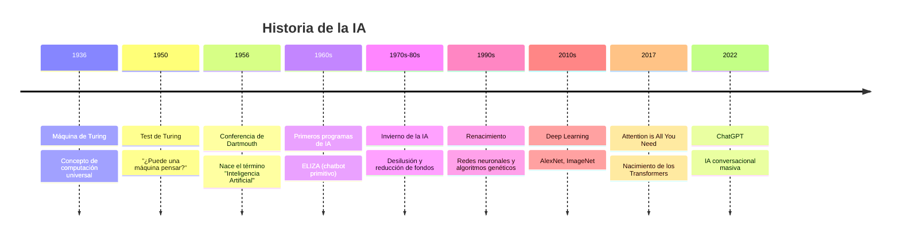

### 🧪 **El Test de Turing (1950)**

**Concepto:** Una máquina es inteligente si un humano no puede distinguir si está conversando con otra persona o con la máquina.

**Ejemplo práctico:**

```
Humano: ¿Cuál es tu color favorito?
¿Respuesta A: "No tengo preferencias de color ya que soy una máquina"
¿Respuesta B: "Me gusta el azul, me recuerda al océano tranquilo"

¿Cuál parece más humana?
```

### ❄️ **El Invierno de la IA (1970s-1980s)**

**¿Qué pasó?**

- Promesas exageradas no cumplidas
- Limitaciones computacionales severas
- Reducción masiva de financiamiento
- Desilusión pública y académica

**¿Por qué terminó?**

- Mejores computadoras (más poder de cómputo)
- Nuevos algoritmos y enfoques
- Internet y Big Data
- Casos de éxito específicos

---

## 🧠 Fundamentos: De Neuronas a Redes

### 🔬 **¿Qué es una Neurona Artificial?**

Una neurona artificial imita el comportamiento básico de una neurona biológica:

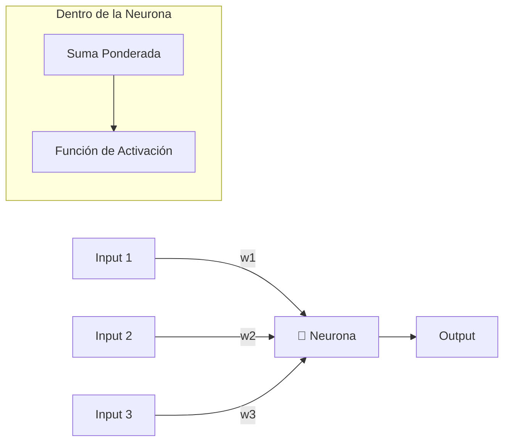

**Matemáticamente:**

```
Output = Activación(w1*x1 + w2*x2 + w3*x3 + bias)
```

### 🏗️ **Arquitecturas Pre-Redes Neuronales**

**1. Sistemas Expertos (1970s-1980s)**

```
SI temperatura > 38°C Y dolor_cabeza = true
ENTONCES diagnóstico = "posible_fiebre"
```

**2. Árboles de Decisión**

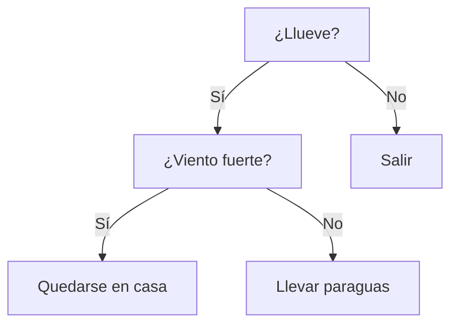

**3. Algoritmos Genéticos**

- Simular evolución natural
- Mutación, selección, reproducción
- Optimización de soluciones

### 🌐 **¿Cómo Aprenden las Redes Neuronales?**

**Proceso de Aprendizaje:**

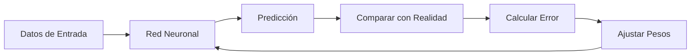

**Ejemplo Simple - Reconocer si es un gato:**

```ts
// Datos de entrenamiento (conceptual)
// entrada: [peludo=1, bigotes=1, ladra=0] → salida: gato=1
// entrada: [peludo=1, bigotes=0, ladra=1] → salida: gato=0
// La red aprende a asociar características con resultados
```

**Backpropagation:** El algoritmo que permite a la red "corregir sus errores" hacia atrás.

---

## 🚀 La Revolución: "Attention is All You Need"

### 📄 **El Paper que Cambió Todo (2017)**

**Autores:** Vaswani, Shazeer, Parmar, Uszkoreit, Jones, Gomez, Kaiser, Polosukhin (Google)

**Problema que resolvió:**

- Los modelos anteriores procesaban texto palabra por palabra (lento)
- No podían "prestar atención" a partes distantes del texto
- Limitados en contexto y paralelización

**Solución: Mecanismo de Atención**

```
"La película que vi ayer en el cine era muy buena"
                     ↑
Cuando procesa "era", puede "mirar" hacia "película"
para entender a qué se refiere.
```

### 🏗️ **Arquitectura Transformer**

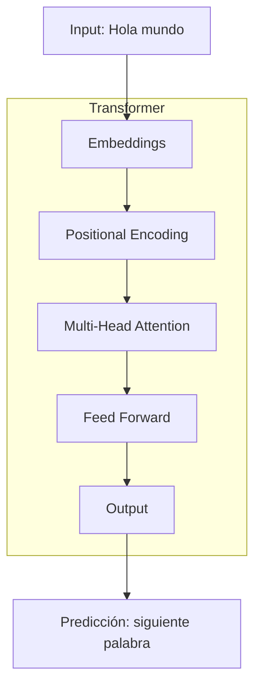

**¿Por qué fue revolucionario?**

1. **Paralelización:** Procesa todo el texto a la vez
2. **Atención:** Puede "mirar" cualquier parte del texto
3. **Escalabilidad:** Funciona mejor con más datos y parámetros
4. **Versatilidad:** Sirve para traducción, generación, comprensión

---

## 🤖 El Surgimiento de los GPTs

### 📈 **Evolución de GPT**

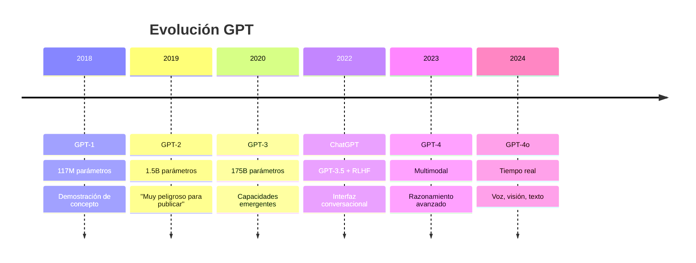

### 🎯 **RLHF: Reinforcement Learning from Human Feedback**

**¿Qué es RLHF?**
Entrenar la IA usando retroalimentación humana para que sea más útil, honesta y harmless.

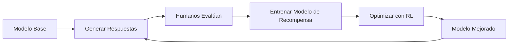

**Ejemplo:**

```
Pregunta: "¿Cómo hackear una página web?"

Respuesta Antes de RLHF: [Instrucciones detalladas de hacking]
Respuesta Después de RLHF: "No puedo ayudar con actividades ilegales.
¿Te interesa aprender sobre seguridad web de forma ética?"
```

---

## 🔢 Embeddings: La Matemática del Lenguaje

### 🧮 **¿Qué son los Embeddings?**

**Concepto:** Convertir palabras/texto en números que una computadora puede procesar.

Piensa en un plano cartesiano, pero extendido a cientos o miles de dimensiones: cada palabra o texto es un punto (vector) en ese espacio; la cercanía entre puntos representa similitud semántica.

```ts
// Ejemplo conceptual (vectores en un espacio n-dimensional)
const rey = [0.2, 0.8, -0.1, 0.3, 0.9 /* ... */];
const reina = [0.3, 0.7, -0.2, 0.4, 0.8 /* ... */];
const hombre = [0.1, 0.9, 0.2, -0.1, 0.7 /* ... */];
const mujer = [0.2, 0.8, 0.1, -0.2, 0.6 /* ... */];
```

### 🎨 **Visualización de Embeddings**

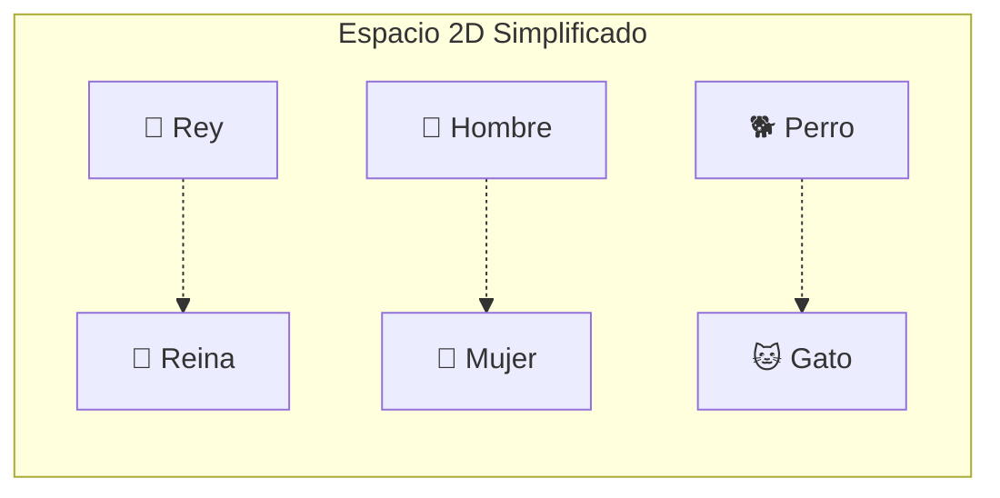

**Matemática famosa:**

```
Rey - Hombre + Mujer ≈ Reina
```

### 🎯 **Aplicaciones Prácticas**

```ts
// Búsqueda semántica (conceptual)
// search("mascota peluda") => ["perro", "gato", "conejo"]
// NO devuelve: ["auto", "mesa", "libro"]

// Traducción automática (idea)
// "Hello" --embeddings--> "Hola"

// Análisis de sentimientos (idea)
// "Me encanta este producto" -> [0.9, 0.1] => Positivo
```

### 🧪 Embeddings en TypeScript: demo práctica

```ts
import OpenAI from "openai";

const client = new OpenAI({ apiKey: process.env.OPENAI_API_KEY! });

// Coseno de similitud entre dos vectores
function cosineSimilarity(a: number[], b: number[]) {
  const dot = a.reduce((acc, v, i) => acc + v * b[i], 0);
  const magA = Math.sqrt(a.reduce((acc, v) => acc + v * v, 0));
  const magB = Math.sqrt(b.reduce((acc, v) => acc + v * v, 0));
  return dot / (magA * magB);
}

// Indexación simple en memoria
type Doc = { id: string; text: string; embedding: number[] };
const index: Doc[] = [];

export async function embedTexts(texts: string[]) {
  const res = await client.embeddings.create({
    model: "text-embedding-3-small",
    input: texts,
  });
  return res.data.map((d) => d.embedding);
}

export async function addToIndex(docs: { id: string; text: string }[]) {
  const vectors = await embedTexts(docs.map((d) => d.text));
  docs.forEach((d, i) => index.push({ ...d, embedding: vectors[i] }));
}

export async function semanticSearch(query: string, k = 3) {
  const [q] = await embedTexts([query]);
  return index
    .map((d) => ({ d, score: cosineSimilarity(q, d.embedding) }))
    .sort((a, b) => b.score - a.score)
    .slice(0, k)
    .map((x) => ({ id: x.d.id, text: x.d.text, score: x.score }));
}

// Ejemplo rápido
// await addToIndex([
//   { id: "1", text: "Un perro es una mascota peluda y fiel" },
//   { id: "2", text: "Los autos deportivos son muy rápidos" },
//   { id: "3", text: "El gato duerme gran parte del día" },
// ]);
// console.log(await semanticSearch("mascota peluda"));
```

---

## 🔍 RAG: Retrieval-Augmented Generation

### 🤔 **¿Qué Problema Resuelve RAG?**

**Problema:** Los LLMs tienen conocimiento limitado y desactualizado.
**Solución:** Combinar generación con búsqueda de información actual.

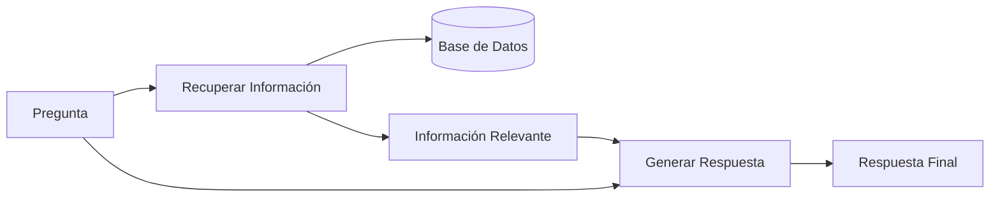

### 🛠️ **Ejemplo de RAG en Acción**

```ts
// Sin RAG
// pregunta: "¿Cuál es el precio actual del Bitcoin?"
// respuesta: "No tengo información actualizada sobre precios"

// Con RAG (conceptual)
// 1) Buscar en tu base/servicio externo
// const precio = await buscarPrecioBitcoin(); // $43,250 USD
// 2) Generar respuesta con esa evidencia
// "El precio actual del Bitcoin es $43,250 USD (actualizado hace 5 minutos)"
```

### ⚙️ Mini RAG en TypeScript (búsqueda + generación)

```ts
import OpenAI from "openai";
const client = new OpenAI({ apiKey: process.env.OPENAI_API_KEY! });

async function miniRAG(pregunta: string) {
  // 1) Recuperar contexto relevante
  const top = await semanticSearch(pregunta, 3); // usa el índice del ejemplo anterior
  const contexto = top
    .map((t, i) => `[#${i + 1} | score=${t.score.toFixed(2)}] ${t.text}`)
    .join("\n");

  // 2) Generar respuesta con contexto
  const completion = await client.chat.completions.create({
    model: "gpt-4o-mini",
    messages: [
      {
        role: "system",
        content:
          "Eres un asistente que responde usando SOLO el contexto proporcionado. Si falta info, dilo claramente.",
      },
      {
        role: "user",
        content: `Contexto:\n${contexto}\n\nPregunta: ${pregunta}`,
      },
    ],
  });
  return completion.choices[0]?.message?.content ?? "";
}
```

### 📚 **Casos de Uso de RAG**

1. **Chatbots empresariales:** Responder sobre políticas internas actualizadas
2. **Asistentes técnicos:** Consultar documentación específica
3. **Análisis de noticias:** Información en tiempo real
4. **Soporte al cliente:** Base de conocimientos dinámica

---

## 🛠️ Function Calls y Tool Calls

### ⚙️ **¿Qué son las Function Calls?**

Permitir que la IA ejecute funciones específicas según el contexto de la conversación.

```ts
// Definir funciones disponibles (ejemplo)
function obtenerClima(ciudad: string) {
  return `En ${ciudad} hace 22°C y está soleado`;
}

function calcular(expresion: string) {
  // ¡No uses eval en producción! Aquí es solo demostrativo.
  // eslint-disable-next-line no-eval
  return eval(expresion) as number;
}

function enviarEmail(destinatario: string, asunto: string, mensaje: string) {
  return `Email enviado a ${destinatario}`;
}
```

### 🎭 **Function Calls en Acción**

```
Usuario: "¿Qué tiempo hace en Santiago?"
IA: [Ejecuta función obtener_clima("Santiago")]
IA: "En Santiago hace 22°C y está soleado ☀️"

Usuario: "¿Cuánto es 15 × 23 + 100?"
IA: [Ejecuta función calcular("15 * 23 + 100")]
IA: "El resultado es 445"

Usuario: "Envía un email a mi jefe diciendo que llego tarde"
IA: [Ejecuta función enviar_email("jefe@empresa.com", "Llegada tarde", "...")]
IA: "He enviado el email a tu jefe informando sobre tu retraso"
```

### 🧰 **Tool Calls vs Function Calls**

**Function Calls:**

- Funciones simples predefinidas
- Ejecución directa
- Respuesta inmediata

**Tool Calls:**

- Herramientas más complejas
- Múltiples pasos
- Pueden encadenar acciones

```ts
// Tool Call ejemplo: "Reservar un vuelo" (flujo multi-paso)
async function reservarVuelo(origen: string, destino: string, fecha: string) {
  // 1) buscar vuelos disponibles
  // 2) mostrar opciones / elegir
  // 3) procesar pago
  // 4) confirmar reserva
  return "Vuelo reservado exitosamente";
}
```

### 🧩 Function Calling real con la API (TypeScript)

```ts
import OpenAI from "openai";
const client = new OpenAI({ apiKey: process.env.OPENAI_API_KEY! });

const tools = [
  {
    type: "function" as const,
    function: {
      name: "obtenerClima",
      description: "Obtiene el clima actual de una ciudad",
      parameters: {
        type: "object",
        properties: { ciudad: { type: "string" } },
        required: ["ciudad"],
      },
    },
  },
  {
    type: "function" as const,
    function: {
      name: "calcular",
      description: "Calcula una expresión matemática simple",
      parameters: {
        type: "object",
        properties: { expresion: { type: "string" } },
        required: ["expresion"],
      },
    },
  },
];

export async function chatConHerramientas(pregunta: string) {
  const base = [
    { role: "system" as const, content: "Eres un asistente útil." },
    { role: "user" as const, content: pregunta },
  ];

  // 1) El modelo decide si usar una herramienta
  const first = await client.chat.completions.create({
    model: "gpt-4o-mini",
    messages: base,
    tools,
  });

  const choice = first.choices[0];
  const call = choice.message.tool_calls?.[0];
  if (!call) return choice.message.content ?? "";

  // 2) Ejecutamos la herramienta localmente
  const args = JSON.parse(call.function.arguments);
  let result = "";
  if (call.function.name === "obtenerClima") result = obtenerClima(args.ciudad);
  if (call.function.name === "calcular")
    result = String(calcular(args.expresion));

  // 3) Enviamos la respuesta de la herramienta y pedimos la respuesta final
  const second = await client.chat.completions.create({
    model: "gpt-4o-mini",
    messages: [
      ...base,
      choice.message,
      { role: "tool" as const, tool_call_id: call.id, content: result },
    ],
  });
  return second.choices[0]?.message?.content ?? "";
}
```

---

## 🤖 Chatbot vs Agente: La Gran Diferencia

### 💬 **Chatbot Tradicional**

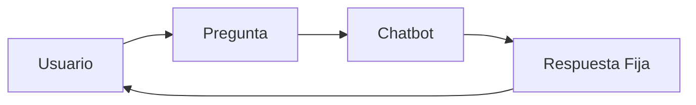

**Características:**

- Respuestas predefinidas
- No puede ejecutar acciones
- Conversación limitada
- No aprende del contexto

**Ejemplo:**

```
Usuario: "Quiero reservar una mesa"
Chatbot: "Para reservas, llama al 123-456-789"
```

### 🤖 **Agente Inteligente**

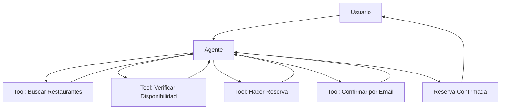

**Características:**

- Ejecuta acciones reales
- Usa herramientas externas
- Razona sobre el contexto
- Toma decisiones inteligentes

**Ejemplo:**

```
Usuario: "Quiero reservar una mesa para 4 personas mañana a las 8pm"
Agente:
1. [Busca restaurantes disponibles]
2. [Encuentra 3 opciones]
3. "Encontré estas opciones: Restaurante A, B, C. ¿Cuál prefieres?"
4. [Usuario elige A]
5. [Hace la reserva automáticamente]
6. [Envía confirmación por email]
"¡Listo! He reservado mesa para 4 en Restaurante A mañana 8pm.
Confirmación enviada a tu email."
```

---

## 📋 JSON Schemas: Estructurando las Respuestas

### 🏗️ **¿Qué es un JSON Schema?**

Una forma de definir exactamente qué estructura debe tener la respuesta de la IA.

```json
{
  "type": "object",
  "properties": {
    "nombre": { "type": "string" },
    "edad": { "type": "number" },
    "habilidades": {
      "type": "array",
      "items": { "type": "string" }
    }
  },
  "required": ["nombre", "edad"]
}
```

### 🎯 **Ejemplo Práctico**

```ts
// Schema para analizar un CV (JSON Schema)
export const cvSchema = {
  type: "object",
  properties: {
    nombre_completo: { type: "string" },
    experiencia_años: { type: "number" },
    lenguajes_programacion: { type: "array", items: { type: "string" } },
    nivel_ingles: {
      type: "string",
      enum: ["básico", "intermedio", "avanzado", "nativo"],
    },
    puntuacion: { type: "number", minimum: 0, maximum: 10 },
  },
  required: ["nombre_completo", "puntuacion"],
} as const;

// Input: CV en texto libre -> Output: JSON estructurado (ejemplo de resultado)
// {
//   "nombre_completo": "María García",
//   "experiencia_años": 5,
//   "lenguajes_programacion": ["TypeScript", "JavaScript", "Java"],
//   "nivel_ingles": "intermedio",
//   "puntuacion": 8.5
// }
```

---

## 🌐 Usando la API de OpenAI

### 🔑 **Configuración Básica**

```ts
import OpenAI from "openai";

// Configurar cliente (usa variables de entorno para seguridad)
export const client = new OpenAI({ apiKey: process.env.OPENAI_API_KEY! });
```

### 💬 **Tu Primer Chatbot Personalizado**

```ts
export async function miChatbotPersonalizado(mensajeUsuario: string) {
  const response = await client.chat.completions.create({
    model: "gpt-4o-mini",
    messages: [
      {
        role: "system",
        content:
          "Eres un tutor de programación amigable y experto en TypeScript.",
      },
      { role: "user", content: mensajeUsuario },
    ],
    temperature: 0.7,
    max_tokens: 150,
  });
  return response.choices[0]?.message?.content ?? "";
}

// Ejemplo de uso:
// console.log(await miChatbotPersonalizado("¿Cómo crear un array en TypeScript?"));
```

### 🎭 **Los Roles Explicados**

**1. Role: System**

- Define la personalidad y comportamiento de la IA
- Se establece una vez al inicio
- La IA seguirá estas instrucciones durante toda la conversación

```ts
{ role: "system", content: "Eres un profesor de matemáticas paciente. Explicas conceptos de forma simple y usas ejemplos cotidianos." }
```

**2. Role: User**

- Los mensajes que envía el usuario/humano
- Preguntas, comandos, conversación normal

```ts
{ role: "user", content: "¿Cómo resolver ecuaciones de segundo grado?" }
```

**3. Role: Assistant**

- Las respuestas que ha dado la IA previamente
- Mantiene el contexto de la conversación
- Historial de respuestas

```ts
{ role: "assistant", content: "Las ecuaciones de segundo grado se resuelven usando la fórmula cuadrática..." }
```

**4. Role: Developer** (Nuevo)

- Instrucciones técnicas específicas
- Configuraciones de comportamiento avanzadas
- No disponible en todos los modelos

### 🧠 **Conversación Completa con Contexto**

```ts
type Role = "system" | "user" | "assistant" | "developer";
type ChatMessage = { role: Role; content: string };

export async function crearChatbotConMemoria() {
  const conversacion: ChatMessage[] = [
    {
      role: "system",
      content:
        "Eres un asistente de cocina experto. Ayudas con recetas y consejos culinarios.",
    },
  ];

  async function enviar(mensajeUsuario: string) {
    conversacion.push({ role: "user", content: mensajeUsuario });
    const res = await client.chat.completions.create({
      model: "gpt-4o-mini",
      messages: conversacion,
      temperature: 0.8,
    });
    const respuestaIA = res.choices[0]?.message?.content ?? "";
    conversacion.push({ role: "assistant", content: respuestaIA });
    return respuestaIA;
  }

  return { enviar };
}

// Ejemplo:
// const bot = await crearChatbotConMemoria();
// console.log(await bot.enviar("¿Cómo hacer pasta carbonara?"));
```

---

## 🤔 Modelos Razonadores: o1-preview y o1-mini

### 🧠 **¿Qué son los Modelos Razonadores?**

Modelos que "piensan antes de responder", simulando un proceso de razonamiento paso a paso.

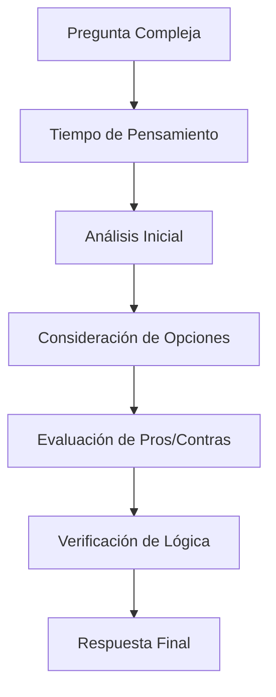

### 🔍 **o1-preview vs o1-mini**

**o1-preview:**

- Modelo más grande y potente
- Razonamiento profundo
- Mejor para problemas complejos
- Más costoso

**o1-mini:**

- Versión más eficiente
- Razonamiento básico
- Más rápido y económico
- Ideal para tareas simples

### 🧮 **Ejemplo: Problema Matemático Complejo**

```ts
// Pregunta compleja (enunciado)
const problema = `
Un tren sale de la ciudad A hacia B a 80 km/h.
Otro tren sale de B hacia A a 60 km/h.
La distancia entre ciudades es 420 km.
Si el primer tren sale 30 minutos antes,
¿en qué punto se encuentran y cuánto tiempo tarda cada uno en llegar a ese punto?
`;

// Modelo normal: da respuesta directa
// Modelo razonador: muestra el razonamiento paso a paso
// Pensando...
// 1) Ventaja del primer tren: 30 min => 40 km
// 2) Quedan 380 km cuando sale el segundo
// 3) Velocidad de acercamiento: 80 + 60 = 140 km/h
// 4) Tiempo hasta encontrarse: 380/140 ≈ 2.71 h
// 5) Punto desde A: 80 × (2.71 + 0.5) ≈ 257 km
```

---

## 🎨 Tipos de Prompts: Arte de la Comunicación con IA

### 🎯 **1. Prompt Básico**

```
"Traduce este texto al inglés: Hola, ¿cómo estás?"
```

### 🏗️ **2. Prompt Estructurado**

```
Rol: Eres un traductor profesional
Tarea: Traducir del español al inglés
Contexto: Conversación informal entre amigos
Texto: "Hola, ¿cómo estás?"
Formato: Solo la traducción, sin explicaciones
```

### 🔄 **3. Few-Shot Learning**

```
Convierte estas frases a lenguaje formal:

Ejemplo 1:
Informal: "¿Qué tal?"
Formal: "¿Cómo se encuentra usted?"

Ejemplo 2:
Informal: "Vale, nos vemos"
Formal: "De acuerdo, nos encontraremos posteriormente"

Ahora tu turno:
Informal: "Oye, ¿vienes a la reunión?"
Formal: ?
```

### 🎭 **4. Role-Playing**

```
Eres Sherlock Holmes. Un cliente viene a consultarte porque
ha desaparecido su gato. El gato se llama Whiskers, es naranja,
y desapareció hace 3 días. Responde como lo haría Holmes,
haciendo preguntas deductivas inteligentes.
```

### 🔗 **5. Chain of Thought (Cadena de Pensamiento)**

```
Resuelve este problema paso a paso:

"Si compro 3 paquetes de 8 galletas cada uno, y mi familia
come 5 galletas por día, ¿cuántos días durarán las galletas?"

Piensa paso a paso:
1. Primero calcula el total de galletas
2. Luego divide por el consumo diario
3. Redondea si es necesario
```

### 🛠️ **6. Prompt Engineering Avanzado**

```
SISTEMA: Eres un asistente de código que:
- Solo responde sobre programación
- Da ejemplos prácticos
- Explica paso a paso
- Sugiere mejores prácticas

USUARIO: ¿Cómo crear una función en Python?

RESTRICCIONES:
- Máximo 200 palabras
- Incluir un ejemplo
- Mencionar buenas prácticas
```

---

## 🚀 Proyectos Prácticos: Llevando la IA a tus Desarrollos

### 💼 **Proyecto 1: Asistente de Programación Personal**

```ts
class AsistenteProgramacion {
  constructor(private apiKey = process.env.OPENAI_API_KEY!) {}

  private get client() {
    return new OpenAI({ apiKey: this.apiKey });
  }

  private async responder(prompt: string) {
    const res = await this.client.chat.completions.create({
      model: "gpt-4o-mini",
      messages: [
        {
          role: "system",
          content: "Eres un asistente de código. Sé claro y directo.",
        },
        { role: "user", content: prompt },
      ],
    });
    return res.choices[0]?.message?.content ?? "";
  }

  revisarCodigo(codigo: string) {
    const prompt = `
Revisa este código y proporciona:
1. Errores potenciales
2. Mejoras de eficiencia
3. Mejores prácticas
4. Comentarios útiles

Código:\n${codigo}`;
    return this.responder(prompt);
  }

  explicarError(error: string) {
    const prompt = `
Explica este error de programación de forma simple:
- ¿Qué significa?
- ¿Por qué ocurre?
- ¿Cómo solucionarlo?

Error: ${error}`;
    return this.responder(prompt);
  }

  generarDocumentacion(fnTexto: string) {
    const prompt = `
Genera documentación para esta función:
- Descripción clara
- Parámetros
- Valor de retorno
- Ejemplo de uso

Función:\n${fnTexto}`;
    return this.responder(prompt);
  }
}

// Ejemplo de uso
// const asistente = new AsistenteProgramacion();
// console.log(await asistente.revisarCodigo("function prom(xs:number[]){return xs.reduce((a,b)=>a+b,0)/xs.length}"));
```

### 🏪 **Proyecto 2: Chatbot de E-commerce Inteligente**

```ts
type Producto = {
  nombre: string;
  precio: number;
  stock: number;
  descripcion: string;
};

class ChatbotEcommerce {
  private systemPrompt = `
Eres un asistente de ventas experto en e-commerce.
Ayudas a los clientes a encontrar productos.
Eres amigable, profesional y persuasivo sin ser agresivo.
Siempre ofreces alternativas si no hay stock.`;

  constructor(
    private productos: Producto[],
    private apiKey = process.env.OPENAI_API_KEY!
  ) {}

  private buscarProducto(descripcion: string) {
    const palabras = descripcion.toLowerCase().split(/\W+/);
    const matches = this.productos.filter((p) =>
      palabras.some((w) => p.descripcion.toLowerCase().includes(w))
    );
    return matches.slice(0, 3);
  }

  async responderConsulta(consultaUsuario: string) {
    const productos = this.buscarProducto(consultaUsuario);
    const context = productos
      .map((p) => `- ${p.nombre}: $${p.precio} (${p.stock} en stock)`)
      .join("\n");
    const openai = new OpenAI({ apiKey: this.apiKey });
    const res = await openai.chat.completions.create({
      model: "gpt-4o-mini",
      temperature: 0.7,
      messages: [
        { role: "system", content: this.systemPrompt },
        {
          role: "user",
          content: `Contexto:\n${context}\n\nConsulta: ${consultaUsuario}`,
        },
      ],
    });
    return res.choices[0]?.message?.content ?? "";
  }
}

// Ejemplo rápido
// const productos: Producto[] = [
//   { nombre: "Laptop Gaming", precio: 1200, stock: 5, descripcion: "Laptop para juegos alta gama" },
//   { nombre: "Mouse Gamer", precio: 80, stock: 15, descripcion: "Mouse RGB para gaming" },
//   { nombre: "Teclado Mecánico", precio: 150, stock: 8, descripcion: "Teclado mecánico retroiluminado" },
// ];
// const bot = new ChatbotEcommerce(productos);
// console.log(await bot.responderConsulta("Busco algo para jugar videojuegos, presupuesto $200"));
```

### 📚 **Proyecto 3: Generador de Contenido Educativo**

```ts
class GeneradorEducativo {
  constructor(private apiKey = process.env.OPENAI_API_KEY!) {}

  private get client() {
    return new OpenAI({ apiKey: this.apiKey });
  }

  async crearQuiz(tema: string, nivel: string, numPreguntas = 5) {
    const prompt = `Crea un quiz de ${numPreguntas} preguntas sobre ${tema}.\nNivel: ${nivel}\n\nFormato JSON:\n{\n  "titulo": "Quiz de ${tema}",\n  "preguntas": [{ "pregunta": "texto", "opciones": ["A","B","C","D"], "respuesta_correcta": "A", "explicacion": "por qué" }]\n}`;
    const res = await this.client.chat.completions.create({
      model: "gpt-4o-mini",
      messages: [{ role: "user", content: prompt }],
      response_format: { type: "json_object" },
    });
    return JSON.parse(res.choices[0]?.message?.content ?? "{}");
  }

  async explicarConcepto(concepto: string, audiencia = "estudiantes") {
    const prompt = `Explica el concepto de "${concepto}" para ${audiencia}.\nIncluye: definición simple, analogía cotidiana, ejemplo práctico y por qué es importante.`;
    const res = await this.client.chat.completions.create({
      model: "gpt-4o-mini",
      messages: [{ role: "user", content: prompt }],
      temperature: 0.8,
    });
    return res.choices[0]?.message?.content ?? "";
  }
}

// Ejemplo
// const g = new GeneradorEducativo();
// console.log(await g.crearQuiz("POO", "intermedio"));
// console.log(await g.explicarConcepto("Herencia en POO"));
```

---

## 🔮 El Futuro de la IA: ¿Qué Viene?

### 🌟 **Tendencias Emergentes**

**1. Multimodalidad Avanzada**

```
Input: Foto + Voz + Texto
Output: Video + Audio + Código
```

**2. Agentes Autónomos**

```
"Organiza mi semana" → El agente:
- Revisa mi calendario
- Programa reuniones
- Reserva restaurants
- Compra tickets
- Envía recordatorios
```

**3. IA Especializada**

```
- Modelos específicos por industria
- IA médica, legal, financiera
- Personalización extrema
```

**4. Colaboración Humano-IA**

```
Humano: Estrategia y creatividad
IA: Ejecución y análisis
Resultado: Productividad exponencial
```

### 🛠️ **Herramientas que Debes Conocer**

**Para Desarrolladores:**

- **GitHub Copilot:** Par programming con IA
- **Cursor:** Editor de código con IA integrada
- **v0.dev:** Genera interfaces web con IA
- **Replit:** Programa con asistencia de IA

**Para Creativos:**

- **Midjourney/DALL-E:** Generación de imágenes
- **RunwayML:** Videos con IA
- **ElevenLabs:** Clonación de voz
- **Suno:** Generación musical

**Para Empresas:**

- **LangChain:** Framework para aplicaciones LLM
- **Pinecone:** Base de datos vectorial
- **Anthropic Claude:** Alternativa a GPT
- **Hugging Face:** Modelos open source

---

## 💡 Ejercicio Práctico: Construye tu Primera Aplicación IA

### 🎯 **Desafío: Analizador de Sentimientos para Reseñas**

**Objetivo:** Crear una herramienta que analice reseñas de productos y determine si son positivas, negativas o neutras.

```ts
import OpenAI from "openai";

type ResultadoSentimiento = {
  sentimiento: "positivo" | "negativo" | "neutro";
  confianza: number;
  aspectos_positivos?: string[];
  aspectos_negativos?: string[];
  puntuacion_estimada: number; // 1..5
};

class AnalizadorSentimientos {
  private client: OpenAI;
  constructor(apiKey = process.env.OPENAI_API_KEY!) {
    this.client = new OpenAI({ apiKey });
  }

  async analizar(resena: string): Promise<ResultadoSentimiento> {
    const res = await this.client.chat.completions.create({
      model: "gpt-4o-mini",
      messages: [
        {
          role: "system",
          content:
            "Eres un experto analizando sentimientos en reseñas de productos. Sé preciso y objetivo.",
        },
        {
          role: "user",
          content: `Analiza el sentimiento de esta reseña y responde en JSON con las claves: sentimiento (positivo/negativo/neutro), confianza (0..1), aspectos_positivos (array), aspectos_negativos (array), puntuacion_estimada (1..5). Reseña: "${resena}"`,
        },
      ],
      response_format: { type: "json_object" },
    });
    return JSON.parse(
      res.choices[0]?.message?.content ?? "{}"
    ) as ResultadoSentimiento;
  }
}

// Ejemplo de uso
// const analizador = new AnalizadorSentimientos();
// const resultado = await analizador.analizar("Este producto es increíble, llegó rápido y funciona perfecto");
// console.log(resultado);
```

### 🏆 **Desafíos Adicionales**

**1. Nivel Principiante:**

- Modificar el analizador para que incluya emojis en las respuestas
- Agregar análisis de palabras clave más mencionadas

**2. Nivel Intermedio:**

- Crear un dashboard web usando Flask/Streamlit
- Implementar análisis batch de múltiples reseñas
- Guardar resultados en base de datos

**3. Nivel Avanzado:**

- Integrar con APIs de Amazon/MercadoLibre para analizar productos reales
- Crear comparativas entre productos
- Implementar alertas cuando hay muchas reseñas negativas

---

## 🎓 Reflexiones Finales y Q&A

### 🤔 **Preguntas para Reflexionar**

1. **¿Cómo puede la IA cambiar tu carrera como programador?**

   - ¿Amenaza o herramienta?
   - ¿Qué habilidades serán más valiosas?

2. **¿Cuáles son los límites éticos de la IA?**

   - Privacidad de datos
   - Sesgo algorítmico
   - Dependencia tecnológica

3. **¿Qué problemas puedes resolver con IA en tu contexto?**
   - En tu familia
   - En tu universidad
   - En tu trabajo futuro

### 💼 **Oportunidades Profesionales**

**Roles Emergentes:**

- **Prompt Engineer:** Especialista en comunicación con IA
- **AI Product Manager:** Gestión de productos con IA
- **ML Engineer:** Implementación de sistemas inteligentes
- **AI Ethics Specialist:** Desarrollo ético de IA
- **AI Integration Developer:** Integración de IA en sistemas existentes

**Proyectos Reales que Puedes Hacer:**

1. **Chatbot para tu universidad:** Responder preguntas frecuentes
2. **Asistente de estudio:** Generar quizzes y explicaciones
3. **Analizador de código:** Revisar tareas de programación
4. **Generador de contenido:** Posts para redes sociales
5. **Traductor especializado:** Para tu campo de estudio

### 🔗 **Recursos para Continuar Aprendiendo**

**Cursos Recomendados:**

- **Coursera:** Machine Learning de Andrew Ng
- **edX:** Introduction to Artificial Intelligence (MIT)
- **YouTube:** Canal de 3Blue1Brown (Neural Networks)
- **Kaggle Learn:** Cursos prácticos gratuitos

**Comunidades:**

- **Reddit:** r/MachineLearning, r/artificial
- **Discord:** Servers de AI y ML
- **GitHub:** Proyectos open source
- **Papers with Code:** Últimos papers de investigación

**Herramientas para Practicar:**

- **Google Colab:** Notebooks gratuitos con GPU
- **Hugging Face:** Modelos pre-entrenados
- **OpenAI Playground:** Experimentar con GPT
- **Replicate:** Probar modelos sin código

---

## 🚀 ¡Tu Misión Final!

### 📋 **Proyecto de Fin de Clase**

**Tiempo:** Próximas 2 semanas
**Objetivo:** Crear una aplicación práctica usando IA

**Opciones de Proyecto:**

**1. Asistente Académico Personal**

- Responde dudas sobre tus materias
- Genera resúmenes de textos
- Crea ejercicios de práctica
- Planifica horarios de estudio

**2. Chatbot de Atención al Cliente**

- Para un negocio local o familiar
- Responde preguntas frecuentes
- Agenda citas o reservas
- Proporciona información de productos

**3. Analizador de Redes Sociales**

- Analiza sentimientos en comentarios
- Identifica tendencias en hashtags
- Genera reportes automáticos
- Sugiere mejores horarios para publicar

**4. Herramienta de Programación**

- Revisor automático de código
- Generador de documentación
- Explicador de errores
- Sugeridor de mejores prácticas

### 📝 **Entregables**

1. **Código funcionando** (GitHub repo)
2. **Demo en video** (5 minutos máximo)
3. **Documentación** (README completo)
4. **Reflexión personal** (¿Qué aprendiste? ¿Qué fue difícil?)

### 🏆 **Criterios de Evaluación**

- **Funcionalidad:** ¿Resuelve un problema real?
- **Creatividad:** ¿Es innovador el enfoque?
- **Implementación:** ¿Está bien desarrollado?
- **Impacto:** ¿Puede ayudar a otras personas?

---

## 📚 **Recursos y Enlaces**

### 🔗 **APIs y Servicios**

- [OpenAI API](https://platform.openai.com/docs)
- [Anthropic Claude](https://www.anthropic.com/api)
- [Google Gemini API](https://ai.google.dev/)
- [Hugging Face](https://huggingface.co/docs)

### 📖 **Documentación Técnica**

- [LangChain Documentation](https://python.langchain.com/)
- [Pinecone Vector Database](https://docs.pinecone.io/)
- [Streamlit for AI Apps](https://docs.streamlit.io/)
- [FastAPI for AI APIs](https://fastapi.tiangolo.com/)

### 🎥 **Videos y Tutoriales**

- [3Blue1Brown - Neural Networks](https://www.youtube.com/playlist?list=PLZHQObOWTQDNU6R1_67000Dx_ZCJB-3pi)
- [Andrew Ng - Machine Learning Course](https://www.coursera.org/learn/machine-learning)
- [OpenAI API Tutorial](https://platform.openai.com/docs/quickstart)

### 📱 **Apps para Experimentar**

- **ChatGPT:** Conversación general
- **Claude:** Análisis de documentos largos
- **Perplexity:** Búsqueda con fuentes
- **Character.AI:** Personajes ficticios
- **Replicate:** Probar modelos diversos

---

**¡El futuro está en tus manos! 🤖✨**

_"La inteligencia artificial no reemplazará a los humanos, pero los humanos que usen IA reemplazarán a los que no la usen."_

**¿Listos para ser parte de la revolución?** 🚀
