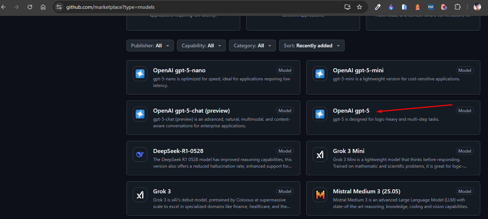
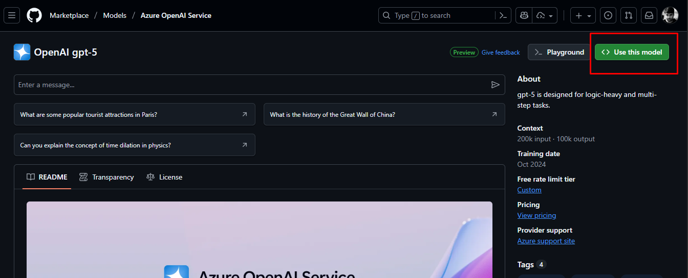
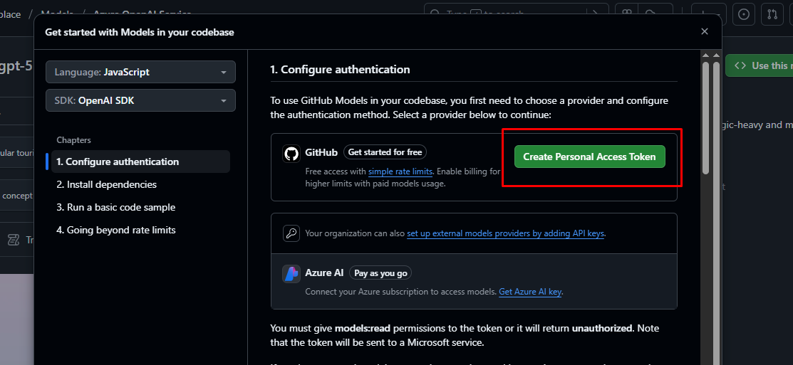
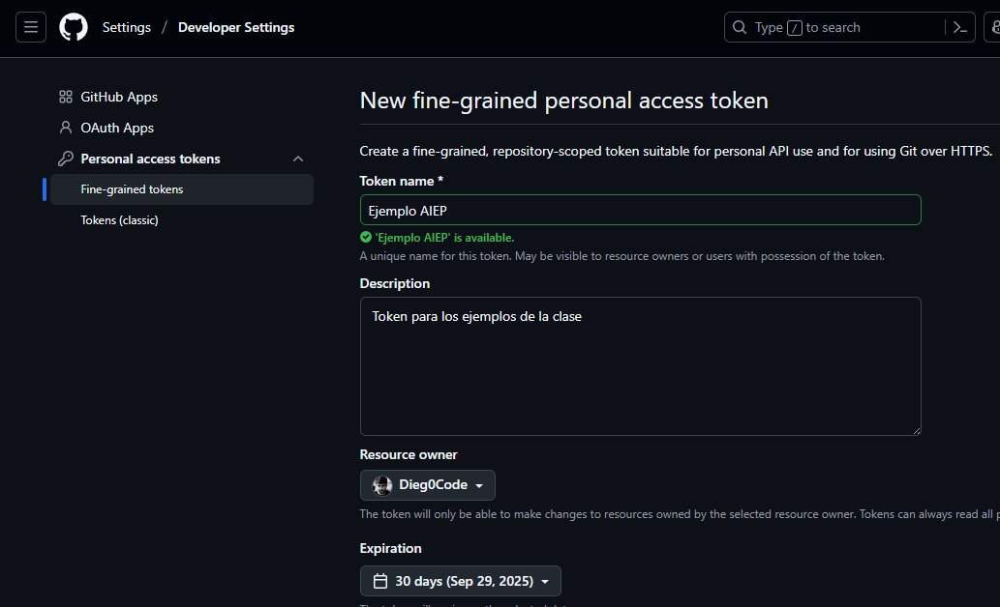
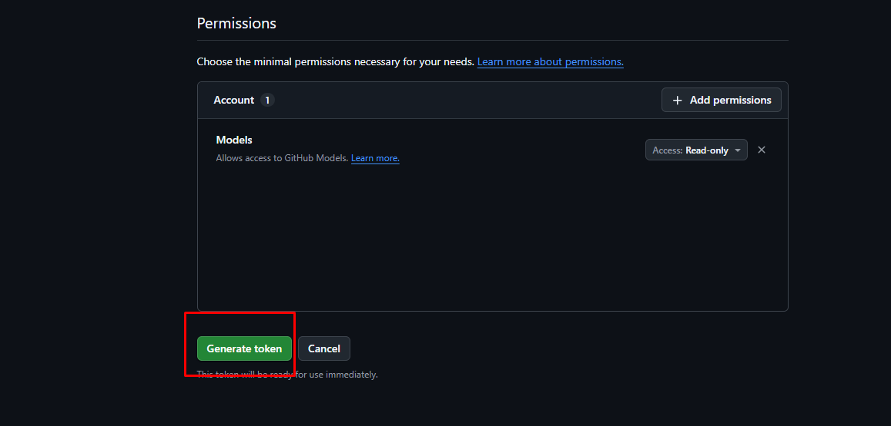
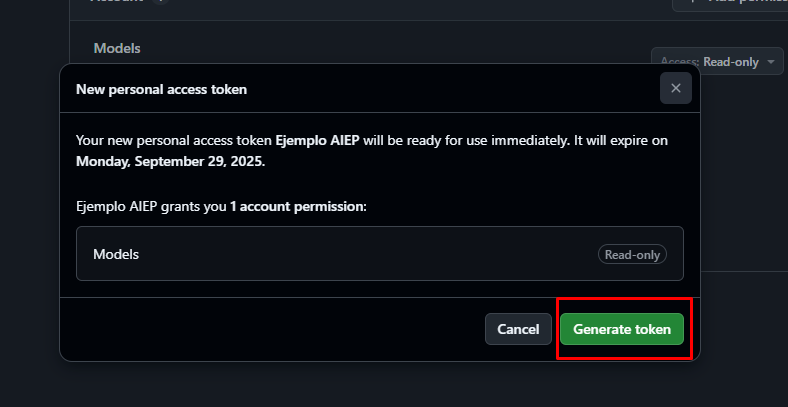
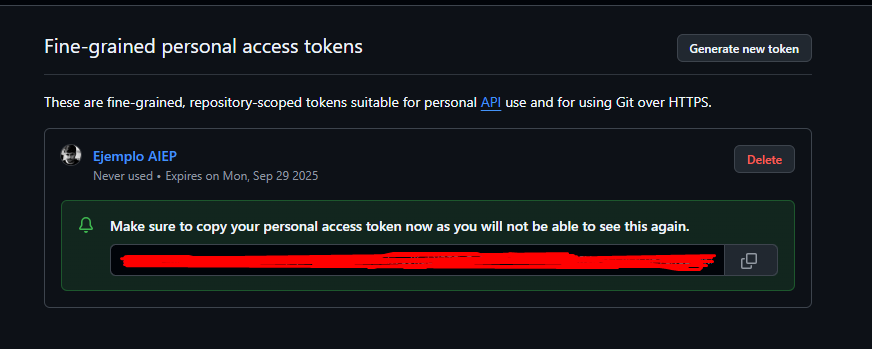

# 🤖 Código de Ejemplo para la Clase

Esta carpeta contiene ejemplos prácticos para aprender a integrar IA en nuestros proyectos.

## Si descargaste el repositorio, asegúrate de hacer lo siguiente:

1. Verifica si tienes **Node.js 18 o superior** instalado.
2. Instala las dependencias necesarias ejecutando el comando `npm install` en la raíz del proyecto.
3. Crea un archivo `.env` en la raíz del proyecto con tu API key de OpenAI.
4. Asegúrate de que el archivo `.env` esté en tu `.gitignore` para evitar subirlo a GitHub.

## 🎯 Objetivo

Demostrar y explorar la integración de la [API de OpenAI](https://platform.openai.com/docs/overview) en nuestro código de manera sencilla y práctica.

## 🚀 Guía Paso a Paso

### 1. 🏗️ Configuración Inicial del Proyecto

Cada vez que iniciemos un nuevo proyecto, seguiremos estos pasos **en orden**:

#### 📁 Preparación del entorno

- ✅ Crear la carpeta del proyecto
- ✅ Inicializar repositorio Git: `git init`
- ✅ Inicializar npm: `npm init -y`

#### 📦 Instalación de dependencias

```bash
npm install openai dotenv
```

> ⚠️ **Importante**: Primero inicializa npm para crear el `package.json`, luego instala las dependencias.

#### ⚙️ Configuración del package.json

Agrega `"type": "module"` para usar ES6 modules:

```json
{
  "name": "code-example",
  "version": "1.0.0",
  "main": "index.js",
  "type": "module",
  "scripts": {
    "test": "echo \"Error: no test specified\" && exit 1"
  },
  "keywords": [],
  "author": "",
  "license": "ISC",
  "description": "",
  "dependencies": {
    "dotenv": "^17.2.1",
    "openai": "^5.16.0"
  }
}
```

#### 🔐 Archivos de configuración

**Crear archivo `.env`** en la raíz:

```env
OPENAI_API_KEY=tu_api_key_aqui
```

**Crear archivo `.gitignore`** en la raíz:

```gitignore
.env
node_modules/
```

> 🔒 **Seguridad**: Nunca subas tu `.env` a GitHub. ¡Tu API key debe mantenerse secreta!

> 📚 **Documentación útil**:
>
> - [OpenAI en npm](https://www.npmjs.com/package/openai)
> - [Repositorio oficial](https://github.com/openai/openai-node)

### 2. 💻 Desarrollo

Una vez configurado el proyecto, ¡ya puedes empezar a codear!

### 3. 📄 Crear ejemplos

Crea archivos individuales para cada ejemplo: [`example1.js`](./example1.js) y [`example2_tool_call.js`](./example2_tool_call.js).

### 4. 🔑 Obtener tu API Key gratuita de GitHub

GitHub nos regala créditos para experimentar con IA.

---

## 🔐 Cómo Obtener tu API Key de GitHub

### Paso 1: 🌟 Accede a GitHub Models

1. 📝 Inicia sesión en tu cuenta de GitHub
2. 🛍️ Ve al [catálogo de modelos](https://github.com/marketplace?type=models)
3. 🎯 Busca y selecciona **"openai/gpt-5"**



### Paso 2: 🚀 Usar el modelo

1. 👀 Revisa la información del modelo
2. 🔘 Haz clic en **"Usar este modelo"** (esquina superior derecha)



### Paso 3: 🎫 Crear Personal Access Token

1. 📋 Se abrirá un diálogo indicando que necesitas un token
2. 🆕 Clic en **"Create Personal Access Token"**



### Paso 4: ⚙️ Configurar el token

Completa la información:

- 📝 **Nombre**: Elige un nombre descriptivo
- 📄 **Descripción**: Para qué vas a usar el token
- ⏰ **Expiración**: Tiempo de vida del token
- 🔐 **Permisos**: Servicios que puede acceder



### Paso 5: 🎉 Generar token

1. 📥 Baja hasta el final y clic en **"Generate Token"**



### Paso 6: ✅ Confirmar creación

1. ✔️ Confirma haciendo clic en **"Generate Token"**



### Paso 7: 💾 ¡Guardar tu token!

1. 📋 **Copia tu token inmediatamente**
2. 🔒 **Guárdalo en un lugar seguro**
3. ⚠️ **No podrás verlo nuevamente**



> 🏦 **Recuerda**: Tu token es como la contraseña de tu banco. **¡NUNCA lo compartas!**

### Paso 8: 🔧 Configurar en tu proyecto

Agrega tu token al archivo `.env`:

```env
OPENAI_API_KEY=tu_token_copiado_aqui
```

---

## 🎊 ¡Listo para Empezar!

Ya tienes todo configurado para comenzar a experimentar con IA 🚀✨

Puede ejecutar y probar el código con el comando:

```bash
node example1.js
```
