# Guía MCP

- Programación y Análisis de Sistemas, AIEP, Osorno, Chile
- Docente: Diego Obando

## Contenidos

1. Introducción a MCP (conceptos y motivación)
2. Arquitectura y ciclo de vida
3. Primer servidor MCP: “Hola MCP”
4. Integración con un cliente MCP (IDE/desktop)
5. Buenas prácticas y patrones
6. Proyecto guiado
7. Anexos

## Introducción a MCP (conceptos y motivación) 🧠🔌

### ¿Qué problema resuelve MCP en el ecosistema de IA? 🎯

Imagina que desarrollas una aplicación con IA y necesitas que acceda a:

- 📊 Una base de datos de clientes
- 📁 Archivos CSV con inventario
- 🌦️ Una API del clima
- 💾 Logs del sistema

**El problema tradicional:**
Cada integración requiere código específico, manejo de errores distinto, autenticación particular, y formatos de respuesta inconsistentes. Si cambias de modelo de IA o quieres reutilizar estas integraciones en otra app, debes reescribir todo.

**La solución MCP:**
Un protocolo estándar que actúa como "traductor universal" 🔄 entre aplicaciones con IA y cualquier sistema externo. Una sola interfaz, múltiples integraciones.

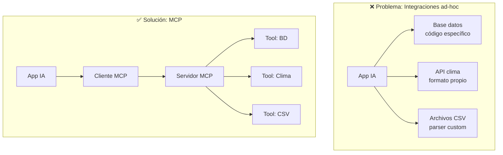

### Vocabulario clave 📚

**🖥️ Client (Cliente MCP):**

- La aplicación que necesita acceder a datos/funcionalidades
- Ejemplos: IDE con IA (VS Code), chatbot, aplicación de escritorio
- Funciones: descubre tools disponibles, valida permisos, invoca herramientas

**🌐 Server (Servidor MCP):**

- El programa que expone herramientas y recursos de forma estandarizada
- Se conecta a sistemas reales (APIs, bases de datos, archivos)
- Funciones: registra capabilities, ejecuta tools, maneja errores

**🔧 Tools (Herramientas):**

- Funciones específicas que el servidor expone al cliente
- Ejemplos: `buscar_cliente`, `obtener_clima`, `calcular_promedio`
- Cada tool tiene nombre, descripción, parámetros de entrada y formato de salida

**💬 Prompts (Plantillas):**

- Instrucciones predefinidas que el servidor puede ofrecer al cliente
- Útiles para tareas repetitivas con contexto específico
- Ejemplo: "Generar reporte mensual con datos de [mes]"

**📦 Resources (Recursos):**

- Datos o contenidos que el servidor puede leer/escribir
- Ejemplos: archivos, URLs, conexiones a base de datos
- El cliente puede solicitar acceso a recursos específicos

**📨 Mensajes:**

- Comunicación estructurada entre cliente y servidor
- Formato JSON estandarizado con tipos: request, response, notification
- Incluyen metadatos como ID de correlación, timestamps, códigos de error

**🚗 Transporte:**

- Método de comunicación entre cliente y servidor
- Opciones: stdio (procesos locales), WebSocket (red), SSE (eventos)
- Transparente para el desarrollador una vez configurado

### Diferencias con integrar directamente APIs de modelos 🆚

| Aspecto           | Integración Directa              | MCP                                     |
| ----------------- | -------------------------------- | --------------------------------------- |
| **Reutilización** | ❌ Código específico por app     | ✅ Un servidor, múltiples clientes      |
| **Mantenimiento** | ❌ Cambios en cada integración   | ✅ Cambios centralizados en el servidor |
| **Estándares**    | ❌ Cada dev inventa su formato   | ✅ Protocolo común y documentado        |
| **Seguridad**     | ❌ Permisos mezclados con lógica | ✅ Capa de permisos clara               |
| **Testing**       | ❌ Tests acoplados a la app      | ✅ Tests independientes del servidor    |
| **Escalabilidad** | ❌ Duplicación de código         | ✅ Composición de servidores            |

**Ejemplo práctico:**

```typescript
// ❌ Integración directa
const respuestaClima = await fetch(
  "https://api.clima.com/v1/current?ciudad=Osorno"
);
const datosClima = await respuestaClima.json();
// Manejo de errores específico, parsing custom...

// ✅ Con MCP
const resultado = await clienteMCP.invokeTool("obtener_clima", {
  ciudad: "Osorno",
});
// Formato estándar, errores normalizados, validación automática
```

### Actividad: Mapa mental cooperativo 🤝

**Instrucciones (10 minutos):**

1. **En parejas**, abran una herramienta de mapas mentales (Miro, Lucidchart, o papel)

2. **Centro del mapa:** "MCP en mi proyecto"

3. **Ramificaciones principales:**

   - Problemas que resuelve
   - Sistemas que podría integrar
   - Tools que me serían útiles
   - Beneficios para mi equipo

4. **Por cada rama**, agreguen al menos 2-3 elementos específicos de su contexto

5. **Compartan** con otra pareja y discutan similitudes/diferencias

**Ejemplo de resultado esperado:**

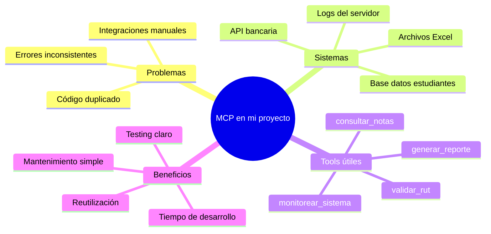

**Reflexión grupal (5 minutos):**

- ¿Qué herramienta (tool) sería la más valiosa para tu equipo actual?
- ¿Qué sistema te parece más complejo de integrar y por qué?

---

## Arquitectura y ciclo de vida ⚙️🔄

### El flujo completo de MCP paso a paso 🎬

MCP funciona como una conversación estructurada entre cliente y servidor. Veamos cada fase:

### 1. Handshake - "Hola, ¿quién eres?" 🤝

El **handshake** es el saludo inicial donde cliente y servidor se presentan y negocian capacidades.

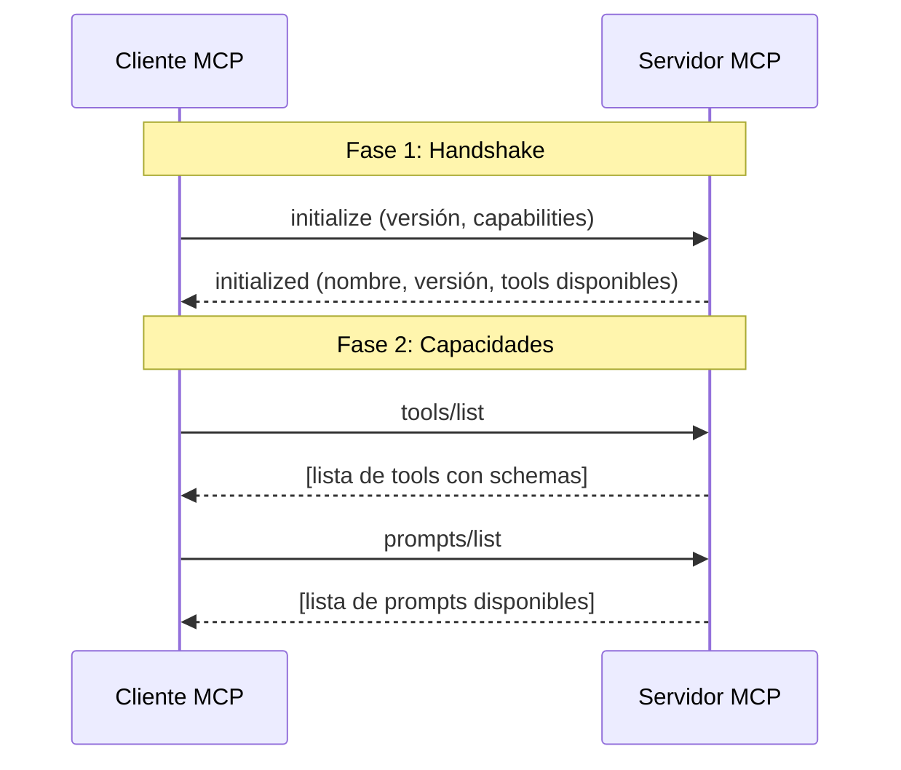

**¿Qué se intercambia?**

- **Cliente envía:** versión de protocolo, capacidades soportadas (sampling, etc.)
- **Servidor responde:** nombre, versión, información del servidor

### 2. Registro de capacidades - "¿Qué sabes hacer?" 📋

Después del handshake, el cliente descubre qué tools y prompts están disponibles:

```json
// Respuesta de tools/list
{
  "tools": [
    {
      "name": "buscar_estudiante",
      "description": "Busca un estudiante por RUT o nombre",
      "inputSchema": {
        "type": "object",
        "properties": {
          "rut": { "type": "string", "pattern": "^[0-9]{7,8}-[0-9Kk]$" },
          "nombre": { "type": "string", "minLength": 2 }
        }
      }
    }
  ]
}
```

### 3. Invocación - "Ejecuta esta tarea" ▶️

Cuando el cliente necesita usar una herramienta:

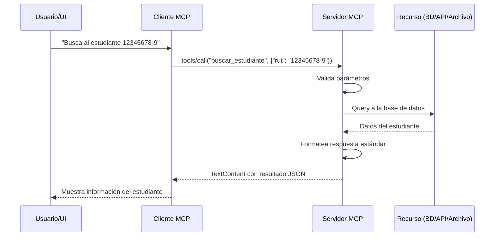

### 4. Resultados y errores - "Aquí tienes" ✅❌

**Respuesta exitosa:**

```json
{
  "content": [
    {
      "type": "text",
      "text": "Estudiante encontrado: Juan Pérez, Carrera: Programación, Semestre: 4"
    }
  ]
}
```

**Respuesta con error:**

```json
{
  "error": {
    "code": -32602,
    "message": "Invalid params",
    "data": "RUT debe tener formato 12345678-9"
  }
}
```

### Canales/transporte: stdio, WebSocket, SSE 🚗📡

MCP soporta diferentes formas de comunicación según el contexto:

| Transporte    | Uso típico                      | Ventajas                   | Desventajas                |
| ------------- | ------------------------------- | -------------------------- | -------------------------- |
| **stdio**     | Procesos locales, desarrollo    | Simple, sin red            | Solo local, no escalable   |
| **WebSocket** | Servidores remotos, producción  | Bidireccional, tiempo real | Más complejo, requiere red |
| **SSE**       | Notificaciones unidireccionales | Ligero para updates        | Solo servidor→cliente      |

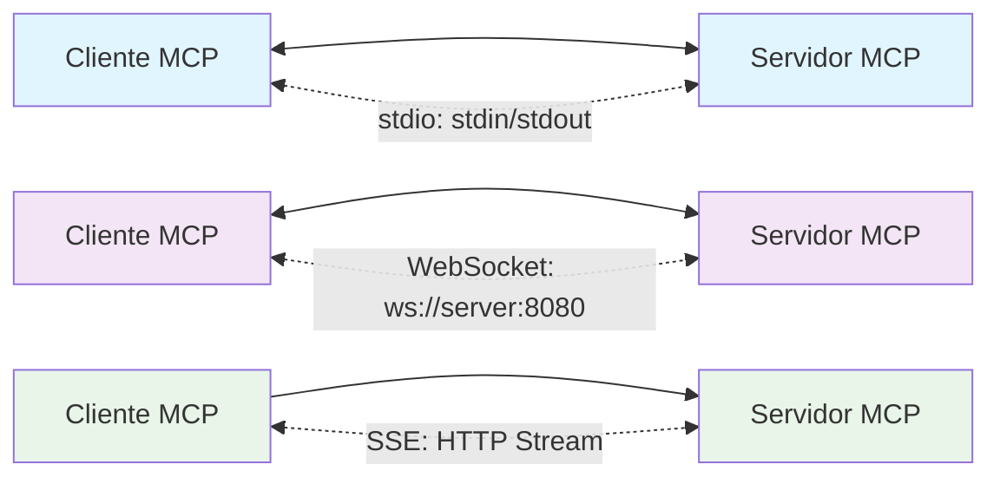

**Ejemplo de configuración:**

```json
// Para stdio (desarrollo local)
{
  "transport": "stdio",
  "command": "node",
  "args": ["mi-servidor-mcp.js"]
}

// Para WebSocket (servidor remoto)
{
  "transport": "websocket",
  "url": "ws://mcp-server.aiep.cl:8080"
}
```

### Seguridad y permisos: decisiones del cliente vs servidor 🔐

La seguridad en MCP es **responsabilidad compartida**:

#### Responsabilidades del Cliente 👤

- **Autorización de tools:** ¿Qué herramientas puede usar el usuario?
- **Límites de invocación:** Rate limiting, timeouts
- **Validación de entrada:** Sanitizar datos antes de enviar
- **UI/UX de permisos:** Mostrar qué se está ejecutando

#### Responsabilidades del Servidor 🛡️

- **Autenticación:** ¿Quién puede conectarse?
- **Validación de parámetros:** Esquemas JSON estrictos
- **Acceso a recursos:** ¿Qué archivos/APIs puede tocar?
- **Logging y auditoría:** Registrar todas las operaciones

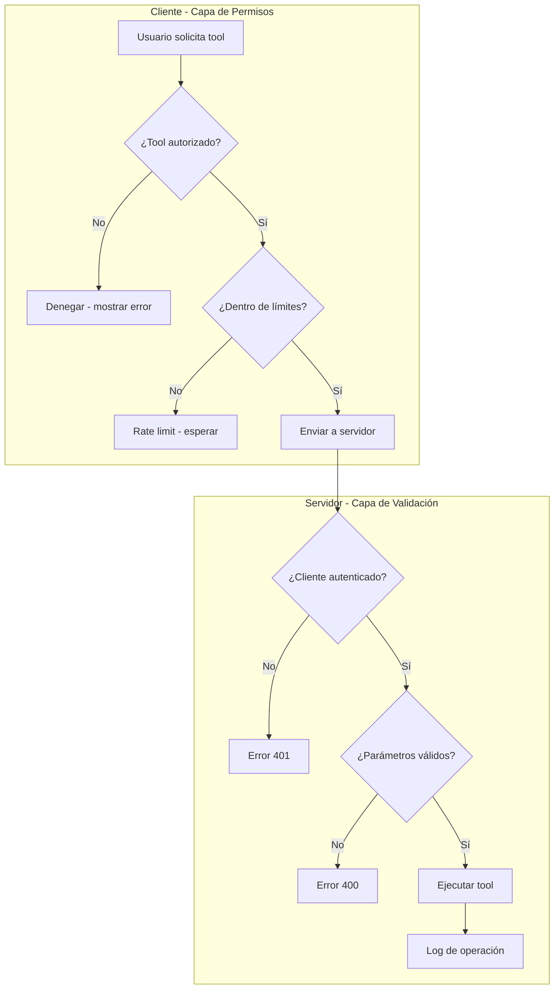

**Ejemplo de configuración de seguridad:**

```json
// Cliente: políticas de uso
{
  "allowedTools": ["buscar_estudiante", "calcular_promedio"],
  "rateLimits": {
    "buscar_estudiante": "10/min",
    "calcular_promedio": "5/min"
  },
  "requireConfirmation": ["eliminar_*"]
}

// Servidor: validaciones
{
  "authentication": "api-key",
  "allowedOrigins": ["localhost", "*.aiep.cl"],
  "maxPayloadSize": "1MB",
  "timeoutMs": 30000
}
```

### Actividad: Recorrido de un request end-to-end 🗺️

**Objetivo:** Trazar un request completo desde la UI hasta la respuesta.

**Escenario:** Un profesor quiere consultar las notas de un estudiante desde VS Code.

**Instrucciones (15 minutos):**

1. **En grupos de 3**, elijan roles:

   - **Estudiante A:** Cliente MCP (VS Code)
   - **Estudiante B:** Servidor MCP
   - **Estudiante C:** Sistema de notas (base de datos)

2. **Simular el flujo completo:**

   - Handshake inicial
   - Descubrimiento de tools
   - Invocación de `consultar_notas`
   - Manejo de un error (estudiante no encontrado)
   - Respuesta exitosa

3. **Documentar cada paso** en una tabla:

| Paso | Actor    | Acción         | Mensaje/Datos                      | Validaciones       |
| ---- | -------- | -------------- | ---------------------------------- | ------------------ |
| 1    | Cliente  | initialize     | `{"version": "1.0"}`               | Versión compatible |
| 2    | Servidor | initialized    | `{"name": "SistemaNotas"}`         | -                  |
| 3    | Cliente  | tools/list     | -                                  | -                  |
| 4    | Servidor | tools response | `[{"name": "consultar_notas"...}]` | -                  |
| ...  | ...      | ...            | ...                                | ...                |

4. **Identificar puntos críticos:**
   - ¿Dónde puede fallar?
   - ¿Qué validaciones son clave?
   - ¿Cómo manejarían errores de red?

**Ejemplo de resultado esperado:**

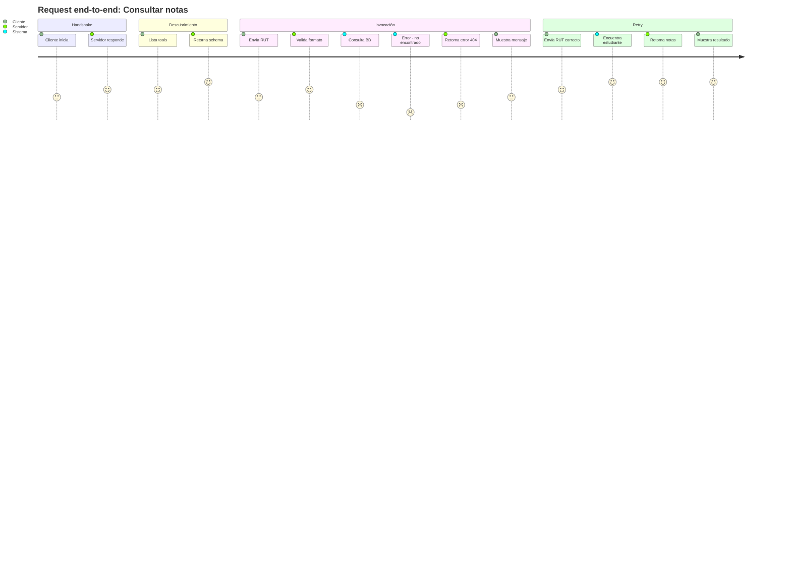

**Debrief grupal (5 minutos):**

- ¿En qué paso del flujo es más probable que ocurran errores?
- ¿Qué información adicional necesitarían para implementar esto en un proyecto real?

---

## Primer servidor MCP: "Hola MCP" 👋💻

¡Ahora vamos a crear tu primer servidor MCP funcional! Comenzaremos con herramientas simples y luego agregarás funcionalidades más complejas.

### Preparación del entorno 🛠️

Antes de comenzar, asegúrate de tener instalado:

- **Node.js 18+** (para TypeScript) o **Python 3.9+**
- **VS Code** con extensión MCP compatible
- **Git** para versionar tu código

### Opción A: TypeScript/Node.js 📘

#### Paso 1: Inicializar el proyecto

```powershell
# Crear directorio del proyecto
mkdir mi-servidor-mcp
cd mi-servidor-mcp

# Inicializar proyecto Node.js
npm init -y

# Instalar dependencias MCP
npm install @modelcontextprotocol/sdk
npm install --save-dev typescript @types/node ts-node nodemon

# Configurar TypeScript
npx tsc --init
```

#### Paso 2: Estructura del proyecto

```
mi-servidor-mcp/
├── src/
│   ├── server.ts          # Servidor principal
│   ├── tools/             # Herramientas
│   │   ├── ping.ts
│   │   └── randomQuote.ts
│   └── utils/
│       └── logger.ts      # Sistema de logging
├── package.json
├── tsconfig.json
└── README.md
```

#### Paso 3: Crear el logger básico

```typescript
// src/utils/logger.ts
export class Logger {
  private static instance: Logger;

  static getInstance(): Logger {
    if (!Logger.instance) {
      Logger.instance = new Logger();
    }
    return Logger.instance;
  }

  info(message: string, data?: any) {
    console.log(`[INFO] ${new Date().toISOString()} - ${message}`, data || "");
  }

  error(message: string, error?: any) {
    console.error(
      `[ERROR] ${new Date().toISOString()} - ${message}`,
      error || ""
    );
  }

  warn(message: string, data?: any) {
    console.warn(`[WARN] ${new Date().toISOString()} - ${message}`, data || "");
  }
}
```

#### Paso 4: Implementar herramientas simples

```typescript
// src/tools/ping.ts
import { Logger } from "../utils/logger.js";

interface PingArgs {
  message?: string;
}

export async function pingTool(args: PingArgs) {
  const logger = Logger.getInstance();
  const message = args.message || "pong";

  logger.info("Ping tool ejecutado", { message });

  return {
    content: [
      {
        type: "text",
        text: `🏓 Respuesta: ${message} - Timestamp: ${new Date().toISOString()}`,
      },
    ],
  };
}

export const pingSchema = {
  name: "ping",
  description:
    "Herramienta simple que responde con un mensaje para verificar conectividad",
  inputSchema: {
    type: "object",
    properties: {
      message: {
        type: "string",
        description: "Mensaje opcional para personalizar la respuesta",
        default: "pong",
      },
    },
  },
};
```

```typescript
// src/tools/randomQuote.ts
import { Logger } from "../utils/logger.js";

interface QuoteArgs {
  categoria?: "motivacional" | "tecnologia" | "programacion";
}

const quotes = {
  motivacional: [
    "El éxito es la suma de pequeños esfuerzos repetidos día tras día.",
    "No esperes oportunidades extraordinarias. Aprovecha las ocasiones comunes y hazlas extraordinarias.",
    "La disciplina es el puente entre metas y logros.",
  ],
  tecnologia: [
    "La tecnología es mejor cuando acerca a las personas.",
    "La innovación distingue entre un líder y un seguidor.",
    "El futuro pertenece a quienes se preparan para él hoy.",
  ],
  programacion: [
    "Código limpio siempre parece haber sido escrito por alguien que se preocupa.",
    "Primero hazlo funcionar, luego hazlo bien, después hazlo rápido.",
    "Los mejores programadores no son necesariamente los más inteligentes, sino los más persistentes.",
  ],
};

export async function randomQuoteTool(args: QuoteArgs) {
  const logger = Logger.getInstance();
  const categoria = args.categoria || "programacion";

  // Validación
  if (!quotes[categoria]) {
    logger.warn("Categoría de quote inválida", { categoria });
    throw new Error(
      `Categoría '${categoria}' no existe. Usa: motivacional, tecnologia, programacion`
    );
  }

  const categoryQuotes = quotes[categoria];
  const randomIndex = Math.floor(Math.random() * categoryQuotes.length);
  const selectedQuote = categoryQuotes[randomIndex];

  logger.info("Quote tool ejecutado", { categoria, quote: selectedQuote });

  return {
    content: [
      {
        type: "text",
        text: `💭 **${categoria.toUpperCase()}**\n\n"${selectedQuote}"\n\n_Fuente: Servidor MCP AIEP_`,
      },
    ],
  };
}

export const randomQuoteSchema = {
  name: "random_quote",
  description:
    "Obtiene una cita inspiradora aleatoria de diferentes categorías",
  inputSchema: {
    type: "object",
    properties: {
      categoria: {
        type: "string",
        enum: ["motivacional", "tecnologia", "programacion"],
        description: "Categoría de la cita a obtener",
        default: "programacion",
      },
    },
  },
};
```

#### Paso 5: Servidor principal

```typescript
// src/server.ts
import { Server } from "@modelcontextprotocol/sdk/server/index.js";
import { StdioServerTransport } from "@modelcontextprotocol/sdk/server/stdio.js";
import {
  CallToolRequestSchema,
  ErrorCode,
  ListToolsRequestSchema,
  McpError,
} from "@modelcontextprotocol/sdk/types.js";

import { pingTool, pingSchema } from "./tools/ping.js";
import { randomQuoteTool, randomQuoteSchema } from "./tools/randomQuote.js";
import { Logger } from "./utils/logger.js";

class HolaMCPServer {
  private server: Server;
  private logger: Logger;

  constructor() {
    this.logger = Logger.getInstance();
    this.server = new Server(
      {
        name: "hola-mcp-server",
        version: "1.0.0",
      },
      {
        capabilities: {
          tools: {},
        },
      }
    );

    this.setupHandlers();
    this.logger.info("Servidor MCP inicializado");
  }

  private setupHandlers() {
    // Listar herramientas disponibles
    this.server.setRequestHandler(ListToolsRequestSchema, async () => {
      this.logger.info("Cliente solicita lista de tools");
      return {
        tools: [pingSchema, randomQuoteSchema],
      };
    });

    // Ejecutar herramientas
    this.server.setRequestHandler(CallToolRequestSchema, async (request) => {
      const { name, arguments: args } = request.params;
      this.logger.info(`Ejecutando tool: ${name}`, args);

      try {
        switch (name) {
          case "ping":
            return await pingTool(args || {});

          case "random_quote":
            return await randomQuoteTool(args || {});

          default:
            this.logger.error(`Tool no encontrado: ${name}`);
            throw new McpError(
              ErrorCode.MethodNotFound,
              `Tool desconocido: ${name}`
            );
        }
      } catch (error) {
        this.logger.error(`Error ejecutando ${name}:`, error);
        if (error instanceof McpError) {
          throw error;
        }
        throw new McpError(
          ErrorCode.InternalError,
          `Error interno: ${
            error instanceof Error ? error.message : "Unknown error"
          }`
        );
      }
    });
  }

  async run() {
    const transport = new StdioServerTransport();
    await this.server.connect(transport);
    this.logger.info("Servidor MCP conectado y listo para recibir requests");
  }
}

// Iniciar servidor
const server = new HolaMCPServer();
server.run().catch((error) => {
  console.error("Error fatal del servidor:", error);
  process.exit(1);
});
```

#### Configuración de scripts

```json
// package.json - agregar en "scripts"
{
  "scripts": {
    "dev": "ts-node src/server.ts",
    "build": "tsc",
    "start": "node dist/server.js"
  }
}
```

### Opción B: Python 🐍

#### Paso 1: Configurar entorno Python

```powershell
# Crear directorio del proyecto
mkdir mi-servidor-mcp-py
cd mi-servidor-mcp-py

# Crear entorno virtual
python -m venv venv
venv\Scripts\activate

# Instalar MCP SDK
pip install mcp
```

#### Paso 2: Servidor Python

```python
# src/server.py
import asyncio
import json
import logging
from datetime import datetime
from typing import Any, Dict, List, Optional
import random

from mcp.server import Server, NotificationOptions
from mcp.server.models import InitializationOptions
import mcp.server.stdio
import mcp.types as types

# Configurar logging
logging.basicConfig(level=logging.INFO)
logger = logging.getLogger("hola-mcp-server")

# Datos para random_quote
QUOTES = {
    "motivacional": [
        "El éxito es la suma de pequeños esfuerzos repetidos día tras día.",
        "No esperes oportunidades extraordinarias. Aprovecha las ocasiones comunes y hazlas extraordinarias.",
        "La disciplina es el puente entre metas y logros."
    ],
    "tecnologia": [
        "La tecnología es mejor cuando acerca a las personas.",
        "La innovación distingue entre un líder y un seguidor.",
        "El futuro pertenece a quienes se preparan para él hoy."
    ],
    "programacion": [
        "Código limpio siempre parece haber sido escrito por alguien que se preocupa.",
        "Primero hazlo funcionar, luego hazlo bien, después hazlo rápido.",
        "Los mejores programadores no son necesariamente los más inteligentes, sino los más persistentes."
    ]
}

# Crear servidor MCP
server = Server("hola-mcp-server")

@server.list_tools()
async def handle_list_tools() -> List[types.Tool]:
    """Lista las herramientas disponibles"""
    logger.info("Cliente solicita lista de tools")
    return [
        types.Tool(
            name="ping",
            description="Herramienta simple que responde con un mensaje para verificar conectividad",
            inputSchema={
                "type": "object",
                "properties": {
                    "message": {
                        "type": "string",
                        "description": "Mensaje opcional para personalizar la respuesta",
                        "default": "pong"
                    }
                }
            }
        ),
        types.Tool(
            name="random_quote",
            description="Obtiene una cita inspiradora aleatoria de diferentes categorías",
            inputSchema={
                "type": "object",
                "properties": {
                    "categoria": {
                        "type": "string",
                        "enum": ["motivacional", "tecnologia", "programacion"],
                        "description": "Categoría de la cita a obtener",
                        "default": "programacion"
                    }
                }
            }
        )
    ]

@server.call_tool()
async def handle_call_tool(name: str, arguments: dict) -> List[types.TextContent]:
    """Ejecuta la herramienta solicitada"""
    logger.info(f"Ejecutando tool: {name} con args: {arguments}")

    if name == "ping":
        message = arguments.get("message", "pong")
        logger.info(f"Ping tool ejecutado con mensaje: {message}")

        return [
            types.TextContent(
                type="text",
                text=f"🏓 Respuesta: {message} - Timestamp: {datetime.now().isoformat()}"
            )
        ]

    elif name == "random_quote":
        categoria = arguments.get("categoria", "programacion")

        # Validación
        if categoria not in QUOTES:
            logger.warning(f"Categoría inválida: {categoria}")
            raise ValueError(f"Categoría '{categoria}' no existe. Usa: motivacional, tecnologia, programacion")

        # Seleccionar quote aleatorio
        quotes_categoria = QUOTES[categoria]
        selected_quote = random.choice(quotes_categoria)

        logger.info(f"Quote tool ejecutado - categoría: {categoria}, quote: {selected_quote}")

        return [
            types.TextContent(
                type="text",
                text=f"💭 **{categoria.upper()}**\n\n\"{selected_quote}\"\n\n_Fuente: Servidor MCP AIEP_"
            )
        ]

    else:
        logger.error(f"Tool no encontrado: {name}")
        raise ValueError(f"Tool desconocido: {name}")

async def main():
    # Ejecutar servidor con transporte stdio
    async with mcp.server.stdio.stdio_server() as (read_stream, write_stream):
        logger.info("Servidor MCP conectado y listo para recibir requests")
        await server.run(
            read_stream,
            write_stream,
            InitializationOptions(
                server_name="hola-mcp-server",
                server_version="1.0.0",
                capabilities=server.get_capabilities(
                    notification_options=NotificationOptions(),
                    experimental_capabilities={},
                ),
            ),
        )

if __name__ == "__main__":
    asyncio.run(main())
```

### Probando tu servidor MCP 🧪

#### Configuración del cliente (VS Code)

Crea un archivo `mcp-config.json`:

```json
{
  "mcpServers": {
    "hola-mcp": {
      "command": "npm",
      "args": ["run", "dev"],
      "cwd": "./mi-servidor-mcp"
    }
  }
}
```

#### Comandos de prueba

```powershell
# Ejecutar servidor (TypeScript)
cd mi-servidor-mcp
npm run dev

# Ejecutar servidor (Python)
cd mi-servidor-mcp-py
python src/server.py
```

### Actividad: Extender con un tercer tool y validaciones 🚀

**Objetivo:** Agregar una herramienta `calculadora_basica` con validaciones robustas.

**Instrucciones (20 minutos):**

1. **En parejas**, implementen una nueva herramienta con estas especificaciones:

```typescript
// Especificación del tool
{
  name: "calculadora_basica",
  description: "Realiza operaciones matemáticas básicas (+, -, *, /)",
  inputSchema: {
    type: "object",
    required: ["operacion", "a", "b"],
    properties: {
      operacion: {
        type: "string",
        enum: ["suma", "resta", "multiplicacion", "division"],
        description: "Tipo de operación a realizar"
      },
      a: {
        type: "number",
        description: "Primer número"
      },
      b: {
        type: "number",
        description: "Segundo número"
      }
    }
  }
}
```

2. **Validaciones requeridas:**

   - División por cero
   - Números válidos (no NaN, no infinito)
   - Operación permitida
   - Límite de precisión decimal (2 decimales)

3. **Logging mejorado:**

   - Registrar todas las operaciones
   - Log de errores con contexto
   - Métricas básicas (tiempo de ejecución)

4. **Testing manual:**
   - Casos válidos: `2 + 3`, `10 / 2`
   - Casos de error: `5 / 0`, operación inválida
   - Casos límite: números muy grandes/pequeños

**Ejemplo de implementación esperada:**

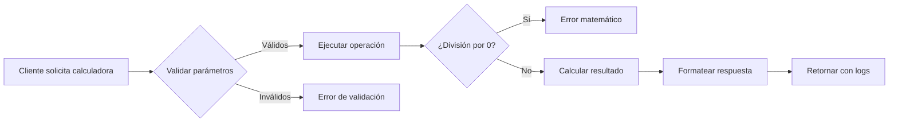

**Criterios de evaluación:**

- ✅ Implementa las 4 operaciones básicas
- ✅ Maneja correctamente división por cero
- ✅ Valida tipos y rangos de entrada
- ✅ Incluye logging detallado
- ✅ Respuesta formateada consistente con otros tools

---

## Integración con un cliente MCP (IDE/desktop) 🔌💻

Ahora que tienes tu servidor MCP funcionando, es hora de conectarlo con un cliente real. Usaremos VS Code como ejemplo principal, pero los conceptos aplican a cualquier cliente MCP compatible.

### Preparación del cliente VS Code 🛠️

#### Paso 1: Instalar extensión MCP

```powershell
# Opción 1: Desde VS Code Marketplace
# Buscar "MCP Client" o "Model Context Protocol"

# Opción 2: Desde línea de comandos
code --install-extension anthropic.mcp-client
```

**Nota:** Si no existe una extensión oficial, configuraremos un cliente MCP genérico o usaremos el Claude Desktop como alternativa.

#### Paso 2: Configurar el archivo de configuración MCP

Crea el archivo de configuración en tu directorio de usuario:

**Windows:**

```powershell
# Crear directorio si no existe
mkdir "$env:USERPROFILE\.mcp" -Force

# Crear archivo de configuración
@"
{
  "mcpServers": {
    "hola-mcp-aiep": {
      "command": "node",
      "args": ["dist/server.js"],
      "cwd": "C:\\ruta\\completa\\a\\mi-servidor-mcp",
      "env": {
        "NODE_ENV": "development"
      }
    },
    "hola-mcp-dev": {
      "command": "npm",
      "args": ["run", "dev"],
      "cwd": "C:\\ruta\\completa\\a\\mi-servidor-mcp",
      "env": {
        "NODE_ENV": "development",
        "MCP_LOG_LEVEL": "info"
      }
    }
  }
}
"@ | Out-File -FilePath "$env:USERPROFILE\.mcp\config.json" -Encoding UTF8
```

#### Paso 3: Configuración de VS Code settings

```json
// .vscode/settings.json en tu proyecto
{
  "mcp.servers": [
    {
      "name": "hola-mcp-aiep",
      "path": "./dist/server.js",
      "args": [],
      "cwd": "./",
      "autoStart": true,
      "logLevel": "info"
    }
  ],
  "mcp.enableLogging": true,
  "mcp.logDirectory": "./logs"
}
```

### Configuración alternativa: Claude Desktop 🤖

Si VS Code no tiene soporte MCP nativo, usa Claude Desktop:

```json
// %APPDATA%/Claude/claude_desktop_config.json
{
  "mcpServers": {
    "hola-mcp-aiep": {
      "command": "npm",
      "args": ["run", "dev"],
      "cwd": "C:\\Users\\TuUsuario\\mi-servidor-mcp"
    }
  }
}
```

### Conexión al servidor local 🔗

#### Verificar que el servidor esté funcionando

```powershell
# En terminal 1: Ejecutar el servidor
cd mi-servidor-mcp
npm run dev

# Deberías ver:
# [INFO] 2025-08-30T10:30:00.000Z - Servidor MCP inicializado
# [INFO] 2025-08-30T10:30:00.001Z - Servidor MCP conectado y listo para recibir requests
```

#### Diagnosticar la conexión

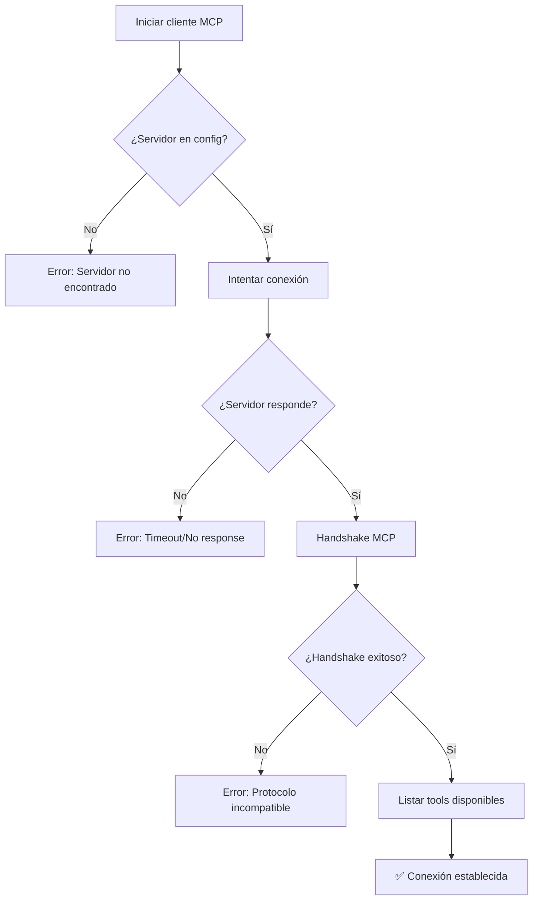

#### Comandos de diagnóstico

```powershell
# Verificar que Node.js puede ejecutar el servidor
node --version
npm --version

# Probar el servidor manualmente (enviar JSON por stdin)
cd mi-servidor-mcp
echo '{"jsonrpc":"2.0","id":1,"method":"initialize","params":{"protocolVersion":"2024-11-05","capabilities":{},"clientInfo":{"name":"test","version":"1.0"}}}' | npm run dev
```

### Prueba de tools paso a paso 🧪

#### Test 1: Verificar herramientas disponibles

En el cliente MCP (VS Code o Claude Desktop):

1. **Abrir panel de herramientas MCP**
2. **Buscar servidor "hola-mcp-aiep"**
3. **Verificar tools listados:**
   - ✅ `ping` - Herramienta de conectividad
   - ✅ `random_quote` - Generador de citas

#### Test 2: Ejecutar tool ping

```typescript
// Lo que hace internamente el cliente:
// 1. Envía request al servidor
{
  "jsonrpc": "2.0",
  "id": 123,
  "method": "tools/call",
  "params": {
    "name": "ping",
    "arguments": {
      "message": "Hola desde AIEP Osorno!"
    }
  }
}

// 2. Recibe respuesta del servidor
{
  "jsonrpc": "2.0",
  "id": 123,
  "result": {
    "content": [{
      "type": "text",
      "text": "🏓 Respuesta: Hola desde AIEP Osorno! - Timestamp: 2025-08-30T10:35:00.000Z"
    }]
  }
}
```

**Resultado esperado en UI:**

```
🏓 Respuesta: Hola desde AIEP Osorno! - Timestamp: 2025-08-30T10:35:00.000Z
```

#### Test 3: Ejecutar tool random_quote

```typescript
// Parámetros para probar:
{
  "categoria": "tecnologia"
}

// Resultado esperado:
💭 **TECNOLOGIA**

"La tecnología es mejor cuando acerca a las personas."

_Fuente: Servidor MCP AIEP_
```

### Lectura de logs 📊

#### Configurar logging detallado

Actualizar el servidor para logs más informativos:

```typescript
// src/utils/logger.ts - versión mejorada
export class Logger {
  private static instance: Logger;
  private logFile: string;

  constructor() {
    this.logFile = `./logs/mcp-server-${
      new Date().toISOString().split("T")[0]
    }.log`;
    this.ensureLogDirectory();
  }

  private ensureLogDirectory() {
    const fs = require("fs");
    const path = require("path");
    const logDir = path.dirname(this.logFile);
    if (!fs.existsSync(logDir)) {
      fs.mkdirSync(logDir, { recursive: true });
    }
  }

  private writeLog(level: string, message: string, data?: any) {
    const timestamp = new Date().toISOString();
    const logEntry = {
      timestamp,
      level,
      message,
      data: data || null,
      server: "hola-mcp-aiep",
    };

    // Console output
    const consoleMsg = `[${level}] ${timestamp} - ${message}`;
    if (level === "ERROR") {
      console.error(consoleMsg, data || "");
    } else if (level === "WARN") {
      console.warn(consoleMsg, data || "");
    } else {
      console.log(consoleMsg, data || "");
    }

    // File output
    const fs = require("fs");
    fs.appendFileSync(this.logFile, JSON.stringify(logEntry) + "\n");
  }

  info(message: string, data?: any) {
    this.writeLog("INFO", message, data);
  }

  error(message: string, error?: any) {
    this.writeLog("ERROR", message, error);
  }

  warn(message: string, data?: any) {
    this.writeLog("WARN", message, data);
  }
}
```

#### Monitorear logs en tiempo real

```powershell
# Terminal separada para ver logs
cd mi-servidor-mcp
Get-Content -Path "./logs/mcp-server-2025-08-30.log" -Wait -Tail 10

# O usando PowerShell moderno
tail -f ./logs/mcp-server-2025-08-30.log
```

#### Ejemplo de logs esperados

```json
{"timestamp":"2025-08-30T10:30:00.000Z","level":"INFO","message":"Servidor MCP inicializado","data":null,"server":"hola-mcp-aiep"}
{"timestamp":"2025-08-30T10:30:05.123Z","level":"INFO","message":"Cliente solicita lista de tools","data":null,"server":"hola-mcp-aiep"}
{"timestamp":"2025-08-30T10:30:10.456Z","level":"INFO","message":"Ejecutando tool: ping","data":{"message":"Hola desde AIEP Osorno!"},"server":"hola-mcp-aiep"}
{"timestamp":"2025-08-30T10:30:10.458Z","level":"INFO","message":"Ping tool ejecutado","data":{"message":"Hola desde AIEP Osorno!"},"server":"hola-mcp-aiep"}
```

### Actividad: Crear un prompt "plantilla" con parámetros 📝✨

**Objetivo:** Implementar un sistema de prompts parameterizados para generar contenido consistente.

#### Paso 1: Agregar soporte para prompts en el servidor

```typescript
// src/prompts/reporteEstudiante.ts
export interface ReporteEstudianteArgs {
  nombre: string;
  rut: string;
  carrera: string;
  semestre: number;
  notas?: number[];
  observaciones?: string;
}

export function generarReporteEstudiante(args: ReporteEstudianteArgs): string {
  const promedio = args.notas
    ? (args.notas.reduce((a, b) => a + b, 0) / args.notas.length).toFixed(1)
    : "N/A";

  return `# Reporte Académico - ${args.nombre}

## Información Personal
- **Nombre completo:** ${args.nombre}
- **RUT:** ${args.rut}
- **Carrera:** ${args.carrera}
- **Semestre actual:** ${args.semestre}

## Rendimiento Académico
- **Promedio general:** ${promedio}
- **Notas registradas:** ${args.notas ? args.notas.join(", ") : "Sin notas"}

## Observaciones
${args.observaciones || "Sin observaciones registradas"}

## Próximos pasos
- [ ] Revisar asistencia
- [ ] Evaluar progreso del semestre
- [ ] Planificar apoyo académico si es necesario

---
*Reporte generado automáticamente el ${new Date().toLocaleDateString("es-CL")}*
*Sistema MCP - AIEP Osorno*`;
}

export const reporteEstudianteSchema = {
  name: "reporte_estudiante",
  description: "Genera un reporte académico estructurado para un estudiante",
  arguments: [
    {
      name: "nombre",
      description: "Nombre completo del estudiante",
      required: true,
    },
    {
      name: "rut",
      description: "RUT del estudiante (formato: 12345678-9)",
      required: true,
    },
    {
      name: "carrera",
      description: "Nombre de la carrera",
      required: true,
    },
    {
      name: "semestre",
      description: "Semestre actual (número)",
      required: true,
    },
    {
      name: "notas",
      description: "Array de notas numéricas",
      required: false,
    },
    {
      name: "observaciones",
      description: "Comentarios adicionales sobre el estudiante",
      required: false,
    },
  ],
};
```

#### Paso 2: Integrar prompts al servidor principal

```typescript
// src/server.ts - agregar handler para prompts
import {
  ListPromptsRequestSchema,
  GetPromptRequestSchema,
} from "@modelcontextprotocol/sdk/types.js";
import {
  generarReporteEstudiante,
  reporteEstudianteSchema,
} from "./prompts/reporteEstudiante.js";

// En setupHandlers(), agregar:
this.server.setRequestHandler(ListPromptsRequestSchema, async () => {
  this.logger.info("Cliente solicita lista de prompts");
  return {
    prompts: [reporteEstudianteSchema],
  };
});

this.server.setRequestHandler(GetPromptRequestSchema, async (request) => {
  const { name, arguments: args } = request.params;
  this.logger.info(`Ejecutando prompt: ${name}`, args);

  if (name === "reporte_estudiante") {
    const contenido = generarReporteEstudiante(args as ReporteEstudianteArgs);
    return {
      description: "Reporte académico generado",
      messages: [
        {
          role: "user",
          content: {
            type: "text",
            text: contenido,
          },
        },
      ],
    };
  }

  throw new McpError(ErrorCode.MethodNotFound, `Prompt desconocido: ${name}`);
});
```

#### Paso 3: Probar el prompt parameterizado

**En el cliente MCP:**

```typescript
// Parámetros de prueba
{
  "nombre": "María González Pérez",
  "rut": "19876543-2",
  "carrera": "Programación y Análisis de Sistemas",
  "semestre": 3,
  "notas": [6.2, 5.8, 6.5, 5.9],
  "observaciones": "Estudiante destacada en desarrollo web. Requiere refuerzo en bases de datos."
}
```

**Resultado esperado:**

```markdown
# Reporte Académico - María González Pérez

## Información Personal

- **Nombre completo:** María González Pérez
- **RUT:** 19876543-2
- **Carrera:** Programación y Análisis de Sistemas
- **Semestre actual:** 3

## Rendimiento Académico

- **Promedio general:** 6.1
- **Notas registradas:** 6.2, 5.8, 6.5, 5.9

## Observaciones

Estudiante destacada en desarrollo web. Requiere refuerzo en bases de datos.

## Próximos pasos

- [ ] Revisar asistencia
- [ ] Evaluar progreso del semestre
- [ ] Planificar apoyo académico si es necesario

---

_Reporte generado automáticamente el 30/8/2025_
_Sistema MCP - AIEP Osorno_
```

### Instrucciones de la actividad (25 minutos) 👥

**Trabajo en grupos de 3:**

1. **Implementar** el prompt `reporte_estudiante` siguiendo el código anterior

2. **Crear un segundo prompt personalizado** para su contexto:

   - `planilla_asistencia` - Generar control de asistencia
   - `resumen_evaluacion` - Crear resumen de evaluación
   - `carta_presentacion` - Template para cartas formales

3. **Probar ambos prompts** con datos reales de ejemplo

4. **Documentar casos de uso:**
   - ¿Cuándo usarías cada prompt?
   - ¿Qué parámetros adicionales serían útiles?
   - ¿Cómo mejorarías la validación?

**Criterios de evaluación:**

- ✅ Prompt implementado y funcional
- ✅ Parámetros bien validados
- ✅ Salida formateada y consistente
- ✅ Logs informativos
- ✅ Casos de prueba documentados

---

## Buenas prácticas y patrones 🏗️✨

Ahora que tienes un servidor MCP funcionando, es momento de profesionalizarlo con patrones de calidad empresarial. Esta sección te enseñará a construir tools robustos, seguros y mantenibles.

### Diseño de tools: entradas/salidas claras 📋🔄

#### Principios fundamentales

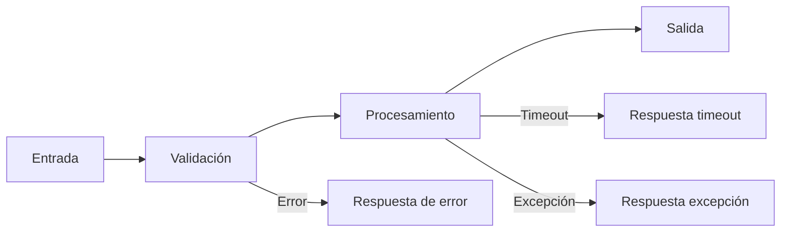

#### 1. Diseño de esquemas de entrada robustos

```typescript
// src/schemas/toolSchemas.ts
export const consultarEstudianteSchema = {
  name: "consultar_estudiante",
  description: "Busca información detallada de un estudiante por RUT o email",
  inputSchema: {
    type: "object",
    required: ["identificador"],
    properties: {
      identificador: {
        type: "string",
        description: "RUT (formato: 12345678-9) o email institucional",
        pattern:
          "^([0-9]{7,8}-[0-9Kk]|[a-zA-Z0-9._%+-]+@[a-zA-Z0-9.-]+\\.[a-zA-Z]{2,})$",
        examples: ["12345678-9", "estudiante@aiep.cl"],
      },
      incluirNotas: {
        type: "boolean",
        description: "Incluir historial de notas en la respuesta",
        default: false,
      },
      semestreActual: {
        type: "boolean",
        description: "Filtrar solo información del semestre actual",
        default: true,
      },
    },
  },
};
```

#### 2. Validación de entrada con feedback claro

```typescript
// src/validators/inputValidator.ts
export class InputValidator {
  static validarRUT(rut: string): { valido: boolean; error?: string } {
    const rutPattern = /^([0-9]{7,8})-([0-9Kk])$/;
    const match = rut.match(rutPattern);

    if (!match) {
      return {
        valido: false,
        error: "RUT debe tener formato 12345678-9 o 12345678-K",
      };
    }

    const [, numero, dv] = match;
    const dvCalculado = this.calcularDV(numero);

    if (dv.toLowerCase() !== dvCalculado.toLowerCase()) {
      return {
        valido: false,
        error: "Dígito verificador del RUT es inválido",
      };
    }

    return { valido: true };
  }

  static validarEmail(email: string): { valido: boolean; error?: string } {
    const emailPattern = /^[a-zA-Z0-9._%+-]+@[a-zA-Z0-9.-]+\.[a-zA-Z]{2,}$/;

    if (!emailPattern.test(email)) {
      return {
        valido: false,
        error: "Email debe tener formato válido (ej: usuario@dominio.com)",
      };
    }

    return { valido: true };
  }

  private static calcularDV(rut: string): string {
    let suma = 0;
    let multiplicador = 2;

    for (let i = rut.length - 1; i >= 0; i--) {
      suma += parseInt(rut[i]) * multiplicador;
      multiplicador = multiplicador === 7 ? 2 : multiplicador + 1;
    }

    const resto = suma % 11;
    const dv = 11 - resto;

    if (dv === 11) return "0";
    if (dv === 10) return "K";
    return dv.toString();
  }
}
```

#### 3. Formato de salida estandarizado

```typescript
// src/types/responses.ts
export interface MCPToolResponse<T = any> {
  content: MCPContent[];
  metadata?: {
    executionTime: number;
    timestamp: string;
    version: string;
  };
}

export interface MCPContent {
  type: "text" | "json" | "html" | "markdown";
  text?: string;
  data?: any;
  format?: "structured" | "raw";
}

export interface ErrorResponse {
  error: {
    code: number;
    message: string;
    details?: any;
    suggestions?: string[];
  };
}

// Ejemplo de uso
export function formatearRespuestaEstudiante(estudiante: any): MCPToolResponse {
  return {
    content: [
      {
        type: "markdown",
        text: `# 👤 ${estudiante.nombre}
        
**RUT:** ${estudiante.rut}
**Carrera:** ${estudiante.carrera}
**Semestre:** ${estudiante.semestre}

## 📊 Rendimiento Académico
- **Promedio:** ${estudiante.promedio}
- **Asignaturas:** ${estudiante.asignaturas.length}
- **Estado:** ${estudiante.estado}`,
      },
    ],
    metadata: {
      executionTime: Date.now() - estudiante.startTime,
      timestamp: new Date().toISOString(),
      version: "1.0.0",
    },
  };
}
```

#### 4. Manejo de errores y timeouts

```typescript
// src/utils/errorHandler.ts
export class MCPErrorHandler {
  static async executeWithTimeout<T>(
    operation: () => Promise<T>,
    timeoutMs: number = 30000,
    operationName: string = "operation"
  ): Promise<T> {
    const timeoutPromise = new Promise<never>((_, reject) => {
      setTimeout(() => {
        reject(
          new MCPTimeoutError(
            `${operationName} excedió el tiempo límite de ${timeoutMs}ms`
          )
        );
      }, timeoutMs);
    });

    try {
      return await Promise.race([operation(), timeoutPromise]);
    } catch (error) {
      if (error instanceof MCPTimeoutError) {
        throw error;
      }
      throw new MCPOperationError(
        `Error en ${operationName}: ${error.message}`,
        error
      );
    }
  }
}

export class MCPTimeoutError extends Error {
  constructor(message: string) {
    super(message);
    this.name = "MCPTimeoutError";
  }
}

export class MCPOperationError extends Error {
  constructor(message: string, public originalError?: Error) {
    super(message);
    this.name = "MCPOperationError";
  }
}
```

### Telemetría: logs estructurados y niveles 📊📋

#### Sistema de logging avanzado

```typescript
// src/utils/telemetry.ts
export enum LogLevel {
  DEBUG = 0,
  INFO = 1,
  WARN = 2,
  ERROR = 3,
  FATAL = 4,
}

export interface LogEntry {
  timestamp: string;
  level: LogLevel;
  message: string;
  context: {
    toolName?: string;
    userId?: string;
    sessionId?: string;
    requestId?: string;
  };
  data?: any;
  duration?: number;
  error?: {
    name: string;
    message: string;
    stack?: string;
  };
}

export class TelemetryLogger {
  private static instance: TelemetryLogger;
  private minLevel: LogLevel = LogLevel.INFO;
  private loggers: LogOutput[] = [];

  static getInstance(): TelemetryLogger {
    if (!TelemetryLogger.instance) {
      TelemetryLogger.instance = new TelemetryLogger();
    }
    return TelemetryLogger.instance;
  }

  constructor() {
    this.addOutput(new ConsoleLogOutput());
    this.addOutput(new FileLogOutput("./logs/mcp-server.jsonl"));
  }

  addOutput(output: LogOutput) {
    this.loggers.push(output);
  }

  private log(
    level: LogLevel,
    message: string,
    context: any = {},
    data?: any,
    error?: Error
  ) {
    if (level < this.minLevel) return;

    const entry: LogEntry = {
      timestamp: new Date().toISOString(),
      level,
      message,
      context: {
        ...context,
        sessionId: this.getSessionId(),
      },
      data,
      error: error
        ? {
            name: error.name,
            message: error.message,
            stack: error.stack,
          }
        : undefined,
    };

    this.loggers.forEach((logger) => logger.write(entry));
  }

  debug(message: string, context?: any, data?: any) {
    this.log(LogLevel.DEBUG, message, context, data);
  }

  info(message: string, context?: any, data?: any) {
    this.log(LogLevel.INFO, message, context, data);
  }

  warn(message: string, context?: any, data?: any) {
    this.log(LogLevel.WARN, message, context, data);
  }

  error(message: string, context?: any, error?: Error) {
    this.log(LogLevel.ERROR, message, context, undefined, error);
  }

  // Métricas de performance
  startTimer(operationName: string, context?: any): () => void {
    const startTime = Date.now();
    const requestId = Math.random().toString(36).substr(2, 9);

    this.info(`Iniciando ${operationName}`, {
      ...context,
      requestId,
      operationName,
    });

    return () => {
      const duration = Date.now() - startTime;
      this.info(`Completado ${operationName}`, {
        ...context,
        requestId,
        operationName,
        duration,
      });
    };
  }

  private getSessionId(): string {
    // Implementar lógica de sesión
    return process.env.MCP_SESSION_ID || "default-session";
  }
}

// Interfaces para outputs
interface LogOutput {
  write(entry: LogEntry): void;
}

class ConsoleLogOutput implements LogOutput {
  write(entry: LogEntry) {
    const level = LogLevel[entry.level];
    const contextStr =
      Object.keys(entry.context).length > 0
        ? `[${JSON.stringify(entry.context)}]`
        : "";

    console.log(
      `[${level}] ${entry.timestamp} ${contextStr} - ${entry.message}`
    );

    if (entry.data) {
      console.log("Data:", JSON.stringify(entry.data, null, 2));
    }

    if (entry.error) {
      console.error("Error:", entry.error);
    }
  }
}

class FileLogOutput implements LogOutput {
  constructor(private filePath: string) {}

  write(entry: LogEntry) {
    const fs = require("fs");
    fs.appendFileSync(this.filePath, JSON.stringify(entry) + "\n");
  }
}
```

### Seguridad: rate limits, whitelists/blacklists, secretos 🔒⚡

#### 1. Rate Limiting

```typescript
// src/security/rateLimiter.ts
export class RateLimiter {
  private windows = new Map<string, { count: number; resetTime: number }>();

  constructor(
    private maxRequests: number = 100,
    private windowMs: number = 60000 // 1 minuto
  ) {}

  isAllowed(clientId: string): boolean {
    const now = Date.now();
    const window = this.windows.get(clientId);

    if (!window || now >= window.resetTime) {
      this.windows.set(clientId, {
        count: 1,
        resetTime: now + this.windowMs,
      });
      return true;
    }

    if (window.count >= this.maxRequests) {
      return false;
    }

    window.count++;
    return true;
  }

  getRemainingRequests(clientId: string): number {
    const window = this.windows.get(clientId);
    if (!window) return this.maxRequests;
    return Math.max(0, this.maxRequests - window.count);
  }

  getTimeToReset(clientId: string): number {
    const window = this.windows.get(clientId);
    if (!window) return 0;
    return Math.max(0, window.resetTime - Date.now());
  }
}
```

#### 2. Sistema de permisos y whitelists

```typescript
// src/security/permissions.ts
export interface PermissionPolicy {
  allowedTools: string[];
  blockedTools: string[];
  allowedIPs: string[];
  blockedIPs: string[];
  requireAuth: boolean;
  maxPayloadSize: number;
}

export class PermissionManager {
  private policies = new Map<string, PermissionPolicy>();

  constructor() {
    // Política por defecto
    this.policies.set("default", {
      allowedTools: ["ping", "random_quote"],
      blockedTools: [],
      allowedIPs: ["127.0.0.1", "localhost"],
      blockedIPs: [],
      requireAuth: false,
      maxPayloadSize: 1024 * 1024, // 1MB
    });

    // Política para producción
    this.policies.set("production", {
      allowedTools: ["consultar_estudiante", "generar_reporte"],
      blockedTools: ["debug_*", "admin_*"],
      allowedIPs: ["10.0.0.0/8", "192.168.0.0/16"],
      blockedIPs: [],
      requireAuth: true,
      maxPayloadSize: 512 * 1024, // 512KB
    });
  }

  checkPermission(
    clientId: string,
    toolName: string,
    clientIP?: string,
    payloadSize?: number
  ): { allowed: boolean; reason?: string } {
    const policy = this.policies.get(clientId) || this.policies.get("default")!;

    // Verificar IP
    if (clientIP && !this.isIPAllowed(clientIP, policy)) {
      return { allowed: false, reason: `IP ${clientIP} no autorizada` };
    }

    // Verificar tool bloqueado
    if (this.isToolBlocked(toolName, policy.blockedTools)) {
      return { allowed: false, reason: `Tool ${toolName} está bloqueado` };
    }

    // Verificar tool permitido
    if (!this.isToolAllowed(toolName, policy.allowedTools)) {
      return {
        allowed: false,
        reason: `Tool ${toolName} no está en la whitelist`,
      };
    }

    // Verificar tamaño de payload
    if (payloadSize && payloadSize > policy.maxPayloadSize) {
      return {
        allowed: false,
        reason: `Payload excede el límite de ${policy.maxPayloadSize} bytes`,
      };
    }

    return { allowed: true };
  }

  private isIPAllowed(ip: string, policy: PermissionPolicy): boolean {
    // Implementar lógica de CIDR y wildcards
    return policy.allowedIPs.some((allowedIP) => {
      if (
        allowedIP === ip ||
        (allowedIP === "localhost" && ip === "127.0.0.1")
      ) {
        return true;
      }
      // Agregar lógica de rangos CIDR si es necesario
      return false;
    });
  }

  private isToolBlocked(toolName: string, blockedTools: string[]): boolean {
    return blockedTools.some((pattern) => {
      if (pattern.endsWith("*")) {
        return toolName.startsWith(pattern.slice(0, -1));
      }
      return pattern === toolName;
    });
  }

  private isToolAllowed(toolName: string, allowedTools: string[]): boolean {
    return allowedTools.some((pattern) => {
      if (pattern.endsWith("*")) {
        return toolName.startsWith(pattern.slice(0, -1));
      }
      return pattern === toolName;
    });
  }
}
```

#### 3. Manejo seguro de secretos

```typescript
// src/security/secretManager.ts
export class SecretManager {
  private secrets = new Map<string, string>();

  constructor() {
    this.loadFromEnvironment();
  }

  private loadFromEnvironment() {
    // Cargar desde variables de entorno
    const dbPassword = process.env.DB_PASSWORD;
    const apiKey = process.env.EXTERNAL_API_KEY;

    if (dbPassword) this.secrets.set("db.password", dbPassword);
    if (apiKey) this.secrets.set("api.external.key", apiKey);

    // Limpiar variables de entorno después de cargar
    delete process.env.DB_PASSWORD;
    delete process.env.EXTERNAL_API_KEY;
  }

  getSecret(key: string): string | undefined {
    return this.secrets.get(key);
  }

  hasSecret(key: string): boolean {
    return this.secrets.has(key);
  }

  // Nunca exponer secretos en logs
  maskSecret(value: string): string {
    if (value.length <= 4) return "***";
    return value.slice(0, 2) + "*".repeat(value.length - 4) + value.slice(-2);
  }
}
```

### Testing de tools (unitario/integración) y contract testing 🧪✅

#### 1. Setup de testing

```powershell
# Instalar dependencias de testing
npm install --save-dev jest @types/jest ts-jest supertest
npm install --save-dev @jest/globals

# Crear configuración de Jest
@"
{
  "preset": "ts-jest",
  "testEnvironment": "node",
  "roots": ["<rootDir>/src", "<rootDir>/tests"],
  "testMatch": ["**/__tests__/**/*.ts", "**/?(*.)+(spec|test).ts"],
  "collectCoverageFrom": [
    "src/**/*.ts",
    "!src/**/*.d.ts",
    "!src/server.ts"
  ],
  "coverageDirectory": "coverage",
  "coverageReporters": ["text", "lcov", "html"]
}
"@ | Out-File -FilePath "jest.config.json" -Encoding UTF8
```

#### 2. Tests unitarios para tools

```typescript
// tests/tools/ping.test.ts
import { describe, test, expect, beforeEach, jest } from "@jest/globals";
import { pingTool, pingSchema } from "../../src/tools/ping";
import { Logger } from "../../src/utils/logger";

// Mock del logger
jest.mock("../../src/utils/logger");

describe("Ping Tool", () => {
  beforeEach(() => {
    jest.clearAllMocks();
  });

  test("debería responder con mensaje por defecto", async () => {
    const resultado = await pingTool({});

    expect(resultado.content).toHaveLength(1);
    expect(resultado.content[0].text).toContain("pong");
    expect(resultado.content[0].text).toContain("Timestamp:");
  });

  test("debería responder con mensaje personalizado", async () => {
    const mensaje = "Hola desde AIEP";
    const resultado = await pingTool({ message: mensaje });

    expect(resultado.content[0].text).toContain(mensaje);
  });

  test("debería registrar logs correctamente", async () => {
    const mockLogger = Logger.getInstance() as jest.Mocked<Logger>;

    await pingTool({ message: "test" });

    expect(mockLogger.info).toHaveBeenCalledWith("Ping tool ejecutado", {
      message: "test",
    });
  });

  test("schema debería tener estructura correcta", () => {
    expect(pingSchema.name).toBe("ping");
    expect(pingSchema.description).toBeDefined();
    expect(pingSchema.inputSchema.type).toBe("object");
  });
});
```

#### 3. Tests de integración

```typescript
// tests/integration/server.test.ts
import { describe, test, expect, beforeAll, afterAll } from "@jest/globals";
import { spawn, ChildProcess } from "child_process";
import { MCPClient } from "../utils/mcpTestClient";

describe("MCP Server Integration", () => {
  let serverProcess: ChildProcess;
  let client: MCPClient;

  beforeAll(async () => {
    // Iniciar servidor de prueba
    serverProcess = spawn("npm", ["run", "dev"], {
      cwd: process.cwd(),
      stdio: ["pipe", "pipe", "pipe"],
    });

    // Esperar a que el servidor esté listo
    await new Promise((resolve) => setTimeout(resolve, 2000));

    // Crear cliente de prueba
    client = new MCPClient(serverProcess.stdin!, serverProcess.stdout!);
    await client.initialize();
  });

  afterAll(async () => {
    await client.close();
    serverProcess.kill();
  });

  test("debería listar tools correctamente", async () => {
    const tools = await client.listTools();

    expect(tools).toEqual(
      expect.arrayContaining([
        expect.objectContaining({
          name: "ping",
          description: expect.any(String),
        }),
        expect.objectContaining({
          name: "random_quote",
          description: expect.any(String),
        }),
      ])
    );
  });

  test("debería ejecutar tool ping exitosamente", async () => {
    const resultado = await client.callTool("ping", {
      message: "integration test",
    });

    expect(resultado.content).toHaveLength(1);
    expect(resultado.content[0].text).toContain("integration test");
  });

  test("debería manejar errores de tool no encontrado", async () => {
    await expect(client.callTool("tool_inexistente", {})).rejects.toThrow(
      "Tool desconocido"
    );
  });
});
```

#### 4. Contract Testing

```typescript
// tests/contracts/mcp-protocol.test.ts
import { describe, test, expect } from "@jest/globals";
import { MCPMessage, MCPRequest, MCPResponse } from "../../src/types/mcp";

describe("MCP Protocol Contracts", () => {
  test("initialize request debería cumplir contrato", () => {
    const request: MCPRequest = {
      jsonrpc: "2.0",
      id: 1,
      method: "initialize",
      params: {
        protocolVersion: "2024-11-05",
        capabilities: {},
        clientInfo: {
          name: "test-client",
          version: "1.0.0",
        },
      },
    };

    // Verificar estructura
    expect(request.jsonrpc).toBe("2.0");
    expect(request.id).toBeDefined();
    expect(request.method).toBe("initialize");
    expect(request.params.protocolVersion).toMatch(/^\d{4}-\d{2}-\d{2}$/);
  });

  test("tools/list response debería cumplir contrato", () => {
    const response: MCPResponse = {
      jsonrpc: "2.0",
      id: 1,
      result: {
        tools: [
          {
            name: "ping",
            description: "Test tool",
            inputSchema: {
              type: "object",
              properties: {},
            },
          },
        ],
      },
    };

    expect(response.result.tools).toBeInstanceOf(Array);
    expect(response.result.tools[0]).toHaveProperty("name");
    expect(response.result.tools[0]).toHaveProperty("description");
    expect(response.result.tools[0]).toHaveProperty("inputSchema");
  });

  test("error response debería cumplir contrato", () => {
    const errorResponse: MCPResponse = {
      jsonrpc: "2.0",
      id: 1,
      error: {
        code: -32602,
        message: "Invalid params",
        data: "Additional error info",
      },
    };

    expect(errorResponse.error.code).toBeTypeOf("number");
    expect(errorResponse.error.message).toBeTypeOf("string");
  });
});
```

#### 5. Cliente de prueba helper

```typescript
// tests/utils/mcpTestClient.ts
import { Readable, Writable } from "stream";

export class MCPClient {
  private messageId = 1;

  constructor(private stdin: Writable, private stdout: Readable) {}

  async initialize(): Promise<void> {
    const response = await this.sendRequest("initialize", {
      protocolVersion: "2024-11-05",
      capabilities: {},
      clientInfo: { name: "test-client", version: "1.0.0" },
    });

    if (response.error) {
      throw new Error(`Initialize failed: ${response.error.message}`);
    }
  }

  async listTools(): Promise<any[]> {
    const response = await this.sendRequest("tools/list", {});
    return response.result.tools;
  }

  async callTool(name: string, args: any): Promise<any> {
    const response = await this.sendRequest("tools/call", {
      name,
      arguments: args,
    });

    if (response.error) {
      throw new Error(response.error.message);
    }

    return response.result;
  }

  private async sendRequest(method: string, params: any): Promise<any> {
    const request = {
      jsonrpc: "2.0",
      id: this.messageId++,
      method,
      params,
    };

    return new Promise((resolve, reject) => {
      const timeout = setTimeout(() => {
        reject(new Error("Request timeout"));
      }, 5000);

      const onData = (data: Buffer) => {
        clearTimeout(timeout);
        this.stdout.off("data", onData);

        try {
          const response = JSON.parse(data.toString());
          resolve(response);
        } catch (error) {
          reject(error);
        }
      };

      this.stdout.on("data", onData);
      this.stdin.write(JSON.stringify(request) + "\n");
    });
  }

  async close(): Promise<void> {
    this.stdin.end();
  }
}
```

#### Comandos de testing

```powershell
# Ejecutar todos los tests
npm test

# Tests con cobertura
npm run test:coverage

# Tests en modo watch
npm run test:watch

# Solo tests unitarios
npm test -- --testPathPattern=unit

# Solo tests de integración
npm test -- --testPathPattern=integration
```

#### Scripts para package.json

```json
{
  "scripts": {
    "test": "jest",
    "test:watch": "jest --watch",
    "test:coverage": "jest --coverage",
    "test:unit": "jest --testPathPattern=unit",
    "test:integration": "jest --testPathPattern=integration"
  }
}
```

Esta sección establece las bases para un servidor MCP de calidad empresarial con validación robusta, telemetría completa, seguridad por capas y testing exhaustivo. Los patrones mostrados son escalables y mantenibles para proyectos reales.

---

## Proyecto guiado 🚀👥

¡Hora de poner todo en práctica! En este proyecto final integrarás conceptos, patrones y herramientas para crear un servidor MCP completo que resuelva un problema real del contexto AIEP.

### Descripción del proyecto 🎯

**Objetivo:** Crear un servidor MCP que combine datos externos (API pública) con información local (archivos CSV/JSON) para generar insights útiles para la comunidad AIEP.

**Duración:** 90 minutos (1 sesión de clase)
**Modalidad:** Grupos de 3-4 estudiantes
**Entregables:** Código funcional + demo en vivo + pitch de 3 minutos

### Opciones de proyecto disponibles 📊

#### Opción A: Centro de Información Estudiantil 🎓

**Integración:**

- **API externa:** OpenWeatherMap (clima Osorno)
- **Datos locales:** `estudiantes.csv` (horarios, salas, contactos)

**Tools a implementar:**

1. `consultar_clima_campus` - Clima actual y pronóstico para planificar actividades
2. `buscar_estudiante` - Información de contacto y horarios
3. `planificar_reunion` - Sugiere mejores horarios considerando clima y disponibilidad
4. `generar_reporte_diario` - Resumen diario con clima, eventos y recordatorios

#### Opción B: Monitor Financiero Estudiantil 💰

**Integración:**

- **API externa:** CurrencyAPI (tipos de cambio USD, EUR)
- **Datos locales:** `presupuestos_estudiantiles.json` (gastos típicos, becas)

**Tools a implementar:**

1. `convertir_moneda` - Conversión de monedas para intercambios/compras
2. `calcular_presupuesto` - Presupuesto mensual en diferentes monedas
3. `alertas_cambio` - Notificaciones cuando el dólar supera umbral
4. `reporte_gastos_estudiante` - Análisis de gastos por categoría

#### Opción C: Hub de Noticias Académicas 📰

**Integración:**

- **API externa:** NewsAPI (noticias tecnología, educación)
- **Datos locales:** `eventos_aiep.json` (calendario académico, fechas importantes)

**Tools a implementar:**

1. `noticias_tecnologia` - Últimas noticias tech relevantes para la carrera
2. `eventos_proximos` - Próximos eventos AIEP con contexto
3. `resumen_semanal` - Digest semanal de noticias + eventos
4. `alertas_fechas_importantes` - Recordatorios de entregas, evaluaciones

### Arquitectura del proyecto 🏗️

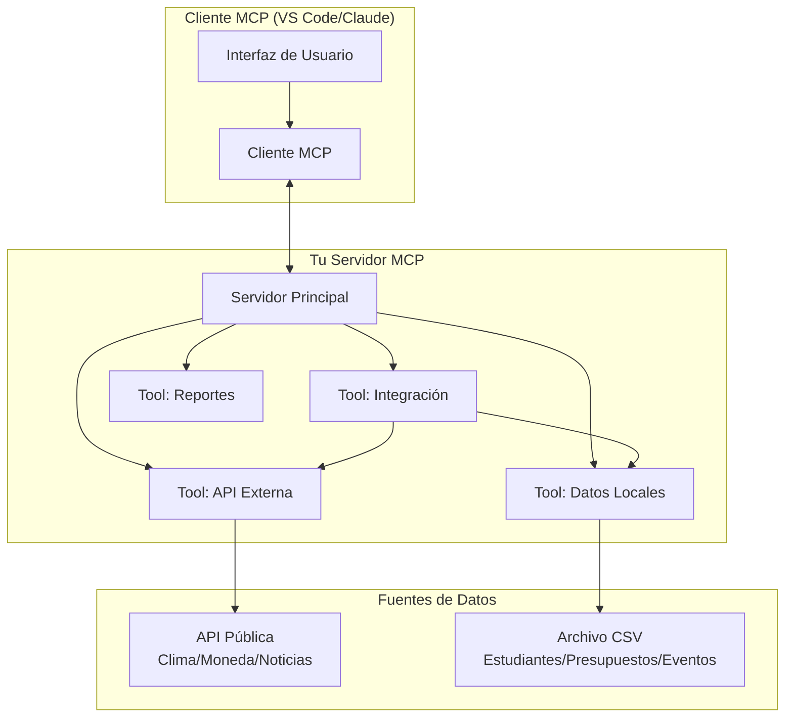

### Datos de prueba proporcionados 📁

#### estudiantes.csv

```csv
rut,nombre,carrera,semestre,email,telefono,horario_preferido
12345678-9,Juan Pérez,Programación,4,juan.perez@aiep.cl,+56912345678,09:00-12:00
98765432-1,María González,Análisis de Sistemas,3,maria.gonzalez@aiep.cl,+56987654321,14:00-17:00
11111111-1,Carlos Silva,Programación,2,carlos.silva@aiep.cl,+56911111111,10:00-13:00
```

#### presupuestos_estudiantiles.json

```json
{
  "categorias": {
    "alimentacion": {
      "promedio_mensual": 120000,
      "descripcion": "Almuerzo y colaciones"
    },
    "transporte": {
      "promedio_mensual": 45000,
      "descripcion": "Locomoción diaria"
    },
    "materiales": {
      "promedio_mensual": 25000,
      "descripcion": "Cuadernos, útiles"
    },
    "tecnologia": {
      "promedio_mensual": 15000,
      "descripcion": "Internet, software"
    }
  },
  "becas_disponibles": [
    {
      "nombre": "Beca Excelencia",
      "monto": 200000,
      "requisitos": "Promedio > 6.0"
    },
    {
      "nombre": "Beca Socioeconómica",
      "monto": 150000,
      "requisitos": "Quintil 1-2"
    }
  ]
}
```

#### eventos_aiep.json

```json
{
  "eventos": [
    {
      "id": 1,
      "nombre": "Evaluación Taller de Programación",
      "fecha": "2025-09-15",
      "tipo": "evaluacion",
      "descripcion": "Evaluación práctica de MCP",
      "importancia": "alta"
    },
    {
      "id": 2,
      "nombre": "Feria de Empleabilidad",
      "fecha": "2025-09-20",
      "tipo": "evento",
      "descripcion": "Empresas locales buscan talentos",
      "importancia": "media"
    }
  ]
}
```

### Implementación paso a paso ⚡

#### Fase 1: Setup y estructura (15 min)

```powershell
# Crear proyecto
mkdir proyecto-mcp-grupo-X
cd proyecto-mcp-grupo-X

# Inicializar
npm init -y
npm install @modelcontextprotocol/sdk axios csv-parser

# Estructura de directorios
mkdir src src\tools src\data src\utils tests
```

#### Fase 2: Tool básico de API externa (20 min)

```typescript
// src/tools/climaTool.ts (Ejemplo para Opción A)
import axios from "axios";
import { Logger } from "../utils/logger.js";

interface ClimaArgs {
  ciudad?: string;
  dias_pronostico?: number;
}

export async function consultarClimaCampus(args: ClimaArgs) {
  const logger = Logger.getInstance();
  const ciudad = args.ciudad || "Osorno";
  const dias = args.dias_pronostico || 1;

  try {
    // API Key de OpenWeatherMap (usar clave de prueba)
    const API_KEY = process.env.OPENWEATHER_API_KEY || "demo_key";
    const url = `https://api.openweathermap.org/data/2.5/forecast?q=${ciudad}&appid=${API_KEY}&units=metric&lang=es`;

    logger.info("Consultando clima", { ciudad, dias });

    const response = await axios.get(url, { timeout: 5000 });
    const data = response.data;

    // Procesar datos
    const pronostico = data.list.slice(0, dias).map((item: any) => ({
      fecha: new Date(item.dt * 1000).toLocaleDateString("es-CL"),
      temperatura: Math.round(item.main.temp),
      descripcion: item.weather[0].description,
      humedad: item.main.humidity,
    }));

    return {
      content: [
        {
          type: "markdown",
          text: `# 🌤️ Clima en ${ciudad}

${pronostico
  .map(
    (p) =>
      `**${p.fecha}**: ${p.temperatura}°C - ${p.descripcion} (Humedad: ${p.humedad}%)`
  )
  .join("\n")}

_Datos de OpenWeatherMap_`,
        },
      ],
    };
  } catch (error) {
    logger.error("Error consultando clima", error);
    throw new Error(
      `No se pudo obtener el clima para ${ciudad}: ${error.message}`
    );
  }
}

export const climaSchema = {
  name: "consultar_clima_campus",
  description: "Obtiene el clima actual y pronóstico para Osorno",
  inputSchema: {
    type: "object",
    properties: {
      ciudad: {
        type: "string",
        description: "Ciudad a consultar (por defecto: Osorno)",
        default: "Osorno",
      },
      dias_pronostico: {
        type: "number",
        description: "Días de pronóstico (1-5)",
        minimum: 1,
        maximum: 5,
        default: 1,
      },
    },
  },
};
```

#### Fase 3: Tool de datos locales (20 min)

```typescript
// src/tools/estudiantesTool.ts
import * as fs from "fs";
import * as path from "path";
import csv from "csv-parser";
import { Logger } from "../utils/logger.js";

interface BuscarEstudianteArgs {
  rut?: string;
  nombre?: string;
}

interface Estudiante {
  rut: string;
  nombre: string;
  carrera: string;
  semestre: number;
  email: string;
  telefono: string;
  horario_preferido: string;
}

export async function buscarEstudiante(args: BuscarEstudianteArgs) {
  const logger = Logger.getInstance();

  if (!args.rut && !args.nombre) {
    throw new Error("Debe proporcionar RUT o nombre para buscar");
  }

  const estudiantes = await cargarEstudiantes();
  logger.info("Buscando estudiante", args);

  const encontrado = estudiantes.find(
    (e) =>
      (args.rut && e.rut.includes(args.rut)) ||
      (args.nombre &&
        e.nombre.toLowerCase().includes(args.nombre.toLowerCase()))
  );

  if (!encontrado) {
    return {
      content: [
        {
          type: "text",
          text: `❌ No se encontró estudiante con los criterios: ${JSON.stringify(
            args
          )}`,
        },
      ],
    };
  }

  return {
    content: [
      {
        type: "markdown",
        text: `# 👤 ${encontrado.nombre}

**RUT:** ${encontrado.rut}
**Carrera:** ${encontrado.carrera}
**Semestre:** ${encontrado.semestre}
**Email:** ${encontrado.email}
**Teléfono:** ${encontrado.telefono}
**Horario preferido:** ${encontrado.horario_preferido}

---
*Información desde base de datos AIEP*`,
      },
    ],
  };
}

async function cargarEstudiantes(): Promise<Estudiante[]> {
  return new Promise((resolve, reject) => {
    const estudiantes: Estudiante[] = [];
    const csvPath = path.join(__dirname, "../data/estudiantes.csv");

    if (!fs.existsSync(csvPath)) {
      reject(new Error(`Archivo no encontrado: ${csvPath}`));
      return;
    }

    fs.createReadStream(csvPath)
      .pipe(csv())
      .on("data", (row) => {
        estudiantes.push({
          rut: row.rut,
          nombre: row.nombre,
          carrera: row.carrera,
          semestre: parseInt(row.semestre),
          email: row.email,
          telefono: row.telefono,
          horario_preferido: row.horario_preferido,
        });
      })
      .on("end", () => resolve(estudiantes))
      .on("error", reject);
  });
}

export const estudiantesSchema = {
  name: "buscar_estudiante",
  description: "Busca información de un estudiante por RUT o nombre",
  inputSchema: {
    type: "object",
    properties: {
      rut: {
        type: "string",
        description: "RUT del estudiante (completo o parcial)",
        pattern: "[0-9-kK]+",
      },
      nombre: {
        type: "string",
        description: "Nombre del estudiante (completo o parcial)",
        minLength: 2,
      },
    },
  },
};
```

#### Fase 4: Tool de integración (20 min)

```typescript
// src/tools/integracionTool.ts
import { consultarClimaCampus } from "./climaTool.js";
import { buscarEstudiante } from "./estudiantesTool.js";
import { Logger } from "../utils/logger.js";

interface PlanificarReunionArgs {
  participantes: string[]; // RUTs
  fecha_preferida?: string;
  duracion_horas?: number;
}

export async function planificarReunion(args: PlanificarReunionArgs) {
  const logger = Logger.getInstance();
  logger.info("Planificando reunión", args);

  // 1. Obtener información de participantes
  const infoParticipantes = await Promise.all(
    args.participantes.map((rut) => buscarEstudiante({ rut }))
  );

  // 2. Consultar clima para la fecha
  const clima = await consultarClimaCampus({ dias_pronostico: 3 });

  // 3. Analizar horarios comunes
  const horariosComunes = encontrarHorariosComunes(infoParticipantes);

  // 4. Generar recomendación
  const recomendacion = generarRecomendacion(horariosComunes, clima, args);

  return {
    content: [
      {
        type: "markdown",
        text: recomendacion,
      },
    ],
  };
}

function encontrarHorariosComunes(participantes: any[]): string[] {
  // Lógica simplificada - en proyecto real sería más compleja
  const horarios = ["09:00-10:00", "10:00-11:00", "14:00-15:00", "15:00-16:00"];
  return horarios; // Por simplicidad, devolver todos
}

function generarRecomendacion(
  horarios: string[],
  clima: any,
  args: any
): string {
  return `# 📅 Planificación de Reunión

## Participantes
${args.participantes.length} personas confirmadas

## Horarios sugeridos
${horarios.map((h) => `- ⏰ ${h}`).join("\n")}

## Consideraciones climáticas
${clima.content[0].text}

## Recomendación
- **Mejor horario:** ${horarios[0]}
- **Duración:** ${args.duracion_horas || 2} horas
- **Modalidad:** ${
    Math.random() > 0.5 ? "Presencial" : "Híbrida (considerar clima)"
  }

---
*Sugerencia generada automáticamente*`;
}

export const integracionSchema = {
  name: "planificar_reunion",
  description:
    "Planifica reuniones considerando horarios de participantes y clima",
  inputSchema: {
    type: "object",
    required: ["participantes"],
    properties: {
      participantes: {
        type: "array",
        items: { type: "string" },
        description: "Lista de RUTs de participantes",
        minItems: 1,
      },
      fecha_preferida: {
        type: "string",
        description: "Fecha preferida (YYYY-MM-DD)",
        pattern: "^\\d{4}-\\d{2}-\\d{2}$",
      },
      duracion_horas: {
        type: "number",
        description: "Duración estimada en horas",
        minimum: 0.5,
        maximum: 8,
        default: 2,
      },
    },
  },
};
```

#### Fase 5: Testing y refinamiento (15 min)

```typescript
// tests/integration.test.ts
import { describe, test, expect } from "@jest/globals";
import { consultarClimaCampus } from "../src/tools/climaTool";
import { buscarEstudiante } from "../src/tools/estudiantesTool";

describe("Integración del Proyecto", () => {
  test("clima tool debería funcionar con ciudad por defecto", async () => {
    const resultado = await consultarClimaCampus({});
    expect(resultado.content[0].text).toContain("Osorno");
  }, 10000); // timeout extendido para API

  test("buscar estudiante debería encontrar datos válidos", async () => {
    const resultado = await buscarEstudiante({ nombre: "Juan" });
    expect(resultado.content[0].text).toContain("Juan Pérez");
  });
});
```

### Rúbrica de evaluación 📊

| Criterio               | Excelente (4 pts)                                   | Bueno (3 pts)                       | Aceptable (2 pts)                | Insuficiente (1 pt)  |
| ---------------------- | --------------------------------------------------- | ----------------------------------- | -------------------------------- | -------------------- |
| **Funcionalidad**      | 4 tools funcionando perfectamente                   | 3 tools funcionando                 | 2 tools funcionando              | 1 tool funcionando   |
| **Integración API**    | API externa con manejo de errores robusto           | API funcionando con errores básicos | API funcionando sin validaciones | API no funciona      |
| **Datos locales**      | CSV/JSON procesado correctamente con validación     | Datos procesados correctamente      | Datos procesados parcialmente    | Datos no procesados  |
| **Calidad del código** | Código limpio, comentado, con patterns              | Código estructurado y legible       | Código funcional básico          | Código desorganizado |
| **Logging/Telemetría** | Logs estructurados y informativos                   | Logs básicos implementados          | Logs mínimos                     | Sin logging          |
| **Testing**            | Tests unitarios + integración                       | Tests unitarios básicos             | Algunos tests                    | Sin tests            |
| **Documentación**      | README completo + comentarios + ejemplos            | README básico + comentarios         | README mínimo                    | Sin documentación    |
| **Pitch**              | Presentación clara, demo fluida, responde preguntas | Presentación buena, demo funciona   | Presentación básica              | Presentación pobre   |

**Puntaje total:** 32 puntos

- **Excelente:** 28-32 puntos (87-100%)
- **Bueno:** 24-27 puntos (75-86%)
- **Aceptable:** 20-23 puntos (62-74%)
- **Insuficiente:** < 20 puntos (< 62%)

### Checklist de entrega ✅

**Archivo del proyecto (obligatorio):**

- [ ] Código fuente en carpeta `src/` organizada
- [ ] Archivo `package.json` con dependencias
- [ ] Datos de prueba en `src/data/`
- [ ] Tests en carpeta `tests/`
- [ ] `README.md` con instrucciones de instalación y uso

**Funcionalidad técnica:**

- [ ] Servidor MCP arranca sin errores
- [ ] Al menos 3 tools implementados y funcionales
- [ ] Integración exitosa con API externa
- [ ] Procesamiento correcto de datos locales
- [ ] Logs informativos en ejecución
- [ ] Manejo básico de errores

**Documentación:**

- [ ] README explica el propósito del proyecto
- [ ] Instrucciones de instalación (comandos PowerShell)
- [ ] Ejemplos de uso de cada tool
- [ ] Descripción de las fuentes de datos utilizadas
- [ ] Lista de dependencias externas

**Preparación para pitch:**

- [ ] Demo funcionando en vivo (máximo 2 min)
- [ ] Slides opcionales (máximo 3 slides)
- [ ] Identificación clara del problema resuelto
- [ ] Explicación del valor agregado de la integración

### Estructura del pitch de 3 minutos 🎤

#### Minuto 1: Problema y solución

- **"¿Qué problema resolvemos?"** (30 seg)
  - Problema específico del contexto AIEP/estudiantil
  - Por qué es importante para la comunidad
- **"¿Cuál es nuestra solución?"** (30 seg)
  - Servidor MCP + integración de datos
  - Valor único de combinar fuentes externas + locales

#### Minuto 2: Demo en vivo

- **Tool 1:** API externa funcionando (30 seg)
- **Tool 2:** Datos locales procesados (30 seg)
- **Tool de integración:** Mostrando el valor agregado (30 seg)

#### Minuto 3: Impacto y preguntas

- **Impacto esperado** (30 seg)
  - ¿Cómo mejora la experiencia estudiantil?
  - Escalabilidad y próximos pasos
- **Preguntas del público** (30 seg)

**Tips para el pitch:**

- Practicar con cronómetro
- Tener datos reales cargados para la demo
- Preparar respuesta para "¿Qué harían diferente?"
- Mostrar código solo si es especialmente elegante

### Cronograma de la sesión ⏱️

```mermaid
gantt
    title Proyecto MCP - 90 minutos
    dateFormat  HH:mm
    axisFormat %H:%M

    section Setup
    Formar grupos y elegir opción    :10:00, 10min

    section Desarrollo
    Fase 1 - Setup y estructura      :10:10, 15min
    Fase 2 - Tool API externa        :10:25, 20min
    Fase 3 - Tool datos locales      :10:45, 20min
    Break                            :11:05, 5min
    Fase 4 - Tool integración        :11:10, 20min
    Fase 5 - Testing y docs          :11:30, 15min

    section Presentaciones
    Preparar pitch                   :11:45, 10min
    Pitches grupales                 :11:55, 25min

    section Cierre
    Feedback y evaluación            :12:20, 10min
```

**¡Manos a la obra! 🚀 Es momento de crear tu servidor MCP que integre el mundo digital con datos reales para resolver problemas de tu comunidad estudiantil.**

---

## Anexos 📚🔧

Esta sección contiene material de apoyo para consulta rápida, resolución de problemas y profundización en MCP.

### Glosario de términos 📖

| Término           | Definición                                                     | Ejemplo                                    |
| ----------------- | -------------------------------------------------------------- | ------------------------------------------ |
| **Cliente MCP**   | Aplicación que consume herramientas de un servidor MCP         | VS Code, Claude Desktop, aplicación custom |
| **Servidor MCP**  | Programa que expone tools, prompts y resources a clientes      | Tu servidor Node.js/Python con tools       |
| **Tool**          | Función específica que el servidor expone al cliente           | `buscar_estudiante`, `consultar_clima`     |
| **Prompt**        | Plantilla de texto parametrizada que el servidor puede generar | `reporte_estudiante`, `carta_presentacion` |
| **Resource**      | Datos o contenidos que el servidor puede leer/escribir         | Archivos CSV, conexiones BD, URLs          |
| **Handshake**     | Proceso inicial de negociación de capacidades cliente-servidor | `initialize` → `initialized`               |
| **Transport**     | Método de comunicación entre cliente y servidor                | stdio, WebSocket, SSE                      |
| **Schema**        | Definición de estructura de entrada/salida de un tool          | JSON Schema con tipos, validaciones        |
| **Rate Limiting** | Control de frecuencia de requests para evitar abuso            | Máximo 100 requests por minuto por cliente |
| **Telemetría**    | Sistema de logs y métricas para monitoreo y debugging          | Logs estructurados en JSON con timestamps  |

### FAQ - Preguntas frecuentes ❓

#### **General sobre MCP**

**P: ¿MCP reemplaza las APIs REST tradicionales?**
R: No, MCP complementa APIs existentes. Es una capa de abstracción que permite que aplicaciones con IA accedan a múltiples fuentes de datos de forma estandarizada. Tus APIs REST pueden ser consumidas desde tools MCP.

**P: ¿Puedo usar MCP sin IA?**
R: Técnicamente sí, pero MCP fue diseñado específicamente para facilitar la integración entre aplicaciones con IA y sistemas externos. Para casos sin IA, una API REST tradicional probablemente sea más apropiada.

**P: ¿MCP funciona con modelos de IA locales?**
R: Sí, cualquier cliente que implemente el protocolo MCP puede usar servidores MCP, incluyendo aplicaciones que usen modelos locales como Ollama, LocalAI, etc.

#### **Desarrollo y configuración**

**P: Mi servidor no se conecta con el cliente. ¿Qué reviso?**
R: Verifica en este orden:

1. El servidor arranca sin errores (`npm run dev`)
2. La configuración del cliente tiene la ruta correcta al servidor
3. El transporte (stdio/WebSocket) coincide entre cliente y servidor
4. No hay conflictos de puertos (si usas WebSocket)

**P: ¿Cómo debuggeo problemas de comunicación?**
R: Activa logging detallado:

```typescript
// En el servidor
const logger = Logger.getInstance();
logger.setLevel(LogLevel.DEBUG);

// En el cliente (VS Code)
"mcp.logLevel": "debug"
```

**P: Mi tool funciona en tests pero no desde el cliente MCP. ¿Por qué?**
R: Probablemente sea un problema de schema o validación:

1. Verifica que el `inputSchema` coincida exactamente con los parámetros
2. Revisa que no haya errores de tipo (string vs number)
3. Confirma que todos los campos `required` están presentes

**P: ¿Cómo manejo secretos de APIs en producción?**
R: Usa variables de entorno y nunca hardcodees claves:

```powershell
# PowerShell
$env:OPENWEATHER_API_KEY="tu_api_key_aqui"
npm run start

# O crea un archivo .env (no subir a Git)
OPENWEATHER_API_KEY=tu_api_key_aqui
```

#### **Performance y escalabilidad**

**P: ¿Cuántos tools puede manejar un servidor MCP?**
R: No hay límite técnico, pero considera:

- Memoria: cada tool carga su código en memoria
- Complejidad: muchos tools hacen el servidor difícil de mantener
- Performance: tools que acceden a recursos externos pueden ser lentos
- **Recomendación:** 5-15 tools bien diseñados por servidor

**P: ¿Cómo optimizo un tool que hace muchas requests a APIs externas?**
R: Implementa caché y batch processing:

```typescript
// Cache simple con TTL
const cache = new Map();
const CACHE_TTL = 5 * 60 * 1000; // 5 minutos

async function consultarConCache(key: string, fetcher: () => Promise<any>) {
  const cached = cache.get(key);
  if (cached && Date.now() - cached.timestamp < CACHE_TTL) {
    return cached.data;
  }

  const data = await fetcher();
  cache.set(key, { data, timestamp: Date.now() });
  return data;
}
```

### Troubleshooting - Resolución de problemas 🛠️

#### Errores comunes y soluciones

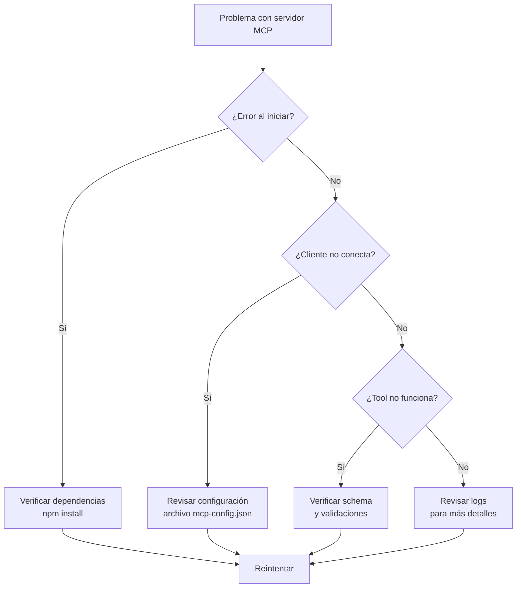

#### **Error: "Module not found"**

```
Error: Cannot find module '@modelcontextprotocol/sdk'
```

**Solución:**

```powershell
# Reinstalar dependencias
rm -rf node_modules package-lock.json
npm install
```

#### **Error: "Tool desconocido"**

```
McpError: Tool desconocido: mi_tool
```

**Solución:**

1. Verifica que el tool está registrado en el servidor:

```typescript
// En server.ts
case 'mi_tool':
  return await miTool(args || {});
```

2. Confirma que el nombre coincide exactamente en schema y handler

#### **Error: "JSON-RPC parse error"**

```
Error: Parse error - Invalid JSON
```

**Solución:**

- El cliente está enviando JSON mal formado
- Verifica la configuración del transporte (stdio vs WebSocket)
- Revisa que no hay caracteres especiales en los mensajes

#### **Error: "Request timeout"**

```
Error: Request timeout after 30000ms
```

**Solución:**

- Aumenta el timeout del cliente
- Optimiza el tool para responder más rápido
- Implementa procesamiento asíncrono para operaciones largas

#### **Warning: "Rate limit exceeded"**

```
Warning: Rate limit exceeded for client
```

**Solución:**

- Implementa caché para reducir requests
- Aumenta los límites de rate limiting si es apropiado
- Optimiza la frecuencia de llamadas del cliente

### Plantillas de código 📄

#### Plantilla básica de tool

```typescript
// src/tools/plantillaTool.ts
import { Logger } from "../utils/logger.js";

interface MiToolArgs {
  parametro_requerido: string;
  parametro_opcional?: number;
}

export async function miTool(args: MiToolArgs) {
  const logger = Logger.getInstance();
  const startTime = Date.now();

  try {
    // Validación de entrada
    if (
      !args.parametro_requerido ||
      args.parametro_requerido.trim().length === 0
    ) {
      throw new Error("parametro_requerido es obligatorio");
    }

    logger.info("Ejecutando miTool", {
      parametro_requerido: args.parametro_requerido,
      parametro_opcional: args.parametro_opcional,
    });

    // Lógica principal del tool
    const resultado = await procesarLogicaPrincipal(args);

    // Log de éxito con métricas
    const duration = Date.now() - startTime;
    logger.info("miTool completado exitosamente", {
      duration,
      resultado: resultado.id || "N/A",
    });

    return {
      content: [
        {
          type: "text",
          text: `✅ Resultado: ${JSON.stringify(resultado, null, 2)}`,
        },
      ],
      metadata: {
        executionTime: duration,
        timestamp: new Date().toISOString(),
        version: "1.0.0",
      },
    };
  } catch (error) {
    const duration = Date.now() - startTime;
    logger.error("Error en miTool", {
      error: error.message,
      duration,
      args,
    });

    throw new Error(`Error en miTool: ${error.message}`);
  }
}

async function procesarLogicaPrincipal(args: MiToolArgs): Promise<any> {
  // Implementar lógica específica aquí
  return {
    id: Math.random().toString(36).substr(2, 9),
    procesado: true,
    timestamp: new Date().toISOString(),
  };
}

export const miToolSchema = {
  name: "mi_tool",
  description: "Descripción clara de qué hace este tool",
  inputSchema: {
    type: "object",
    required: ["parametro_requerido"],
    properties: {
      parametro_requerido: {
        type: "string",
        description: "Descripción del parámetro requerido",
        minLength: 1,
        maxLength: 100,
        examples: ["ejemplo1", "ejemplo2"],
      },
      parametro_opcional: {
        type: "number",
        description: "Descripción del parámetro opcional",
        minimum: 1,
        maximum: 1000,
        default: 10,
      },
    },
  },
};
```

#### Plantilla de test unitario

```typescript
// tests/tools/miTool.test.ts
import { describe, test, expect, beforeEach, jest } from "@jest/globals";
import { miTool, miToolSchema } from "../../src/tools/plantillaTool";

describe("Mi Tool", () => {
  beforeEach(() => {
    jest.clearAllMocks();
  });

  test("debería ejecutarse exitosamente con parámetros válidos", async () => {
    const args = {
      parametro_requerido: "valor_test",
      parametro_opcional: 42,
    };

    const resultado = await miTool(args);

    expect(resultado.content).toHaveLength(1);
    expect(resultado.content[0].text).toContain("✅ Resultado:");
    expect(resultado.metadata.executionTime).toBeGreaterThan(0);
  });

  test("debería fallar con parámetro requerido vacío", async () => {
    const args = {
      parametro_requerido: "",
    };

    await expect(miTool(args)).rejects.toThrow(
      "parametro_requerido es obligatorio"
    );
  });

  test("debería usar valor por defecto para parámetro opcional", async () => {
    const args = {
      parametro_requerido: "test",
    };

    const resultado = await miTool(args);
    expect(resultado.content[0].text).toBeDefined();
  });

  test("schema debería tener estructura correcta", () => {
    expect(miToolSchema.name).toBe("mi_tool");
    expect(miToolSchema.inputSchema.required).toContain("parametro_requerido");
    expect(miToolSchema.inputSchema.properties.parametro_requerido.type).toBe(
      "string"
    );
  });
});
```

### Recursos adicionales de estudio 🎓

#### **Documentación oficial**

- [Model Context Protocol Specification](https://spec.modelcontextprotocol.io/)
- [MCP TypeScript SDK](https://github.com/modelcontextprotocol/typescript-sdk)
- [JSON-RPC 2.0 Specification](https://www.jsonrpc.org/specification)

#### **APIs públicas recomendadas para proyectos**

- **Clima:** OpenWeatherMap (gratuita con límites)
- **Monedas:** CurrencyAPI, ExchangeRate-API
- **Noticias:** NewsAPI, Guardian API
- **Datos Chile:** APIs del Estado (mindicador.cl, API comunas)

#### **Herramientas útiles**

- **Testing:** Jest, Supertest para APIs
- **Validation:** Ajv para JSON Schema
- **HTTP:** Axios, node-fetch
- **CSV:** csv-parser, fast-csv
- **Logs:** Winston, Pino

#### **Patrones avanzados**

```typescript
// Circuit Breaker pattern para APIs externas
class CircuitBreaker {
  private failures = 0;
  private lastFailTime = 0;
  private state: "closed" | "open" | "half-open" = "closed";

  constructor(private threshold = 5, private timeout = 60000) {}

  async execute<T>(operation: () => Promise<T>): Promise<T> {
    if (this.state === "open") {
      if (Date.now() - this.lastFailTime < this.timeout) {
        throw new Error("Circuit breaker is OPEN");
      }
      this.state = "half-open";
    }

    try {
      const result = await operation();
      this.onSuccess();
      return result;
    } catch (error) {
      this.onFailure();
      throw error;
    }
  }

  private onSuccess() {
    this.failures = 0;
    this.state = "closed";
  }

  private onFailure() {
    this.failures++;
    this.lastFailTime = Date.now();

    if (this.failures >= this.threshold) {
      this.state = "open";
    }
  }
}
```

### Próximos pasos sugeridos 🚀

#### **Para continuar aprendiendo:**

1. **Explora servidores MCP existentes** en GitHub
2. **Implementa un servidor con base de datos** (PostgreSQL/MongoDB)
3. **Experimenta con WebSockets** para notificaciones en tiempo real
4. **Crea un cliente MCP custom** para casos específicos
5. **Estudia patterns avanzados** como Circuit Breaker, Retry, Bulkhead

#### **Proyectos de extensión:**

- Servidor MCP para gestión de tareas estudiantiles
- Integración con sistemas académicos reales
- Bot de Discord/Telegram que use tu servidor MCP
- Dashboard web que consuma múltiples servidores MCP

#### **Contribuir al ecosistema:**

- Documenta y comparte tus tools útiles
- Contribuye a proyectos MCP open source
- Crea tutoriales para la comunidad

---

**¡Felicitaciones! 🎉 Has completado la guía completa de Model Context Protocol. Ahora tienes las herramientas y conocimientos para crear integraciones poderosas que conecten el mundo de la IA con sistemas reales. ¡A programar se ha dicho!**

### Información del curso 📋

**Guía creada por:** Prof. Diego Obando  
**Institución:** AIEP Osorno, Chile  
**Carrera:** Programación y Análisis de Sistemas  
**Año:** 2025  
**Versión:** 1.0
