# Clase 01 - Semana 05 - Plataforma .NET: Framework/.NET CORE y Comparativa entre TS y C#

- Unidad 02: **Diseño y Programación Orientada a Objetos**
- Fecha: Lunes 08 de Septiembre, 2025
- Horario: 10:50 - 13:30
- Docente: Diego Obando

## 🎯 Objetivos de la Clase

Al finalizar esta clase, los estudiantes podrán:

1. **🏗️ Caracterizar la plataforma .NET** identificando sus componentes principales (Runtime, BCL, lenguajes), modelos de aplicación y arquitectura asociada

2. **⚖️ Comparar TypeScript y C#** analizando similitudes y diferencias en sintaxis, tipado estático y aplicación de conceptos de POO (clases, herencia, interfaces)

3. **📐 Determinar las ventajas de la programación por capas** explicando cómo el patrón MVC mejora la organización y mantenibilidad del código en aplicaciones .NET

4. **🔧 Relacionar estructuras básicas de control** (condicionales, loops, excepciones) con propiedades de programación orientada a objetos en el contexto del desarrollo con C#

5. **🐛 Identificar errores básicos de compilación** utilizando técnicas de depuración en Visual Studio y comprendiendo los tipos de excepciones más comunes

**🎯 Competencia trabajada:** Comunicación - Establecer comunicación técnica adecuada sobre conceptos de plataforma .NET

---

## 📚 BLOQUE 1: Fundamentos .NET (45 min)

### 🏛️ Historia y Evolución de .NET (15 min)

**🎯 Pregunta motivadora:** _"¿Por qué Microsoft creó .NET si ya existían otros lenguajes de programación?"_

#### 📚 **Contexto Histórico: La "Guerra de Plataformas" (1990s)**

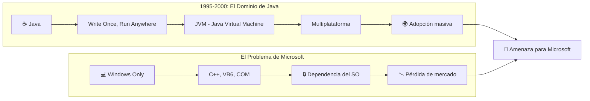

#### 🥊 **La Respuesta de Microsoft: .NET (2000)**

**🎯 Objetivo:** Crear una plataforma que compitiera directamente con Java, pero mejor integrada con Windows.

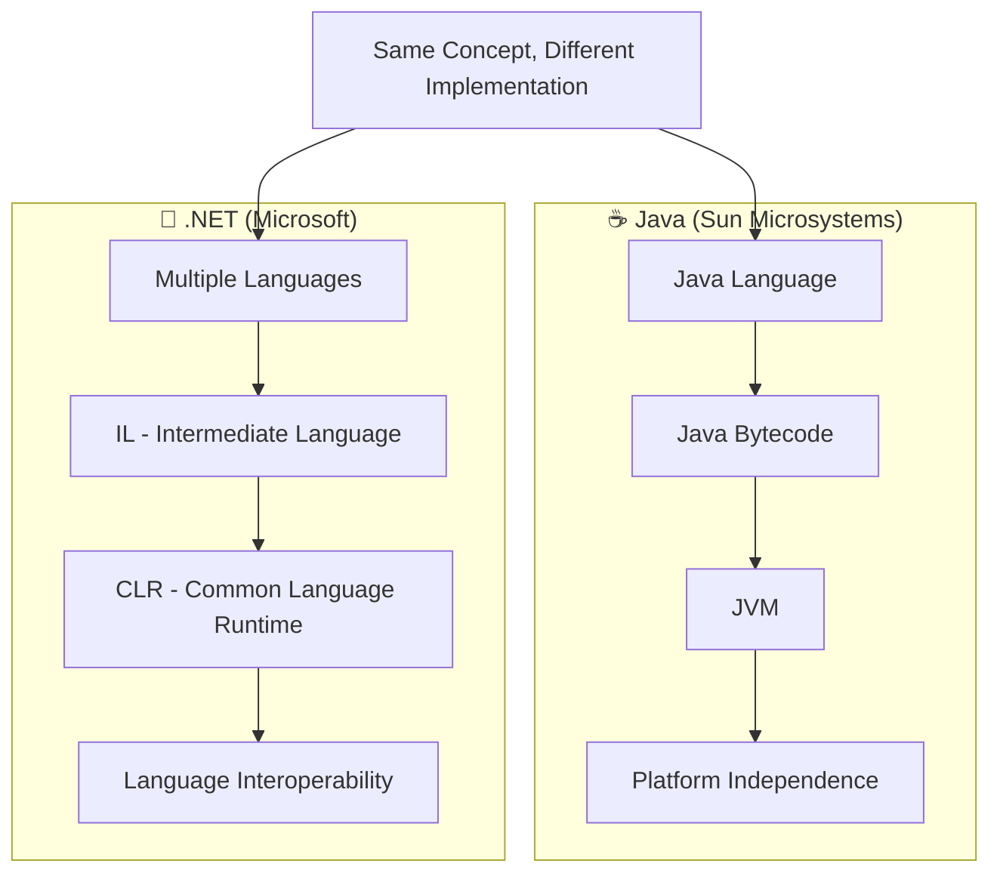

#### 📊 **Comparación Java vs .NET (Diseño Original)**

| Aspecto                  | ☕ **Java**                | 🔷 **.NET Framework**        |
| ------------------------ | -------------------------- | ---------------------------- |
| **📅 Año**               | 1995                       | 2000                         |
| **🏢 Compañía**          | Sun Microsystems           | Microsoft                    |
| **🗣️ Lenguajes**         | Solo Java                  | C#, VB.NET, F#, C++          |
| **💻 Plataformas**       | Multiplataforma            | Solo Windows                 |
| **🔄 Código Intermedio** | Bytecode                   | IL (Intermediate Language)   |
| **⚙️ Runtime**           | JVM                        | CLR                          |
| **🎯 Filosofía**         | "Write Once, Run Anywhere" | "Write Once, Run on Windows" |

#### 🎭 **Las Estrategias Competitivas**

**Microsoft copió conceptos clave de Java, pero añadió:**

1. **🗣️ Múltiples Lenguajes:** No solo C#, sino VB.NET, F#, etc.
2. **🔗 Interoperabilidad:** Los lenguajes pueden trabajar juntos
3. **🚀 Mejor Rendimiento:** CLR optimizado para Windows
4. **🛠️ Mejores Herramientas:** Visual Studio vs herramientas Java de la época

#### 🕰️ **Timeline Completo: Java vs .NET**

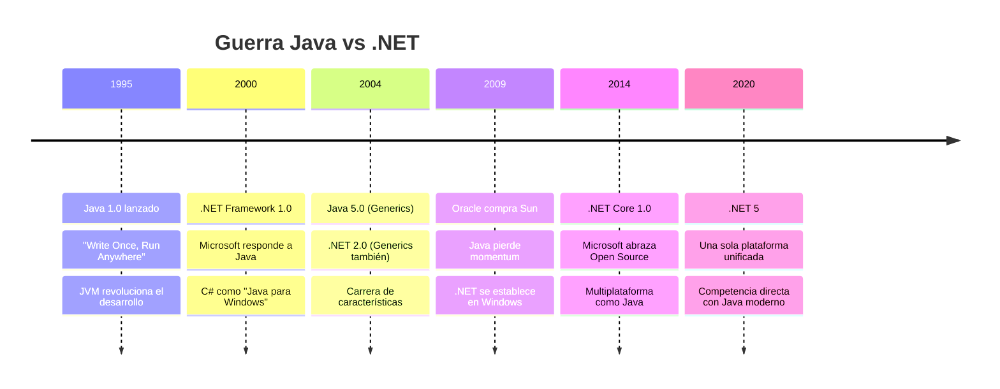

#### 💡 **Conceptos Clave Compartidos**

**Ambas plataformas introdujeron:**

1. **🔄 Compilación en dos fases:**

   - **Java:** `.java` → `bytecode` → JVM
   - **.NET:** `.cs` → `IL` → CLR

2. **🗑️ Gestión automática de memoria (Garbage Collection)**

3. **🔒 Seguridad de tipos en tiempo de ejecución**

4. **📚 Bibliotecas estándar extensas**

#### 🎯 **¿Por qué .NET "ganó" en el ecosistema Microsoft?**

1. **🔗 Integración perfecta** con Windows y tecnologías Microsoft
2. **🛠️ Herramientas superiores** (Visual Studio)
3. **💼 Adopción empresarial** masiva en entornos corporativos
4. **🔄 Evolución constante** (.NET Core, .NET 5+)

**💭 Reflexión:** .NET no reinventó la rueda, sino que mejoró el diseño de Java y lo adaptó al ecosistema Microsoft.

### ⚙️ Componentes Principales de .NET (12 min)

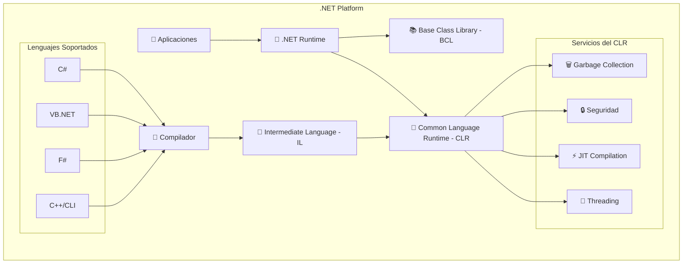

#### 🔍 **Explicación Detallada de Componentes:**

**1. Common Language Runtime (CLR)** 🔧

- **Analogía:** Es como el "motor" de un auto - ejecuta y administra el código
- **Comparación con Java:** Equivale a la JVM, pero optimizado para múltiples lenguajes
- **Funciones críticas:**
  - 🗑️ **Garbage Collection:** Manejo automático de memoria
  - 🔒 **Code Access Security:** Permisos granulares de ejecución
  - ⚡ **JIT Compilation:** Convierte IL a código nativo en tiempo real
  - 🧵 **Thread Management:** Manejo eficiente de hilos
- **Ventaja clave:** Un solo runtime para múltiples lenguajes vs Java que necesita JVM por lenguaje

**2. Base Class Library (BCL)** 📚

- **Analogía:** Es como una "caja de herramientas gigante" con 15,000+ funciones pre-construidas
- **Comparación con Java:** Similar al JDK, pero más integrado con Windows
- **Categorías principales:**
  - 🔢 **System:** Tipos básicos (String, Int32, DateTime)
  - 📊 **Collections:** Listas, diccionarios, colas
  - 🗂️ **System.IO:** Archivos, streams, directorios
  - 🌐 **System.Net:** HTTP, TCP, sockets
  - 🔍 **System.Linq:** Consultas sobre datos (como SQL en memoria)
- **Ventaja:** No reinventar la rueda, 80% del código ya está escrito

**3. Lenguajes .NET y Common Type System (CTS)** 🗣️

- **Concepto revolucionario:** Todos los lenguajes comparten el mismo sistema de tipos
- **Common Language Specification (CLS):** Reglas para interoperabilidad
- **Ejemplo práctico:**
  ```csharp
  // C# puede usar una clase escrita en VB.NET
  var calculadora = new VB_Calculator(); // Clase de VB.NET
  calculadora.Sumar(5, 3); // Método en VB.NET
  ```

#### 🔄 **El Flujo de Compilación .NET vs Java**

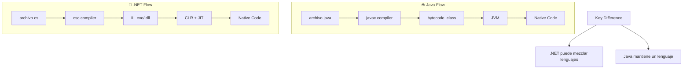

#### 🧬 **Metadata: El "ADN" de .NET**

**Concepto único de .NET:** Cada assembly contiene metadatos completos sobre tipos y miembros.

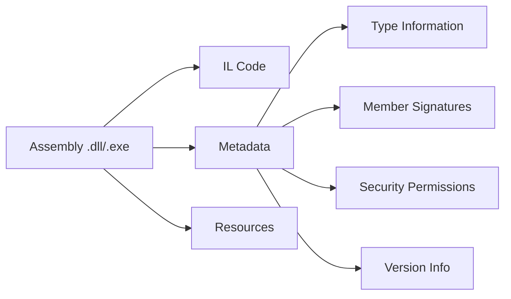

**🎯 Ventajas de Metadata:**

- **🔍 Reflection:** Inspeccionar tipos en tiempo de ejecución
- **🔧 No IDL files:** No necesita archivos de interfaz separados (como COM)
- **📦 Self-describing:** El assembly se describe completamente a sí mismo
- **🔄 Versionado:** Control preciso de versiones de componentes

#### 💡 **¿Por qué IL (Intermediate Language) en lugar de código nativo?**

**Ventajas del IL:**

1. **🗣️ Multi-lenguaje:** C#, VB.NET, F# → mismo IL
2. **🔒 Seguridad:** Verificación de tipos antes de ejecución
3. **⚡ Optimización:** JIT puede optimizar para el CPU específico
4. **🐛 Debugging:** Mejor información de depuración
5. **📦 Portabilidad:** Same IL runs on different architectures

**Desventaja:**

- **⏱️ Startup Time:** Primera ejecución es más lenta (JIT overhead)

### 🏗️ Modelos de Aplicación .NET (8 min)

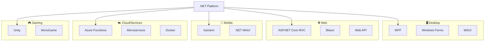

#### 🎯 **Actividad Interactiva: "¿Qué aplicación usarías?"**

**Escenarios:**

1. **Sistema de inventario para empresa** → _Windows Forms/WPF_
2. **E-commerce online** → _ASP.NET Core MVC_
3. **App móvil de delivery** → _.NET MAUI_
4. **API para consumir datos** → _Web API_
5. **Juego 2D simple** → _MonoGame_

### 🏛️ Arquitectura .NET: Framework vs Core vs 5+ (10 min)

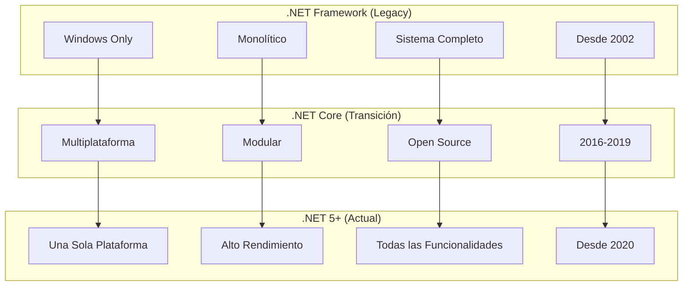

#### 📊 **Comparativa Práctica:**

| Aspecto                | .NET Framework   | .NET Core      | .NET 5+       |
| ---------------------- | ---------------- | -------------- | ------------- |
| **🖥️ Plataformas**     | Solo Windows     | Win/Mac/Linux  | Win/Mac/Linux |
| **📦 Despliegue**      | Sistema completo | Self-contained | Flexible      |
| **⚡ Rendimiento**     | Bueno            | Muy bueno      | Excelente     |
| **🔄 Actualizaciones** | Lentas           | Rápidas        | Regulares     |
| **💰 Licencia**        | Propietaria      | Open Source    | Open Source   |

### 🎯 Actividad de Consolidación (5 min)

**🤔 Reflexión grupal:**

1. **¿Cuál es la principal ventaja de que .NET sea multiplataforma?**
2. **¿Por qué es importante que múltiples lenguajes compilen al mismo IL?**
3. **¿En qué escenario elegirían .NET Framework sobre .NET 5+?**

**💡 Respuestas esperadas:**

1. _Flexibilidad de despliegue, menor dependencia de Windows_
2. _Interoperabilidad, reutilización de código entre lenguajes_
3. _Aplicaciones legacy que no pueden migrar, dependencias específicas_

---

## 🔄 BLOQUE 2: Comparativa TypeScript vs C# - Del Frontend al Backend

### 🎯 Objetivos del Bloque

- Aprovechar el conocimiento previo de TypeScript para facilitar el aprendizaje de C#
- Identificar similitudes conceptuales y diferencias técnicas
- Comprender la transición de desarrollo web a desarrollo de escritorio/backend
- Establecer paralelismos en sintaxis, tipado y programación orientada a objetos

### 🌉 ¿Por qué esta Comparación es Estratégica?

**Contexto pedagógico:** Los estudiantes ya dominan TypeScript, por lo que C# no será un lenguaje completamente nuevo, sino una "evolución natural" hacia el backend y aplicaciones de escritorio.

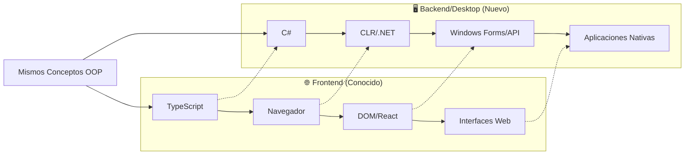

### 📚 Fundamentos Teóricos: Similitudes Arquitectónicas

#### 🏗️ **Ambos son Lenguajes de Alto Nivel con Tipado Estático**

**TypeScript** surge como una evolución de JavaScript para agregar tipado estático y características empresariales. **C#** fue diseñado desde el inicio como un lenguaje empresarial con tipado fuerte. Ambos comparten filosofías similares:

1. **🔒 Type Safety:** Prevenir errores en tiempo de compilación
2. **🏢 Enterprise Ready:** Diseñados para aplicaciones grandes y complejas
3. **🛠️ Tooling Excellence:** IDEs poderosos con IntelliSense
4. **📚 Rich Ecosystems:** Bibliotecas extensas y comunidades activas

#### 🔄 **Procesos de Compilación Paralelos**

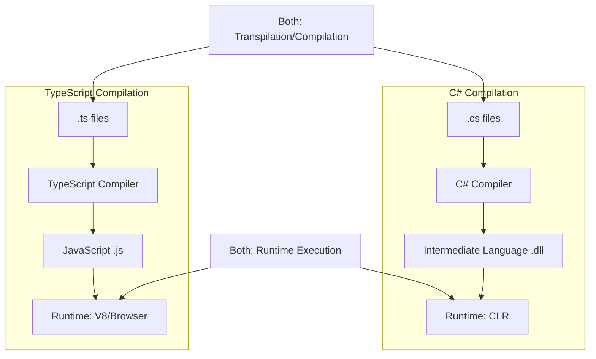

**Diferencias clave en compilación:**

- **TypeScript:** Transpila a JavaScript (interpretado)
- **C#:** Compila a IL, luego JIT a código nativo (compilado)

### 🔤 Comparativa de Sintaxis: Lado a Lado

#### 1️⃣ **Declaración de Variables y Tipos**

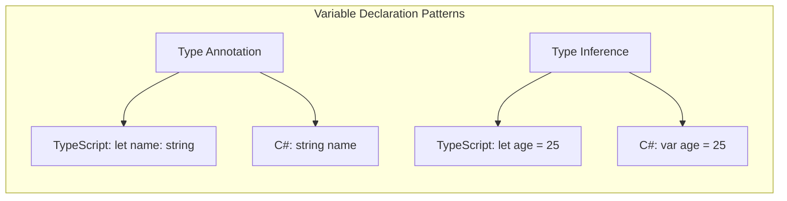

**TypeScript:**

```typescript
// Tipado explícito
let nombre: string = "Juan";
let edad: number = 25;
let activo: boolean = true;
let hobbies: string[] = ["leer", "programar"];

// Tipado implícito (inferencia)
let producto = "Laptop"; // string inferido
let precio = 999.99; // number inferido
let disponible = true; // boolean inferido
```

**C# equivalente:**

```csharp
// Tipado explícito
string nombre = "Juan";
int edad = 25;
bool activo = true;
string[] hobbies = {"leer", "programar"};

// Tipado implícito con 'var'
var producto = "Laptop";          // string inferido
var precio = 999.99;              // double inferido
var disponible = true;            // bool inferido
```

**📊 Diferencias conceptuales:**

- **TypeScript:** `number` para enteros y decimales
- **C#:** `int`, `double`, `decimal` - tipos específicos para mejor rendimiento
- **TypeScript:** `boolean` (minúscula)
- **C#:** `bool` (palabra clave específica)

#### 2️⃣ **Funciones y Métodos**

**TypeScript:**

```typescript
// Función tradicional
function calcular(a: number, b: number): number {
  return a + b;
}

// Arrow function
const multiplicar = (x: number, y: number): number => x * y;

// Función con parámetros opcionales
function saludar(nombre: string, apellido?: string): string {
  return apellido ? `Hola ${nombre} ${apellido}` : `Hola ${nombre}`;
}

// Parámetros por defecto
function configurar(host: string = "localhost", puerto: number = 3000): void {
  console.log(`Conectando a ${host}:${puerto}`);
}
```

**C# equivalente:**

```csharp
// Método estático
public static int Calcular(int a, int b) {
    return a + b;
}

// Expresión lambda (equivalente a arrow function)
Func<int, int, int> multiplicar = (x, y) => x * y;

// Método con parámetros opcionales
public static string Saludar(string nombre, string apellido = null) {
    return apellido != null ? $"Hola {nombre} {apellido}" : $"Hola {nombre}";
}

// Parámetros por defecto
public static void Configurar(string host = "localhost", int puerto = 3000) {
    Console.WriteLine($"Conectando a {host}:{puerto}");
}
```

**🔍 Análisis de diferencias:**

- **C#:** Requiere especificar visibilidad (`public`, `private`)
- **C#:** Métodos deben estar dentro de clases
- **C#:** `Func<>` para funciones como variables
- **TypeScript:** Más flexible en declaración de funciones

#### 3️⃣ **Clases y Programación Orientada a Objetos**

**TypeScript:**

```typescript
// Interfaz
interface IVehiculo {
  marca: string;
  modelo: string;
  acelerar(): void;
}

// Clase base
abstract class Vehiculo implements IVehiculo {
  protected _velocidad: number = 0;

  constructor(public marca: string, public modelo: string) {}

  abstract acelerar(): void;

  get velocidad(): number {
    return this._velocidad;
  }

  protected mostrarInfo(): string {
    return `${this.marca} ${this.modelo}`;
  }
}

// Clase derivada
class Automovil extends Vehiculo {
  private _combustible: number;

  constructor(marca: string, modelo: string, combustible: number = 100) {
    super(marca, modelo);
    this._combustible = combustible;
  }

  acelerar(): void {
    if (this._combustible > 0) {
      this._velocidad += 10;
      this._combustible -= 5;
    }
  }

  // Sobrecarga de método
  frenar(intensidad: number = 5): void {
    this._velocidad = Math.max(0, this._velocidad - intensidad);
  }
}
```

**C# equivalente:**

```csharp
// Interfaz
public interface IVehiculo {
    string Marca { get; }
    string Modelo { get; }
    void Acelerar();
}

// Clase base abstracta
public abstract class Vehiculo : IVehiculo {
    protected int _velocidad = 0;

    // 🔧 PROPIEDADES AUTOMÁTICAS de C#
    // Estas líneas crean automáticamente un campo privado interno
    // y métodos get/set sin que tengamos que escribirlos manualmente
    public string Marca { get; protected set; }
    public string Modelo { get; protected set; }

    /*
    📝 EQUIVALENCIA MANUAL - Lo que C# hace automáticamente:

    private string _marca;     // Campo privado interno (automático)
    public string Marca {      // Propiedad pública
        get { return _marca; }           // Getter público
        protected set { _marca = value; } // Setter protegido
    }

    🎯 SIGNIFICADO DE LOS MODIFICADORES:
    - get: Lectura pública (cualquiera puede leer Marca)
    - protected set: Escritura protegida (solo esta clase y subclases pueden modificar)

    🔍 EN TYPESCRIPT SERÍA:
    protected _marca: string;  // Campo protegido
    get marca(): string { return this._marca; }  // Solo getter público
    // No hay setter público, se modifica internamente
    */

    // Constructor
    protected Vehiculo(string marca, string modelo) {
        Marca = marca;    // Usa el setter protegido
        Modelo = modelo;  // Usa el setter protegido
    }

    // Método abstracto
    public abstract void Acelerar();

    // Propiedad de solo lectura
    public int Velocidad => _velocidad;

    // Método protegido
    protected string MostrarInfo() {
        return $"{Marca} {Modelo}";
    }
}

// Clase derivada
public class Automovil : Vehiculo {
    private int _combustible;

    // Constructor con parámetros por defecto
    public Automovil(string marca, string modelo, int combustible = 100)
        : base(marca, modelo) {
        _combustible = combustible;
    }

    // Implementación del método abstracto
    public override void Acelerar() {
        if (_combustible > 0) {
            _velocidad += 10;
            _combustible -= 5;
        }
    }

    // Sobrecarga de método
    public void Frenar(int intensidad = 5) {
        _velocidad = Math.Max(0, _velocidad - intensidad);
    }
}
```

#### 🔧 **Explicación Profunda: Propiedades Automáticas de C#**

**⭐ Concepto clave:** Las propiedades automáticas son una característica única de C# que simplifica enormemente la escritura de getters y setters.

##### 📊 **Comparación Visual: Manual vs Automática**

```csharp
// ❌ FORMA TRADICIONAL (Manual) - MUY VERBOSA
public class PersonaManual {
    private string _nombre;        // Campo privado
    private int _edad;            // Campo privado

    // Propiedad Nombre con getter y setter completos
    public string Nombre {
        get {
            return _nombre;
        }
        set {
            _nombre = value;
        }
    }

    // Propiedad Edad con validación
    public int Edad {
        get {
            return _edad;
        }
        set {
            if (value >= 0) {
                _edad = value;
            }
        }
    }
}

// ✅ FORMA MODERNA (Automática) - CONCISA Y ELEGANTE
public class PersonaAutomatica {
    // 🎯 Propiedades automáticas - C# genera todo automáticamente
    public string Nombre { get; set; }     // Get/Set públicos
    public int Edad { get; private set; }  // Get público, Set privado
    public string Email { get; init; }     // Get público, Set solo en constructor (C# 9+)

    public PersonaAutomatica(string nombre, int edad, string email) {
        Nombre = nombre;
        Edad = edad;
        Email = email;    // Solo se puede asignar aquí
    }

    // Método para cambiar edad (ya que set es privado)
    public void CumplirAños() {
        Edad++;  // Solo esta clase puede modificar Edad
    }
}
```

##### 🔍 **Desglose de Modificadores de Acceso en Propiedades**

```csharp
public class EjemploCompleto {
    // 1️⃣ PROPIEDAD BÁSICA - Equivale a getter/setter públicos
    public string Nombre { get; set; }

    // 2️⃣ SOLO LECTURA EXTERNA - Solo la clase puede modificar
    public int Edad { get; private set; }

    // 3️⃣ LECTURA PÚBLICA, ESCRITURA PROTEGIDA - Herencia puede modificar
    public string Departamento { get; protected set; }

    // 4️⃣ SOLO LECTURA TOTAL - Solo asignable en constructor
    public DateTime FechaNacimiento { get; init; }

    // 5️⃣ PROPIEDAD CALCULADA - Sin campo interno, se calcula cada vez
    public int EdadCalculada => DateTime.Now.Year - FechaNacimiento.Year;

    // 6️⃣ PROPIEDAD CON LÓGICA PERSONALIZADA
    private decimal _salario;
    public decimal Salario {
        get => _salario;
        set => _salario = value > 0 ? value : 0;
    }
}
```

##### 🆚 **Comparación con TypeScript**

```typescript
// TypeScript - Más explícito, menos "mágico"
class PersonaTS {
  private _nombre: string;
  private _edad: number;

  constructor(nombre: string, edad: number) {
    this._nombre = nombre;
    this._edad = edad;
  }

  // Getter explícito
  get nombre(): string {
    return this._nombre;
  }

  // Setter explícito
  set nombre(value: string) {
    this._nombre = value;
  }

  // Solo getter (propiedad de solo lectura)
  get edad(): number {
    return this._edad;
  }

  // Método para modificar edad
  cumplirAños(): void {
    this._edad++;
  }
}
```

```csharp
// C# - Más conciso, "mágico" pero poderoso
public class PersonaCS {
    public string Nombre { get; set; }        // ¡2 líneas en 1!
    public int Edad { get; private set; }     // Solo lectura externa

    public PersonaCS(string nombre, int edad) {
        Nombre = nombre;
        Edad = edad;
    }

    public void CumplirAños() {
        Edad++;  // Solo esta clase puede modificar
    }
}
```

##### 🎯 **¿Por qué son útiles las propiedades automáticas?**

1. **📝 Menos código repetitivo:** No escribir getters/setters manuales
2. **🔒 Control de acceso granular:** public get + private set
3. **🛠️ Refactoring fácil:** Cambiar de campo a propiedad sin romper código
4. **🔍 IntelliSense mejor:** Las propiedades aparecen diferentes a los métodos
5. **📊 Debugging superior:** Se pueden poner breakpoints en getters/setters

##### ⚠️ **Cuándo NO usar propiedades automáticas**

```csharp
// ❌ NO usar cuando necesitas validación compleja
public string Email { get; set; }  // ¿Qué pasa si no es un email válido?

// ✅ SÍ usar propiedad manual con validación
private string _email;
public string Email {
    get => _email;
    set {
        if (value.Contains("@")) {
            _email = value;
        } else {
            throw new ArgumentException("Email inválido");
        }
    }
}
```

##### 💡 **Tip Pedagógico para Estudiantes de TypeScript**

**Piensen en las propiedades automáticas como:**

- "Getters y setters automáticos con superpoderes"
- C# escribe el código repetitivo por ustedes
- Pero mantienen todo el control sobre quién puede leer/escribir

**Ventaja mental:** En lugar de pensar "tengo que escribir getter y setter", piensen "¿quién debería poder leer y quién debería poder escribir esta propiedad?"

### 🏗️ Conceptos Avanzados: Diferencias Fundamentales

#### 🔒 **Modificadores de Acceso: TypeScript vs C#**

**TypeScript** tiene un sistema más simple:

```typescript
class Ejemplo {
  public nombre: string; // Accesible desde cualquier lugar
  private edad: number; // Solo dentro de la clase
  protected activo: boolean; // Clase y subclases
  readonly id: number; // Solo lectura después de inicialización
}
```

**C#** tiene un sistema más granular:

```csharp
class Ejemplo {
    public string nombre;              // Accesible desde cualquier lugar
    private int edad;                  // Solo dentro de la clase
    protected bool activo;             // Clase y subclases
    internal string departamento;      // Dentro del mismo assembly
    protected internal string region;  // protected O internal
    private protected string zona;     // protected Y internal
    readonly int id;                   // Solo lectura
    const int MAXIMO = 100;           // Constante en tiempo de compilación
}
```

#### 🔄 **Manejo de Tipos Nullable**

**TypeScript:**

```typescript
// Union types para nullable
let nombre: string | null = null;
let edad: number | undefined = undefined;

// Optional chaining
let usuario = { perfil: { nombre: "Juan" } };
let nombreUsuario = usuario?.perfil?.nombre;

// Nullish coalescing
let nombrePorDefecto = nombreUsuario ?? "Anónimo";
```

**C#:**

```csharp
// Nullable reference types (C# 8+)
string? nombre = null;
int? edad = null;

// Null-conditional operators
var usuario = new { perfil = new { nombre = "Juan" } };
var nombreUsuario = usuario?.perfil?.nombre;

// Null-coalescing
var nombrePorDefecto = nombreUsuario ?? "Anónimo";

// Null-coalescing assignment (C# 8+)
nombreUsuario ??= "Valor por defecto";
```

#### 📦 **Generics: Potencia de Tipos Paramétricos**

**Concepto teórico:** Los generics permiten escribir código que funciona con diferentes tipos manteniendo type safety. Es como crear "plantillas" de código.

**TypeScript:**

```typescript
// Interfaz genérica
interface Repositorio<T> {
  obtener(id: number): T | null;
  guardar(entidad: T): void;
  listar(): T[];
}

// Clase genérica con restricciones
class RepositorioEnMemoria<T extends { id: number }> implements Repositorio<T> {
  private datos: T[] = [];

  obtener(id: number): T | null {
    return this.datos.find((item) => item.id === id) || null;
  }

  guardar(entidad: T): void {
    const indice = this.datos.findIndex((item) => item.id === entidad.id);
    if (indice >= 0) {
      this.datos[indice] = entidad;
    } else {
      this.datos.push(entidad);
    }
  }

  listar(): T[] {
    return [...this.datos];
  }
}

// Uso
interface Producto {
  id: number;
  nombre: string;
  precio: number;
}
const repoProductos = new RepositorioEnMemoria<Producto>();
```

**C# equivalente:**

```csharp
// Interfaz genérica
public interface IRepositorio<T> {
    T? Obtener(int id);
    void Guardar(T entidad);
    List<T> Listar();
}

// Clase genérica con restricciones
public class RepositorioEnMemoria<T> : IRepositorio<T> where T : class, IIdentificable {
    private readonly List<T> _datos = new List<T>();

    public T? Obtener(int id) {
        return _datos.FirstOrDefault(item => item.Id == id);
    }

    public void Guardar(T entidad) {
        var indice = _datos.FindIndex(item => item.Id == entidad.Id);
        if (indice >= 0) {
            _datos[indice] = entidad;
        } else {
            _datos.Add(entidad);
        }
    }

    public List<T> Listar() {
        return new List<T>(_datos);
    }
}

// Interfaz para restricción
public interface IIdentificable {
    int Id { get; }
}

// Uso
public class Producto : IIdentificable {
    public int Id { get; set; }
    public string Nombre { get; set; }
    public decimal Precio { get; set; }
}

var repoProductos = new RepositorioEnMemoria<Producto>();
```

### 🛠️ Ecosistemas y Herramientas de Desarrollo

#### 📚 **Gestión de Dependencias**

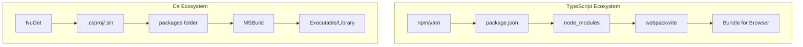

**TypeScript:**

- **npm/yarn:** Gestores de paquetes
- **package.json:** Configuración de dependencias
- **Bundlers:** webpack, vite, rollup
- **Target:** Navegadores web principalmente

**C#:**

- **NuGet:** Gestor de paquetes oficial de .NET
- **.csproj:** Archivo de proyecto XML
- **MSBuild:** Sistema de construcción integrado
- **Target:** Aplicaciones nativas, servicios, APIs

#### 🔧 **IDEs y Herramientas de Desarrollo**

**Características compartidas:**

- IntelliSense avanzado
- Debugging integrado
- Refactoring automático
- Control de versiones Git
- Extensiones/plugins

**Diferencias específicas:**

- **TypeScript:** VS Code, WebStorm (enfoque web)
- **C#:** Visual Studio, Rider (enfoque desktop/enterprise)

### 🎯 Actividad Práctica: "Traducción de Código"

**Ejercicio:** Convertir una clase TypeScript a C#

**TypeScript original:**

```typescript
interface ICalculadora {
  sumar(a: number, b: number): number;
  restar(a: number, b: number): number;
}

class CalculadoraCientifica implements ICalculadora {
  private historial: string[] = [];

  sumar(a: number, b: number): number {
    const resultado = a + b;
    this.historial.push(`${a} + ${b} = ${resultado}`);
    return resultado;
  }

  restar(a: number, b: number): number {
    const resultado = a - b;
    this.historial.push(`${a} - ${b} = ${resultado}`);
    return resultado;
  }

  potencia(base: number, exponente: number): number {
    return Math.pow(base, exponente);
  }

  obtenerHistorial(): readonly string[] {
    return this.historial;
  }
}
```

**🎯 Desafío para estudiantes:** Convertir a C# considerando:

1. Modificadores de acceso apropiados
2. Convenciones de nomenclatura C# (PascalCase)
3. Tipos de datos específicos de C#
4. Propiedades en lugar de métodos getter/setter

### 💭 Reflexión Teórica: ¿Cuándo Usar Cada Uno?

#### 🌐 **TypeScript es ideal para:**

- Aplicaciones web (frontend/backend con Node.js)
- Desarrollo rápido y despliegue en la nube
- Equipos con experiencia en JavaScript
- Proyectos que requieren flexibilidad y agilidad
- Aplicaciones que consumen APIs REST

#### 🖥️ **C# es ideal para:**

- Aplicaciones de escritorio empresariales
- APIs backend robustas y escalables
- Integración profunda con ecosistema Microsoft
- Aplicaciones que requieren alto rendimiento
- Sistemas que manejan grandes volúmenes de datos

#### 🤝 **Complementariedad en Arquitecturas Modernas**

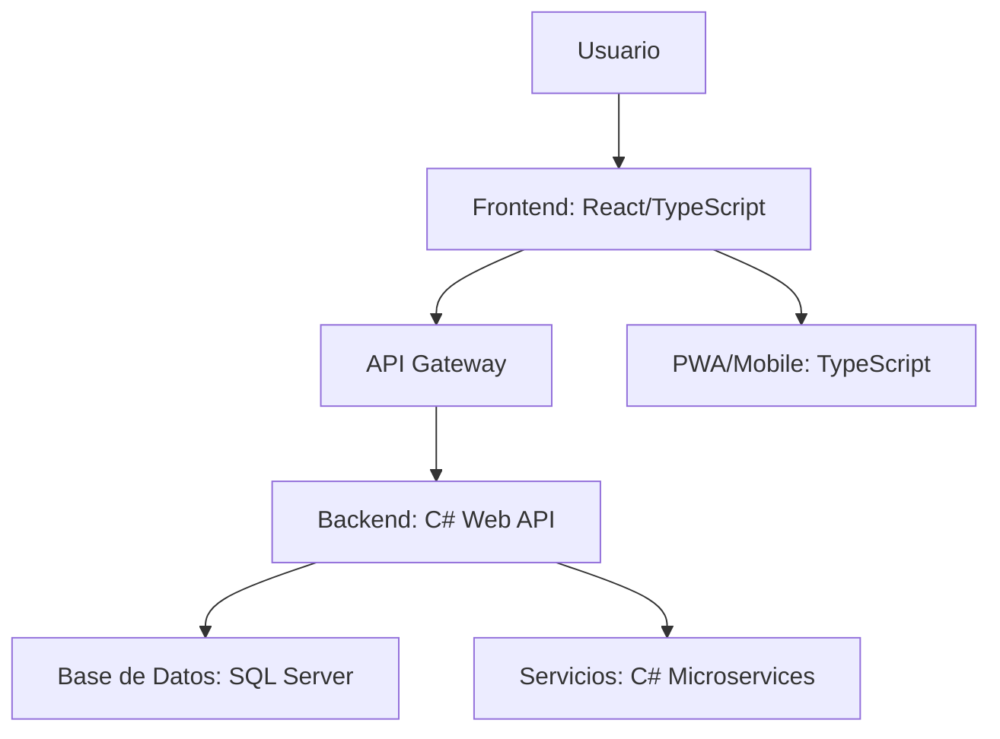

**Arquitectura híbrida moderna:**

- **Frontend:** TypeScript + React/Vue
- **Backend:** C# + ASP.NET Core
- **Mobile:** TypeScript + React Native o C# + Xamarin
- **Desktop:** C# + WPF/Windows Forms

Esta combinación aprovecha las fortalezas de cada tecnología en su dominio optimal.

---

## 🏗️ BLOQUE 3: Programación por Capas y Patrón MVC en .NET

### 🎯 Objetivos del Bloque

- Comprender los fundamentos teóricos de la arquitectura por capas
- Analizar las ventajas de la separación de responsabilidades
- Entender el patrón MVC (Model-View-Controller) en el contexto .NET
- Comparar arquitecturas monolíticas vs por capas
- Establecer la base conceptual para aplicaciones empresariales

### 🤔 ¿Por qué Programación por Capas?

**Pregunta motivadora:** _"¿Alguna vez han visto código donde todo está mezclado: lógica de negocio, interfaz de usuario y acceso a datos en el mismo lugar?"_

#### 📚 **El Problema del Código Monolítico**

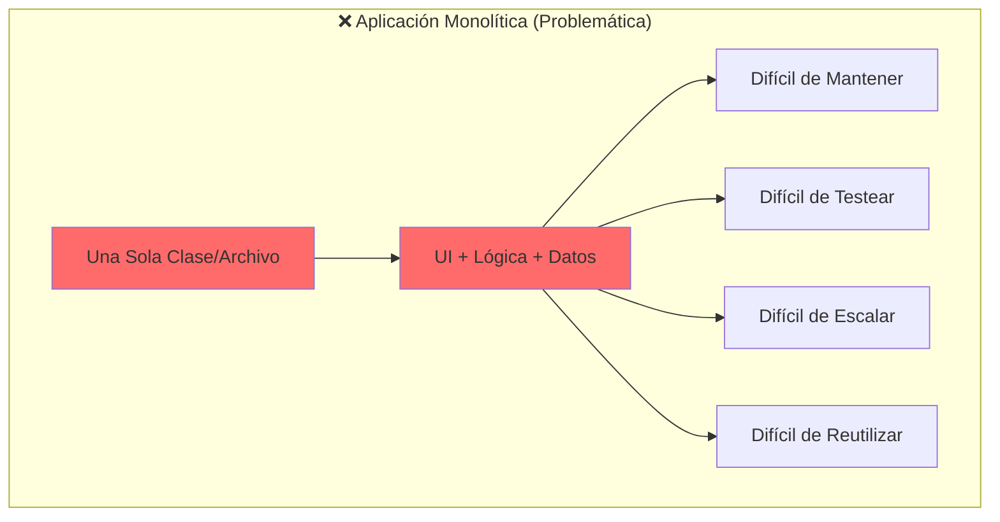

**Ejemplo de código problemático:**

```csharp
// ❌ TODO EN UNA CLASE - ANTIPATRÓN
public class ProductoManager {
    // UI, lógica y datos mezclados
    public void MostrarProductos() {
        // 1. Acceso directo a base de datos (capa de datos)
        var connectionString = "Server=...";
        var connection = new SqlConnection(connectionString);
        var command = new SqlCommand("SELECT * FROM Productos", connection);

        // 2. Lógica de negocio mezclada
        connection.Open();
        var reader = command.ExecuteReader();

        // 3. Presentación mezclada
        Console.WriteLine("=== LISTA DE PRODUCTOS ===");
        while (reader.Read()) {
            // 4. Validación de negocio aquí también
            var precio = (decimal)reader["Precio"];
            if (precio > 1000) {
                Console.WriteLine($"⭐ PREMIUM: {reader["Nombre"]} - ${precio:F2}");
            } else {
                Console.WriteLine($"📦 {reader["Nombre"]} - ${precio:F2}");
            }
        }
        connection.Close();
    }
}
```

**¿Qué problemas ves en este código?**

- ✅ Mezcla presentación, lógica y datos
- ✅ Difícil de testear (dependencias hard-coded)
- ✅ Imposible reutilizar la lógica
- ✅ Cambiar la UI requiere modificar todo

### 🏗️ La Solución: Arquitectura por Capas

#### 📐 **Principios Fundamentales**

**1. Separación de Responsabilidades (Separation of Concerns)**
Cada capa tiene una responsabilidad específica y bien definida.

**2. Dependencias Unidireccionales**
Las capas superiores pueden usar las inferiores, pero no al revés.

**3. Abstracción**
Cada capa expone solo lo necesario a la capa superior.

#### 🎂 **Arquitectura de 3 Capas Clásica**

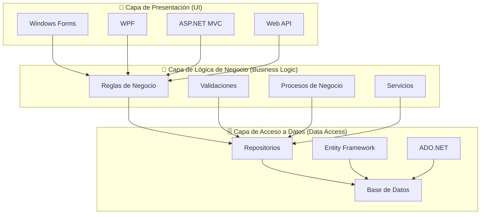

#### 🔍 **Análisis Detallado de Cada Capa**

##### 🎨 **Capa de Presentación (Presentation Layer)**

**Responsabilidades:**

- **Interfaz de Usuario:** Formularios, vistas, controles
- **Validación de Entrada:** Formato, longitud, tipos de datos
- **Navegación:** Flujo entre pantallas
- **Formateo de Salida:** Cómo se muestran los datos al usuario

**Tecnologías en .NET:**

```csharp
// Windows Forms
public partial class ProductoForm : Form {
    private ProductoService _productoService;

    public ProductoForm(ProductoService productoService) {
        InitializeComponent();
        _productoService = productoService;
    }

    private void btnGuardar_Click(object sender, EventArgs e) {
        // Solo maneja la UI - delega la lógica
        try {
            var producto = new Producto {
                Nombre = txtNombre.Text,
                Precio = decimal.Parse(txtPrecio.Text)
            };

            _productoService.CrearProducto(producto);
            MessageBox.Show("Producto guardado exitosamente");
        } catch (Exception ex) {
            MessageBox.Show($"Error: {ex.Message}");
        }
    }
}
```

##### 🧠 **Capa de Lógica de Negocio (Business Logic Layer)**

**Responsabilidades:**

- **Reglas de Negocio:** Políticas empresariales específicas
- **Validaciones Complejas:** Lógica que va más allá del formato
- **Procesos de Negocio:** Workflows, cálculos, transformaciones
- **Coordinación:** Orquesta operaciones entre diferentes entidades

```csharp
// Servicio de lógica de negocio
public class ProductoService {
    private readonly IProductoRepository _repository;
    private readonly IEmailService _emailService;

    public ProductoService(IProductoRepository repository, IEmailService emailService) {
        _repository = repository;
        _emailService = emailService;
    }

    public void CrearProducto(Producto producto) {
        // 1. Validaciones de negocio
        ValidarReglasDeNegocio(producto);

        // 2. Lógica de negocio específica
        if (producto.Precio > 10000) {
            producto.RequiereAprobacion = true;
        }

        // 3. Coordina con otras capas
        _repository.Guardar(producto);

        // 4. Procesos adicionales
        if (producto.RequiereAprobacion) {
            _emailService.NotificarAprobacionPendiente(producto);
        }
    }

    private void ValidarReglasDeNegocio(Producto producto) {
        if (string.IsNullOrWhiteSpace(producto.Nombre)) {
            throw new ArgumentException("El nombre es obligatorio");
        }

        if (producto.Precio <= 0) {
            throw new ArgumentException("El precio debe ser mayor a cero");
        }

        // Validación específica del dominio
        if (_repository.ExisteProductoConNombre(producto.Nombre)) {
            throw new InvalidOperationException("Ya existe un producto con ese nombre");
        }
    }
}
```

##### 🗄️ **Capa de Acceso a Datos (Data Access Layer)**

**Responsabilidades:**

- **Persistencia:** Guardar y recuperar datos
- **Mapeo:** Convertir entre objetos de dominio y estructuras de BD
- **Consultas:** Implementar búsquedas y filtros
- **Transacciones:** Manejar consistencia de datos

```csharp
// Interfaz del repositorio (abstracción)
public interface IProductoRepository {
    void Guardar(Producto producto);
    Producto ObtenerPorId(int id);
    List<Producto> ObtenerTodos();
    bool ExisteProductoConNombre(string nombre);
    void Eliminar(int id);
}

// Implementación con Entity Framework
public class ProductoRepository : IProductoRepository {
    private readonly ApplicationDbContext _context;

    public ProductoRepository(ApplicationDbContext context) {
        _context = context;
    }

    public void Guardar(Producto producto) {
        if (producto.Id == 0) {
            _context.Productos.Add(producto);
        } else {
            _context.Productos.Update(producto);
        }
        _context.SaveChanges();
    }

    public Producto ObtenerPorId(int id) {
        return _context.Productos
            .FirstOrDefault(p => p.Id == id);
    }

    public bool ExisteProductoConNombre(string nombre) {
        return _context.Productos
            .Any(p => p.Nombre.ToLower() == nombre.ToLower());
    }

    // ... más métodos
}
```

### 🎯 Patrón MVC (Model-View-Controller)

#### 📚 **Fundamentos Teóricos del MVC**

**MVC es una especialización de la arquitectura por capas** específicamente diseñada para aplicaciones web y de escritorio que requieren interfaces de usuario dinámicas.

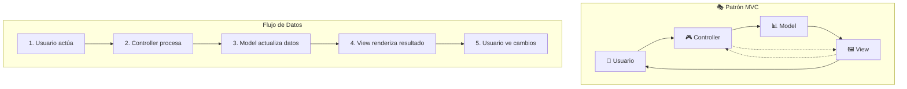

#### 🎮 **Controller (Controlador)**

**Responsabilidades:**

- **Manejo de Entrada:** Procesa acciones del usuario
- **Coordinación:** Decide qué modelo usar y qué vista mostrar
- **Flujo de Control:** Maneja la navegación y el estado de la aplicación

```csharp
// Controlador en ASP.NET Core MVC
[ApiController]
[Route("api/[controller]")]
public class ProductosController : ControllerBase {
    private readonly ProductoService _productoService;

    public ProductosController(ProductoService productoService) {
        _productoService = productoService;
    }

    [HttpGet]
    public ActionResult<List<ProductoDto>> ObtenerProductos() {
        try {
            var productos = _productoService.ObtenerTodosLosProductos();
            var productosDto = productos.Select(p => new ProductoDto {
                Id = p.Id,
                Nombre = p.Nombre,
                Precio = p.Precio,
                Disponible = p.Stock > 0
            }).ToList();

            return Ok(productosDto);
        } catch (Exception ex) {
            return BadRequest(new { error = ex.Message });
        }
    }

    [HttpPost]
    public ActionResult<ProductoDto> CrearProducto([FromBody] CrearProductoRequest request) {
        try {
            var producto = new Producto {
                Nombre = request.Nombre,
                Precio = request.Precio,
                Stock = request.Stock
            };

            _productoService.CrearProducto(producto);

            return CreatedAtAction(nameof(ObtenerProductos),
                new { id = producto.Id },
                MapearADto(producto));
        } catch (ArgumentException ex) {
            return BadRequest(new { error = ex.Message });
        }
    }
}
```

#### 📊 **Model (Modelo)**

**Responsabilidades:**

- **Datos:** Representa la información de la aplicación
- **Estado:** Mantiene el estado actual de la aplicación
- **Lógica de Dominio:** Encapsula reglas de negocio específicas
- **Notificaciones:** Informa cambios a las vistas

```csharp
// Modelo de dominio
public class Producto {
    public int Id { get; set; }
    public string Nombre { get; set; }
    public decimal Precio { get; set; }
    public int Stock { get; set; }
    public DateTime FechaCreacion { get; set; }
    public bool RequiereAprobacion { get; set; }

    // Lógica de dominio en el modelo
    public bool EstaDisponible => Stock > 0;

    public void ReducirStock(int cantidad) {
        if (cantidad > Stock) {
            throw new InvalidOperationException("Stock insuficiente");
        }
        Stock -= cantidad;
    }

    public void AplicarDescuento(decimal porcentaje) {
        if (porcentaje < 0 || porcentaje > 100) {
            throw new ArgumentException("Porcentaje inválido");
        }
        Precio = Precio * (1 - porcentaje / 100);
    }
}

// DTO para transferencia de datos
public class ProductoDto {
    public int Id { get; set; }
    public string Nombre { get; set; }
    public decimal Precio { get; set; }
    public bool Disponible { get; set; }
}
```

#### 🖼️ **View (Vista)**

**Responsabilidades:**

- **Presentación:** Cómo se muestran los datos
- **Interacción:** Elementos con los que el usuario interactúa
- **Formateo:** Transformación de datos para mostrar
- **Responsividad:** Adaptación a diferentes dispositivos

```csharp
// Vista en Windows Forms
public partial class ProductosView : UserControl {
    private ProductosController _controller;

    public ProductosView(ProductosController controller) {
        InitializeComponent();
        _controller = controller;
        CargarProductos();
    }

    private void CargarProductos() {
        try {
            var response = _controller.ObtenerProductos();
            if (response.Result is OkObjectResult okResult) {
                var productos = (List<ProductoDto>)okResult.Value;

                // Limpiar grid
                dataGridViewProductos.Rows.Clear();

                // Llenar grid con formato
                foreach (var producto in productos) {
                    var row = new object[] {
                        producto.Id,
                        producto.Nombre,
                        $"${producto.Precio:F2}",
                        producto.Disponible ? "✅ Disponible" : "❌ Agotado"
                    };
                    dataGridViewProductos.Rows.Add(row);
                }
            }
        } catch (Exception ex) {
            MessageBox.Show($"Error al cargar productos: {ex.Message}");
        }
    }

    private void btnAgregar_Click(object sender, EventArgs e) {
        // La vista solo recolecta datos y delega al controlador
        var request = new CrearProductoRequest {
            Nombre = txtNombre.Text,
            Precio = decimal.Parse(txtPrecio.Text),
            Stock = int.Parse(txtStock.Text)
        };

        var response = _controller.CrearProducto(request);
        if (response.Result is CreatedAtActionResult) {
            MessageBox.Show("Producto creado exitosamente");
            CargarProductos(); // Refrescar vista
        }
    }
}
```

### 🎯 **Ventajas de la Programación por Capas**

#### 📈 **Comparación: Antes vs Después**

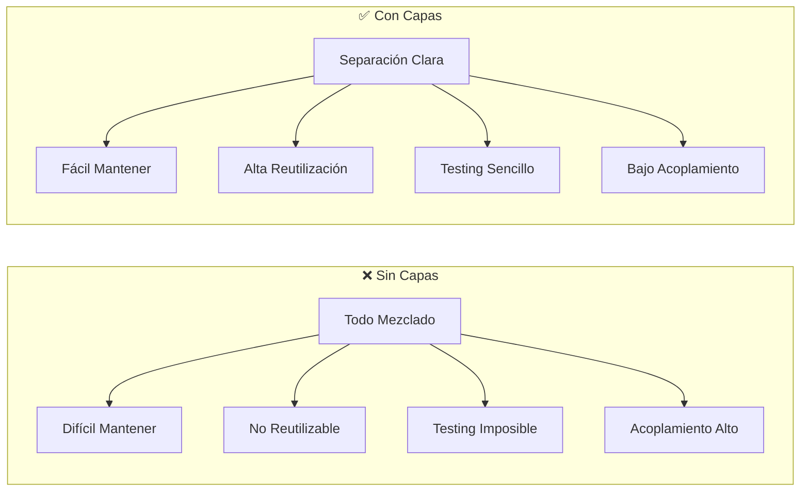

#### 🎯 **Ventajas Específicas**

**1. 🛠️ Mantenibilidad**

- Cambios aislados en cada capa
- Bugs más fáciles de localizar
- Refactoring seguro

**2. 🔄 Reutilización**

- Lógica de negocio independiente de la UI
- Servicios utilizables desde múltiples interfaces
- Componentes modulares

**3. ✅ Testabilidad**

- Cada capa se puede testear independientemente
- Mocking sencillo de dependencias
- Tests unitarios enfocados

**4. 👥 Trabajo en Equipo**

- Equipos pueden trabajar en paralelo
- Especialización por capas
- Interfaces claras entre equipos

**5. 📈 Escalabilidad**

- Capas pueden desplegarse independientemente
- Escalado horizontal por responsabilidad
- Microservicios como evolución natural

#### 🧪 **Ejemplo de Testing por Capas**

```csharp
// Test de la capa de negocio (aislada)
[Test]
public void CrearProducto_ConPrecioAlto_DebeRequerirAprobacion() {
    // Arrange
    var mockRepository = new Mock<IProductoRepository>();
    var mockEmailService = new Mock<IEmailService>();
    var service = new ProductoService(mockRepository.Object, mockEmailService.Object);

    var producto = new Producto {
        Nombre = "Producto Premium",
        Precio = 15000
    };

    // Act
    service.CrearProducto(producto);

    // Assert
    Assert.IsTrue(producto.RequiereAprobacion);
    mockEmailService.Verify(e => e.NotificarAprobacionPendiente(producto), Times.Once);
}
```

### 🏗️ **Arquitecturas Modernas: Evolución del Patrón**

#### 🌐 **De MVC a Arquitecturas Distribuidas**

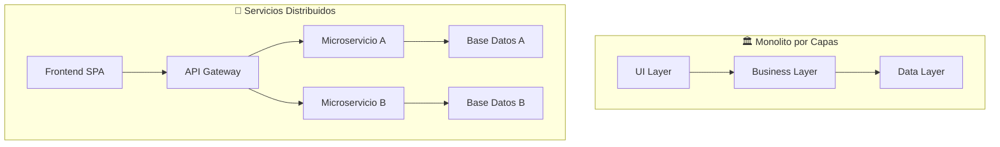

#### 🎯 **Actividad de Reflexión: Casos de Uso**

**Escenarios para análisis grupal:**

1. **Sistema de inventario de farmacia**

   - ¿Qué capas necesitarían?
   - ¿Qué reglas de negocio específicas?
   - ¿Cómo manejar prescripciones médicas?

2. **E-commerce de ropa**

   - ¿Cómo separar catálogo, carrito y pagos?
   - ¿Qué validaciones por capa?
   - ¿Cómo integrar con APIs externas?

3. **Sistema académico universitario**
   - ¿Cómo manejar estudiantes, cursos y notas?
   - ¿Qué reglas de negocio académicas?
   - ¿Cómo generar reportes?

### 💡 **Principios de Diseño Aplicados**

#### 🔧 **SOLID en Arquitectura por Capas**

**S - Single Responsibility:** Cada capa tiene una responsabilidad única  
**O - Open/Closed:** Nuevas funcionalidades se agregan sin modificar existentes  
**L - Liskov Substitution:** Interfaces permiten cambiar implementaciones  
**I - Interface Segregation:** Contratos específicos entre capas  
**D - Dependency Inversion:** Capas superiores no dependen de implementaciones

#### 🏗️ **Preparación para Tecnologías Futuras**

Esta base conceptual les permitirá entender:

- **ASP.NET Core MVC** (próximas clases)
- **Web APIs RESTful**
- **Microservicios**
- **Clean Architecture**
- **Domain-Driven Design (DDD)**

**💭 Reflexión final:** La programación por capas no es solo una técnica, es una **mentalidad** de organizar código que escala desde aplicaciones simples hasta sistemas empresariales complejos.

---

## 🔧 BLOQUE 4: Estructuras de Control en C# y Depuración con Visual Studio

### 🎯 Objetivos del Bloque

- Relacionar estructuras básicas de control con propiedades de POO
- Dominar las estructuras de control específicas de C#
- Comprender el manejo de excepciones en .NET
- Aprender técnicas de depuración en Visual Studio
- Identificar y solucionar errores de compilación y runtime

### 🔄 ¿Por qué las Estructuras de Control son Fundamentales?

**Pregunta motivadora:** _"¿Cómo las estructuras de control en C# se integran con los principios de POO que ya conocen?"_

#### 📚 **Fundamento Teórico: Control + POO**

Las estructuras de control no son solo herramientas para dirigir el flujo del programa, sino que en C# están **íntimamente relacionadas** con los principios de programación orientada a objetos:

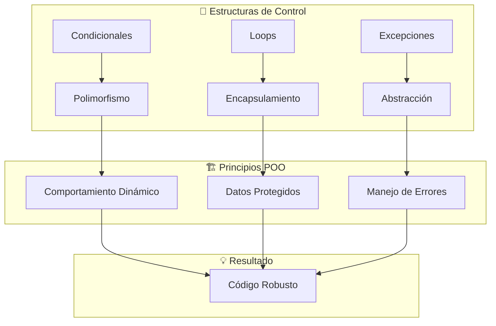

### 🎯 Estructuras Condicionales: Más Allá del if/else

#### 🔍 **Comparación TypeScript vs C#: Condicionales**

**TypeScript:**

```typescript
// ✨ CONDICIONAL BÁSICA EN TYPESCRIPT
// Nota: TypeScript usa una aproximación más tradicional y verbosa
function procesarUsuario(usuario: Usuario): string {
  // ➡️ Evaluación secuencial: if-else if-else
  // Cada condición se evalúa una por una hasta encontrar una que sea verdadera
  if (usuario.activo) {
    return `Usuario ${usuario.nombre} está activo`;
  } else if (usuario.suspendido) {
    return `Usuario ${usuario.nombre} está suspendido`;
  } else {
    // 🎯 Caso por defecto: si no es activo ni suspendido
    return `Usuario ${usuario.nombre} está inactivo`;
  }
}

// 🔄 SWITCH EXPRESSION MODERNO EN TYPESCRIPT
// Nota: Similar al switch tradicional pero más funcional
function obtenerTipoUsuario(rol: string): string {
  // ⚠️ Limitación: Solo puede evaluar valores exactos, no patrones complejos
  switch (rol) {
    case "admin":
      return "Administrador";
    case "user":
      return "Usuario";
    case "guest":
      return "Invitado";
    default:
      // 🛡️ Caso por defecto obligatorio para manejar valores inesperados
      return "Desconocido";
  }
}
```

**C# equivalente con mejoras:**

```csharp
// 🚀 PATTERN MATCHING EN C# - MUCHO MÁS PODEROSO
// Concepto clave: Evalúa PATRONES, no solo valores exactos
public string ProcesarUsuario(Usuario usuario) {
    // 🎯 Switch expression: más conciso y expresivo que if-else
    return usuario switch {
        // ✨ Pattern matching con propiedades: { Propiedad: valor }
        // Esto dice: "si el objeto usuario tiene la propiedad Activo = true"
        { Activo: true } => $"Usuario {usuario.Nombre} está activo",

        // 🔍 Otro patrón de propiedades
        { Suspendido: true } => $"Usuario {usuario.Nombre} está suspendido",

        // 🎯 Discard pattern (_): equivale al "else" - cualquier otro caso
        _ => $"Usuario {usuario.Nombre} está inactivo"
    };
    // 💡 Ventaja: El compilador garantiza que todos los casos están cubiertos
}

// 🎯 SWITCH CON ENUMS - MEJOR PRÁCTICA EN C#
// Concepto: Los enums son más seguros que strings
public string ObtenerTipoUsuario(RolUsuario rol) {
    return rol switch {
        // 🔒 Type safety: El compilador conoce todos los valores posibles
        RolUsuario.Admin => "Administrador",
        RolUsuario.Usuario => "Usuario",
        RolUsuario.Invitado => "Invitado",
        // ⚠️ Si agregamos un nuevo valor al enum, el compilador nos obliga a manejarlo
        _ => "Desconocido"
    };
}

// 📋 ENUM: Define un conjunto fijo de valores posibles
// Ventaja: IntelliSense, verificación en tiempo de compilación
public enum RolUsuario {
    Admin,      // Internamente = 0
    Usuario,    // Internamente = 1
    Invitado    // Internamente = 2
}
```

#### 🚀 **Pattern Matching Avanzado en C#**

**Concepto único de C#:** Pattern matching permite decisiones complejas basadas en tipo y propiedades.

```csharp
// 🎯 PATTERN MATCHING CON TIPOS Y PROPIEDADES COMBINADAS
// Concepto: Un solo switch puede evaluar tipo + múltiples propiedades
public decimal CalcularDescuento(object item) {
    return item switch {
        // 🚀 Patrón complejo: Tipo + múltiples propiedades + condición numérica
        // Lee como: "Si es un Producto Y categoría Premium Y precio mayor a 1000"
        Producto { Categoria: "Premium", Precio: > 1000 } => 0.15m,

        // 🔍 Mismo tipo, diferentes condiciones
        Producto { Categoria: "Regular", Precio: > 500 } => 0.10m,

        // 🎯 Captura de variable: guarda el objeto en 'producto' para usar después
        Producto producto => 0.05m, // Cualquier otro producto

        // 🏢 Diferentes tipos en el mismo switch
        Servicio { TipoServicio: TipoServicio.Consultoria } => 0.20m,

        // ⚠️ Manejo de null explícito (muy importante en C#)
        null => 0m,

        // 🛡️ Caso por defecto con excepción informativa
        _ => throw new ArgumentException("Tipo no soportado")
    };
    // 💡 El compilador verifica que todos los casos estén cubiertos
}

// 🌡️ PATTERN MATCHING CON RANGOS NUMÉRICOS
// Concepto: Evalúa rangos de valores con operadores relacionales
public string ClasificarTemperatura(double temperatura) {
    return temperatura switch {
        // 📊 Comparaciones relacionales directas (C# 9+)
        < 0 => "Congelante",                    // Menor que cero
        >= 0 and < 15 => "Frío",              // Entre 0 y 15 (combinando condiciones)
        >= 15 and < 25 => "Templado",         // Entre 15 y 25
        >= 25 and < 35 => "Cálido",           // Entre 25 y 35
        >= 35 => "Caliente",                   // Mayor o igual a 35

        // 🚨 Caso especial: manejo de valores especiales de double
        double.NaN => "Sensor dañado"          // Not a Number
    };
    // 🎯 Ventaja: Mucho más legible que múltiples if-else anidados
}

// 🧮 DECONSTRUCCIÓN EN PATTERN MATCHING
// Concepto: Descompone objetos complejos en sus partes
public string AnalizarPunto(Point punto) {
    return punto switch {
        // 📍 Deconstrucción de tupla/record: (X, Y)
        (0, 0) => "Origen",                                    // Punto exacto (0,0)

        // 🎯 Captura de variables con 'var': extrae valores para usar
        (var x, 0) => $"En el eje X: {x}",                   // Y=0, cualquier X
        (0, var y) => $"En el eje Y: {y}",                   // X=0, cualquier Y

        // ⚡ Guard clause con 'when': condición adicional
        (var x, var y) when x == y => $"Diagonal: ({x}, {y})", // X==Y (diagonal)

        // 🎲 Caso general: captura ambas coordenadas
        (var x, var y) => $"Punto: ({x}, {y})"              // Cualquier otro punto
    };
    // 💡 La deconstrucción funciona automáticamente con records y tuplas
}

// 📐 RECORD: Tipo inmutable perfecto para deconstrucción
// Los records generan automáticamente métodos Deconstruct
public record Point(int X, int Y);
```

#### 🎯 **Condicionales y Polimorfismo**

**Concepto avanzado:** Las condicionales en C# pueden trabajar seamlessly con herencia y polimorfismo.

```csharp
// 🏗️ JERARQUÍA DE CLASES PARA DEMOSTRAR POLIMORFISMO
// Concepto: Clase base abstracta define el contrato común
public abstract class Forma {
    // 🎯 Método abstracto: cada subclase DEBE implementarlo
    public abstract double CalcularArea();
    public abstract string Describir();
}

// 🔵 IMPLEMENTACIÓN ESPECÍFICA: Círculo
public class Circulo : Forma {
    public double Radio { get; set; }

    // ⚡ Override: implementación específica del método abstracto
    public override double CalcularArea() => Math.PI * Radio * Radio;
    public override string Describir() => $"Círculo con radio {Radio}";
}

// 🔲 IMPLEMENTACIÓN ESPECÍFICA: Rectángulo
public class Rectangulo : Forma {
    public double Ancho { get; set; }
    public double Alto { get; set; }

    // ⚡ Override: otra implementación del mismo método abstracto
    public override double CalcularArea() => Ancho * Alto;
    public override string Describir() => $"Rectángulo {Ancho}x{Alto}";
}

// 🧮 PROCESAMIENTO POLIMÓRFICO CON PATTERN MATCHING
// Concepto clave: Combina el poder del polimorfismo con pattern matching
public class CalculadoraFormas {
    public string AnalizarForma(Forma forma) {
        // 🎯 POLIMORFISMO EN ACCIÓN
        // Estas llamadas usan el método correcto según el tipo real del objeto
        var area = forma.CalcularArea();        // Llama al método específico (Circulo o Rectangulo)
        var descripcion = forma.Describir();    // Mismo principio

        // 📊 PATTERN MATCHING CON RANGOS NUMÉRICOS
        // Clasifica por tamaño usando el área calculada polimórficamente
        var categoria = area switch {
            < 10 => "Pequeña",                  // Área menor a 10
            >= 10 and < 100 => "Mediana",      // Área entre 10 y 100
            >= 100 => "Grande"                 // Área mayor o igual a 100
        };

        // 🚀 PATTERN MATCHING AVANZADO CON TIPOS ESPECÍFICOS
        // Aquí combinamos polimorfismo con pattern matching
        var detalles = forma switch {
            // 🔵 Pattern con tipo específico + condición de propiedad
            Circulo { Radio: > 10 } => "Círculo grande",

            // 🎯 Pattern con captura de variable para uso posterior
            Circulo circulo => $"Círculo pequeño (r={circulo.Radio})",

            // 🔲 Deconstrucción de propiedades + guard clause
            Rectangulo { Ancho: var w, Alto: var h } when w == h => "Es un cuadrado",

            // 🔲 Cualquier otro rectángulo
            Rectangulo => "Rectángulo irregular",

            // 🛡️ Caso por defecto (nunca debería ocurrir con esta jerarquía)
            _ => "Forma desconocida"
        };

        // 📋 RESULTADO FINAL: Combina información polimórfica y pattern matching
        return $"{descripcion} - {categoria} - {detalles}";
    }
}
// 💡 VENTAJA CLAVE: Este código funciona con CUALQUIER nueva forma que agregues
//    Solo necesitas que herede de Forma e implemente los métodos abstractos
```

### 🔄 Estructuras de Repetición: Loops Potenciados

#### 📊 **Comparación de Loops: TypeScript vs C#**

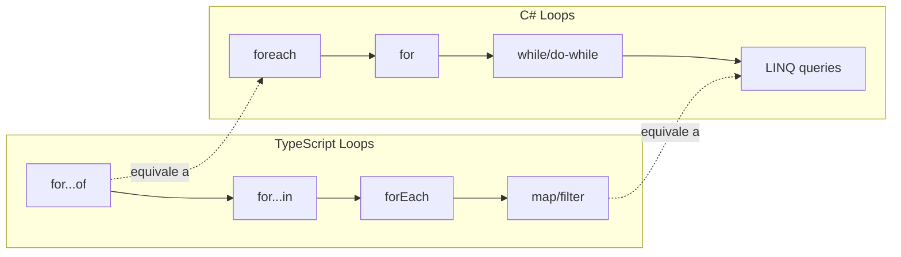

#### 🔍 **Loops Tradicionales vs LINQ**

**TypeScript (funcional):**

```typescript
// 📊 DATOS DE EJEMPLO PARA COMPARACIÓN
const productos = [
  { nombre: "Laptop", precio: 1200, categoria: "Tech" },
  { nombre: "Mouse", precio: 25, categoria: "Tech" },
  { nombre: "Silla", precio: 150, categoria: "Muebles" },
];

// 🚀 ESTILO FUNCIONAL MODERNO - INMUTABLE
// Concepto: Transformaciones en cadena sin modificar el array original
const productosCaros = productos
  .filter((p) => p.precio > 100) // 🔍 Filtrar: mantiene solo elementos que cumplen condición
  .map((p) => ({
    // 🔄 Transformar: crea nuevos objetos
    ...p, // 📋 Spread operator: copia todas las propiedades
    descripcion: `${p.nombre} - $${p.precio}`, // ➕ Agrega nueva propiedad
  }));
// 💡 El array original 'productos' NO se modifica (inmutabilidad)

// 🔄 ITERACIÓN CLÁSICA PARA EFECTOS SECUNDARIOS
// Concepto: Cuando solo quieres hacer algo con cada elemento (no transformar)
for (const producto of productos) {
  // 📤 Efecto secundario: imprimir (no crea nuevo array)
  console.log(`${producto.nombre}: $${producto.precio}`);
}
// 🎯 Usar for...of cuando solo necesitas iterar, no transformar
```

**C# (imperativo + funcional):**

```csharp
// 📊 DATOS DE EJEMPLO - USANDO RECORDS PARA INMUTABILIDAD
var productos = new List<Producto> {
    new("Laptop", 1200, "Tech"),      // 🎯 Record constructor syntax
    new("Mouse", 25, "Tech"),
    new("Silla", 150, "Muebles")
};

// 🚀 LINQ (ESTILO FUNCIONAL) - MÁS EXPRESIVO QUE TYPESCRIPT
// Concepto: LINQ es más potente y expresivo que métodos de array de JS
var productosCaros = productos
    .Where(p => p.Precio > 100)      // 🔍 Equivale a filter()
    .Select(p => new ProductoDto {   // 🔄 Equivale a map(), pero más fuerte tipado
        Nombre = p.Nombre,
        Precio = p.Precio,
        // 🎯 Formateo de moneda con F2 (2 decimales)
        Descripcion = $"{p.Nombre} - ${p.Precio:F2}"
    })
    .ToList();                       // 📦 Materializa como List<T> (evaluación lazy)

// 🔄 FOREACH CLÁSICO (IMPERATIVO) - MÁS LEGIBLE PARA ACCIONES SIMPLES
// Concepto: Mejor para efectos secundarios y lógica simple
foreach (var producto in productos) {
    // 📤 WriteLine: equivale a console.log pero más robusto
    Console.WriteLine($"{producto.Nombre}: ${producto.Precio:F2}");
}

// 🔢 FOR TRADICIONAL CON ÍNDICE - CUANDO NECESITAS LA POSICIÓN
// Concepto: Útil cuando el índice es importante
for (int i = 0; i < productos.Count; i++) {
    var producto = productos[i];     // 📍 Acceso por índice
    Console.WriteLine($"{i+1}. {producto.Nombre}");  // 🏷️ Numeración desde 1
}

// 🏗️ DEFINICIÓN DE TIPOS - MÁS ROBUSTO QUE TYPESCRIPT
public record Producto(string Nombre, decimal Precio, string Categoria);
// 📋 Record: inmutable por defecto, ideal para datos

public class ProductoDto {
    // 🎯 DTO (Data Transfer Object): para transformaciones
    public string Nombre { get; set; }
    public decimal Precio { get; set; }
    public string Descripcion { get; set; }
}
```

#### 🎯 **Loops y Encapsulamiento**

**Concepto avanzado:** Los loops en C# respetan y aprovechan el encapsulamiento de objetos.

```csharp
public class InventarioService {
    private List<Producto> _productos = new();
    private Dictionary<string, int> _stock = new();

    // Iteración que respeta encapsulamiento
    public void ActualizarInventario() {
        foreach (var producto in _productos) {
            // Accede a propiedades públicas solamente
            var stockActual = _stock.GetValueOrDefault(producto.Codigo, 0);

            // Lógica de negocio encapsulada
            if (producto.RequiereReabastecimiento(stockActual)) {
                EnviarOrdenReabastecimiento(producto);
            }

            // Actualización controlada
            producto.ActualizarUltimaRevision(DateTime.Now);
        }
    }

    // LINQ con lógica de negocio
    public IEnumerable<Producto> ObtenerProductosBajoStock() {
        return _productos
            .Where(p => {
                var stock = _stock.GetValueOrDefault(p.Codigo, 0);
                return p.RequiereReabastecimiento(stock);
            })
            .OrderBy(p => p.Prioridad)
            .ThenBy(p => p.Nombre);
    }

    private void EnviarOrdenReabastecimiento(Producto producto) {
        // Lógica encapsulada
        Console.WriteLine($"Orden de reabastecimiento: {producto.Nombre}");
    }
}

public class Producto {
    public string Codigo { get; private set; }
    public string Nombre { get; private set; }
    public int StockMinimo { get; private set; }
    public int Prioridad { get; private set; }
    private DateTime _ultimaRevision;

    public bool RequiereReabastecimiento(int stockActual) {
        return stockActual <= StockMinimo;
    }

    public void ActualizarUltimaRevision(DateTime fecha) {
        _ultimaRevision = fecha;
    }
}
```

### ⚠️ Manejo de Excepciones: Abstracción del Control de Errores

#### 🔍 **Comparación: TypeScript vs C# Exceptions**

```mermaid
graph TB
    subgraph "TypeScript Error Handling"
        A[try/catch] --> B[Error objects]
        B --> C[Promise catch]
        C --> D[async/await]
    end

    subgraph "C# Exception Handling"
        E[try/catch/finally] --> F[Exception hierarchy]
        F --> G[Custom exceptions]
        G --> H[Exception filters]
    end

    subgraph "Ventajas C#"
        I[Tipado de excepciones]
        J[Jerarquía rica]
        K[Información de stack]
    end
```

#### 🎯 **Jerarquía de Excepciones en .NET**

**Concepto fundamental:** Las excepciones en .NET forman una jerarquía orientada a objetos.

```csharp
// 🏗️ JERARQUÍA DE EXCEPCIONES PERSONALIZADA
// Concepto clave: Las excepciones en .NET siguen principios de OOP
public abstract class DominioException : Exception {
    // 🎯 Constructor base: establece el mensaje común para todas las excepciones de dominio
    protected DominioException(string mensaje) : base(mensaje) { }

    // 🔄 Constructor con inner exception: para wrapping de excepciones
    protected DominioException(string mensaje, Exception innerException)
        : base(mensaje, innerException) { }
}

// 🛒 EXCEPCIÓN ESPECÍFICA PARA PRODUCTOS
// Concepto: Agrupa todas las excepciones relacionadas con productos
public class ProductoException : DominioException {
    // 📋 Propiedad específica: información adicional sobre el error
    public string CodigoProducto { get; }

    public ProductoException(string codigoProducto, string mensaje)
        : base($"Error en producto {codigoProducto}: {mensaje}") {
        // 💾 Almacena información específica para debugging y logging
        CodigoProducto = codigoProducto;
    }
}

// 📦 EXCEPCIÓN MUY ESPECÍFICA: Stock insuficiente
// Concepto: Proporciona información detallada para manejo de negocio
public class StockInsuficienteException : ProductoException {
    // 📊 Propiedades específicas: datos necesarios para la lógica de negocio
    public int StockDisponible { get; }
    public int CantidadSolicitada { get; }

    public StockInsuficienteException(string codigoProducto, int disponible, int solicitada)
        : base(codigoProducto, $"Stock insuficiente. Disponible: {disponible}, Solicitado: {solicitada}") {
        // 💡 Almacena datos que pueden ser útiles para la UI o lógica de recuperación
        StockDisponible = disponible;
        CantidadSolicitada = solicitada;
    }
}

// 🚫 EXCEPCIÓN SIMPLE: Producto no existe
// Concepto: Excepción simple sin datos adicionales
public class ProductoInexistenteException : ProductoException {
    public ProductoInexistenteException(string codigoProducto)
        : base(codigoProducto, "El producto no existe") { }
}
```

#### 🛡️ **Manejo Estructurado de Excepciones**

```csharp
// 🏢 SERVICIO DE VENTAS CON MANEJO ROBUSTO DE EXCEPCIONES
// Concepto: Demuestra patrones profesionales de manejo de errores
public class VentaService {
    // 🔧 Dependency Injection: patrones modernos de arquitectura
    private readonly IProductoRepository _productoRepo;
    private readonly IStockService _stockService;
    private readonly ILogger<VentaService> _logger;       // 📝 Logging estructurado

    public async Task<VentaResult> ProcesarVenta(SolicitudVenta solicitud) {
        try {
            // 🛡️ VALIDACIONES TEMPRANAS
            // Concepto: Fail fast - validar lo antes posible
            ValidarSolicitud(solicitud);

            // 🔍 OPERACIONES QUE PUEDEN FALLAR
            // Concepto: Identificar puntos de falla potenciales
            var producto = await _productoRepo.ObtenerPorCodigoAsync(solicitud.CodigoProducto);
            var stockDisponible = await _stockService.ObtenerStockAsync(solicitud.CodigoProducto);

            // 💼 LÓGICA DE NEGOCIO CON VALIDACIÓN
            // Concepto: Lanzar excepciones específicas para condiciones de negocio
            if (stockDisponible < solicitud.Cantidad) {
                throw new StockInsuficienteException(
                    solicitud.CodigoProducto,
                    stockDisponible,
                    solicitud.Cantidad);
            }

            // ✅ PROCESAMIENTO EXITOSO
            var venta = new Venta(producto, solicitud.Cantidad);
            await _stockService.ReducirStockAsync(solicitud.CodigoProducto, solicitud.Cantidad);

            return VentaResult.Exitosa(venta);

        } catch (ProductoInexistenteException ex) {
            // 🎯 MANEJO ESPECÍFICO: Producto inexistente (caso de negocio esperado)
            // Nivel Warning: es un problema del usuario, no del sistema
            _logger.LogWarning(ex, "Intento de venta de producto inexistente: {Codigo}",
                ex.CodigoProducto);
            return VentaResult.Fallida("Producto no encontrado");

        } catch (StockInsuficienteException ex) {
            // 📦 MANEJO ESPECÍFICO: Stock insuficiente (caso de negocio común)
            // Nivel Information: situación normal del negocio
            _logger.LogInformation(ex, "Stock insuficiente para venta: {Codigo}, Disponible: {Stock}",
                ex.CodigoProducto, ex.StockDisponible);
            return VentaResult.Fallida($"Stock insuficiente. Disponible: {ex.StockDisponible}");

        } catch (DominioException ex) {
            // 🏢 MANEJO GENÉRICO: Cualquier otra excepción de dominio
            // Concepto: Catch más general para errores de negocio no específicos
            _logger.LogError(ex, "Error de dominio en venta: {Mensaje}", ex.Message);
            return VentaResult.Fallida("Error en la operación");

        } catch (Exception ex) {
            // 🚨 MANEJO DE EMERGENCIA: Errores inesperados del sistema
            // Nivel Critical: algo está muy mal en el sistema
            _logger.LogCritical(ex, "Error crítico en procesamiento de venta");
            return VentaResult.Fallida("Error interno del sistema");

        } finally {
            // 🧹 BLOQUE FINALLY: SIEMPRE SE EJECUTA
            // Concepto: Cleanup, logging, o liberación de recursos
            _logger.LogDebug("Finalizando procesamiento de venta para producto: {Codigo}",
                solicitud.CodigoProducto);
        }
    }

    // 🛡️ VALIDACIÓN PRIVADA CON EXCEPCIONES ESPECÍFICAS
    // Concepto: Métodos de validación que lanzan excepciones informativas
    private void ValidarSolicitud(SolicitudVenta solicitud) {
        // ✅ Validación de parámetros con ArgumentException
        if (string.IsNullOrWhiteSpace(solicitud.CodigoProducto)) {
            throw new ArgumentException("Código de producto es requerido", nameof(solicitud.CodigoProducto));
        }

        if (solicitud.Cantidad <= 0) {
            throw new ArgumentException("Cantidad debe ser mayor a cero", nameof(solicitud.Cantidad));
        }
    }
}

// 🎯 RESULT PATTERN: ALTERNATIVA A EXCEPCIONES PARA CASOS ESPERADOS
// Concepto: Evita el overhead de excepciones para flujos normales del negocio
public class VentaResult {
    // 🏁 Propiedades inmutables para indicar el estado del resultado
    public bool EsExitosa { get; private set; }
    public string MensajeError { get; private set; }
    public Venta Venta { get; private set; }

    // 🔒 Constructor privado: fuerza uso de factory methods
    private VentaResult(bool exitosa, Venta venta = null, string error = null) {
        EsExitosa = exitosa;
        Venta = venta;
        MensajeError = error;
    }

    // 🏭 FACTORY METHODS: patrones para crear instancias válidas
    public static VentaResult Exitosa(Venta venta) => new(true, venta);
    public static VentaResult Fallida(string error) => new(false, null, error);
}
```

### 🐛 Depuración en Visual Studio: Herramientas Avanzadas

#### 🔧 **Técnicas Fundamentales de Debugging**

```csharp
// 🧪 CLASE DE EJEMPLO PARA DEMOSTRAR TÉCNICAS DE DEBUGGING
// Concepto: Diferentes herramientas de VS para diferentes situaciones
public class DebugEjemplo {
    private List<Producto> _productos = new();

    public decimal CalcularTotalInventario() {
        decimal total = 0;

        // 🔴 BREAKPOINT CONDICIONAL
        // Cómo configurar: Click derecho en breakpoint → Conditions → "producto.Precio > 1000"
        // Concepto: Pausa SOLO cuando se cumple una condición específica
        foreach (var producto in _productos) {            // 🟡 Punto de seguimiento: log sin parar ejecución
            System.Diagnostics.Debug.WriteLine($"Procesando: {producto.Nombre}");

            // 🔵 Assertion: verifica condiciones en debug
            System.Diagnostics.Debug.Assert(producto.Precio > 0,
                $"Precio inválido para {producto.Nombre}");

            total += producto.Precio * producto.Stock;

            // 🟢 Ventana inmediata: evaluar expresiones en runtime
            // Escribir en Immediate Window: ?producto.Precio * producto.Stock
        }

        return total;
    }

    // Método con logging estructurado para debugging
    public void ProcesarPedido(int pedidoId) {
        using var scope = _logger.BeginScope("Procesando pedido {PedidoId}", pedidoId);

        try {
            _logger.LogDebug("Iniciando procesamiento");

            // Simulación de procesamiento
            var pedido = ObtenerPedido(pedidoId);
            _logger.LogInformation("Pedido obtenido: {Cliente}", pedido.Cliente);

            ValidarPedido(pedido);
            _logger.LogDebug("Pedido validado correctamente");

            ProcesarItems(pedido.Items);
            _logger.LogInformation("Pedido procesado exitosamente");

        } catch (Exception ex) {
            _logger.LogError(ex, "Error procesando pedido {PedidoId}", pedidoId);
            throw;
        }
    }
}
```

#### 🛠️ **Herramientas de Visual Studio**

**1. Breakpoints Avanzados:**

```csharp
public void EjemploBreakpoints() {
    var numeros = Enumerable.Range(1, 100).ToList();

    foreach (var numero in numeros) {
        // Breakpoint condicional: numero % 10 == 0
        // Hit count: Break when hit count is multiple of 5
        // Filter: ThreadId = 1 && numero > 50

        var resultado = ProcesarNumero(numero);

        // Tracepoint: "Procesado número {numero}, resultado: {resultado}"
        Console.WriteLine($"Resultado: {resultado}");
    }
}
```

**2. Ventanas de Debugging:**

- **Locals:** Variables locales automáticamente
- **Watch:** Expresiones personalizadas
- **Call Stack:** Pila de llamadas con contexto
- **Immediate:** Evaluación en vivo
- **Output:** Mensajes de Debug.WriteLine()

**3. Debugging Avanzado:**

```csharp
public class DebuggingAvanzado {
    // DebuggerDisplay personalizado
    [DebuggerDisplay("Producto: {Nombre}, Precio: {Precio:C}")]
    public class Producto {
        public string Nombre { get; set; }
        public decimal Precio { get; set; }

        // DebuggerBrowsable para controlar visibilidad
        [DebuggerBrowsable(DebuggerBrowsableState.Never)]
        private string _datosInternos;

        // DebuggerTypeProxy para vista personalizada
        [DebuggerTypeProxy(typeof(ProductoDebugView))]
        public List<string> Categorias { get; set; }
    }

    // Proxy para debugging de colecciones
    internal class ProductoDebugView {
        private List<string> _categorias;

        public ProductoDebugView(List<string> categorias) {
            _categorias = categorias;
        }

        [DebuggerBrowsable(DebuggerBrowsableState.RootHidden)]
        public string[] Items => _categorias.ToArray();
    }
}
```

### 🎯 **Actividad Práctica: Debugging de Aplicación Real**

**Escenario:** Sistema de facturación con errores intencionados.

```csharp
// 🐛 Código con bugs para debugging
public class SistemaFacturacion {
    private List<Producto> _productos = new();
    private decimal _impuesto = 0.19m;

    public FacturaResult GenerarFactura(List<ItemFactura> items) {
        try {
            decimal subtotal = 0;
            var itemsFactura = new List<ItemFacturaDetalle>();

            foreach (var item in items) {
                // 🐛 Bug 1: NullReferenceException potencial
                var producto = _productos.First(p => p.Codigo == item.CodigoProducto);

                // 🐛 Bug 2: División por cero potencial
                var precioUnitario = producto.Precio / item.Descuento;

                // 🐛 Bug 3: Overflow potencial
                var totalItem = precioUnitario * item.Cantidad * 1000000;

                subtotal += totalItem;
                itemsFactura.Add(new ItemFacturaDetalle {
                    Nombre = producto.Nombre,
                    Cantidad = item.Cantidad,
                    PrecioUnitario = precioUnitario,
                    Total = totalItem
                });
            }

            // 🐛 Bug 4: Cálculo incorrecto de impuestos
            var impuestos = subtotal * _impuesto * 2; // Factor incorrecto
            var total = subtotal + impuestos;

            return new FacturaResult {
                Subtotal = subtotal,
                Impuestos = impuestos,
                Total = total,
                Items = itemsFactura
            };

        } catch (Exception ex) {
            // 🐛 Bug 5: Manejo inadecuado de excepciones
            Console.WriteLine("Error");
            return null;
        }
    }
}

// 🎯 Ejercicio para estudiantes:
// 1. Identificar los 5 bugs usando breakpoints
// 2. Usar Watch window para monitorear variables
// 3. Usar Call Stack para entender el flujo
// 4. Corregir los bugs uno por uno
// 5. Agregar logging apropiado
```

### 💡 **Mejores Prácticas: Control de Flujo + POO**

#### 🏗️ **Integración de Conceptos**

```csharp
// Ejemplo integrado: Estructuras de control + POO + Debugging
public class OrganizadorEventos {
    private readonly Dictionary<TipoEvento, IManejadorEvento> _manejadores;
    private readonly ILogger<OrganizadorEventos> _logger;

    public OrganizadorEventos(ILogger<OrganizadorEventos> logger) {
        _logger = logger;
        _manejadores = new Dictionary<TipoEvento, IManejadorEvento> {
            [TipoEvento.Conferencia] = new ManejadorConferencia(),
            [TipoEvento.Taller] = new ManejadorTaller(),
            [TipoEvento.Webinar] = new ManejadorWebinar()
        };
    }

    public async Task<ResultadoEvento> OrganizarEvento(SolicitudEvento solicitud) {
        // Validación con pattern matching
        var validacion = ValidarSolicitud(solicitud);
        if (!validacion.EsValida) {
            return ResultadoEvento.Invalido(validacion.Errores);
        }

        try {
            // Polimorfismo + pattern matching
            var manejador = solicitud.Tipo switch {
                TipoEvento tipo when _manejadores.ContainsKey(tipo) => _manejadores[tipo],
                _ => throw new NotSupportedException($"Tipo de evento no soportado: {solicitud.Tipo}")
            };

            // Control de flujo con async/await
            var resultado = await ProcesarEventoConReintentos(manejador, solicitud);

            // Logging estructurado para debugging
            _logger.LogInformation("Evento organizado exitosamente: {TipoEvento} - {Nombre}",
                solicitud.Tipo, solicitud.Nombre);

            return resultado;

        } catch (Exception ex) when (ex is not OperationCanceledException) {
            // Exception filtering + logging
            _logger.LogError(ex, "Error organizando evento: {TipoEvento} - {Nombre}",
                solicitud.Tipo, solicitud.Nombre);
            return ResultadoEvento.Error("Error interno al organizar evento");
        }
    }

    private async Task<ResultadoEvento> ProcesarEventoConReintentos(
        IManejadorEvento manejador,
        SolicitudEvento solicitud) {

        const int maxReintentos = 3;

        for (int intento = 1; intento <= maxReintentos; intento++) {
            try {
                _logger.LogDebug("Intento {Intento} de {MaxIntentos} para evento {Nombre}",
                    intento, maxReintentos, solicitud.Nombre);

                return await manejador.ProcesarAsync(solicitud);

            } catch (Exception ex) when (intento < maxReintentos) {
                _logger.LogWarning(ex, "Reintentando procesamiento de evento. Intento {Intento}",
                    intento);

                // Exponential backoff
                await Task.Delay(TimeSpan.FromSeconds(Math.Pow(2, intento)));
            }
        }

        throw new InvalidOperationException($"Falló después de {maxReintentos} intentos");
    }
}

// Interfaces para polimorfismo
public interface IManejadorEvento {
    Task<ResultadoEvento> ProcesarAsync(SolicitudEvento solicitud);
}

public enum TipoEvento { Conferencia, Taller, Webinar }
```

### 🎯 **Actividad de Consolidación**

**Ejercicio integrador:** Crear un mini-sistema que combine:

1. **Estructuras de control** para lógica de negocio
2. **Manejo de excepciones** personalizado
3. **Debugging** con breakpoints y logging
4. **POO** con herencia y polimorfismo

**Reto:** Sistema de gestión de biblioteca que incluya:

- Préstamos con validaciones complejas
- Diferentes tipos de materiales (libros, DVDs, revistas)
- Manejo de multas y renovaciones
- Logging para auditoría
- Recuperación de errores

**💭 Reflexión final:** Las estructuras de control en C# no son solo herramientas sintácticas, sino que se integran profundamente con los principios de POO para crear código robusto, mantenible y debuggeable.

---
