# Clase 02 - Semana 05: Programación por Capas (MVC) y API REST básica

- Unidad 02: **Diseño y Programación Orientada a Objetos**
- Fecha: Martes 09 de Septiembre, 2025
- Horario: 10:50 - 13:30
- Docente: Diego Obando

## 🎯 Objetivos de la Clase

### 📚 **Aprendizaje Esperado AE4:** Programación por Capas (MVC)

_"Aplicar el patrón de arquitectura MVC (Modelo-Vista-Controlador) para organizar aplicaciones .NET de forma escalable y mantenible"_

### 🎯 **Objetivos Específicos:**

#### 1️⃣ **Comprender la Arquitectura por Capas**

- **Explicar** las ventajas de la programación por capas vs aplicaciones monolíticas
- **Identificar** las responsabilidades de cada capa en MVC
- **Relacionar** MVC con principios SOLID aprendidos anteriormente

#### 2️⃣ **Dominar el Patrón Repository**

- **Comprender** el propósito del Repository Pattern para abstracción de datos
- **Implementar** interfaces de repositorio siguiendo inversión de dependencias
- **Conectar** repositorios con Entity Framework Core (ORM básico)

#### 3️⃣ **Fundamentos de APIs REST**

- **Distinguir** entre los métodos HTTP (GET, POST, PUT, DELETE) y sus usos apropiados
- **Interpretar** códigos de estado HTTP y su significado en el contexto de APIs
- **Diseñar** endpoints REST siguiendo convenciones estándar

#### 4️⃣ **Integrar MVC con Desarrollo Backend**

- **Construir** un controlador MVC que exponga endpoints REST
- **Implementar** el flujo completo: Cliente → Controller → Service → Repository → Database
- **Comunicar** arquitecturas de software usando diagramas y terminología técnica apropiada

### 🏆 **Competencias Desarrolladas:**

#### 🗣️ **Comunicación (Principal)**

- Explicar arquitecturas de software usando terminología técnica precisa
- Presentar decisiones de diseño y justificar elecciones arquitecturales
- Documentar APIs y estructura de proyectos para otros desarrolladores

#### 🔧 **Resolución de Problemas (Secundaria)**

- Organizar código complejo usando patrones de diseño
- Separar responsabilidades para facilitar mantenimiento y testing
- Integrar múltiples tecnologías (.NET, Entity Framework, REST) en una solución cohesiva

### 📊 **Indicadores de Logro:**

Al finalizar la clase, el estudiante será capaz de:

| Indicador           | Descripción                                                      | Evaluación      |
| ------------------- | ---------------------------------------------------------------- | --------------- |
| **🏗️ Arquitectura** | Dibuja y explica un diagrama MVC completo con todas sus capas    | Oral + Práctica |
| **💾 Datos**        | Implementa un repositorio básico con Entity Framework            | Código          |
| **🌐 REST**         | Diseña 4-5 endpoints REST para un dominio específico             | Diseño          |
| **🔗 Integración**  | Explica el flujo de datos desde HTTP request hasta base de datos | Oral            |
| **📝 Comunicación** | Presenta una arquitectura usando términos técnicos apropiados    | Presentación    |

### 🔄 **Prerrequisitos de la Clase Anterior:**

- ✅ Fundamentos de .NET Platform y C#
- ✅ Conceptos básicos de POO (encapsulamiento, herencia, polimorfismo)
- ✅ Sintaxis de C# y diferencias con TypeScript

### 🚀 **Preparación para Próxima Clase:**

- **Miércoles:** Introducción práctica a C# con implementación de los conceptos MVC aprendidos

---

## 🏗️ BLOQUE 1: Fundamentos MVC y Arquitectura por Capas

**⏰ Duración:** 40 minutos  
**🎯 Objetivo:** Comprender por qué necesitamos organizar el código en capas y cómo MVC resuelve problemas arquitecturales

### 🔥 ¿Por qué Necesitamos Arquitectura por Capas?

**Pregunta motivadora:** _"¿Qué pasa cuando tu aplicación crece de 100 líneas a 10,000 líneas de código? ¿Y a 100,000?"_

#### 📚 **El Problema del Crecimiento de Software**

**Escenario:** Imaginen que están desarrollando una aplicación de e-commerce...

```csharp
// 🚨 CÓDIGO "ESPAGUETI" - TODO EN UN SOLO LUGAR
public class TiendaOnlineApp {
    public void ProcesarCompra() {
        // 💸 Lógica de negocio mezclada con UI
        Console.WriteLine("=== TIENDA ONLINE ===");
        Console.Write("Ingrese producto: ");
        string producto = Console.ReadLine();

        // 🗄️ Acceso directo a base de datos
        using (var connection = new SqlConnection("Server=...")) {
            connection.Open();
            var command = new SqlCommand(
                $"SELECT precio FROM productos WHERE nombre = '{producto}'",
                connection);
            decimal precio = (decimal)command.ExecuteScalar();

            // 💼 Lógica de descuentos mezclada
            if (precio > 1000) precio *= 0.9m; // 10% descuento

            // 🖨️ Presentación mezclada con lógica
            Console.WriteLine($"Precio final: ${precio}");

            // 💾 Guardar venta
            var insertCmd = new SqlCommand(
                $"INSERT INTO ventas VALUES ('{producto}', {precio})",
                connection);
            insertCmd.ExecuteNonQuery();
        }
    }
}
```

**🤔 ¿Qué problemas ven en este código?**

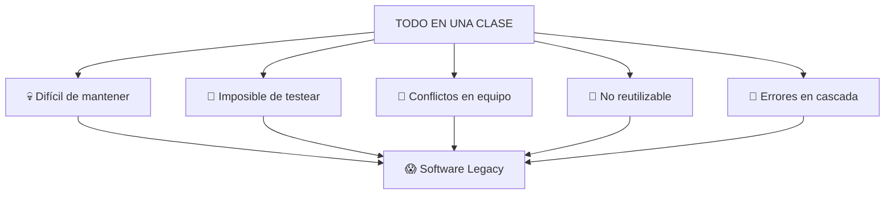

### 🎯 **MVC: La Solución Elegante**

#### 📖 **Historia del Patrón MVC**

**¿Sabían que MVC tiene más de 40 años?**

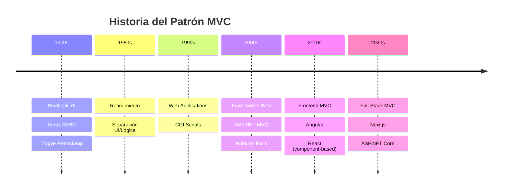

#### 🏛️ **Los 3 Pilares de MVC**

**MVC no es solo una técnica, es una filosofía de separación de responsabilidades:**

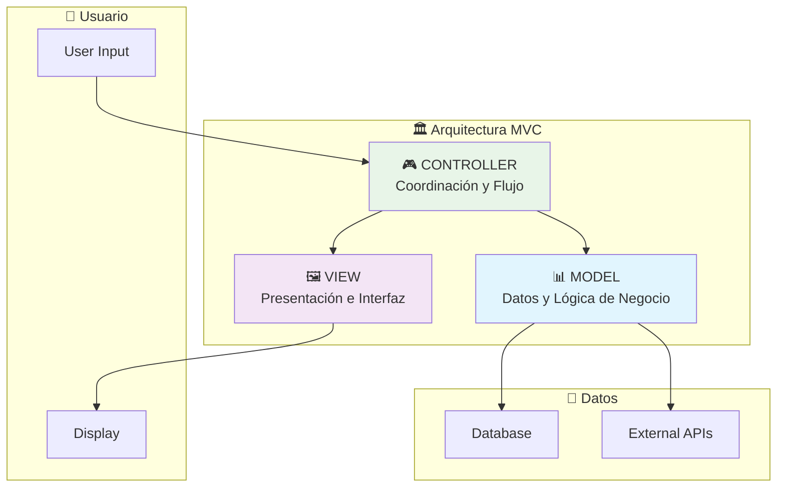

#### 📊 **MODEL: El Cerebro de la Aplicación**

```csharp
// 🧠 MODEL: Contiene la lógica de negocio y datos
// Responsabilidades: ¿QUÉ hace la aplicación?

public class Producto {
    // 📋 Datos de la entidad
    public int Id { get; set; }
    public string Nombre { get; set; }
    public decimal Precio { get; set; }
    public int Stock { get; set; }

    // 💼 LÓGICA DE NEGOCIO: Reglas del dominio
    public bool EstaDisponible() {
        return Stock > 0;
    }

    public decimal CalcularPrecioConDescuento(decimal porcentajeDescuento) {
        // 🎯 Regla de negocio: Descuentos no pueden ser mayor al 50%
        if (porcentajeDescuento > 0.5m) {
            throw new ArgumentException("Descuento máximo permitido: 50%");
        }

        return Precio * (1 - porcentajeDescuento);
    }

    public void ReducirStock(int cantidad) {
        // 🛡️ Invariante de negocio: Stock no puede ser negativo
        if (cantidad > Stock) {
            throw new InvalidOperationException("Stock insuficiente");
        }

        Stock -= cantidad;
    }
}

// 📦 SERVICE: Orquesta lógica de negocio compleja
public class VentaService {
    public ResultadoVenta ProcesarVenta(int productoId, int cantidad) {
        // 🔄 Coordinación de múltiples modelos
        var producto = _repositorio.ObtenerProducto(productoId);

        if (!producto.EstaDisponible()) {
            return ResultadoVenta.Falla("Producto no disponible");
        }

        var precioFinal = producto.CalcularPrecioConDescuento(0.1m);
        producto.ReducirStock(cantidad);

        return ResultadoVenta.Exito(precioFinal);
    }
}
```

#### 🖼️ **VIEW: La Cara Visible**

```csharp
// 🎨 VIEW: Se encarga de la presentación
// Responsabilidades: ¿CÓMO se muestra la información?

// 🖥️ Ejemplo: Vista de consola
public class ProductoConsoleView {
    public void MostrarProducto(Producto producto) {
        Console.WriteLine("=== INFORMACIÓN DEL PRODUCTO ===");
        Console.WriteLine($"📦 Nombre: {producto.Nombre}");
        Console.WriteLine($"💰 Precio: ${producto.Precio:F2}");
        Console.WriteLine($"📊 Stock: {producto.Stock} unidades");
        Console.WriteLine($"✅ Estado: {(producto.EstaDisponible() ? "Disponible" : "Agotado")}");
    }

    public void MostrarError(string mensaje) {
        Console.ForegroundColor = ConsoleColor.Red;
        Console.WriteLine($"❌ Error: {mensaje}");
        Console.ResetColor();
    }

    public void MostrarExito(string mensaje) {
        Console.ForegroundColor = ConsoleColor.Green;
        Console.WriteLine($"✅ Éxito: {mensaje}");
        Console.ResetColor();
    }
}

// 🌐 Ejemplo: Vista web (Razor en ASP.NET Core)
/*
@model Producto

<div class="producto-card">
    <h2>@Model.Nombre</h2>
    <p class="precio">$@Model.Precio.ToString("F2")</p>
    <p class="stock">Stock: @Model.Stock</p>

    @if (Model.EstaDisponible()) {
        <button class="btn-comprar">Comprar</button>
    } else {
        <span class="agotado">Producto Agotado</span>
    }
</div>
*/
```

#### 🎮 **CONTROLLER: El Director de Orquesta**

```csharp
// 🎭 CONTROLLER: Coordina entre Model y View
// Responsabilidades: ¿CUÁNDO y CÓMO responder a las acciones del usuario?

public class ProductoController {
    private readonly VentaService _ventaService;
    private readonly ProductoConsoleView _view;

    public ProductoController(VentaService ventaService, ProductoConsoleView view) {
        _ventaService = ventaService;
        _view = view;
    }

    // 🎯 Acción: Responde a la solicitud del usuario
    public void ComprarProducto(int productoId, int cantidad) {
        try {
            // 1️⃣ Delega la lógica de negocio al MODEL (Service)
            var resultado = _ventaService.ProcesarVenta(productoId, cantidad);

            // 2️⃣ Decide qué VIEW mostrar según el resultado
            if (resultado.EsExitoso) {
                _view.MostrarExito($"Compra realizada. Total: ${resultado.Total:F2}");
            } else {
                _view.MostrarError(resultado.MensajeError);
            }

        } catch (Exception ex) {
            // 🛡️ Manejo de errores: El controller decide cómo mostrar errores
            _view.MostrarError($"Error inesperado: {ex.Message}");
        }
    }

    // 🔍 Acción: Consultar producto
    public void MostrarProducto(int productoId) {
        var producto = _ventaService.ObtenerProducto(productoId);

        if (producto != null) {
            _view.MostrarProducto(producto);
        } else {
            _view.MostrarError("Producto no encontrado");
        }
    }
}
```

### 🆚 **Comparación: Antes vs Después de MVC**

#### 🚨 **ANTES: Código Espagueti**

```csharp
// TODO MEZCLADO - DIFÍCIL DE MANTENER
public void ComprarProducto() {
    Console.Write("ID del producto: ");  // UI mezclada
    int id = int.Parse(Console.ReadLine());

    using (var conn = new SqlConnection("...")) {  // Datos mezclados
        // SQL directo + lógica de negocio + UI = 😱
        var cmd = new SqlCommand($"SELECT * FROM productos WHERE id = {id}", conn);
        // ... más código mezclado ...
    }
}
```

#### ✅ **DESPUÉS: MVC Organizado**

```csharp
// CADA COSA EN SU LUGAR - FÁCIL DE MANTENER
public class ProductoController {
    public void ComprarProducto(int id, int cantidad) {
        var resultado = _service.ProcesarCompra(id, cantidad);  // MODEL
        _view.MostrarResultado(resultado);                      // VIEW
    }
}
```

### 🌟 **MVC en el Ecosistema .NET**

#### 🔄 **De Desktop a Web**

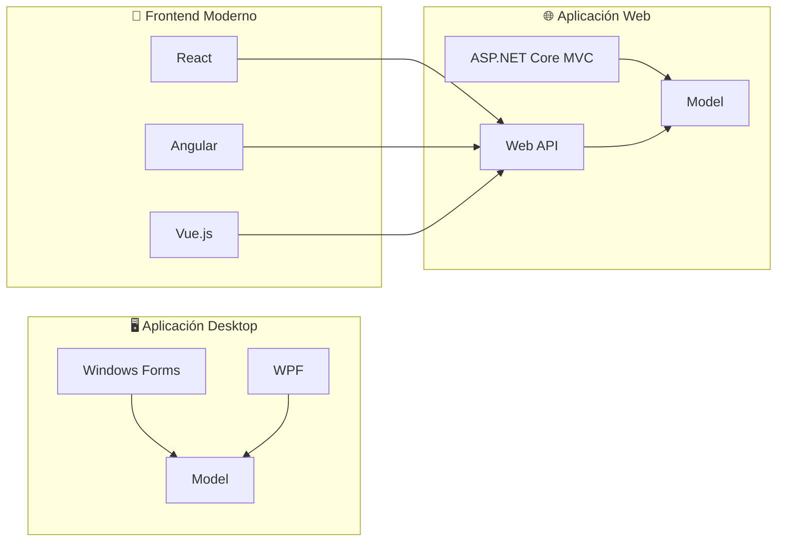

#### 🎯 **ASP.NET Core MVC en Acción**

```csharp
// 🌐 CONTROLLER en ASP.NET Core
[ApiController]
[Route("api/[controller]")]
public class ProductosController : ControllerBase {
    private readonly IProductoService _service;

    // 📥 GET: Obtener todos los productos
    [HttpGet]
    public async Task<IActionResult> GetProductos() {
        var productos = await _service.ObtenerTodosAsync();
        return Ok(productos);  // VIEW = JSON Response
    }

    // 📥 GET: Obtener producto específico
    [HttpGet("{id}")]
    public async Task<IActionResult> GetProducto(int id) {
        var producto = await _service.ObtenerPorIdAsync(id);

        if (producto == null) {
            return NotFound();  // VIEW = 404 Error
        }

        return Ok(producto);  // VIEW = JSON Response
    }

    // 📤 POST: Crear nuevo producto
    [HttpPost]
    public async Task<IActionResult> CrearProducto([FromBody] CrearProductoDto dto) {
        try {
            var producto = await _service.CrearAsync(dto);
            return CreatedAtAction(  // VIEW = 201 Created
                nameof(GetProducto),
                new { id = producto.Id },
                producto);
        } catch (Exception ex) {
            return BadRequest(ex.Message);  // VIEW = 400 Error
        }
    }
}
```

### 🎯 **Actividad Práctica: Identificar MVC**

**🕵️ Ejercicio:** En grupos de 3, analicen estas aplicaciones conocidas e identifiquen los componentes MVC:

#### 📱 **Instagram**

- **Model:** ¿Qué datos maneja? ¿Qué lógica de negocio tiene?
- **View:** ¿Cómo se presenta la información?
- **Controller:** ¿Qué acciones puede hacer el usuario?

#### 🛒 **MercadoLibre**

- **Model:** Productos, usuarios, transacciones...
- **View:** Lista de productos, página de detalle...
- **Controller:** Búsqueda, compra, favoritos...

#### 🎮 **Discord**

- **Model:** Mensajes, canales, usuarios...
- **View:** Chat, lista de servidores...
- **Controller:** Enviar mensaje, unirse a canal...

**💭 Reflexión:** ¿Por qué creen que estas aplicaciones exitosas usan MVC?

---

**🎯 Puntos Clave del Bloque 1:**

- ✅ **MVC no es opcional:** Es necesario para aplicaciones escalables
- ✅ **Separación clara:** Cada componente tiene una responsabilidad específica
- ✅ **Reutilización:** El mismo modelo puede tener múltiples vistas
- ✅ **Testing:** Cada capa se puede probar independientemente
- ✅ **Mantenimiento:** Cambios en UI no afectan lógica de negocio

---

## 📊 BLOQUE 2: Repository Pattern + ORM Fundamentals

**⏰ Duración:** 40 minutos  
**🎯 Objetivo:** Comprender cómo abstraer el acceso a datos de forma elegante y mantenible usando el patrón Repository y ORMs

### 🔥 El Problema: ¿Cómo Conectamos con los Datos?

**Pregunta motivadora:** _"¿Cómo hacemos que nuestra aplicación MVC se comunique con una base de datos sin crear un desastre de código?"_

#### 🚨 **Antipatrón: SQL Directo en Controllers**

```csharp
// 💀 CÓDIGO HORRIBLE - NO HACER ESTO JAMÁS
public class ProductosController : ControllerBase {
    [HttpGet]
    public async Task<IActionResult> GetProductos() {
        // 🚨 SQL directo en el controller = PESADILLA
        using (var connection = new SqlConnection("Server=localhost;Database=Tienda;...")) {
            await connection.OpenAsync();
            var command = new SqlCommand(
                "SELECT Id, Nombre, Precio, Stock FROM Productos WHERE Activo = 1",
                connection);

            var productos = new List<Producto>();
            using (var reader = await command.ExecuteReaderAsync()) {
                while (await reader.ReadAsync()) {
                    // 😱 Mapeo manual de cada campo
                    productos.Add(new Producto {
                        Id = reader.GetInt32("Id"),
                        Nombre = reader.GetString("Nombre"),
                        Precio = reader.GetDecimal("Precio"),
                        Stock = reader.GetInt32("Stock")
                    });
                }
            }

            return Ok(productos);
        }
    }

    [HttpPost]
    public async Task<IActionResult> CrearProducto([FromBody] Producto producto) {
        // 🚨 MÁS SQL DIRECTO - EL HORROR CONTINÚA
        using (var connection = new SqlConnection("Server=localhost;Database=Tienda;...")) {
            await connection.OpenAsync();
            var command = new SqlCommand(
                $"INSERT INTO Productos (Nombre, Precio, Stock) VALUES " +
                $"('{producto.Nombre}', {producto.Precio}, {producto.Stock})",
                connection);

            await command.ExecuteNonQueryAsync();
            return Ok();
        }
    }
}
```

**🤔 ¿Qué problemas ven aquí?**

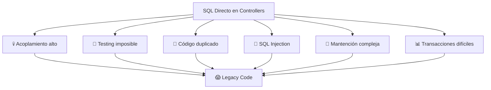

### 🎯 **Repository Pattern: La Solución Elegante**

#### 📚 **¿Qué es el Repository Pattern?**

**💡 Concepto:** El Repository encapsula la lógica necesaria para acceder a fuentes de datos. Centraliza funcionalidades comunes de acceso a datos, proporcionando mejor mantenibilidad y desacoplando la infraestructura o tecnología usada para acceder a las bases de datos de la capa del modelo de dominio.

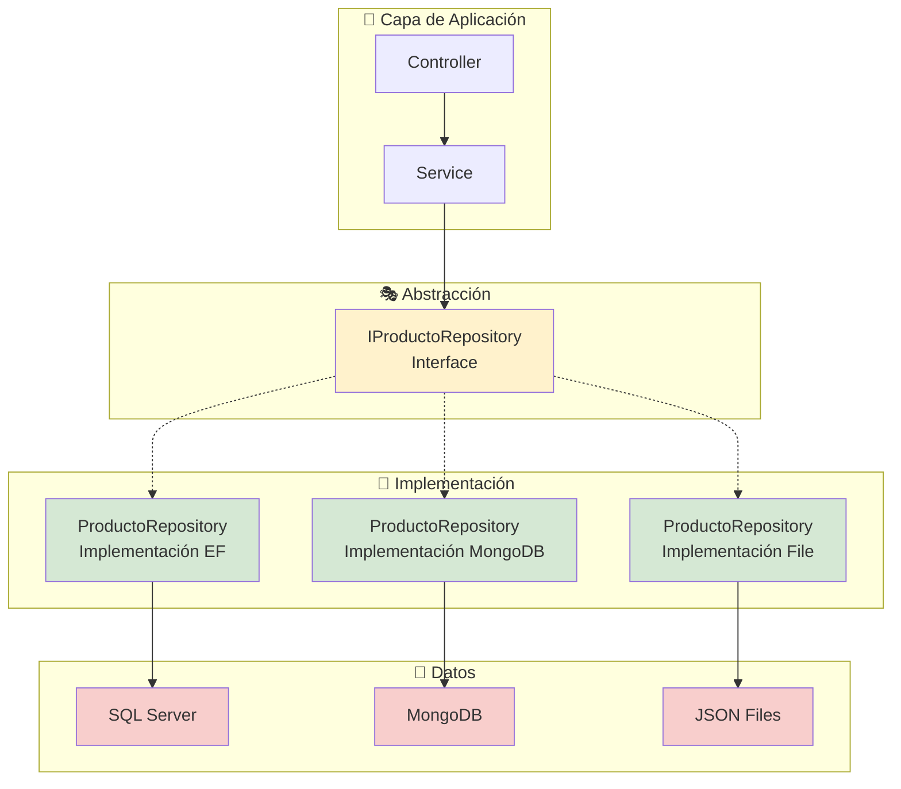

#### 🏗️ **Implementación del Repository Pattern**

##### 1️⃣ **Definir la Interfaz (Contrato)**

```csharp
// 📋 INTERFAZ: Define QUÉ operaciones son posibles
// Siguiendo principios SOLID: Inversión de Dependencias
public interface IProductoRepository {
    // 🔍 CONSULTAS (Queries)
    Task<IEnumerable<Producto>> ObtenerTodosAsync();
    Task<Producto?> ObtenerPorIdAsync(int id);
    Task<IEnumerable<Producto>> BuscarPorNombreAsync(string nombre);
    Task<IEnumerable<Producto>> ObtenerPorCategoriaAsync(string categoria);
    Task<int> ContarTotalAsync();

    // ✏️ COMANDOS (Commands)
    Task<Producto> CrearAsync(Producto producto);
    Task ActualizarAsync(Producto producto);
    Task EliminarAsync(int id);

    // 💼 OPERACIONES DE NEGOCIO ESPECÍFICAS
    Task<IEnumerable<Producto>> ObtenerProductosBajoStockAsync(int umbral);
    Task<bool> ExisteProductoConNombreAsync(string nombre);

    // 🔄 TRANSACCIONES
    Task<bool> GuardarCambiosAsync();
}
```

##### 2️⃣ **Implementación con Entity Framework**

```csharp
// 🔧 IMPLEMENTACIÓN CONCRETA: Cómo se ejecutan las operaciones
public class ProductoRepository : IProductoRepository {
    private readonly TiendaDbContext _context;

    public ProductoRepository(TiendaDbContext context) {
        _context = context;
    }

    // 🔍 CONSULTAS IMPLEMENTADAS
    public async Task<IEnumerable<Producto>> ObtenerTodosAsync() {
        // 🚀 Entity Framework traduce esto a SQL automáticamente
        return await _context.Productos
            .Where(p => p.Activo)           // Solo productos activos
            .OrderBy(p => p.Nombre)         // Ordenados alfabéticamente
            .ToListAsync();                 // Ejecución asíncrona
    }

    public async Task<Producto?> ObtenerPorIdAsync(int id) {
        // 🎯 Búsqueda eficiente por clave primaria
        return await _context.Productos
            .FirstOrDefaultAsync(p => p.Id == id && p.Activo);
    }

    public async Task<IEnumerable<Producto>> BuscarPorNombreAsync(string nombre) {
        // 🔍 Búsqueda con LIKE SQL
        return await _context.Productos
            .Where(p => p.Nombre.Contains(nombre) && p.Activo)
            .ToListAsync();
    }

    // ✏️ COMANDOS IMPLEMENTADOS
    public async Task<Producto> CrearAsync(Producto producto) {
        // 🆕 Agregar al contexto (no ejecuta SQL aún)
        _context.Productos.Add(producto);

        // 💾 Guardar cambios (ejecuta INSERT SQL)
        await _context.SaveChangesAsync();

        // ✅ Retorna el producto con ID generado
        return producto;
    }

    public async Task ActualizarAsync(Producto producto) {
        // 🔄 Marcar como modificado
        _context.Entry(producto).State = EntityState.Modified;
        await _context.SaveChangesAsync();
    }

    public async Task EliminarAsync(int id) {
        // 🗑️ Eliminación lógica (mejor práctica)
        var producto = await ObtenerPorIdAsync(id);
        if (producto != null) {
            producto.Activo = false;  // No eliminar físicamente
            await ActualizarAsync(producto);
        }
    }

    // 💼 LÓGICA DE NEGOCIO ESPECÍFICA
    public async Task<IEnumerable<Producto>> ObtenerProductosBajoStockAsync(int umbral) {
        return await _context.Productos
            .Where(p => p.Stock < umbral && p.Activo)
            .OrderBy(p => p.Stock)          // Los más críticos primero
            .ToListAsync();
    }

    public async Task<bool> ExisteProductoConNombreAsync(string nombre) {
        return await _context.Productos
            .AnyAsync(p => p.Nombre.ToLower() == nombre.ToLower() && p.Activo);
    }

    public async Task<bool> GuardarCambiosAsync() {
        return await _context.SaveChangesAsync() > 0;
    }
}
```

##### 3️⃣ **Uso en el Controller (Clean!)**

```csharp
// ✨ CONTROLLER LIMPIO: Solo coordina, no maneja datos
[ApiController]
[Route("api/[controller]")]
public class ProductosController : ControllerBase {
    private readonly IProductoRepository _repository;

    // 🔌 Inyección de dependencias: El framework inyecta la implementación
    public ProductosController(IProductoRepository repository) {
        _repository = repository;
    }

    [HttpGet]
    public async Task<IActionResult> GetProductos() {
        // 🎯 UNA LÍNEA: Delegamos al repository
        var productos = await _repository.ObtenerTodosAsync();
        return Ok(productos);
    }

    [HttpGet("{id}")]
    public async Task<IActionResult> GetProducto(int id) {
        var producto = await _repository.ObtenerPorIdAsync(id);

        if (producto == null) {
            return NotFound($"Producto con ID {id} no encontrado");
        }

        return Ok(producto);
    }

    [HttpPost]
    public async Task<IActionResult> CrearProducto([FromBody] CrearProductoDto dto) {
        // 🛡️ Validación de negocio
        if (await _repository.ExisteProductoConNombreAsync(dto.Nombre)) {
            return BadRequest("Ya existe un producto con ese nombre");
        }

        // 🔄 Mapeo DTO a entidad
        var producto = new Producto {
            Nombre = dto.Nombre,
            Precio = dto.Precio,
            Stock = dto.Stock,
            Activo = true
        };

        // 💾 Persistencia delegada al repository
        var productoCreado = await _repository.CrearAsync(producto);

        return CreatedAtAction(
            nameof(GetProducto),
            new { id = productoCreado.Id },
            productoCreado);
    }

    [HttpGet("bajo-stock/{umbral}")]
    public async Task<IActionResult> GetProductosBajoStock(int umbral) {
        // 🎯 Lógica de negocio encapsulada en el repository
        var productos = await _repository.ObtenerProductosBajoStockAsync(umbral);
        return Ok(productos);
    }
}
```

### 🗄️ **ORM: Object-Relational Mapping**

#### 🤔 **¿Qué es un ORM y por qué lo necesitamos?**

**Problema:** Las bases de datos hablan SQL, los programas hablan objetos.

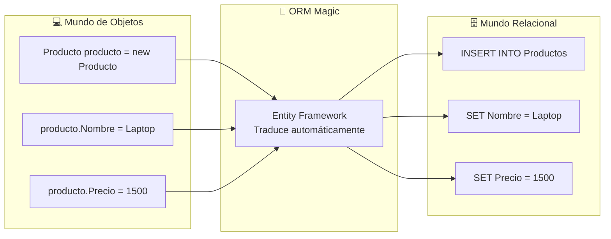

#### 🎯 **Visualización Completa: Tabla → SQL → ORM**

**💡 Concepto:** Veamos cómo la misma información se representa en 3 niveles diferentes

##### 📊 **1. Nivel Visual: Tabla de Base de Datos**

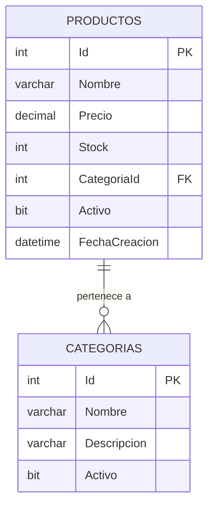

**📋 Datos de Ejemplo:**

```
PRODUCTOS
+----+----------+--------+-------+-------------+--------+---------------------+
| Id | Nombre   | Precio | Stock | CategoriaId | Activo | FechaCreacion       |
+----+----------+--------+-------+-------------+--------+---------------------+
| 1  | Laptop   | 1500.00| 10    | 1           | 1      | 2025-01-15 10:30:00 |
| 2  | Mouse    | 25.50  | 50    | 1           | 1      | 2025-01-15 11:00:00 |
| 3  | Silla    | 299.99 | 5     | 2           | 1      | 2025-01-16 09:15:00 |
+----+----------+--------+-------+-------------+--------+---------------------+

CATEGORIAS
+----+-------------+---------------------------+--------+
| Id | Nombre      | Descripcion               | Activo |
+----+-------------+---------------------------+--------+
| 1  | Electrónicos| Dispositivos tecnológicos | 1      |
| 2  | Muebles     | Mobiliario para oficina   | 1      |
+----+-------------+---------------------------+--------+
```

##### 🗄️ **2. Nivel SQL: Comandos de Base de Datos**

```sql
-- 🏗️ CREAR TABLAS (DDL - Data Definition Language)
CREATE TABLE Categorias (
    Id int IDENTITY(1,1) PRIMARY KEY,
    Nombre varchar(100) NOT NULL,
    Descripcion varchar(500),
    Activo bit DEFAULT 1
);

CREATE TABLE Productos (
    Id int IDENTITY(1,1) PRIMARY KEY,
    Nombre varchar(200) NOT NULL,
    Precio decimal(18,2) NOT NULL,
    Stock int DEFAULT 0,
    CategoriaId int NOT NULL,
    Activo bit DEFAULT 1,
    FechaCreacion datetime DEFAULT GETDATE(),

    -- 🔗 Relación con Categorias
    CONSTRAINT FK_Productos_Categorias
        FOREIGN KEY (CategoriaId) REFERENCES Categorias(Id)
);

-- 📊 INSERTAR DATOS (DML - Data Manipulation Language)
INSERT INTO Categorias (Nombre, Descripcion) VALUES
    ('Electrónicos', 'Dispositivos tecnológicos'),
    ('Muebles', 'Mobiliario para oficina');

INSERT INTO Productos (Nombre, Precio, Stock, CategoriaId) VALUES
    ('Laptop', 1500.00, 10, 1),
    ('Mouse', 25.50, 50, 1),
    ('Silla', 299.99, 5, 2);

-- 🔍 CONSULTAS TÍPICAS
-- Obtener todos los productos activos
SELECT Id, Nombre, Precio, Stock
FROM Productos
WHERE Activo = 1
ORDER BY Nombre;

-- Buscar productos por nombre
SELECT p.Nombre, p.Precio, c.Nombre as Categoria
FROM Productos p
INNER JOIN Categorias c ON p.CategoriaId = c.Id
WHERE p.Nombre LIKE '%Laptop%' AND p.Activo = 1;

-- Crear un nuevo producto
INSERT INTO Productos (Nombre, Precio, Stock, CategoriaId, Activo)
VALUES ('Teclado', 75.00, 25, 1, 1);

-- Actualizar stock
UPDATE Productos
SET Stock = Stock - 1
WHERE Id = 1 AND Stock > 0;

-- Eliminación lógica
UPDATE Productos
SET Activo = 0
WHERE Id = 2;
```

##### 💻 **3. Nivel ORM: Clases C# con Entity Framework**

```csharp
// 🏗️ ENTIDADES: Clases que representan las tablas
public class Categoria {
    // 🔑 Clave primaria (EF lo detecta por convención: Id)
    public int Id { get; set; }

    // 📝 Propiedades que mapean a columnas
    public string Nombre { get; set; } = string.Empty;
    public string? Descripcion { get; set; }
    public bool Activo { get; set; } = true;

    // 🔗 Navegación: Una categoría tiene muchos productos
    public virtual ICollection<Producto> Productos { get; set; } = new List<Producto>();
}

public class Producto {
    // 🔑 Clave primaria
    public int Id { get; set; }

    // 📝 Propiedades básicas
    public string Nombre { get; set; } = string.Empty;
    public decimal Precio { get; set; }
    public int Stock { get; set; }
    public bool Activo { get; set; } = true;
    public DateTime FechaCreacion { get; set; } = DateTime.Now;

    // 🔗 Clave foránea
    public int CategoriaId { get; set; }

    // 🔗 Navegación: Un producto pertenece a una categoría
    public virtual Categoria Categoria { get; set; } = null!;
}

// 🗄️ CONTEXTO: Representa la base de datos
public class TiendaDbContext : DbContext {
    public DbSet<Producto> Productos { get; set; }
    public DbSet<Categoria> Categorias { get; set; }

    protected override void OnModelCreating(ModelBuilder modelBuilder) {
        // ⚙️ EF convierte esto automáticamente en las tablas SQL mostradas arriba

        // 🏷️ Configuración de Categoria
        modelBuilder.Entity<Categoria>(entity => {
            entity.Property(c => c.Nombre).HasMaxLength(100).IsRequired();
            entity.Property(c => c.Descripcion).HasMaxLength(500);
        });

        // 🏷️ Configuración de Producto
        modelBuilder.Entity<Producto>(entity => {
            entity.Property(p => p.Nombre).HasMaxLength(200).IsRequired();
            entity.Property(p => p.Precio).HasColumnType("decimal(18,2)");
            entity.Property(p => p.FechaCreacion).HasDefaultValueSql("GETDATE()");

            // 🔗 Relación
            entity.HasOne(p => p.Categoria)
                  .WithMany(c => c.Productos)
                  .HasForeignKey(p => p.CategoriaId);
        });
    }
}

// 🎯 USO DEL ORM: Las mismas operaciones SQL, pero en C#
public class ProductoService {
    private readonly TiendaDbContext _context;

    // 🔍 CONSULTA: SELECT * FROM Productos WHERE Activo = 1
    public async Task<List<Producto>> ObtenerProductosActivosAsync() {
        return await _context.Productos
            .Where(p => p.Activo)              // WHERE Activo = 1
            .OrderBy(p => p.Nombre)            // ORDER BY Nombre
            .ToListAsync();                    // Ejecuta la consulta
    }

    // 🔍 BÚSQUEDA CON JOIN: Consulta con INNER JOIN automático
    public async Task<List<Producto>> BuscarPorNombreAsync(string nombre) {
        return await _context.Productos
            .Include(p => p.Categoria)         // INNER JOIN Categorias
            .Where(p => p.Nombre.Contains(nombre) && p.Activo)
            .ToListAsync();
    }

    // ✏️ CREAR: INSERT INTO Productos
    public async Task<Producto> CrearProductoAsync(Producto producto) {
        _context.Productos.Add(producto);     // Prepara INSERT
        await _context.SaveChangesAsync();    // Ejecuta SQL
        return producto;                      // Retorna con Id generado
    }

    // 🔄 ACTUALIZAR: UPDATE Productos SET...
    public async Task ActualizarStockAsync(int productoId, int nuevaCantidad) {
        var producto = await _context.Productos.FindAsync(productoId);
        if (producto != null) {
            producto.Stock = nuevaCantidad;    // Marca como modificado
            await _context.SaveChangesAsync(); // UPDATE automático
        }
    }

    // 🗑️ ELIMINACIÓN LÓGICA: UPDATE Productos SET Activo = 0
    public async Task EliminarAsync(int productoId) {
        var producto = await _context.Productos.FindAsync(productoId);
        if (producto != null) {
            producto.Activo = false;           // Eliminación lógica
            await _context.SaveChangesAsync();
        }
    }
}
```

### 🔄 **Comparación de las 3 Aproximaciones**

| Aspecto              | SQL Directo                                           | Entity Framework ORM                              |
| -------------------- | ----------------------------------------------------- | ------------------------------------------------- |
| **📝 Código**        | `SELECT p.*, c.Nombre FROM Productos p INNER JOIN...` | `_context.Productos.Include(p => p.Categoria)...` |
| **🛡️ Seguridad**     | Vulnerable a SQL Injection                            | Protegido automáticamente                         |
| **🔧 Mantenimiento** | Cambios manuales en BD = cambios en código            | Migraciones automáticas                           |
| **🧪 Testing**       | Difícil (requiere BD real)                            | Fácil (InMemory database)                         |
| **📊 Performance**   | Control total                                         | Buena con optimizaciones                          |
| **👥 Productividad** | Lenta para operaciones simples                        | Rápida para CRUD estándar                         |
| **🎯 Flexibilidad**  | Total control de SQL                                  | Limitado a capacidades del ORM                    |

### 💡 **¿Cuándo usar cada aproximación?**

#### ✅ **Usar Entity Framework cuando:**

- **CRUD estándar:** Operaciones básicas de crear, leer, actualizar, eliminar
- **Desarrollo rápido:** Prototipado y aplicaciones de línea de negocio
- **Equipos mixtos:** Desarrolladores con diferentes niveles de SQL
- **Mantenimiento:** Aplicaciones que evolucionan frecuentemente

#### ✅ **Usar SQL directo cuando:**

- **Performance crítica:** Consultas muy complejas con optimizaciones específicas
- **Lógica compleja:** Stored procedures, funciones de BD específicas
- **Reportes:** Consultas analíticas con agregaciones complejas
- **BD existente:** Sistemas legacy con esquemas complejos

**💭 Reflexión:** El ORM no reemplaza el conocimiento de SQL, ¡lo potencia! Un buen desarrollador entiende qué SQL genera su ORM.

#### 🚀 **Entity Framework Core: El ORM de .NET**

##### 1️⃣ **Configuración del DbContext**

```csharp
// 🏗️ DBCONTEXT: Representa una sesión con la base de datos
public class TiendaDbContext : DbContext {
    public TiendaDbContext(DbContextOptions<TiendaDbContext> options)
        : base(options) { }

    // 📊 DBSETS: Representan tablas en la base de datos
    public DbSet<Producto> Productos { get; set; }
    public DbSet<Categoria> Categorias { get; set; }
    public DbSet<Cliente> Clientes { get; set; }
    public DbSet<Venta> Ventas { get; set; }

    // ⚙️ CONFIGURACIÓN DE ENTIDADES
    protected override void OnModelCreating(ModelBuilder modelBuilder) {
        // 🏷️ Configuración de la entidad Producto
        modelBuilder.Entity<Producto>(entity => {
            // 🔑 Clave primaria
            entity.HasKey(p => p.Id);

            // 📝 Propiedades requeridas
            entity.Property(p => p.Nombre)
                .IsRequired()
                .HasMaxLength(200);

            // 💰 Configuración de decimales para dinero
            entity.Property(p => p.Precio)
                .HasColumnType("decimal(18,2)");

            // 📊 Índices para performance
            entity.HasIndex(p => p.Nombre);
            entity.HasIndex(p => p.Categoria);

            // 🔗 Relaciones
            entity.HasOne(p => p.Categoria)
                .WithMany(c => c.Productos)
                .HasForeignKey(p => p.CategoriaId);
        });

        // 📊 Datos de prueba (Seeding)
        modelBuilder.Entity<Categoria>().HasData(
            new Categoria { Id = 1, Nombre = "Electrónicos", Activo = true },
            new Categoria { Id = 2, Nombre = "Ropa", Activo = true },
            new Categoria { Id = 3, Nombre = "Hogar", Activo = true }
        );
    }
}
```

##### 2️⃣ **Configuración en Program.cs**

```csharp
// ⚙️ CONFIGURACIÓN DE LA APLICACIÓN
var builder = WebApplication.CreateBuilder(args);

// 🗄️ Configurar Entity Framework
builder.Services.AddDbContext<TiendaDbContext>(options =>
    options.UseSqlServer(builder.Configuration.GetConnectionString("DefaultConnection")));

// 🔌 Registrar repositorios para inyección de dependencias
builder.Services.AddScoped<IProductoRepository, ProductoRepository>();
builder.Services.AddScoped<ICategoriaRepository, CategoriaRepository>();

// 🌐 Configurar controladores
builder.Services.AddControllers();

var app = builder.Build();

// 🚀 Configurar pipeline de la aplicación
app.UseRouting();
app.MapControllers();

app.Run();
```

##### 3️⃣ **Migraciones: Evolución de la Base de Datos**

```bash
# 📦 Crear una nueva migración
dotnet ef migrations add CrearTablasIniciales

# 🗄️ Aplicar migraciones a la base de datos
dotnet ef database update

# 📊 Ver el estado de las migraciones
dotnet ef migrations list
```

### 🆚 **Comparación: SQL Directo vs Repository + ORM**

#### 🚨 **Antes: SQL Directo (Nightmare Mode)**

```csharp
// 💀 130 líneas de código para una operación simple
public async Task<List<Producto>> BuscarProductosComplejoAsync(string nombre, decimal precioMin, int categoriaId) {
    var productos = new List<Producto>();
    var sql = @"
        SELECT p.Id, p.Nombre, p.Precio, p.Stock, c.Nombre as CategoriaNombre
        FROM Productos p
        INNER JOIN Categorias c ON p.CategoriaId = c.Id
        WHERE p.Activo = 1
        AND p.Nombre LIKE @nombre
        AND p.Precio >= @precioMin
        AND p.CategoriaId = @categoriaId
        ORDER BY p.Nombre";

    using (var connection = new SqlConnection(connectionString)) {
        using (var command = new SqlCommand(sql, connection)) {
            command.Parameters.AddWithValue("@nombre", $"%{nombre}%");
            command.Parameters.AddWithValue("@precioMin", precioMin);
            command.Parameters.AddWithValue("@categoriaId", categoriaId);

            await connection.OpenAsync();
            using (var reader = await command.ExecuteReaderAsync()) {
                while (await reader.ReadAsync()) {
                    productos.Add(new Producto {
                        Id = reader.GetInt32("Id"),
                        Nombre = reader.GetString("Nombre"),
                        Precio = reader.GetDecimal("Precio"),
                        Stock = reader.GetInt32("Stock"),
                        Categoria = new Categoria {
                            Nombre = reader.GetString("CategoriaNombre")
                        }
                    });
                }
            }
        }
    }
    return productos;
}
```

#### ✅ **Después: Repository + ORM (Heaven Mode)**

```csharp
// ✨ 6 líneas de código para la misma operación
public async Task<IEnumerable<Producto>> BuscarProductosComplejoAsync(
    string nombre, decimal precioMin, int categoriaId) {

    return await _context.Productos
        .Include(p => p.Categoria)                    // JOIN automático
        .Where(p => p.Activo &&                      // Filtros expresivos
                   p.Nombre.Contains(nombre) &&
                   p.Precio >= precioMin &&
                   p.CategoriaId == categoriaId)
        .OrderBy(p => p.Nombre)                       // Ordenamiento
        .ToListAsync();                               // Ejecución asíncrona
}
```

### 🎯 **Actividad Práctica: Diseñar un Repository**

**🕵️ Ejercicio:** En grupos de 3, diseñen el `IClienteRepository` para un sistema de e-commerce:

#### 📋 **Requisitos:**

1. **CRUD básico:** Crear, leer, actualizar, eliminar clientes
2. **Búsquedas:** Por email, por nombre, por rango de fechas de registro
3. **Operaciones de negocio:**
   - Clientes VIP (más de X compras)
   - Clientes inactivos (sin compras en X meses)
   - Estadísticas de clientes por región

#### 🤔 **Preguntas Guía:**

- ¿Qué métodos tendría la interfaz `IClienteRepository`?
- ¿Qué parámetros necesitaría cada método?
- ¿Cómo manejarían la paginación para listas grandes?

**💡 Tiempo:** 10 minutos para diseñar + 5 minutos para presentar

---

**🎯 Puntos Clave del Bloque 2:**

- ✅ **Repository Pattern:** Abstrae el acceso a datos y mejora la testabilidad
- ✅ **Separación de responsabilidades:** Controllers no manejan SQL directamente
- ✅ **ORMs facilitan desarrollo:** Entity Framework traduce objetos a SQL automáticamente
- ✅ **Inversión de dependencias:** Interfaces permiten cambiar implementaciones fácilmente
- ✅ **Código más limpio:** Menos código repetitivo y más expresivo

---

## 🌐 **BLOQUE 3: APIs REST - El Lenguaje Universal del Backend**

**⏰ Tiempo:** 40 minutos | **🎯 Objetivo:** Entender qué son las APIs REST y cómo funcionan los métodos HTTP

### 🔍 **¿Qué es una API REST?**

#### 💭 **Analogía: El Restaurant Digital**

Imaginen un restaurante donde:

- **👨‍🍳 La cocina** = Backend (base de datos, lógica de negocio)
- **👨‍💼 El mesero** = API REST
- **👥 Los clientes** = Frontend (web, móvil, otras aplicaciones)

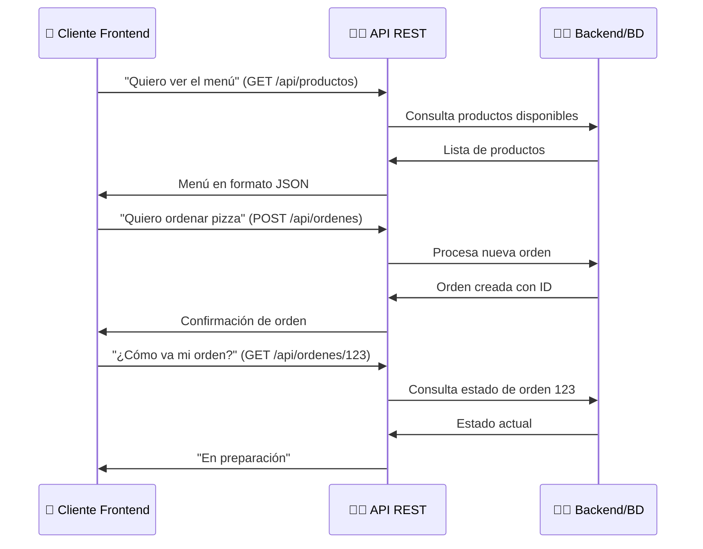

#### 🎯 **REST = Representational State Transfer**

**📋 Principios fundamentales:**

1. **🔗 Recursos identificables:** Cada "cosa" tiene una URL única

   ```
   https://api.tienda.com/api/productos          ← Todos los productos
   https://api.tienda.com/api/productos/123      ← Producto específico
   https://api.tienda.com/api/categorias/5       ← Categoría específica
   ```

2. **📤 Métodos HTTP estándar:** Cada verbo tiene un propósito específico
3. **🗣️ Sin estado (Stateless):** Cada petición es independiente
4. **📦 Representaciones:** Los datos viajan en formato estándar (JSON, XML)

### 🛠️ **Los 4 Métodos HTTP Fundamentales (CRUD)**

#### � **Tabla Resumen de Métodos HTTP**

| Método     | Propósito         | URL Ejemplo                 | Código Éxito   | ¿Datos en Body? |
| ---------- | ----------------- | --------------------------- | -------------- | --------------- |
| **GET**    | 📖 Leer/Consultar | `GET /api/productos`        | 200 OK         | ❌ No           |
| **POST**   | ✏️ Crear          | `POST /api/productos`       | 201 Created    | ✅ Sí           |
| **PUT**    | 🔄 Actualizar     | `PUT /api/productos/123`    | 204 No Content | ✅ Sí           |
| **DELETE** | 🗑️ Eliminar       | `DELETE /api/productos/123` | 204 No Content | ❌ No           |

#### 📖 **GET - Leer/Consultar**

**💭 Concepto:** "Mostrar información sin modificar nada"

**🌐 Ejemplos comunes:**

- `GET /api/productos` → Lista todos los productos
- `GET /api/productos/123` → Producto específico
- `GET /api/productos?categoria=electronics` → Productos filtrados

```csharp
[HttpGet]
public async Task<ActionResult<List<Producto>>> GetProductos() {
    return Ok(await _repository.ObtenerTodosAsync());
}
```

#### ✏️ **POST - Crear**

**💭 Concepto:** "Enviar datos para crear algo nuevo"

**📦 Datos viajan en el Body:**

```json
{
  "nombre": "Laptop Gaming",
  "precio": 1299.99,
  "stock": 15,
  "categoriaId": 1
}
```

```csharp
[HttpPost]
public async Task<ActionResult<Producto>> CrearProducto([FromBody] CrearProductoDto dto) {
    var producto = await _repository.CrearAsync(nuevoProducto);
    return CreatedAtAction(nameof(GetProducto), new { id = producto.Id }, producto);
}
```

#### � **PUT - Actualizar**

**💭 Concepto:** "Reemplazar completamente un recurso existente"

```csharp
[HttpPut("{id}")]
public async Task<IActionResult> ActualizarProducto(int id, [FromBody] ActualizarProductoDto dto) {
    await _repository.ActualizarAsync(producto);
    return NoContent();
}
```

#### 🗑️ **DELETE - Eliminar**

**💭 Concepto:** "Quitar un recurso específico"

```csharp
[HttpDelete("{id}")]
public async Task<IActionResult> EliminarProducto(int id) {
    await _repository.EliminarAsync(id);
    return NoContent();
}
```

```http
POST /api/productos
Content-Type: application/json

{
    "nombre": "Laptop Gaming",
    "precio": 1299.99,
    "stock": 15,
    "categoriaId": 1
}
```

#### 🔄 **PUT - Actualizar Completo (UPDATE)**

### **Códigos de Estado HTTP Más Importantes**

#### ✅ **2xx - Éxito**

- **200 OK:** Petición exitosa con datos (GET exitoso)
- **201 Created:** Recurso creado exitosamente (POST exitoso)
- **204 No Content:** Éxito sin contenido (PUT/DELETE exitoso)

#### ❌ **4xx - Error del Cliente**

- **400 Bad Request:** Datos inválidos en la petición
- **401 Unauthorized:** Falta autenticación
- **403 Forbidden:** Sin permisos para el recurso
- **404 Not Found:** Recurso no encontrado
- **409 Conflict:** Conflicto con el estado actual

#### 🔥 **5xx - Error del Servidor**

- **500 Internal Server Error:** Error interno del servidor
- **503 Service Unavailable:** Servicio temporalmente no disponible

### 🎯 **Diseño de URLs RESTful**

#### ✅ **Buenas Prácticas:**

```http
# 📋 Colecciones (sustantivos en plural)
GET    /api/productos                   ← Todos los productos
POST   /api/productos                   ← Crear nuevo producto

# 🎯 Recursos específicos
GET    /api/productos/123               ← Producto con ID 123
PUT    /api/productos/123               ← Actualizar producto 123
DELETE /api/productos/123               ← Eliminar producto 123

# 🔗 Recursos relacionados
GET    /api/categorias/5/productos      ← Productos de categoría 5
GET    /api/productos/123/reviews       ← Reviews del producto 123

# 🔍 Filtros con query parameters
GET    /api/productos?categoria=electronics&precio_min=100
```

#### ❌ **Qué Evitar:**

```http
# 🚫 Verbos en las URLs
GET /api/obtenerProductos              ← ❌ Usar GET /api/productos
POST /api/crearProducto                ← ❌ Usar POST /api/productos

# 🚫 Inconsistencias
GET /api/product                       ← ❌ (productos vs product)
GET /api/Products                      ← ❌ (mayúsculas inconsistentes)
```

### 🧪 **Herramientas para Probar APIs**

#### 1️⃣ **Swagger/OpenAPI (Incluido en .NET)**

- **🎯 Propósito:** Documentación automática e interfaz de pruebas
- **📍 URL:** `https://localhost:7000/swagger` (en desarrollo)
- **✅ Ventajas:** Generado automáticamente, no requiere instalación

#### 2️⃣ **Postman/Insomnia**

- **🎯 Propósito:** Cliente REST profesional para testing
- **✅ Funciones:** Colecciones, variables, tests automáticos
- **📝 Ejemplo de uso:**
  ```http
  GET {{baseUrl}}/api/productos
  POST {{baseUrl}}/api/productos
  Body: {"nombre": "Nuevo Producto", "precio": 299.99}
  ```

#### 3️⃣ **Thunder Client (VS Code)**

- **🎯 Propósito:** Plugin ligero para VS Code
- **✅ Ventajas:** Integrado en el editor, fácil de usar

```csharp
  producto.CategoriaId = dto.CategoriaId;

          await _repository.ActualizarAsync(producto);
          return NoContent();
      }

      /// <summary>
      /// Elimina un producto (eliminación lógica)
      /// </summary>
      [HttpDelete("{id:int}")]
      [ProducesResponseType(204)]
      [ProducesResponseType(404)]
      public async Task<IActionResult> EliminarProducto(int id) {
          var producto = await _repository.ObtenerPorIdAsync(id);
          if (producto == null) {
              return NotFound();
          }

          await _repository.EliminarAsync(id);
          return NoContent();
      }

  }

```

### 🎯 **Actividad Práctica: Diseñar una API REST**

**🏪 Escenario:** Sistema de gestión de biblioteca

#### 📚 **Recursos:**

- **Libros:** ID, título, autor, ISBN, año, disponible
- **Autores:** ID, nombre, biografía, fecha_nacimiento
- **Préstamos:** ID, usuario, libro, fecha_prestamo, fecha_devolucion

#### 🎯 **Ejercicio en Grupos (15 minutos):**

1. **Diseñar URLs RESTful** para cada operación CRUD
2. **Definir métodos HTTP** y códigos de respuesta esperados
3. **Crear ejemplos JSON** para requests y responses
4. **Identificar relaciones** entre recursos

#### 📋 **Plantilla de trabajo:**

```

📚 LIBROS
GET /api/libros ← Obtener todos los libros
POST /api/libros ← Crear nuevo libro
GET /api/libros/{id} ← Obtener libro específico
PUT /api/libros/{id} ← Actualizar libro
DELETE /api/libros/{id} ← Eliminar libro

✍️ AUTORES
GET /api/autores ← ?
POST /api/autores ← ?
...

📝 PRÉSTAMOS
GET /api/prestamos ← ?
POST /api/prestamos ← ?
...

🔗 RELACIONES
GET /api/autores/{id}/libros ← Libros de un autor
GET /api/libros/{id}/prestamos ← Préstamos de un libro

```

**🤔 Preguntas para reflexionar:**

1. ¿Qué códigos HTTP devolvería cada endpoint?
2. ¿Cómo estructurarían el JSON para crear un libro?
3. ¿Qué filtros añadirían para búsquedas?

### 💡 **Mejores Prácticas para APIs REST**

#### ✅ **DO - Buenas Prácticas:**

1. **📝 Usar sustantivos, no verbos** en las URLs
2. **📊 Devolver códigos HTTP apropiados** para cada situación
3. **🔒 Validar siempre los datos de entrada**
4. **📖 Documentar con Swagger/OpenAPI**
5. **🏷️ Usar versionado** (`/api/v1/productos`)
6. **🔍 Implementar filtros y paginación** para listas grandes
7. **🛡️ Manejar errores de forma consistente**

#### ❌ **DON'T - Qué Evitar:**

1. **🚫 URLs con verbos:** `/api/obtenerProductos`
2. **🚫 Ignorar códigos HTTP:** Siempre devolver 200
3. **🚫 Exponer estructura interna:** IDs de base de datos sensibles
4. **🚫 APIs sin documentación**
5. **🚫 Respuestas inconsistentes:** Diferentes formatos por endpoint

---

**🎯 Puntos Clave del Bloque 3:**

- ✅ **REST es un estándar:** Define cómo estructurar APIs web de forma predecible
- ✅ **HTTP methods tienen propósito:** GET lee, POST crea, PUT actualiza, DELETE elimina
- ✅ **URLs expresan recursos:** Usar sustantivos, no verbos
- ✅ **Códigos de estado comunican:** 2xx éxito, 4xx error cliente, 5xx error servidor
- ✅ **Documentación es clave:** Swagger facilita pruebas y integración

---

## 🔧 **BLOQUE 4: Integrando MVC + Repository + API - El Ecosistema Completo**

**⏰ Tiempo:** 40 minutos | **🎯 Objetivo:** Unir todos los patrones en una aplicación real completa

### 🎯 **El Gran Panorama: ¿Cómo Se Conecta Todo?**

#### 💭 **Analogía: La Fábrica de Software Moderna**

Imaginen una **fábrica automotriz moderna** donde:

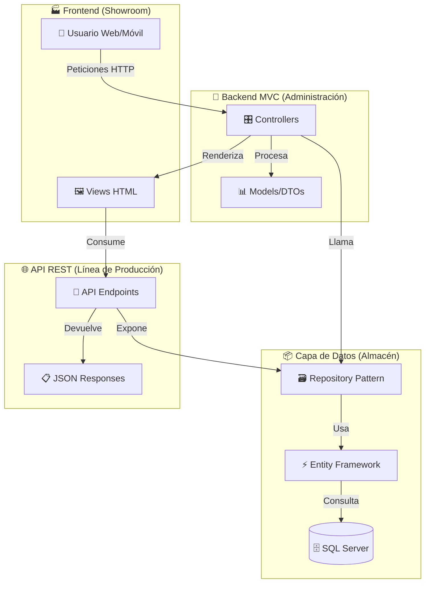

### 🧩 **Arquitectura por Capas Explicada**

#### 📊 **Las 4 Capas Fundamentales**

| Capa                  | Responsabilidad                 | Tecnología                       | Analogía                                    |
| --------------------- | ------------------------------- | -------------------------------- | ------------------------------------------- |
| **🖼️ Presentación**   | Interfaz de usuario             | Razor Views, React, Angular      | 🏪 **Escaparate** - Lo que ve el cliente    |
| **🎛️ Controladores**  | Lógica de negocio, coordinación | MVC Controllers, API Controllers | 👨‍💼 **Manager** - Organiza el trabajo        |
| **🗃️ Acceso a Datos** | Abstracción de BD               | Repository Pattern, Services     | 📋 **Secretario** - Maneja la información   |
| **🗄️ Persistencia**   | Almacenamiento                  | Entity Framework, SQL Server     | 🏦 **Bóveda** - Guarda todo de forma segura |

#### 🔄 **Flujo de Datos: De la Petición a la Respuesta**

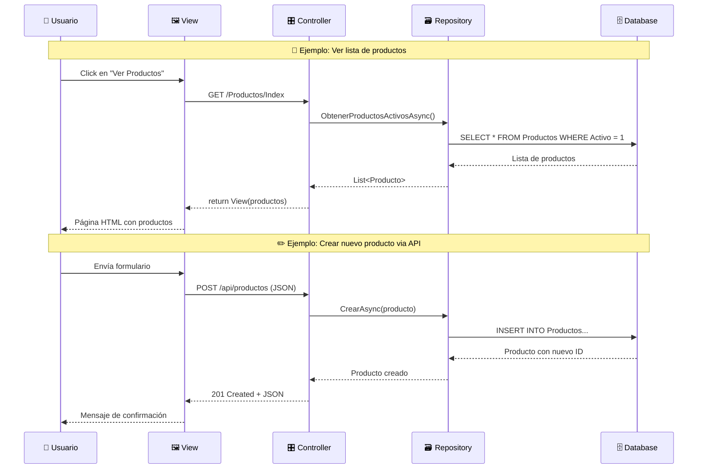

### 🏗️ **Estructura de Proyecto Real**

#### 📁 **Organización de Carpetas Profesional**

```
TiendaOnline.Web/
├── 📁 Controllers/
│   ├── 🎛️ HomeController.cs          ← MVC para páginas web
│   ├── 🎛️ ProductosController.cs     ← MVC para CRUD con views
│   └── 📁 Api/
│       ├── 🔌 ProductosApiController.cs   ← API REST endpoints
│       └── 🔌 CategoriasApiController.cs  ← API REST endpoints
├── 📁 Models/
│   ├── 📊 Producto.cs                 ← Entidades de dominio
│   ├── 📊 Categoria.cs
│   └── 📁 DTOs/
│       ├── 📋 CrearProductoDto.cs     ← Objetos de transferencia
│       └── 📋 ProductoResponseDto.cs
├── 📁 Views/
│   ├── 🖼️ Productos/
│   │   ├── Index.cshtml               ← Lista de productos
│   │   ├── Details.cshtml             ← Detalle de producto
│   │   └── Create.cshtml              ← Formulario crear
│   └── 🖼️ Shared/
│       └── _Layout.cshtml             ← Plantilla común
├── 📁 Data/
│   ├── 🗄️ TiendaDbContext.cs         ← Configuración EF Core
│   └── 📁 Repositories/
│       ├── 🗃️ IProductoRepository.cs  ← Interfaces
│       └── 🗃️ ProductoRepository.cs   ← Implementaciones
└── 📁 wwwroot/
    ├── 🎨 css/site.css                ← Estilos
    └── 📱 js/site.js                  ← JavaScript para APIs
```

### 🔌 **Integración: MVC + API en el Mismo Proyecto**

#### 💡 **Concepto Clave: Dos Tipos de Controllers**

```csharp
// 🎛️ MVC Controller: Devuelve Views HTML
[Route("[controller]")]
public class ProductosController : Controller
{
    private readonly IProductoRepository _repository;

    // 🖼️ Renderiza páginas HTML
    public async Task<IActionResult> Index()
    {
        var productos = await _repository.ObtenerTodosAsync();
        return View(productos);  // ← Devuelve HTML
    }
}

// 🔌 API Controller: Devuelve JSON
[ApiController]
[Route("api/[controller]")]
public class ProductosApiController : ControllerBase
{
    private readonly IProductoRepository _repository;

    // 📊 Devuelve datos en JSON
    [HttpGet]
    public async Task<ActionResult<List<Producto>>> GetProductos()
    {
        var productos = await _repository.ObtenerTodosAsync();
        return Ok(productos);  // ← Devuelve JSON
    }
}
```

#### 🔄 **Configuración en Program.cs**

```csharp
var builder = WebApplication.CreateBuilder(args);

// 🗄️ Base de datos
builder.Services.AddDbContext<TiendaDbContext>(options =>
    options.UseSqlServer(connectionString));

// 🗃️ Repositories (Dependency Injection)
builder.Services.AddScoped<IProductoRepository, ProductoRepository>();

// 🎛️ Servicios MVC (para views HTML)
builder.Services.AddControllersWithViews();

// 🔌 Servicios API (para endpoints JSON)
builder.Services.AddControllers();
builder.Services.AddEndpointsApiExplorer();
builder.Services.AddSwaggerGen();

var app = builder.Build();

// 🔧 Pipeline de configuración
app.UseRouting();
app.MapControllers();           // ← APIs
app.MapControllerRoute(         // ← MVC Routes
    name: "default",
    pattern: "{controller=Home}/{action=Index}/{id?}");

app.Run();
```

### 🎨 **Frontend: Consumiendo la API con JavaScript**

#### 📱 **View que Combina Razor + JavaScript**

```html
<!-- 🖼️ Views/Productos/Index.cshtml -->
<div class="container">
  <h2>Gestión de Productos</h2>

  <!-- 📋 Lista renderizada por MVC -->
  <div class="server-data">
    @foreach(var producto in Model) {
    <div class="producto-card">
      <h4>@producto.Nombre</h4>
      <p>Precio: $@producto.Precio</p>
    </div>
    }
  </div>

  <!-- 📱 Sección interactiva con JavaScript -->
  <div class="dynamic-section">
    <button onclick="cargarProductos()">🔄 Recargar con API</button>
    <div id="productos-dinamicos"></div>
  </div>
</div>

<script>
  // 🔌 Consumir nuestra propia API
  async function cargarProductos() {
    try {
      const response = await fetch("/api/productos");
      const productos = await response.json();

      const container = document.getElementById("productos-dinamicos");
      container.innerHTML = productos
        .map(
          (p) => `
            <div class="producto-card">
                <h4>${p.nombre}</h4>
                <p>Precio: $${p.precio}</p>
                <button onclick="editarProducto(${p.id})">✏️ Editar</button>
            </div>
        `
        )
        .join("");
    } catch (error) {
      console.error("Error al cargar productos:", error);
    }
  }
</script>
```

### 🔀 **Casos de Uso: ¿Cuándo Usar Cada Patrón?**

#### 📊 **Matriz de Decisión**

| Escenario                                | MVC Controller | API Controller | Repository |
| ---------------------------------------- | -------------- | -------------- | ---------- |
| **👀 Mostrar página web**                | ✅ Sí          | ❌ No          | ✅ Sí      |
| **📱 App móvil consume datos**           | ❌ No          | ✅ Sí          | ✅ Sí      |
| **🔄 AJAX en página web**                | ❌ No          | ✅ Sí          | ✅ Sí      |
| **📊 Generar reporte PDF**               | ✅ Sí          | ❌ No          | ✅ Sí      |
| **🌐 Integración con sistemas externos** | ❌ No          | ✅ Sí          | ✅ Sí      |

#### 🎯 **Ejemplos Prácticos de Integración**

**🛍️ Escenario 1: E-commerce Híbrido**

```
👤 Usuario navega web → MVC Controller → Razor View (HTML)
📱 App móvil oficial → API Controller → JSON Response
🔧 Sistema de inventario externo → API Controller → JSON
```

**📊 Escenario 2: Dashboard Empresarial**

```
📈 Página de reportes → MVC Controller → View con gráficos
⚡ Datos en tiempo real → API Controller → WebSocket/AJAX
📥 Exportar Excel → MVC Controller → FileResult
```

### 🎯 **Actividad Práctica: Diseñar la Integración**

**🏪 Escenario:** Tienda online con app móvil

#### 📋 **Ejercicio en Grupos (15 minutos):**

**📝 Situación:** Una tienda necesita:

1. **🌐 Sitio web** para clientes (catálogo, carrito, checkout)
2. **📱 App móvil** para clientes (mismo catálogo, notificaciones)
3. **💼 Panel admin web** para empleados (gestión productos, órdenes)
4. **🔧 Integración** con sistema de inventario externo

**🤔 Preguntas para resolver:**

1. **¿Qué endpoints necesitarían?**

   ```
   Web Cliente: ?
   App Móvil: ?
   Panel Admin: ?
   Sistema Externo: ?
   ```

2. **¿Qué tipo de controller usarían para cada caso?**

   - Mostrar catálogo en web: `MVC` o `API`?
   - App móvil obtiene productos: `MVC` o `API`?
   - Admin crea producto: `MVC` o `API`?

3. **¿Cómo organizarían las rutas?**
   ```
   /productos          ← ?
   /api/productos      ← ?
   /admin/productos    ← ?
   ```

#### 💭 **Reflexión Grupal:**

- ¿Qué ventajas tiene tener MVC + API en el mismo proyecto?
- ¿Cuándo sería mejor separarlos?

### 🚀 **Escalabilidad: Pensando en el Futuro**

#### 📈 **Evolución Natural de la Arquitectura**

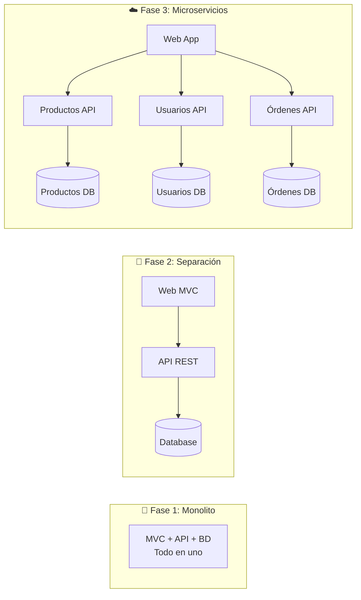

#### 💡 **Principios para Código Escalable**

1. **🔧 Dependency Injection:** Facilita testing y cambios
2. **🗃️ Repository Pattern:** Abstrae acceso a datos
3. **📋 DTOs:** Controla qué datos se exponen
4. **🛡️ Validaciones:** Datos seguros en todas las capas
5. **📖 Documentación:** Swagger para APIs, comentarios en código

---

**🎯 Puntos Clave del Bloque 4:**

- ✅ **Arquitectura por capas:** Cada capa tiene responsabilidades claras
- ✅ **MVC + API conviven:** Diferentes controladores para diferentes necesidades
- ✅ **Repository centraliza datos:** Una fuente de verdad para ambos tipos de controllers
- ✅ **Frontend híbrido:** HTML renderizado + JavaScript consumiendo APIs
- ✅ **Escalabilidad planificada:** La arquitectura permite crecer sin reescribir
