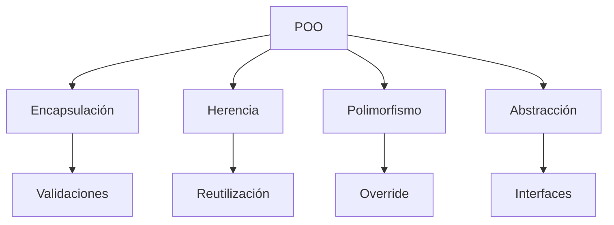
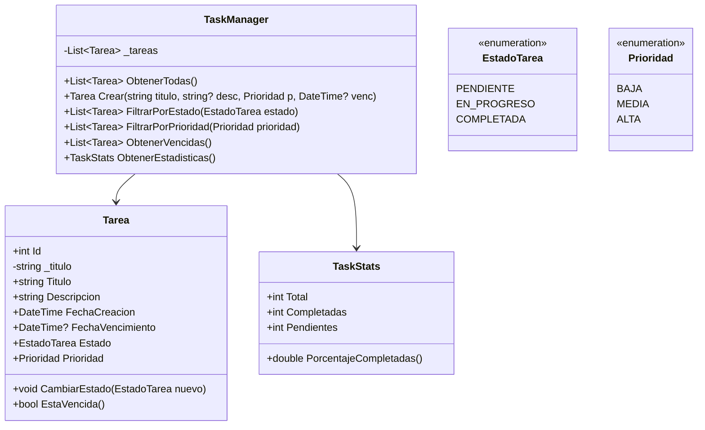
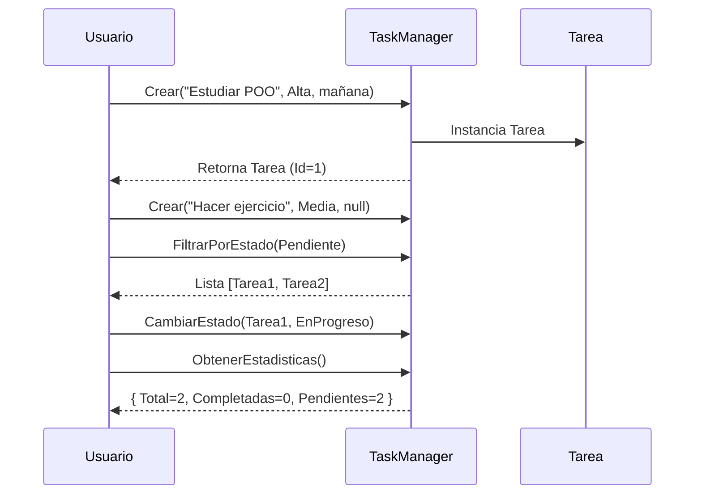
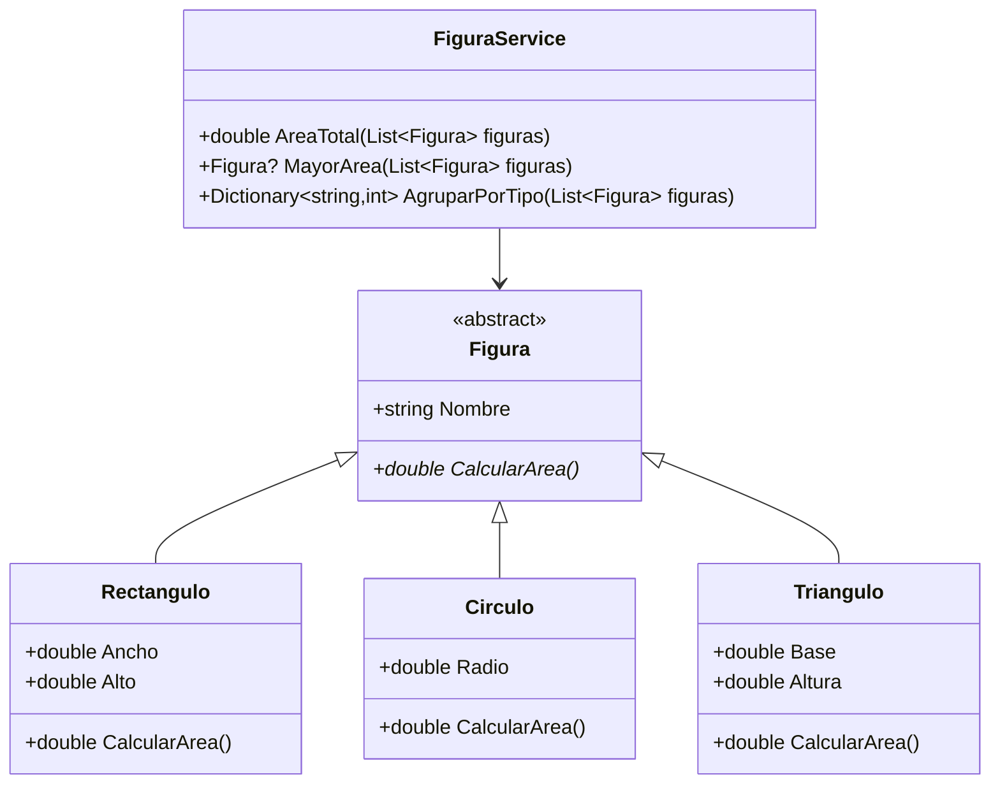
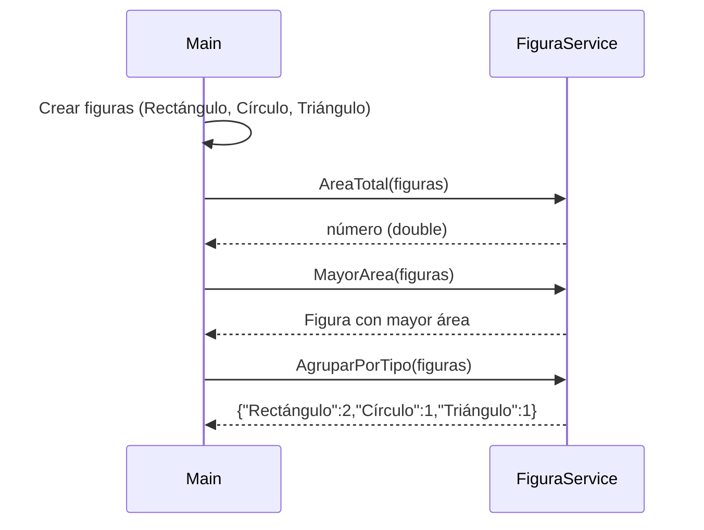
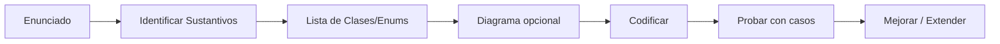
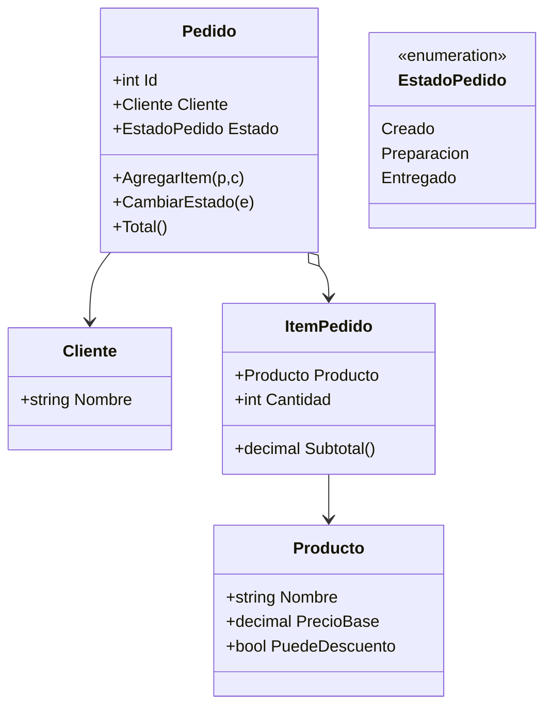

# Clase 03 - Semana 05 - Ejercicios en C#

- Unidad 02: **Diseño y Programación Orientada a Objetos**
- Fecha: Miercoles 10 de Septiembre. 2025
- Horario: 10:50 - 13:30
- Docente: Diego Obando

## 🎯 Objetivos de la Clase

### Objetivo General

Desarrollar habilidades prácticas en programación orientada a objetos y lógica imperativa en C#, reforzando los cuatro pilares (encapsulación, herencia, polimorfismo y abstracción) mediante ejercicios progresivos y guiados.

### Objetivos Específicos (Observables y Evaluables)

1. Aplicar encapsulación definiendo propiedades con validaciones simples (ej: no permitir valores negativos o strings vacíos) en al menos 3 clases modeladas durante la sesión.
2. Implementar herencia y polimorfismo usando al menos una jerarquía con `virtual`/`override` o interfaces para resolver un problema concreto (figuras, animales, notificaciones, etc.).
3. Traducir un enunciado textual a un diagrama de clases en Mermaid identificando correctamente entidades, relaciones y responsabilidades (mínimo 2 diagramas trabajados).
4. Escribir métodos que procesen colecciones (`List<T>`) realizando operaciones de filtrado, conteo, agregación o búsqueda aplicando LINQ básico o bucles estructurados.
5. Diferenciar correctamente cuándo utilizar: clase base, interfaz o composición justificándolo verbalmente al menos una vez en discusión guiada.
6. Mejorar la calidad del diseño evitando al menos 2 errores comunes (duplicación de código, abuso de herencia, números mágicos, falta de validaciones).

### Indicadores de Logro

| Indicador                    | Evidencia Esperada                                       |
| ---------------------------- | -------------------------------------------------------- |
| Encapsulación aplicada       | Propiedades con validación (`set`) o métodos protectores |
| Polimorfismo funcional       | Uso de `List<Base>` iterando instancias derivadas        |
| Diagramas correctos          | Diagramas Mermaid compilables y consistentes con código  |
| Lógica en colecciones        | Métodos que retornan métricas (promedio, mayor, filtros) |
| Justificación de diseño      | Explicación oral o comentario en código                  |
| Mejora sobre errores comunes | Código refactorizado evitando duplicación                |

### Alcances y Límites

- No se abordan patrones avanzados (Factory, Strategy) hoy; foco en fundamentos sólidos.
- No se usa persistencia ni bases de datos: todo in-memory.
- Se prioriza legibilidad sobre micro-optimización.

### Enfoque Pedagógico

- Ejemplos resueltos completos (modelado → diagrama → código → extensión).
- Alternancia entre demostración guiada + construcción incremental + práctica independiente.
- Actividades diferenciadas según ritmo (básico / intermedio / desafío).

---

> A continuación: Bloque 1 (Calentamiento + repaso POO) y luego Ejercicio Resuelto #1.

---

## 🔥 BLOQUE 1 (25 min) - Calentamiento + Repaso Inteligente de POO

### 🎯 Meta del Bloque

Activar conocimientos previos, alinear vocabulario y preparar la mente para modelar antes de escribir código.

### ⏱️ Estructura

| Min   | Actividad                          | Metodología                         |
| ----- | ---------------------------------- | ----------------------------------- |
| 0-5   | Repaso ultra–compacto pilares      | Exposición guiada + ejemplo micro   |
| 5-10  | Micro Quiz Oral (diagnóstico)      | Preguntas rápidas dirigidas         |
| 10-22 | Warm-up Coding (3 mini ejercicios) | Resolución incremental colaborativa |
| 22-25 | Micro reflexión y transición       | Preguntas metacognitivas            |

### 🧱 Los 4 Pilares en 4 Frases

| Pilar         | Definición Simple                         | Mini Ejemplo C#               |
| ------------- | ----------------------------------------- | ----------------------------- |
| Encapsulación | Proteger y controlar acceso a datos       | Propiedad con validación      |
| Herencia      | Reutilizar estructura/comportamiento base | Clase base `Animal` + `Perro` |
| Polimorfismo  | Mismo mensaje, comportamiento distinto    | `List<Figura>.CalcularArea()` |
| Abstracción   | Mostrar lo esencial, ocultar lo interno   | Interface `INotificacion`     |

### 🧩 Diagrama Mental de Pilares



### 🎤 Micro Quiz (Diagnóstico Rápido)

Responder sin código (mano levantada / voluntario):

1. ¿Dónde validarías que un precio no sea negativo? (¿propiedad? ¿método? ¿setter?)
2. ¿"Un Perro es un Animal" aplica para herencia? ¿"Un Motor es un Vehículo"?
3. ¿Qué usarías para múltiples formas de "Enviar"? (interface o herencia?)
4. ¿Qué rompe la encapsulación? a) Campos públicos b) Propiedades con validación c) Métodos privados
5. ¿Qué ventaja tiene programar contra una interfaz?

### 🧪 Warm-up Coding (Participativo)

Cada mini ejercicio: 3 pasos → pensar (30s) → compartir → construir juntos.

#### 1) Clase con Propiedad Calculada

Enunciado: Crear clase `Alumno` que almacena notas (`List<int>`) y expone `Promedio` calculado.

```csharp
public class Alumno {
    private readonly List<int> _notas = new();
    public string Nombre { get; private set; }
    public double Promedio => _notas.Count == 0 ? 0 : _notas.Average();

    public Alumno(string nombre) {
        Nombre = string.IsNullOrWhiteSpace(nombre)
            ? throw new ArgumentException("Nombre inválido")
            : nombre;
    }

    public void AgregarNota(int nota) {
        if (nota < 1 || nota > 7) throw new ArgumentOutOfRangeException(nameof(nota));
        _notas.Add(nota);
    }
}
```

#### 2) Filtrar Pares

Implementar un método que, dado `List<int>`, retorne sólo los pares.

```csharp
public static List<int> FiltrarPares(List<int> numeros) {
    var resultado = new List<int>();
    foreach (var n in numeros) {
        if (n % 2 == 0) resultado.Add(n);
    }
    return resultado;
}
// Variante LINQ: numeros.Where(n => n % 2 == 0).ToList();
```

#### 3) `switch expression` Moderno

Mapear código de estado a mensaje.

```csharp
public static string TraducirEstado(int codigo) => codigo switch {
    0 => "Pendiente",
    1 => "Procesando",
    2 => "Completado",
    _ => "Desconocido"
};
```

### 🔍 Errores que Observaremos en el Warm-up

- Usar campos públicos en vez de propiedades
- No validar rangos de notas
- Uso innecesario de herencia
- Repetir lógica de filtrado

### 🤔 Micro Reflexión (3 min)

Preguntas:

- ¿Qué patrón vimos implícitamente en `Alumno` (encapsulación)?
- ¿Cuándo preferirías LINQ sobre bucle?
- ¿Por qué `Promedio` es sólo lectura?

---

## 🧩 BLOQUE 2 (35 min) - Ejercicio Resuelto #1: Sistema de Tareas

### 🎯 Objetivo Didáctico

Modelar un pequeño sistema de gestión de tareas priorizando: encapsulación, responsabilidad única y operaciones sobre colecciones.

### 📝 Enunciado

Diseña un sistema para gestionar tareas personales. Cada tarea tiene: título, descripción, fecha de creación automática, estado (Pendiente, EnProgreso, Completada), prioridad (Baja, Media, Alta) y una fecha opcional de vencimiento. Se necesita:

1. Crear nuevas tareas (validando título no vacío).
2. Cambiar estado de una tarea.
3. Listar tareas filtradas por estado o prioridad.
4. Listar tareas vencidas (fechaVencimiento < hoy y no completadas).
5. Obtener estadísticas: total, completadas, pendientes, porcentaje completado.

### 🧠 Paso 1: Identificar Sustantivos y Verbos

| Sustantivos    | Candidatos a Clase / Enum           |
| -------------- | ----------------------------------- |
| Tarea          | Clase `Tarea`                       |
| Estado         | Enum `EstadoTarea`                  |
| Prioridad      | Enum `Prioridad`                    |
| Gestor / Lista | Clase `TaskManager`                 |
| Estadísticas   | Clase/struct `TaskStats` (opcional) |

Verbos → Métodos: crear, cambiar estado, filtrar, obtener estadísticas.

### 🗺️ Diagrama de Clases (Versión Inicial)



### 🧪 Validaciones Clave

| Elemento         | Regla                                  | Acción                     |
| ---------------- | -------------------------------------- | -------------------------- |
| Título           | No vacío / no espacios                 | Lanzar `ArgumentException` |
| FechaVencimiento | Si existe y < FechaCreación → inválida | Excepción                  |
| CambiarEstado    | No repetir estado actual               | Ignorar o log              |

### 🧱 Código Base (Fragmentos Ilustrativos)

```csharp
enum EstadoTarea { Pendiente, EnProgreso, Completada }
enum Prioridad { Baja, Media, Alta }

public class Tarea {
    private static int _contador = 1;
    private string _titulo = string.Empty;

    public int Id { get; }
    public string Titulo {
        get => _titulo;
        private set {
            if (string.IsNullOrWhiteSpace(value)) throw new ArgumentException("Título inválido");
            _titulo = value.Trim();
        }
    }
    public string Descripcion { get; private set; } = string.Empty;
    public DateTime FechaCreacion { get; } = DateTime.Now;
    public DateTime? FechaVencimiento { get; private set; }
    public EstadoTarea Estado { get; private set; } = EstadoTarea.Pendiente;
    public Prioridad Prioridad { get; private set; }

    public Tarea(string titulo, string? descripcion, Prioridad prioridad, DateTime? fechaVencimiento) {
        Id = _contador++;
        Titulo = titulo;
        Descripcion = descripcion?.Trim() ?? string.Empty;
        if (fechaVencimiento.HasValue && fechaVencimiento.Value < FechaCreacion)
            throw new ArgumentException("Fecha de vencimiento inválida");
        FechaVencimiento = fechaVencimiento;
        Prioridad = prioridad;
    }

    public void CambiarEstado(EstadoTarea nuevo) {
        if (nuevo == Estado) return; // evitar cambio redundante
        Estado = nuevo;
    }

    public bool EstaVencida() => FechaVencimiento.HasValue && FechaVencimiento < DateTime.Now && Estado != EstadoTarea.Completada;
}

public record TaskStats(int Total, int Completadas, int Pendientes) {
    public double PorcentajeCompletadas() => Total == 0 ? 0 : (double)Completadas / Total * 100;
}

public class TaskManager {
    private readonly List<Tarea> _tareas = new();

    public Tarea Crear(string titulo, string? descripcion, Prioridad prioridad, DateTime? vencimiento) {
        var t = new Tarea(titulo, descripcion, prioridad, vencimiento);
        _tareas.Add(t);
        return t;
    }

    public List<Tarea> ObtenerTodas() => _tareas.ToList();
    public List<Tarea> FiltrarPorEstado(EstadoTarea estado) => _tareas.Where(t => t.Estado == estado).ToList();
    public List<Tarea> FiltrarPorPrioridad(Prioridad prioridad) => _tareas.Where(t => t.Prioridad == prioridad).ToList();
    public List<Tarea> ObtenerVencidas() => _tareas.Where(t => t.EstaVencida()).ToList();

    public TaskStats ObtenerEstadisticas() {
        int total = _tareas.Count;
        int comp = _tareas.Count(t => t.Estado == EstadoTarea.Completada);
        int pend = _tareas.Count(t => t.Estado != EstadoTarea.Completada);
        return new TaskStats(total, comp, pend);
    }
}
```

### 🔄 Flujo de Uso (Secuencia)



### 🧪 Mini Extensiones (Mostrar Opcionalmente)

| Extensión | Idea                       | Beneficio                            |
| --------- | -------------------------- | ------------------------------------ |
| Búsqueda  | `BuscarPorTexto(string q)` | Practicar `Contains` y normalización |
| Ordenar   | `OrdenarPorVencimiento()`  | Comparadores / LINQ `OrderBy`        |
| Exportar  | `ToCsv()`                  | Formateo de strings                  |
| Métricas  | Promedio días pendientes   | Operaciones sobre fechas             |

### ⚠️ Errores Comunes a Señalar

- Usar `public string titulo;` en vez de propiedad → romper encapsulación.
- No validar fecha vencida lógica.
- Retornar la lista interna directamente (exposición de estado interno).
- Duplicar lógica de conteo en estadísticas.

### 💬 Preguntas de Reflexión (5 min finales del bloque)

1. ¿Por qué `TaskManager` existe en lugar de poner todo en `Program`?
2. ¿Encapsulación dónde se ve claramente? (propiedad `Titulo` / lista privada)
3. ¿Qué pasaría si mañana agregamos soporte a prioridad "Crítica"?
4. ¿Cómo harías test unitario de `EstaVencida()`?

---

## 🎨 BLOQUE 3 (35 min) - Ejercicio Resuelto #2: Figuras y Polimorfismo

### 🎯 Objetivo Didáctico

Practicar herencia, polimorfismo (override), abstracción y uso de colecciones heterogéneas (`List<Figura>`).

### 📝 Enunciado

Se requiere un pequeño módulo que permita calcular el área de múltiples figuras geométricas y generar un resumen. Figuras soportadas inicialmente: Rectángulo, Círculo y Triángulo. Se pide:

1. Definir una jerarquía común para las figuras.
2. Calcular el área de cada tipo sin usar `if`/`switch` en la lógica central (utilizar polimorfismo).
3. Crear un servicio que:
   - Devuelva el área total.
   - Indique la figura de mayor área.
   - Agrupe el número de figuras por tipo.
4. Permitir agregar nuevas figuras en el futuro con mínimo cambio.

### 🧠 Decisiones de Diseño

| Aspecto                | Decisión                          | Justificación                                               |
| ---------------------- | --------------------------------- | ----------------------------------------------------------- |
| Clase base vs interfaz | Clase abstracta `Figura`          | Compartir propiedad `Nombre` y contrato de `CalcularArea()` |
| Propiedades            | Sólo lectura donde aplique        | Inmutabilidad ligera = menos errores                        |
| Método polimórfico     | `double CalcularArea()` abstracto | Obliga implementación concreta                              |
| Servicio externo       | `FiguraService`                   | Evita sobrecargar la jerarquía con lógica agregada          |

### 🗺️ Diagrama de Clases



### 🧱 Código Base (Fragmentos)

```csharp
public abstract class Figura {
    public string Nombre { get; }
    protected Figura(string nombre) => Nombre = nombre;
    public abstract double CalcularArea();
}

public class Rectangulo : Figura {
    public double Ancho { get; }
    public double Alto { get; }
    public Rectangulo(double ancho, double alto) : base("Rectángulo") {
        if (ancho <= 0 || alto <= 0) throw new ArgumentException("Dimensiones inválidas");
        Ancho = ancho; Alto = alto;
    }
    public override double CalcularArea() => Ancho * Alto;
}

public class Circulo : Figura {
    public double Radio { get; }
    public Circulo(double radio) : base("Círculo") {
        if (radio <= 0) throw new ArgumentException("Radio inválido");
        Radio = radio;
    }
    public override double CalcularArea() => Math.PI * Radio * Radio;
}

public class Triangulo : Figura {
    public double Base { get; }
    public double Altura { get; }
    public Triangulo(double b, double h) : base("Triángulo") {
        if (b <= 0 || h <= 0) throw new ArgumentException("Dimensiones inválidas");
        Base = b; Altura = h;
    }
    public override double CalcularArea() => (Base * Altura) / 2.0;
}

public class FiguraService {
    public double AreaTotal(List<Figura> figuras) => figuras.Sum(f => f.CalcularArea());
    public Figura? MayorArea(List<Figura> figuras) => figuras.OrderByDescending(f => f.CalcularArea()).FirstOrDefault();
    public Dictionary<string,int> AgruparPorTipo(List<Figura> figuras) => figuras
        .GroupBy(f => f.Nombre)
        .ToDictionary(g => g.Key, g => g.Count());
}
```

### 🔄 Secuencia de Uso



### 🧪 Ejemplo de Uso (Main simulada)

```csharp
var figuras = new List<Figura> {
    new Rectangulo(2, 5),
    new Circulo(3),
    new Triangulo(4, 6),
    new Rectangulo(1, 1)
};

var servicio = new FiguraService();
Console.WriteLine($"Área total: {servicio.AreaTotal(figuras):F2}");
Console.WriteLine($"Mayor área: {servicio.MayorArea(figuras)?.Nombre}");
foreach (var kv in servicio.AgruparPorTipo(figuras))
    Console.WriteLine($"{kv.Key}: {kv.Value}");
```

### 🧪 Extensión (Mostrar sólo si hay tiempo)

| Mejora       | Descripción                    | Concepto Refuerzo                      |
| ------------ | ------------------------------ | -------------------------------------- |
| Nueva figura | `Trapecio`                     | Apertura/cierre controlada (OCP suave) |
| Interface    | `IReporteable` con `Resumen()` | Polimorfismo vía interfaces            |
| Validación   | Evitar duplicados en lista     | Reglas de dominio                      |
| Caching      | Guardar área calculada         | Optimización ligera                    |

### ⚠️ Errores Comunes a Resaltar

- Poner lógica de acumulación dentro de las figuras (rompe SRP).
- Usar `switch` en vez de polimorfismo en `FiguraService`.
- Recalcular área muchas veces (posible optimización futura).
- No validar dimensiones.

### 💬 Preguntas de Reflexión

1. ¿Por qué `Figura` es abstracta y no una interface?
2. ¿Dónde se manifiesta el polimorfismo?
3. ¿Qué cambio sería necesario para agregar `Hexágono`?
4. ¿Cuándo una interface sería mejor que clase abstracta aquí?

---

## 🏋️ BLOQUE 4 (30 min) - Ejercicios Individuales / Parejas

### 🎯 Objetivo del Bloque

Practicar de forma autónoma los pilares de POO y lógica básica aplicando las ideas de los ejercicios guiados.

### 📌 Instrucciones Generales

1. Elige primero 2 ejercicios del Nivel 1 para calentar.
2. Luego toma 1–2 ejercicios del Nivel 2 según tu ritmo.
3. Si terminas antes: intenta un desafío del Nivel 3 o mejora (validaciones / extensiones / refactorización).
4. En cada ejercicio: MODELAR (lista de clases / enums) → (opcional) DIAGRAMA → CODIFICAR → PROBAR con casos simples.
5. Escribe comentarios breves donde apliques una decisión de diseño (ej: "Uso interface para permitir múltiples tipos de notificación").

### ✅ Criterios de Buen Trabajo

| Aspecto       | OK Mínimo             | Excelente                                     |
| ------------- | --------------------- | --------------------------------------------- |
| Encapsulación | Propiedades básicas   | Validaciones y sólo lectura donde aplica      |
| Colecciones   | Uso de `List<T>`      | Operaciones filtrado / conteo expresivas      |
| Polimorfismo  | Jerarquía simple      | Uso de listas base + métodos virtual/override |
| Claridad      | Nombres correctos     | Comentarios justificados / sin redundancia    |
| Diseño        | Resuelve el enunciado | Pequeñas extensiones coherentes               |

---

### 🟢 Nivel 1 – Fundamentos (elige 2–3)

1. Biblioteca: Clase `Libro` (Título, Autor, Disponible). Método `Prestar()` (no prestar si ya está prestado). Método `Devolver()`.
2. Cuenta Bancaria: `CuentaBancaria` con `Depositar(decimal)` y `Retirar(decimal)` (no permitir saldo negativo). Propiedad calculada: `TieneFondos => Saldo > 0`.
3. Analizador de Notas: Método que recibe `int[]` y retorna (promedio, mayor, menor, cantidad ≥ 4). Representar con un record/struct.
4. Contador de Palabras: Método que recibe `string` y retorna cuántas palabras únicas hay (ignorar mayúsculas / signos simples).
5. Serie Acumulativa: Método que genera la serie 1,3,6,10,15,... hasta N términos (suma incremental).

### 🟡 Nivel 2 – POO Aplicada (elige 1–2)

6. Zoológico: Base `Animal` con método virtual `EmitirSonido()`. Derivadas: `Perro`, `Gato`, `Vaca`. Método que recibe `List<Animal>` y ejecuta todos los sonidos.
7. Vehículos: Interface `IConducible` con `Avanzar(int unidades)`. Clases `Auto` (suma 5 por avance), `Bicicleta` (suma 2), `Patin` (suma 1). Simular avanzar 20 unidades mínimos.
8. Notificaciones: Interface `INotificacion` (`Enviar(string mensaje)`). Implementaciones: `EmailNotificacion`, `SmsNotificacion`. Servicio despacha según tipo preferido.
9. Inventario: Clase `Producto` (Nombre, Stock). Método `Descontar(int)` lanza excepción si insuficiente. Agregar `Reponer(int)`.

### 🔴 Nivel 3 – Desafío (si terminas temprano)

10. Marketplace Mini:
    - Clases: `Usuario` (Nombre), `Producto` (Nombre, Precio), `Pedido` (Usuario, Lista de Productos).
    - Reglas: Pedido no puede estar vacío. Método `Total()` suma precios. Método global: usuarios cuyo total comprado > X.
    - Extensión: calcular top 3 compradores.

### 🧠 Extra Opcional

11. Ranking Jugadores: `Jugador` (Nombre, Puntos). Método `AgregarResultado(int delta)`. Servicio: Top 3, promedio y jugadores con puntos negativos.

---

### 🛠️ Guía para Modelar Rápido



### 💡 Sugerencias de Extensión (para rápidos)

| Ejercicio      | Extensión                               | Concepto                       |
| -------------- | --------------------------------------- | ------------------------------ |
| Biblioteca     | Registro de préstamos (otra clase)      | Relaciones                     |
| Cuenta         | Historial de movimientos                | Colecciones / encapsulación    |
| Zoológico      | Añadir `Ave` con método extra `Volar()` | Polimorfismo + especialización |
| Notificaciones | Añadir `PushNotificacion`               | Abstracción                    |
| Marketplace    | Aplicar descuentos por cantidad         | Reglas de negocio              |

### ⚠️ Errores Frecuentes a Vigilar

- Usar `public` en campos simples.
- No validar parámetros negativos o vacíos.
- Clases que hacen demasiado (falta SRP).
- Comportamiento dependiente de `if(tipo)` en vez de polimorfismo.
- Recalcular valores que podrían ser propiedades calculadas.

### 🧪 Checklist de Revisión Personal (Antes de decir “terminé”)

- ¿Validé entradas?
- ¿Puedo explicar cada clase en una frase?
- ¿Repetí lógica que podría estar en un método?
- ¿Hay nombres ambiguos?
- ¿Hay algo que podría representarse con enum?

### ⏱️ Gestión del Tiempo Recomendada

| Min   | Acción                               |
| ----- | ------------------------------------ |
| 0-5   | Elegir ejercicios y modelar en papel |
| 5-15  | Implementar Nivel 1                  |
| 15-25 | Nivel 2 o mejora                     |
| 25-30 | Revisión + dudas                     |

---

## 🤝 BLOQUE 5 (25 min) - Desafío Colaborativo Guiado

### 🎯 Objetivo del Bloque

Aplicar coordinación de diseño en grupo y justificar decisiones de modelado usando los pilares de POO.

### 🧱 Desafío: Sistema Mini de Pedidos de Comida

Crear un módulo simple para gestionar pedidos en una cafetería.

#### 📝 Reglas del Dominio

- Un `Pedido` pertenece a un `Cliente`.
- Un pedido contiene múltiples `ItemPedido` (Producto + Cantidad).
- Un `Producto` tiene: Nombre, PrecioBase, PuedeDescuento(bool).
- Si un producto admite descuento y cantidad >= 3 → aplicar 10% a ese ítem.
- Total del pedido = suma subtotales (con descuentos donde aplique).
- Estado del pedido: Creado, Preparación, Entregado.
- No se puede marcar "Entregado" si no pasó por "Preparación".

#### 🎯 Meta Técnica

Implementar: crear pedido, agregar ítems, calcular total, cambiar estado válido.

### 👥 Roles en el Grupo (3–4 estudiantes)

| Rol                  | Responsabilidad                       |
| -------------------- | ------------------------------------- |
| Arquitecto           | Propone clases / relaciones iniciales |
| Implementador        | Escribe código base                   |
| Validador            | Revisa reglas y valida casos borde    |
| Expositor (rotativo) | Explica decisiones al final           |

### 🗺️ Diagrama Esperado (Guía, no mostrar de inicio)



### 🧪 Casos de Prueba Sugeridos

1. Pedido con 2 productos normales → total correcto.
2. Producto con descuento (3 unidades) → aplica 10% sólo a ese ítem.
3. Cambiar estado: Creado → Preparación → Entregado (válido).
4. Intentar: Creado → Entregado (debe impedirse).
5. Total en pedido vacío (0 ítems) = 0.

### 🧩 Fragmentos de Apoyo (mostrar sólo si se bloquean)

```csharp
enum EstadoPedido { Creado, Preparacion, Entregado }

public class Producto {
    public string Nombre { get; }
    public decimal PrecioBase { get; }
    public bool PuedeDescuento { get; }
    public Producto(string nombre, decimal precioBase, bool puedeDescuento) {
        if (string.IsNullOrWhiteSpace(nombre)) throw new ArgumentException();
        if (precioBase <= 0) throw new ArgumentException();
        Nombre = nombre.Trim();
        PrecioBase = precioBase;
        PuedeDescuento = puedeDescuento;
    }
}
```

### 📊 Criterios de Evaluación Rápida (Observacional)

| Criterio          | Básico              | Sólido                 | Destacado                   |
| ----------------- | ------------------- | ---------------------- | --------------------------- |
| Modelado          | Clases mínimas      | Relaciones correctas   | Diagrama claro + extensible |
| Encapsulación     | Propiedades simples | Validaciones aplicadas | Sin fugas de estado interno |
| Reglas de negocio | Parciales           | Todas implementadas    | + Casos borde extra         |
| Colaboración      | Tareas divididas    | Comunicación clara     | Mejora entre roles          |
| Explicación       | Describe qué        | Justifica decisiones   | Analiza alternativas        |

### ⏱️ Plan de Trabajo

| Min   | Actividad                                  |
| ----- | ------------------------------------------ |
| 0-5   | Leer y proponer clases (en papel)          |
| 5-10  | Alinear reglas y validar casos             |
| 10-18 | Implementar núcleo (Pedido + Item + Total) |
| 18-22 | Estados + descuentos + pruebas rápidas     |
| 22-25 | Preparar explicación (1 minuto por grupo)  |

### 💬 Preguntas Guía para el Facilitador

- ¿Qué pasa si agregan el mismo producto dos veces? (¿fusionar ítems?)
- ¿Cómo prueban el descuento sin UI?
- ¿Qué parte cambiaría si agregamos IVA en el futuro?
- ¿Dónde estaría mal poner la lógica de descuento? (en `Program` / dispersa)

---

## 🧾 CIERRE (10 min)

### 🧠 Reflexión Final Guiada

| Pregunta                                                    | Propósito                        |
| ----------------------------------------------------------- | -------------------------------- |
| ¿Dónde aplicaste polimorfismo hoy?                          | Verificar comprensión conceptual |
| ¿Qué validación evitó un bug potencial?                     | Resaltar buenas prácticas        |
| ¿Qué harías diferente si repitieras el diseño?              | Fomentar mejora continua         |
| ¿Qué ejercicio te hizo “clic” el concepto de encapsulación? | Internalizar aprendizaje         |

### 📌 Resumen Ejecutivo

- Encapsulación = protección + claridad → menos bugs.
- Herencia y polimorfismo = extensibilidad sin condicionales gigantes.
- Abstracción = formar contratos claros (interfaces / clases base).
- Buen diseño primero en papel → código más rápido y limpio.

### 🧪 Tarea Opcional

Extender el sistema de Figuras: agregar figura `Trapecio` y servicio que calcule figura con perímetro mayor (requiere agregar `CalcularPerimetro()` a la jerarquía).

### 🚀 Siguientes Pasos (Próxima Clase)

- Introducir tests unitarios básicos sobre clases de lógica.
- Introducir principios SOLID con ejemplos concretos.

---

**Fin de la sesión** ✅
