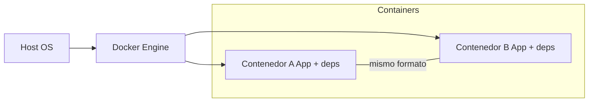
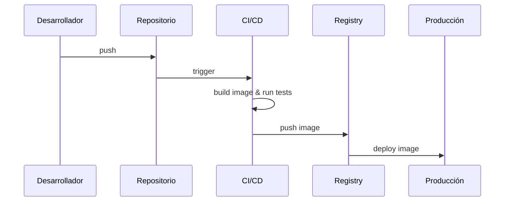
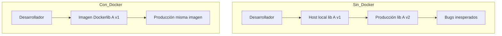

# Clase 01 - Semana 08 - Docker

- Unidad 03: Programación de interfaces gráficas
- Fecha: Lunes 29 de septiembre, 2025
- Horario: 10:50 - 13:30
- Docente: Diego Obando

## 🎯 Objetivos de la Clase

- Entender por qué usar contenedores (aislamiento y reproducibilidad)
- Levantar una base de datos Postgres en contenedor con datos persistentes.
- Levantar pgAdmin en contenedor y conectarse desde el navegador para ver/editar la BD.
- Usar los comandos mínimos para gestionar servicios: docker run, docker ps, docker logs, docker exec; y docker-compose up/down.
- Saber cómo parar, borrar y limpiar volúmenes básicos (docker-compose down -v) y dónde mirar logs si algo falla.

## Como instalar Docker desde cero en Windows

Breve (rápido) — recomendado: Windows 10/11 con soporte WSL2. Abre PowerShell como administrador para los pasos que requieren privilegios.

1. Comprobar requisitos básicos

```powershell
# Ver versión de Windows
ver

# Ver si ya tienes WSL instalado
wsl -l -v

# Verificar si la virtualización está habilitada (usa Systeminfo)
systeminfo | Select-String "Hyper-V" -SimpleMatch
```

2. Instalar WSL2 (opción rápida si tu Windows lo soporta)

```powershell
# Desde Windows 10/11 moderno (instala WSL + kernel + Ubuntu por defecto)
wsl --install

# Si ya tienes WSL pero quieres forzar WSL2 como default:
wsl --set-default-version 2
```

Si el comando `wsl --install` no está disponible en tu Windows, habilita manualmente las características:

```powershell
dism.exe /online /enable-feature /featurename:Microsoft-Windows-Subsystem-Linux /all /norestart
dism.exe /online /enable-feature /featurename:VirtualMachinePlatform /all /norestart
# Reinicia el equipo y luego descarga el kernel de WSL2 si lo solicita Microsoft.
```

3. Instalar Docker Desktop

Opción rápida con winget (si lo tienes):

```powershell
winget install --id Docker.DockerDesktop -e
```

Opción manual: descarga el instalador desde https://www.docker.com/products/docker-desktop y ejecútalo. Durante la instalación selecciona el backend WSL2 si te lo ofrece.

4. Primera puesta en marcha y prueba

Después de instalar, inicia Docker Desktop (tray icon) y espera que el estado sea "Running".

Prueba desde PowerShell (puede ser sin privilegios):

```powershell
docker version
docker info
docker run --rm hello-world
```

5. Consejos rápidos y solución de problemas

- Si la instalación pide habilitar características adicionales (Hyper-V, Virtual Machine Platform) acepta y reinicia.
- Si `hello-world` falla, abre Docker Desktop, ve a Settings → Resources → WSL Integration y activa la distro que uses.
- Si tu Windows es muy antiguo, considera actualizar a una versión con soporte WSL2 o usar Docker Toolbox (legacy, no recomendado).

## ¿Por qué Docker?

Piensa en Docker como una caja portátil para tu aplicación: dentro va el código, las dependencias y la configuración. El resultado: la app se ejecuta igual donde la pongas.

Ventajas clave (breve):

- 🧩 Aislamiento — cada contenedor corre separado; evita el clásico «en mi máquina funciona».
- 🔁 Reproducibilidad — la misma imagen, mismo comportamiento en desarrollo, pruebas y producción.
- 🚚 Portabilidad — si hay Docker, tu contenedor puede correr (Linux, macOS, Windows).
- ⚡ Eficiencia — arranca rápido y consume menos recursos que una VM.
- 📦 Despliegue simple — empaquetas todo y lo lanzas igual en cualquier entorno.
- 🌐 Ecosistema y orquestación — imágenes, Docker Hub, Docker Compose y Kubernetes para escalar.
- 🔄 Amigable con CI/CD — las pipelines usan imágenes para tests y despliegues consistentes.

Regla rápida para recordar: A-P-E-D-E-CI (Aislamiento, Portabilidad, Eficiencia, Despliegue, Ecosistema, CI/CD).

Tip práctico: empieza con un Dockerfile mínimo y usa `docker-compose` para orquestar varios servicios. Mantén las imágenes pequeñas y versiones fijas.

## Diagramas (apoyo visual)

1. Aislamiento y portabilidad



Este diagrama muestra cómo el motor Docker ejecuta contenedores aislados que llevan todo lo necesario.

2. Flujo CI/CD con imágenes Docker



Pipeline típico: commit → build imagen → tests → push al registry → despliegue.

---

## ¿Qué problemas resuelve Docker?

Docker no es magia; es una solución práctica para problemas reales que enfrentan equipos al desarrollar y desplegar software. Resumen rápido:

- 🔧 Dependencias inconsistentes — evita el «en mi máquina funciona» al fijar todo dentro de una imagen.
- 🌍 Entornos distintos — mismo artefacto para desarrollo, pruebas y producción.
- ⏱ Despliegues lentos y manuales — imágenes reproducibles aceleran despliegues.
- 🧹 Entorno sucio/limpieza — levantar y eliminar contenedores sin ensuciar el host.
- ⚖️ Escalabilidad y replicabilidad — replicas idénticas de servicios con orquestadores.
- 🔬 Pruebas más fiables — tests corriendo sobre la misma imagen que se despliega.

Pequeño diagrama (sin/ con Docker) para visualizar el contraste:



Actividad rápida (5–10 min): crea un `Dockerfile` mínimo para una app simple (Node/Python) y demuestra que la misma imagen funciona en tu máquina y en otra (o en un contenedor separado).

### Ejemplo con Python

```Dockerfile
# Usa una imagen base de Python
FROM python:3.9-slim

# Establece el directorio de trabajo
WORKDIR /app

# Copia los archivos de la aplicación
COPY . .

# Instala las dependencias
RUN pip install -r requirements.txt

# Comando por defecto
CMD ["python", "app.py"]
```

### Ejemplo de caso que resuelve Docker

Caso breve: tienes una app Python que usa Postgres. En la máquina del profe corre con Postgres 13, pero en la del alumno está la 12 — aparece un fallo de compatibilidad en tiempo de ejecución.

Sin Docker: cada quien instala versiones locales, pierde tiempo en configurar y depurar entornos.

Con Docker: definimos una imagen para la app y un servicio de Postgres en `docker-compose`. Todos usan exactamente la misma imagen y la misma versión de la base de datos.

Dockerfile mínimo (app Python):

```dockerfile
# Dockerfile
FROM python:3.10-slim
WORKDIR /app
COPY requirements.txt .
RUN pip install --no-cache-dir -r requirements.txt
COPY . .
CMD ["python", "app.py"]
```

Ejemplo `docker-compose.yml` (app + Postgres):

```yaml
# docker-compose.yml
version: '3.8'
# Define dos servicios: web (app Python) y db (Postgres)
services:
    # Servicio de la aplicación web
	web:
        # Construye la imagen de la app
		build: .
        # Expone el puerto 5000
		ports:
			- "5000:5000"
        # Variable de entorno para la base de datos, es la url de conexión
		environment:
			- DATABASE_URL=postgresql://postgres:postgres@db:5432/mydb
        # Asegura que el servicio db esté listo antes de iniciar web
		depends_on:
			- db

    # Servicio de la base de datos Postgres
	db:
        # Usa la imagen oficial de Postgres 13
		image: postgres:13
        # Variables de entorno para configurar Postgres
		environment:
			- POSTGRES_USER=postgres
			- POSTGRES_PASSWORD=postgres
			- POSTGRES_DB=mydb
        # Volumen para persistir datos entre reinicios
		volumes:
			- db-data:/var/lib/postgresql/data

# Define el volumen para persistencia de datos
volumes:
	db-data:
```

Comandos mínimos para la demo:

```powershell
docker-compose up --build
# luego, en otra terminal:
curl http://localhost:5000/health
```

Resultado esperado: la app se conecta siempre a Postgres 13 (la misma imagen), los tests y despliegues usan el mismo artefacto y la clase puede reproducir el fallo o su corrección sin diferencias entre máquinas.

Breve actividad: entrega a los estudiantes un repo pequeño con `app.py`, `requirements.txt`, `Dockerfile` y `docker-compose.yml`; que compilen y comparen "sin Docker" vs "con Docker" en 10 minutos.

### Código

### Ejemplo `app.py`

```python
from flask import Flask
import os

app = Flask(__name__)

DATABASE_URL = os.getenv("DATABASE_URL")

@app.route("/health")
def health_check():
    return {"status": "healthy", "database": DATABASE_URL}

if __name__ == "__main__":
    app.run(host="0.0.0.0", port=5000)
```

### Ejemplo `requirements.txt`

```
Flask==2.0.1
psycopg2-binary==2.9.1
```

### Comandos para correr la app

```bash
docker-compose up --build
# luego, en otra terminal:
curl http://localhost:5000/health
```

Resultado esperado: la app se conecta siempre a Postgres 13 (la misma imagen), los tests y despliegues usan el mismo artefacto y la clase puede reproducir el fallo o su corrección sin diferencias entre máquinas.

## Comandos esenciales de Docker

```bash
# Construir la imagen
docker build -t myapp .

# Correr un contenedor
docker run -p 5000:5000 myapp

# Listar contenedores
docker ps

# Detener un contenedor
docker stop <container_id>

# Eliminar un contenedor
docker rm <container_id>

# Eliminar una imagen
docker rmi <image_id>

# Ver logs de un contenedor
docker logs <container_id>

# Ejecutar un comando dentro de un contenedor en ejecución
docker exec -it <container_id> /bin/bash

# Usar docker-compose para levantar servicios definidos en docker-compose.yml
docker-compose up --build

# Detener y eliminar contenedores, redes y volúmenes creados por docker-compose
docker-compose down -v
```

## Imagen para Docker con postgres y pgAdmin

```yaml
version: "3.8"
services:
  db:
    image: postgres:13
    environment:
      POSTGRES_USER: postgres
      POSTGRES_PASSWORD: postgres
      POSTGRES_DB: mydb
    volumes:
      - db-data:/var/lib/postgresql/data

  pgadmin:
    image: dpage/pgadmin4
    environment:
      PGADMIN_DEFAULT_EMAIL: admin@admin.com
      PGADMIN_DEFAULT_PASSWORD: admin
    ports:
      - "5050:80"
    depends_on:
      - db

volumes:
  db-data:
```

### Pasos ejecución

1. Guarda el archivo como `docker-compose.yml`.
2. En la terminal, navega al directorio del archivo.
3. Ejecuta el siguiente comando para iniciar los servicios:

   ```bash
   docker-compose up -d
   ```

4. Abre tu navegador y ve a `http://localhost:5050`.
5. Inicia sesión con:
   - Email: `admin@admin.com`
   - Password: `admin`
6. Añade un nuevo servidor en pgAdmin con los siguientes detalles:
   - Name: `Local Postgres`
   - Host: `db`
   - Port: `5432`
   - Username: `postgres`
   - Password: `postgres`
7. Guarda y conecta. Ahora puedes gestionar tu base de datos Postgres desde pgAdmin.
