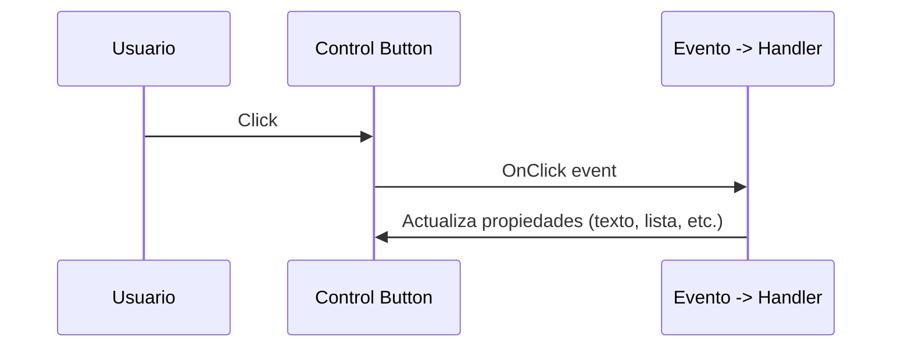

# Clase 01 - Semana 08 - Windows Forms

- Unidad 03: Programación de interfaces gráficas
- Fecha: Lunes 29 de septiembre, 2025
- Horario: 10:50 - 13:30
- Docente: Diego Obando

## 🎯 Objetivos de la Clase

- Entender los conceptos básicos de Windows Forms.
- Crear una aplicación simple usando Windows Forms.
- Manejar eventos y controles comunes en Windows Forms.
- Introducción a la depuración y pruebas de aplicaciones Windows Forms.

## ¿Qué es Windows Forms?

Windows Forms (WinForms) es un framework de Microsoft para crear aplicaciones de escritorio con interfaces gráficas en Windows. Es sencillo, maduro y excelente para aprender patrones básicos de GUI (controles, eventos y ciclo de vida de la UI).

Cuándo usarlo:

- Apps de escritorio simples o administrativas.
- Prototipos rápidos donde la integración con Windows es importante.

Requisitos rápidos:

- Windows 10/11.
- .NET SDK (6, 7 o 8) o Visual Studio (Community/Professional/Enterprise) con carga de trabajo de escritorio .NET.

Inicio rápido (PowerShell):

```powershell
# Crear un proyecto WinForms (Windows only)
dotnet new winforms -n MiAppWinForms
cd MiAppWinForms
dotnet run
```

Controles comunes que verás y su uso rápido:

- Label: mostrar texto.
- Button: acciones por click.
- TextBox: entrada de texto.
- ListBox / ComboBox: listas y selección.
- DataGridView: tablas de datos.
- PictureBox: mostrar imágenes.

Flujo de eventos (visual):



Ejemplo mínimo (código C#):

```csharp
// Dentro de Form1.cs (simplificado)
private void button1_Click(object sender, EventArgs e)
{
		// Lee texto de un TextBox y actualiza un Label
		labelStatus.Text = "Hola, " + textBoxName.Text;
}
```

## Convención de nombres para componentes visuales

- Prefijo según tipo: btn (Button), lbl (Label), txt (TextBox), lst (ListBox), dgv (DataGridView).
- Nombre descriptivo: btnSubmit, lblStatus, txtUserName.
- Usa PascalCase para nombres compuestos: btnAddItem, lblErrorMessage.

Cada componente visual en programación tiene un nombre, por ejemplo la barra de navegación inferior en una app móvil podría llamarse `navBar`:

- Nav bar:

Ejemplos y reglas prácticas:

- Prefijos adicionales: frm (Form), pnl (Panel), dlg (Dialog), mnu (MenuStrip), tbr (ToolStrip), sts (StatusStrip), chk (CheckBox), rdo (RadioButton), grp (GroupBox).
- Nombres concretos:

  - `frmMain` — ventana principal.
  - `pnlBottomNav` o `navBarBottom` — barra de navegación inferior (usa `pnl` si es un Panel, `navBar` si es un control personalizado).
  - `btnSubmit`, `btnCancel` — botones.
  - `lblStatus`, `lblErrorMessage` — etiquetas.
  - `txtUserName`, `txtPassword` — cajas de texto.
  - `dgvCustomers` — DataGridView para clientes.
  - `mnuFile`, `mnuFileExit` — elementos del menú.
  - `stsMain` — StatusStrip principal.

- Convención para handlers de eventos: usa el control + evento, por ejemplo `btnSubmit_Click`, `txtSearch_TextChanged`, `dgvCustomers_CellDoubleClick`.

- Buenas prácticas breves:
  - Sé consistente: elige inglés o español y úsalo en todo el proyecto.
  - Nombres descriptivos pero concisos: `btnAddItem` mejor que `button1`.
  - Evita caracteres especiales y espacios; no uses guiones bajos al principio.
  - Prefiere usar los prefijos solo para controles UI; no los uses para clases de dominio.

Pequeño ejemplo en C# (declaraciones en el código):

```csharp
// En el diseñador o código-behind
private System.Windows.Forms.Button btnSubmit;
private System.Windows.Forms.TextBox txtUserName;
private System.Windows.Forms.Label lblStatus;

// Handler
private void btnSubmit_Click(object sender, EventArgs e)
{
		lblStatus.Text = "Enviando...";
}
```

Regla: consistente, legible y predecible — si todos siguen la misma convención, leer y mantener la UI será mucho más rápido.

## Código de ejemplo completo

Supongamos que tenemos que crear una app simple para registrar usuarios con nombre y correo y luego mostrarlos en una lista.

Necesitaríamos los siguientes componentes:

- Formulario principal (`frmMain`).
- TextBox para nombre (`txtName`).
- TextBox para correo (`txtEmail`).
- Botón para enviar (`btnSubmit`).
- ListBox para mostrar usuarios (`lstUsers`).

Luego necesitamos establecer nuestra estructura de carpetas:

Estructura sugerida (simple):

```
MiAppWinForms/
└─ src/
   ├─ Program.cs
   └─ FrmMain.cs
└─ data/
   └─ users.json   (creado al guardar)
```

Pasos rápidos:

1. Crea el proyecto WinForms:

```powershell
dotnet new winforms -n MiAppWinForms
cd MiAppWinForms
mkdir data
```

2. Sustituye `Program.cs` y añade `FrmMain.cs` con el siguiente código (puedes pegar en `src/` o directamente en el proyecto):

Program.cs

```csharp
using System;
using System.Windows.Forms;

namespace MiAppWinForms
{
  static class Program
  {
    [STAThread]
    static void Main()
    {
      Application.SetHighDpiMode(HighDpiMode.SystemAware);
      Application.EnableVisualStyles();
      Application.SetCompatibleTextRenderingDefault(false);
      Application.Run(new FrmMain());
    }
  }
}
```

FrmMain.cs (UI creada por código, sin diseñador)

```csharp
using System;
using System.Collections.Generic;
using System.IO;
using System.Text.Json;
using System.Windows.Forms;

namespace MiAppWinForms
{
  // Form principal que contiene la UI y la lógica mínima para registrar usuarios
  public class FrmMain : Form
  {
    // Controles de la UI
    private TextBox txtName;    // entrada para el nombre
    private TextBox txtEmail;   // entrada para el email
    private Button btnSubmit;   // botón para agregar usuario
    private ListBox lstUsers;   // lista que muestra los usuarios registrados

    // Ruta del archivo donde se persisten los usuarios en JSON
    private const string DataFile = "data/users.json";

    // Constructor: inicializa la UI (sin diseñador) y carga datos guardados
    public FrmMain()
    {
      Text = "Registro de Usuarios"; // título de la ventana
      Width = 420;                    // ancho del formulario
      Height = 380;                   // alto del formulario

      // Crear controles y posicionarlos manualmente
      var lbl1 = new Label { Text = "Nombre:", Left = 10, Top = 15, Width = 60 };
      txtName = new TextBox { Left = 80, Top = 12, Width = 300 };

      var lbl2 = new Label { Text = "Email:", Left = 10, Top = 45, Width = 60 };
      txtEmail = new TextBox { Left = 80, Top = 42, Width = 300 };

      // Botón y su handler (evento Click)
      btnSubmit = new Button { Text = "Agregar", Left = 80, Top = 75, Width = 100 };
      btnSubmit.Click += BtnSubmit_Click; // suscribirse al evento Click

      // ListBox para mostrar los usuarios en formato simple
      lstUsers = new ListBox { Left = 10, Top = 110, Width = 370, Height = 210 };

      // Añadir controles al formulario
      Controls.AddRange(new Control[] { lbl1, txtName, lbl2, txtEmail, btnSubmit, lstUsers });

      // Cargar usuarios persistidos (si existen)
      LoadUsers();
    }

    // Handler del botón: valida entradas, agrega el usuario a la lista y guarda
    private void BtnSubmit_Click(object sender, EventArgs e)
    {
      var name = txtName.Text.Trim();
      var email = txtEmail.Text.Trim();

      // Validación básica: ambos campos obligatorios
      if (string.IsNullOrEmpty(name) || string.IsNullOrEmpty(email))
      {
        MessageBox.Show("Completa nombre y email", "Atención", MessageBoxButtons.OK, MessageBoxIcon.Warning);
        return;
      }

      // Crear un objeto usuario y añadirlo al ListBox en formato legible
      var user = new User { Name = name, Email = email };
      lstUsers.Items.Add(FormatUser(user));

      // Limpiar campos de entrada para la siguiente inserción
      txtName.Clear();
      txtEmail.Clear();

      // Guardar en disco la lista actualizada
      SaveUsers();
    }

    // Formatea un usuario como 'Nombre <email>' para mostrar en la ListBox
    private string FormatUser(User u) => $"{u.Name} <{u.Email}>";

    // Carga usuarios desde el archivo JSON y los muestra en la lista
    private void LoadUsers()
    {
      try
      {
        if (!File.Exists(DataFile)) return; // nada que cargar
        var json = File.ReadAllText(DataFile);
        var users = JsonSerializer.Deserialize<List<User>>(json);
        if (users == null) return;
        foreach (var u in users) lstUsers.Items.Add(FormatUser(u));
      }
      catch (Exception ex)
      {
        // Mostrar error si la carga falla (p. ej. JSON corrupto)
        MessageBox.Show($"No se pudo cargar users: {ex.Message}", "Error", MessageBoxButtons.OK, MessageBoxIcon.Error);
      }
    }

    // Serializa la lista actual de usuarios y la escribe en disco (data/users.json)
    private void SaveUsers()
    {
      try
      {
        var users = new List<User>();

        // Recorrer los items del ListBox y reconstruir objetos User
        foreach (var item in lstUsers.Items)
        {
          var s = item.ToString();
          // formato simple esperado: Nombre <email>
          var idx = s.LastIndexOf('<');
          if (idx > 0)
          {
            var name = s.Substring(0, idx).Trim();
            var email = s.Substring(idx + 1).TrimEnd('>');
            users.Add(new User { Name = name, Email = email });
          }
        }

        // Asegurar existencia de la carpeta y escribir JSON con indentación
        Directory.CreateDirectory(Path.GetDirectoryName(DataFile) ?? "data");
        var json = JsonSerializer.Serialize(users, new JsonSerializerOptions { WriteIndented = true });
        File.WriteAllText(DataFile, json);
      }
      catch (Exception ex)
      {
        // Mostrar error si el guardado falla
        MessageBox.Show($"No se pudo guardar users: {ex.Message}", "Error", MessageBoxButtons.OK, MessageBoxIcon.Error);
      }
    }

    // Clase interna simple para representar un usuario (para serializar)
    private class User { public string Name { get; set; } = ""; public string Email { get; set; } = ""; }
  }
}
```

3. Ejecuta la app:

```powershell
dotnet run
```

Qué se demuestra con este ejemplo:

- Crear controles y handlers (btnSubmit_Click).
- Mantener una lista en memoria y persistir a `data/users.json`.
- Cómo validar entrada y mostrar mensajes.

Actividad rápida: identifica mejoras o nuevas funcionalidades que podrías añadir a esta app simple.
