# Clase 01 - Semana 09 - Introducción a React

- Unidad 03: Programación de interfaces gráficas
- Fecha: Lunes 06 de Octubre, 2025
- Horario: 10:50 - 13:30
- Docente: Diego Obando

## 🎯 Objetivos de la Clase

Al finalizar esta clase, los estudiantes serán capaces de:

1. **Comprender** los conceptos fundamentales de React y su propósito en el desarrollo web moderno
2. **Identificar** la estructura básica de un componente de React y su ciclo de vida
3. **Crear** su primer proyecto de React utilizando herramientas modernas (Vite)
4. **Desarrollar** componentes simples de React utilizando JSX
5. **Aplicar** el concepto de props para la comunicación entre componentes
6. **Diferenciar** entre componentes funcionales y componentes de clase (contexto histórico)

### 📊 Niveles de Aprendizaje (Bloom)

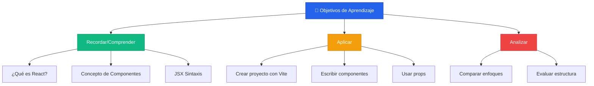

### 🎓 Resultados de Aprendizaje Esperados

| Nivel          | Acción                                                                  | Evidencia                          |
| -------------- | ----------------------------------------------------------------------- | ---------------------------------- |
| **Básico**     | Explicar qué es React y para qué sirve                                  | Participación en discusión inicial |
| **Intermedio** | Crear y renderizar componentes básicos                                  | Proyecto funcionando localmente    |
| **Avanzado**   | Construir una aplicación simple con múltiples componentes comunicándose | Mini proyecto al final de la clase |

---

## 📚 Introducción a React

### 🕰️ Historia y Contexto

React no surgió de la nada, sino como respuesta a problemas reales del desarrollo web. Veamos su evolución:

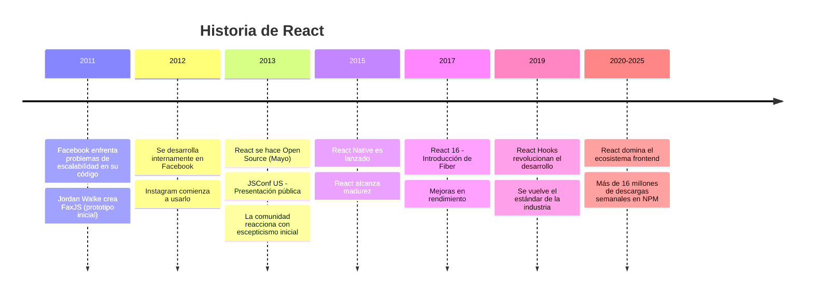

#### 💡 ¿Por qué Facebook creó React?

**El problema:**

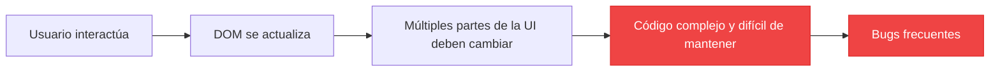

Antes de React, actualizar interfaces dinámicas era complicado:

- **jQuery**: Manipulación directa del DOM (tedioso y propenso a errores)
- **Frameworks MVC**: Sincronización manual entre modelo y vista
- **Código espagueti**: Difícil de mantener a medida que crecía la aplicación

**La solución de React:**

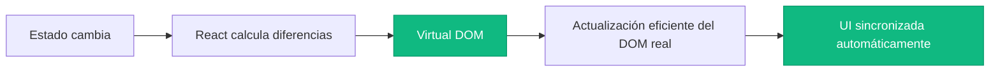

---

### 🎓 Conceptos Fundamentales

#### 1️⃣ ¿Qué es React?

> **React es una biblioteca de JavaScript para construir interfaces de usuario declarativas y basadas en componentes.**

Desglosemos esta definición:

| Término         | Significado                                          | Beneficio                                   |
| --------------- | ---------------------------------------------------- | ------------------------------------------- |
| **Biblioteca**  | No es un framework completo, solo se enfoca en la UI | Flexibilidad para elegir otras herramientas |
| **Declarativa** | Describes _qué_ quieres mostrar, no _cómo_ hacerlo   | Código más legible y predecible             |
| **Componentes** | Piezas reutilizables de UI                           | Modularidad y mantenibilidad                |

#### 2️⃣ Paradigma Declarativo vs Imperativo

**Enfoque Imperativo (JavaScript tradicional):**

```javascript
// Le decimos al navegador CÓMO hacer cada cosa paso a paso
const button = document.createElement("button");
button.textContent = "Click me";
button.addEventListener("click", () => {
  const counter = document.getElementById("counter");
  counter.textContent = parseInt(counter.textContent) + 1;
});
document.body.appendChild(button);
```

**Enfoque Declarativo (React):**

```javascript
// Le decimos a React QUÉ queremos mostrar
function Counter() {
  const [count, setCount] = useState(0);

  return <button onClick={() => setCount(count + 1)}>Contador: {count}</button>;
}
```

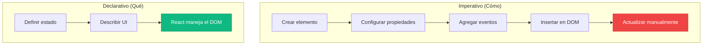

#### 3️⃣ Componentes: Los Bloques de Construcción

Los componentes son como **piezas de LEGO** que puedes combinar para crear interfaces complejas.

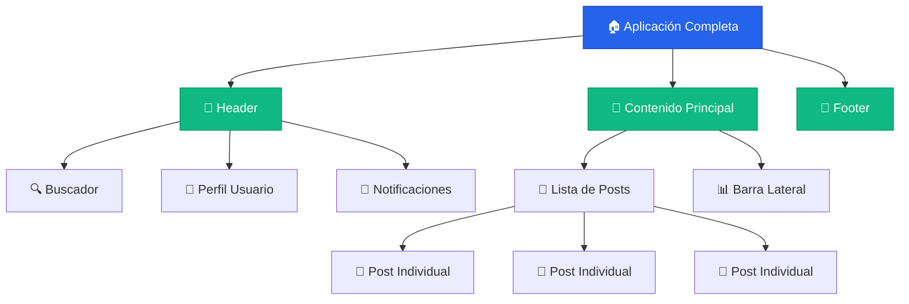

**Características de los Componentes:**

- ✅ **Reutilizables**: Escribe una vez, usa muchas veces
- ✅ **Independientes**: Cada componente maneja su propia lógica
- ✅ **Componibles**: Se pueden anidar para crear UIs complejas
- ✅ **Mantenibles**: Más fácil encontrar y arreglar bugs

#### 4️⃣ Virtual DOM: La Magia de React

React no actualiza el DOM directamente (que es lento). Usa un **Virtual DOM**.

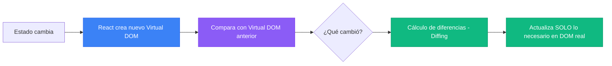

**Ejemplo visual:**

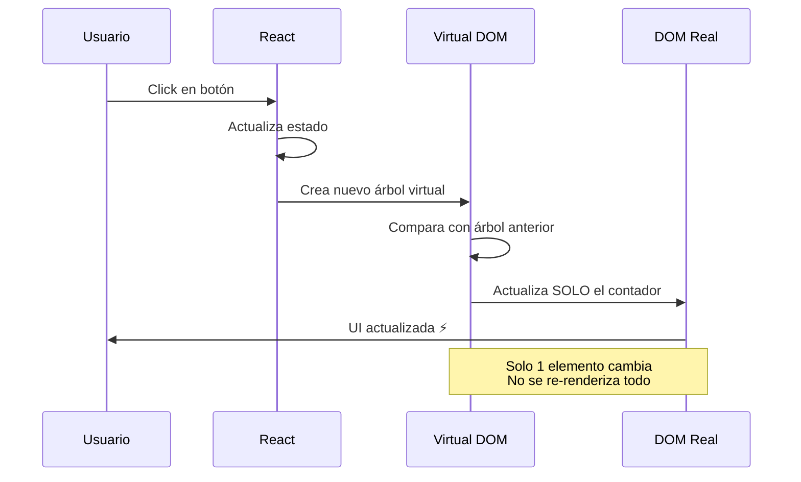

#### 5️⃣ JSX: HTML en JavaScript

JSX es una **extensión de sintaxis** que parece HTML pero es JavaScript.

```javascript
// Esto es JSX (parece HTML)
const elemento = <h1>Hola Mundo</h1>;

// React lo convierte en esto (JavaScript puro)
const elemento = React.createElement("h1", null, "Hola Mundo");
```

**Ventajas de JSX:**

- 📖 **Legible**: Familiar para quien conoce HTML
- 🔒 **Seguro**: Previene inyección de código (XSS)
- 💪 **Poderoso**: Puedes usar JavaScript dentro del markup


---

### 🎯 Resumen de Conceptos Clave

| Concepto        | Definición Corta                  | ¿Por qué importa?              |
| --------------- | --------------------------------- | ------------------------------ |
| **React**       | Biblioteca para UIs               | Simplifica desarrollo frontend |
| **Componentes** | Piezas reutilizables de UI        | Código modular y mantenible    |
| **Virtual DOM** | Representación en memoria del DOM | Rendimiento optimizado         |
| **JSX**         | HTML + JavaScript                 | Sintaxis intuitiva y poderosa  |
| **Declarativo** | Describes el resultado final      | Menos bugs, más predecible     |

### 💭 Pregunta de Reflexión

> **Antes de continuar:** ¿Cómo creen que el Virtual DOM hace que React sea más rápido que manipular el DOM directamente?
>
> _Tómense un momento para discutir en parejas._

---

## 🔧 Configuración del Entorno de Desarrollo

### ⚠️ Cambio Importante en el Ecosistema React (2023-2025)

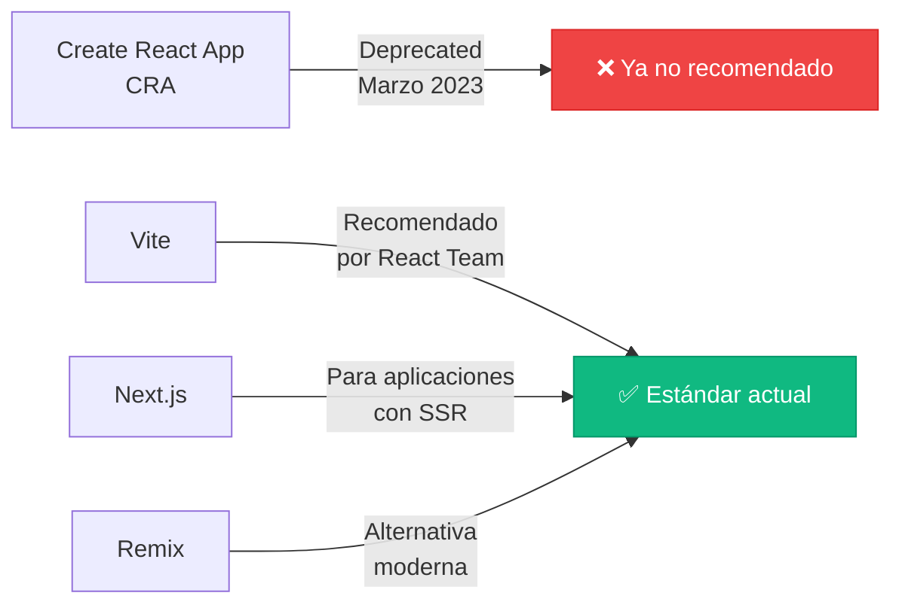

#### 📢 ¿Qué pasó con Create React App?

| Aspecto                 | Create React App (CRA)                         | Vite                        |
| ----------------------- | ---------------------------------------------- | --------------------------- |
| **Estado**              | ❌ Deprecado (Meta ya no mantiene activamente) | ✅ Activo y en desarrollo   |
| **Velocidad**           | 🐌 Lento (usa Webpack)                         | ⚡ Muy rápido (usa esbuild) |
| **HMR**                 | ~2-5 segundos                                  | ~50-200ms                   |
| **Build**               | ~30-60 segundos                                | ~5-15 segundos              |
| **Tamaño**              | 200+ MB de node_modules                        | ~50 MB de node_modules      |
| **Documentación React** | Ya no aparece en docs oficiales                | Recomendado oficialmente    |

**Conclusión:** En 2025, **Vite es el estándar de facto** para nuevos proyectos React.

---

### 📋 Pre-requisitos

Antes de comenzar, necesitamos tener instalado:

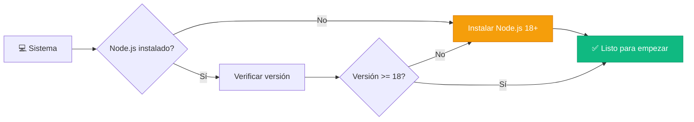

#### 🔍 Verificar Node.js

Abre una terminal (PowerShell, CMD o la terminal de VS Code) y ejecuta:

```powershell
node --version
```

Deberías ver algo como: `v20.10.0` o superior.

Si no tienes Node.js instalado:

- 🌐 Descárgalo desde: [nodejs.org](https://nodejs.org)
- 📦 Recomendado: **Versión LTS** (Long Term Support)

---

### 🚀 Crear Primer Proyecto con Vite

#### Paso 1: Ejecutar el comando de creación

```powershell
npm create vite@latest mi-primera-app-react -- --template react
```

**Desglose del comando:**

- `npm create vite@latest` → Usa la última versión de Vite
- `mi-primera-app-react` → Nombre de tu proyecto
- `--template react` → Usa la plantilla de React (con JavaScript)

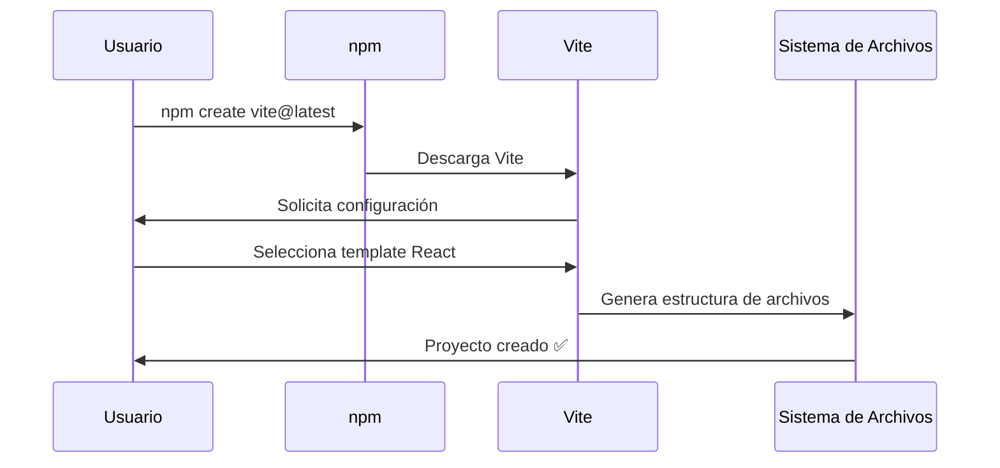

#### Paso 2: Alternativa Interactiva (Recomendado para clase)

Si quieres ver todas las opciones:

```powershell
npm create vite@latest
```

Vite te preguntará:

1. **Project name:** `mi-primera-app-react`
2. **Select a framework:** `React` ⚛️
3. **Select a variant:** `JavaScript` (por ahora)

```
? Project name: › mi-primera-app-react
? Select a framework: › - Use arrow-keys. Return to submit.
    Vanilla
    Vue
❯   React        ← Seleccionar esto
    Preact
    Lit
    Svelte
    Solid
    Qwik
    Others

? Select a variant: › - Use arrow-keys. Return to submit.
❯   JavaScript   ← Seleccionar esto (más simple para empezar)
    TypeScript
    JavaScript + SWC
    TypeScript + SWC
```

#### Paso 3: Entrar al proyecto

```powershell
cd mi-primera-app-react
```

#### Paso 4: Instalar dependencias

```powershell
npm install
```

Esto descarga todos los paquetes necesarios (React, ReactDOM, Vite, etc.)

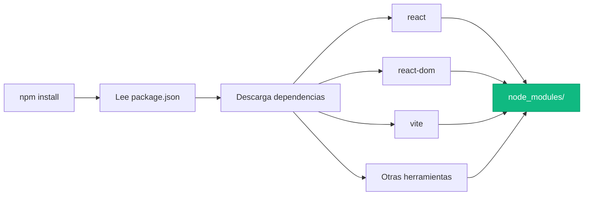

**⏱️ Tiempo estimado:** 30-60 segundos (dependiendo de tu conexión)

#### Paso 5: Iniciar servidor de desarrollo

```powershell
npm run dev
```

Verás algo como:

```
  VITE v5.0.0  ready in 500 ms

  ➜  Local:   http://localhost:5173/
  ➜  Network: use --host to expose
  ➜  press h + enter to show help
```

**🎉 ¡Felicidades!** Tu aplicación React está corriendo.

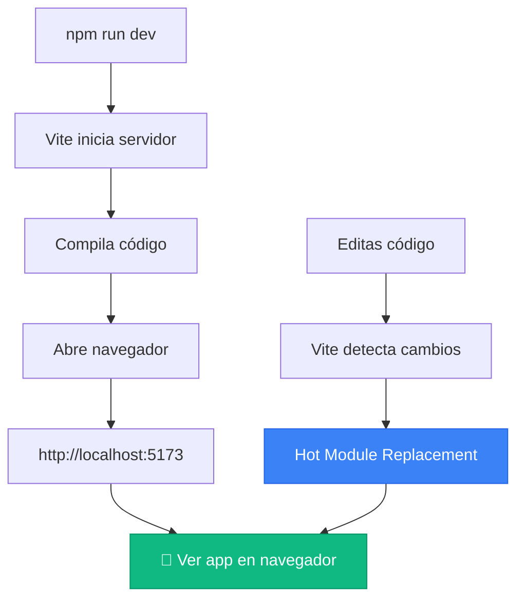

---

### 📁 Estructura del Proyecto

Al abrir la carpeta `mi-primera-app-react` verás:

```
mi-primera-app-react/
├── 📁 node_modules/        ← Dependencias (no tocar)
├── 📁 public/               ← Archivos estáticos
│   └── vite.svg
├── 📁 src/                  ← ¡AQUÍ trabajaremos!
│   ├── 📄 App.css          ← Estilos del componente App
│   ├── 📄 App.jsx          ← Componente principal
│   ├── 📄 index.css        ← Estilos globales
│   └── 📄 main.jsx         ← Punto de entrada
├── 📄 .gitignore           ← Archivos ignorados por Git
├── 📄 index.html           ← HTML base
├── 📄 package.json         ← Configuración del proyecto
├── 📄 vite.config.js       ← Configuración de Vite
└── 📄 README.md            ← Documentación
```

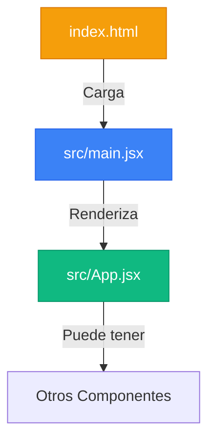

#### 🔍 Archivos Clave Explicados

**1. `index.html` - La base**

```html
<!DOCTYPE html>
<html lang="en">
  <head>
    <meta charset="UTF-8" />
    <meta name="viewport" content="width=device-width, initial-scale=1.0" />
    <title>Vite + React</title>
  </head>
  <body>
    <div id="root"></div>
    ← React se monta aquí
    <script type="module" src="/src/main.jsx"></script>
    ← Punto de entrada
  </body>
</html>
```

**2. `src/main.jsx` - Punto de entrada de React**

```jsx
import React from "react";
import ReactDOM from "react-dom/client";
import App from "./App.jsx";
import "./index.css";

// Esto conecta React con el HTML
ReactDOM.createRoot(document.getElementById("root")).render(
  <React.StrictMode>
    <App /> ← Tu aplicación comienza aquí
  </React.StrictMode>
);
```

**3. `src/App.jsx` - Tu primer componente**

```jsx
import { useState } from "react";
import "./App.css";

function App() {
  const [count, setCount] = useState(0);

  return (
    <>
      <h1>Vite + React</h1>
      <button onClick={() => setCount(count + 1)}>count is {count}</button>
    </>
  );
}

export default App;
```

**4. `package.json` - Configuración del proyecto**

```json
{
  "name": "mi-primera-app-react",
  "version": "0.0.0",
  "scripts": {
    "dev": "vite",              ← Servidor de desarrollo
    "build": "vite build",      ← Compilar para producción
    "preview": "vite preview"   ← Ver build de producción
  },
  "dependencies": {
    "react": "^18.2.0",         ← Biblioteca React
    "react-dom": "^18.2.0"      ← React para el navegador
  }
}
```

---

### 🎨 Flujo de Desarrollo

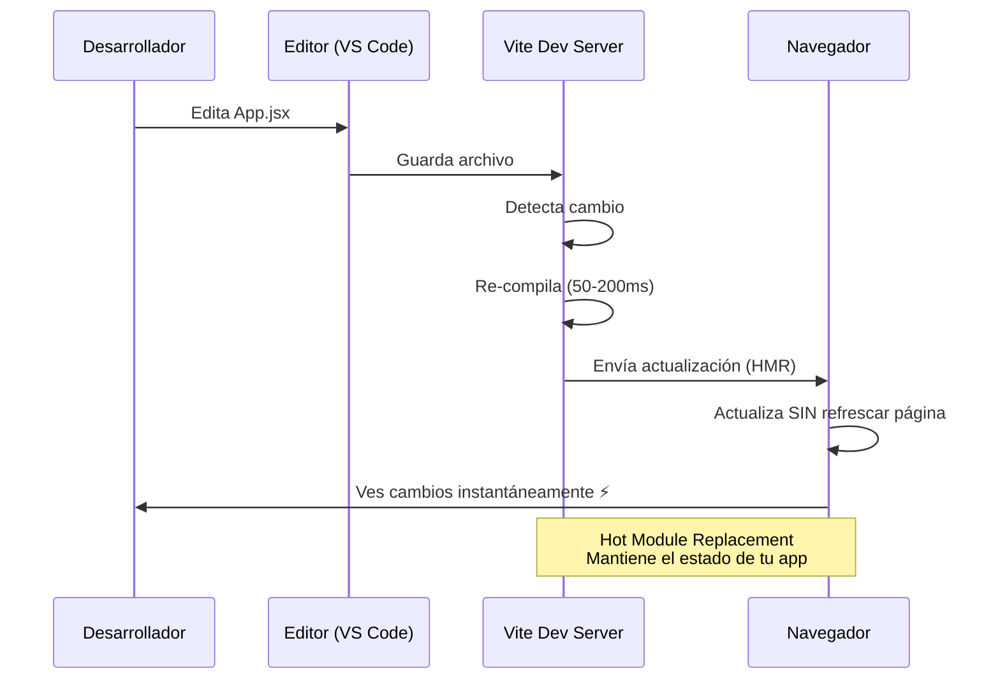

### 🧪 Ejercicio Práctico Guiado

**Objetivo:** Modificar el proyecto inicial para sentir el poder de Vite

#### Paso 1: Abre `src/App.jsx`

#### Paso 2: Cambia el título

```jsx
// Antes
<h1>Vite + React</h1>

// Después
<h1>¡Mi Primera App con React! 🚀</h1>
```

#### Paso 3: Guarda el archivo (Ctrl + S)

**🎯 Observa:** El navegador se actualiza INSTANTÁNEAMENTE sin perder el estado del contador.

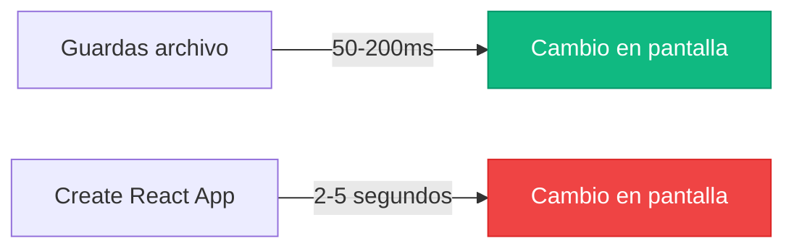

---

### 💡 Comandos Esenciales

| Comando           | Propósito                     | Cuándo usarlo                       |
| ----------------- | ----------------------------- | ----------------------------------- |
| `npm run dev`     | Inicia servidor de desarrollo | Durante desarrollo (todos los días) |
| `npm run build`   | Compila para producción       | Antes de deployar                   |
| `npm run preview` | Vista previa del build        | Para probar antes de deployar       |

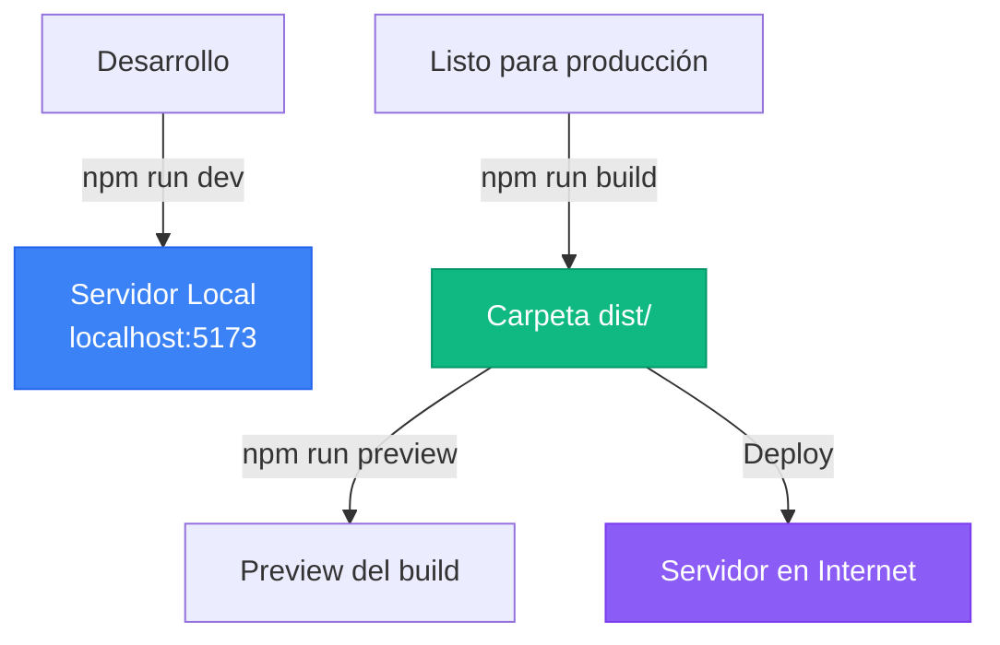

---

### 🎯 Resumen de esta Sección

✅ **Aprendimos:**

- Por qué Vite es el estándar actual (CRA está deprecado)
- Cómo crear un proyecto React moderno
- La estructura de archivos de un proyecto Vite + React
- El flujo de trabajo con Hot Module Replacement

✅ **Habilidades prácticas:**

- Crear proyecto con `npm create vite@latest`
- Iniciar servidor de desarrollo
- Navegar por la estructura del proyecto

### 🚀 Siguiente Paso

Ahora que tenemos nuestro entorno listo, vamos a:

- **Crear nuestro primer componente desde cero**
- **Entender JSX en profundidad**
- **Aprender sobre props**

### 💭 Pregunta de Reflexión

> **Antes de continuar:** Abre tu proyecto en VS Code y explora la carpeta `src/`. ¿Qué archivo crees que deberíamos modificar primero para crear nuestro primer componente personalizado?

---

## Properties (Props) en React

### ¿Qué son las Props?

Las **Props** (abreviatura de "properties" o propiedades) son el mecanismo que React utiliza para **pasar datos de un componente padre a un componente hijo**. Son como los argumentos o parámetros de una función, pero para componentes.

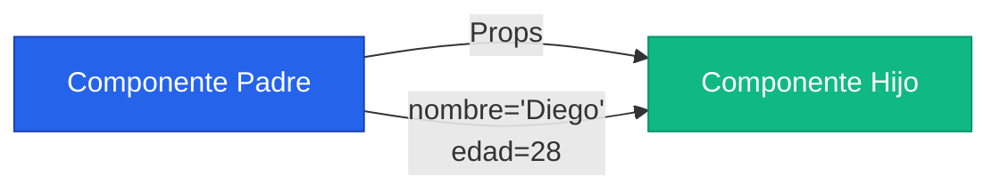

#### 🎯 Características Clave de las Props

| Característica       | Descripción                                             | Ejemplo                     |
| -------------------- | ------------------------------------------------------- | --------------------------- |
| **Inmutables**       | No pueden ser modificadas por el componente hijo        | `props.nombre` es read-only |
| **Unidireccionales** | Fluyen solo de padre a hijo                             | Top-down data flow          |
| **Cualquier tipo**   | Pueden ser strings, números, objetos, arrays, funciones | `name="Diego"` `age={28}`   |
| **Opcionales**       | Se pueden definir valores por defecto                   | `defaultProps`              |

---

### 📝 Sintaxis Básica

#### Ejemplo sin Props (Componente Estático)

```jsx
// Saludo.jsx - Componente que siempre muestra lo mismo
function Saludo() {
  return <h2>¡Hola Usuario!</h2>;
}

// App.jsx
function App() {
  return (
    <>
      <Saludo />
      <Saludo />
      <Saludo />
    </>
  );
}
// Resultado: Tres saludos idénticos ❌
```

#### Ejemplo con Props (Componente Dinámico)

```jsx
// Saludo.jsx - Componente reutilizable con props
function Saludo(props) {
  return <h2>¡Hola {props.nombre}!</h2>;
}

// App.jsx
function App() {
  return (
    <>
      <Saludo nombre="Diego" />
      <Saludo nombre="María" />
      <Saludo nombre="Juan" />
    </>
  );
}
// Resultado: Tres saludos personalizados ✅
```

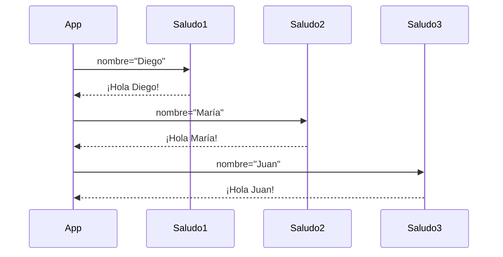

---

### 🎨 Destructuring de Props (Buena Práctica)

En lugar de usar `props.nombre`, `props.edad`, etc., podemos "destructurar" el objeto props:

**❌ Sin destructuring (repetitivo):**

```jsx
function TarjetaPerfil(props) {
  return (
    <div>
      <h3>{props.nombre}</h3>
      <p>{props.profesion}</p>
      <p>{props.edad} años</p>
      <p>{props.email}</p>
    </div>
  );
}
```

**✅ Con destructuring (limpio):**

```jsx
function TarjetaPerfil({ nombre, profesion, edad, email }) {
  return (
    <div>
      <h3>{nombre}</h3>
      <p>{profesion}</p>
      <p>{edad} años</p>
      <p>{email}</p>
    </div>
  );
}
```

```mermaid
graph LR
    A[props object] -->|Destructuring| B[Variables individuales]
    B --> C[nombre]
    B --> D[profesion]
    B --> E[edad]
    B --> F[email]

    style A fill:#ef4444,stroke:#dc2626,color:#fff
    style C fill:#10b981,stroke:#059669,color:#fff
    style D fill:#10b981,stroke:#059669,color:#fff
    style E fill:#10b981,stroke:#059669,color:#fff
    style F fill:#10b981,stroke:#059669,color:#fff
```

---

### 🔢 Tipos de Props

#### 1. Strings (cadenas de texto)

```jsx
<Saludo nombre="Diego" mensaje="Bienvenido" />
```

#### 2. Numbers (números)

```jsx
<Producto precio={19.99} cantidad={5} />
```

⚠️ **Importante**: Los números deben ir entre llaves `{}`, no entre comillas.

#### 3. Booleans (verdadero/falso)

```jsx
<Boton activo={true} deshabilitado={false} />

// Shorthand: Si el valor es true, puedes omitirlo
<Boton activo deshabilitado={false} />
```

#### 4. Arrays (listas)

```jsx
<ListaProductos items={["Manzana", "Banana", "Naranja"]} />
```

#### 5. Objects (objetos)

```jsx
<Usuario
  datos={{
    nombre: "Diego",
    edad: 28,
    email: "diego@ejemplo.com",
  }}
/>
```

#### 6. Functions (funciones)

```jsx
<Boton onClick={() => console.log("Click!")} />
```

```mermaid
graph TD
    A[Tipos de Props] --> B[Primitivos]
    A --> C[Complejos]
    A --> D[Especiales]

    B --> B1[String]
    B --> B2[Number]
    B --> B3[Boolean]

    C --> C1[Array]
    C --> C2[Object]

    D --> D1[Function]
    D --> D2[JSX Elements]

    style A fill:#2563eb,stroke:#1e40af,color:#fff
    style B fill:#10b981,stroke:#059669,color:#fff
    style C fill:#f59e0b,stroke:#d97706,color:#fff
    style D fill:#8b5cf6,stroke:#7c3aed,color:#fff
```

---

### 🧪 Ejercicio Práctico Completo

Vamos a crear un componente `TarjetaProducto` que acepta múltiples tipos de props:

```jsx
// TarjetaProducto.jsx
function TarjetaProducto({
  nombre,
  precio,
  imagen,
  enStock,
  onAgregarCarrito,
}) {
  return (
    <div style={styles.card}>
      
      <h3>{nombre}</h3>
      <p style={styles.precio}>${precio.toFixed(2)}</p>

      {enStock ? (
        <p style={styles.disponible}>✅ Disponible</p>
      ) : (
        <p style={styles.agotado}>❌ Agotado</p>
      )}

      <button
        onClick={() => onAgregarCarrito(nombre)}
        disabled={!enStock}
        style={enStock ? styles.boton : styles.botonDeshabilitado}
      >
        Agregar al Carrito
      </button>
    </div>
  );
}

const styles = {
  card: {
    border: "2px solid #e5e7eb",
    borderRadius: "8px",
    padding: "16px",
    margin: "10px",
    width: "200px",
    textAlign: "center",
  },
  imagen: {
    width: "100%",
    height: "150px",
    objectFit: "cover",
    borderRadius: "4px",
  },
  precio: {
    fontSize: "24px",
    fontWeight: "bold",
    color: "#10b981",
  },
  disponible: {
    color: "#10b981",
  },
  agotado: {
    color: "#ef4444",
  },
  boton: {
    backgroundColor: "#3b82f6",
    color: "white",
    padding: "10px 20px",
    border: "none",
    borderRadius: "4px",
    cursor: "pointer",
  },
  botonDeshabilitado: {
    backgroundColor: "#9ca3af",
    color: "white",
    padding: "10px 20px",
    border: "none",
    borderRadius: "4px",
    cursor: "not-allowed",
  },
};

export default TarjetaProducto;
```

**Uso en App.jsx:**

```jsx
// App.jsx
import TarjetaProducto from "./TarjetaProducto";

function App() {
  const manejarAgregarCarrito = (nombreProducto) => {
    alert(`${nombreProducto} agregado al carrito!`);
  };

  return (
    <div
      style={{ display: "flex", justifyContent: "center", flexWrap: "wrap" }}
    >
      <TarjetaProducto
        nombre="Laptop Gaming"
        precio={1299.99}
        imagen="https://picsum.photos/200/150?random=1"
        enStock={true}
        onAgregarCarrito={manejarAgregarCarrito}
      />

      <TarjetaProducto
        nombre="Mouse Inalámbrico"
        precio={29.99}
        imagen="https://picsum.photos/200/150?random=2"
        enStock={true}
        onAgregarCarrito={manejarAgregarCarrito}
      />

      <TarjetaProducto
        nombre="Teclado Mecánico"
        precio={149.99}
        imagen="https://picsum.photos/200/150?random=3"
        enStock={false}
        onAgregarCarrito={manejarAgregarCarrito}
      />
    </div>
  );
}

export default App;
```

---

### 🎯 Props vs Estado (Comparación)

```mermaid
graph TD
    subgraph "Props"
        A1[Vienen del padre]
        A2[Inmutables]
        A3[Comunicación padre→hijo]
    end

    subgraph "Estado - useState"
        B1[Definidos en el componente]
        B2[Mutables con setState]
        B3[Datos internos]
    end

    style A1 fill:#3b82f6,stroke:#2563eb,color:#fff
    style A2 fill:#3b82f6,stroke:#2563eb,color:#fff
    style A3 fill:#3b82f6,stroke:#2563eb,color:#fff
    style B1 fill:#f59e0b,stroke:#d97706,color:#fff
    style B2 fill:#f59e0b,stroke:#d97706,color:#fff
    style B3 fill:#f59e0b,stroke:#d97706,color:#fff
```

| Aspecto         | Props                       | Estado (State)                          |
| --------------- | --------------------------- | --------------------------------------- |
| **Origen**      | Vienen del componente padre | Se definen dentro del componente        |
| **Mutabilidad** | ❌ Inmutables (read-only)   | ✅ Mutables (con setter)                |
| **Propósito**   | Configurar componentes      | Datos que cambian con el tiempo         |
| **Flujo**       | Padre → Hijo                | Interno al componente                   |
| **Ejemplo**     | `<Saludo nombre="Diego" />` | `const [count, setCount] = useState(0)` |

---

### 💡 Props: Mejores Prácticas

#### 1. ✅ Nombres Descriptivos

```jsx
// ❌ Mal
<Card d="Diego" n={28} />

// ✅ Bien
<Card nombre="Diego" edad={28} />
```

#### 2. ✅ Valores Por Defecto (DefaultProps)

```jsx
function Saludo({ nombre = "Usuario", emoji = "👋" }) {
  return <h2>¡Hola {nombre}! {emoji}</h2>;
}

// Si no pasas props, usa los valores por defecto
<Saludo /> // ¡Hola Usuario! 👋
<Saludo nombre="Diego" /> // ¡Hola Diego! 👋
<Saludo nombre="María" emoji="🌟" /> // ¡Hola María! 🌟
```

#### 3. ✅ Validación de Props (PropTypes)

```jsx
import PropTypes from "prop-types";

function TarjetaProducto({ nombre, precio, enStock }) {
  // ... código del componente
}

// Validación de tipos
TarjetaProducto.propTypes = {
  nombre: PropTypes.string.isRequired,
  precio: PropTypes.number.isRequired,
  enStock: PropTypes.bool,
};

// Valores por defecto
TarjetaProducto.defaultProps = {
  enStock: true,
};
```

#### 4. ✅ Spread Operator para Muchas Props

```jsx
const datosUsuario = {
  nombre: 'Diego',
  edad: 28,
  email: 'diego@ejemplo.com',
  profesion: 'Desarrollador'
};

// ❌ Sin spread
<Perfil
  nombre={datosUsuario.nombre}
  edad={datosUsuario.edad}
  email={datosUsuario.email}
  profesion={datosUsuario.profesion}
/>

// ✅ Con spread
<Perfil {...datosUsuario} />
```

---

### 🎓 Resumen de Props

✅ **Conceptos clave:**

- Props permiten pasar datos de padre a hijo
- Son inmutables (read-only)
- Pueden ser de cualquier tipo (string, number, boolean, array, object, function)
- Destructuring hace el código más limpio
- Flujo unidireccional: padre → hijo

✅ **Cuándo usar Props:**

- Para configurar componentes reutilizables
- Para pasar datos entre componentes
- Para pasar funciones callback (comunicación hijo → padre)

```mermaid
graph LR
    A[Componente Padre] -->|Props| B[Componente Hijo]
    B -->|Callback Function| A

    style A fill:#2563eb,stroke:#1e40af,color:#fff
    style B fill:#10b981,stroke:#059669,color:#fff
```

### 💭 Pregunta de Reflexión

> **Para la próxima clase:** Si las props son inmutables y fluyen solo de padre a hijo, ¿cómo creen que un componente hijo puede "comunicarse" con su padre? (Pista: una de las props puede ser una función 😉)

---

## 🪝 Hooks en React

### ¿Qué son los Hooks?

Los **Hooks** son funciones especiales que te permiten "enganchar" funcionalidades de React (como estado y ciclo de vida) en componentes funcionales. Antes de los Hooks (pre-2019), estas funcionalidades solo estaban disponibles en componentes de clase.

```mermaid
timeline
    title Evolución de los Componentes en React
    2013-2018 : Componentes de Clase para estado
              : Componentes Funcionales solo para UI estática
              : Código complejo y difícil de reutilizar
    2019 : React 16.8 introduce Hooks
         : Revolución en el desarrollo
         : useState, useEffect lanzados
    2020-2025 : Hooks se vuelven el estándar
              : Componentes funcionales dominan
              : Componentes de clase casi obsoletos
```

#### 🎯 ¿Por qué se crearon los Hooks?

**Problemas antes de los Hooks:**

```mermaid
graph TD
    A[Problemas sin Hooks] --> B[Reutilización difícil]
    A --> C[Componentes complejos]
    A --> D[Clases confusas]

    B --> B1[HOCs anidados]
    B --> B2[Render Props complicados]

    C --> C1[Lógica dispersa en métodos]
    C --> C2[componentDidMount gigantes]

    D --> D1[this binding]
    D --> D2[Difícil para principiantes]

    style A fill:#ef4444,stroke:#dc2626,color:#fff
    style B fill:#f59e0b,stroke:#d97706,color:#fff
    style C fill:#f59e0b,stroke:#d97706,color:#fff
    style D fill:#f59e0b,stroke:#d97706,color:#fff
```

**Solución con Hooks:**

```mermaid
graph LR
    A[Hooks] --> B[Reutilización fácil]
    A --> C[Lógica agrupada]
    A --> D[Sintaxis simple]

    style A fill:#10b981,stroke:#059669,color:#fff
    style B fill:#10b981,stroke:#059669,color:#fff
    style C fill:#10b981,stroke:#059669,color:#fff
    style D fill:#10b981,stroke:#059669,color:#fff
```

---

### 📋 Reglas de los Hooks

⚠️ **IMPORTANTE**: Los Hooks tienen reglas estrictas que DEBES seguir:

```mermaid
graph TD
    A[Reglas de los Hooks] --> B[🔴 Regla 1:<br/>Solo en el nivel superior]
    A --> C[🔴 Regla 2:<br/>Solo en componentes React]

    B --> B1[❌ No en bucles]
    B --> B2[❌ No en condicionales]
    B --> B3[❌ No en funciones anidadas]

    C --> C1[✅ En componentes funcionales]
    C --> C2[✅ En custom hooks]

    style A fill:#2563eb,stroke:#1e40af,color:#fff
    style B fill:#ef4444,stroke:#dc2626,color:#fff
    style C fill:#ef4444,stroke:#dc2626,color:#fff
    style C1 fill:#10b981,stroke:#059669,color:#fff
    style C2 fill:#10b981,stroke:#059669,color:#fff
```

#### ❌ Ejemplo INCORRECTO:

```jsx
function MiComponente() {
  if (algunaCondicion) {
    const [estado, setEstado] = useState(0); // ❌ NUNCA hacer esto
  }

  for (let i = 0; i < 5; i++) {
    const [valor, setValor] = useState(i); // ❌ NUNCA hacer esto
  }

  const miFuncion = () => {
    const [dato, setDato] = useState(""); // ❌ NUNCA hacer esto
  };

  return <div>Componente</div>;
}
```

#### ✅ Ejemplo CORRECTO:

```jsx
function MiComponente() {
  // ✅ Todos los hooks al inicio, en el nivel superior
  const [estado, setEstado] = useState(0);
  const [valor, setValor] = useState(0);
  const [dato, setDato] = useState("");

  // Ahora puedes usar lógica condicional con los valores
  if (algunaCondicion) {
    // Usa el estado, pero no lo declares aquí
    console.log(estado);
  }

  return <div>Componente</div>;
}
```

---

### 🎨 useState: El Hook Fundamental

`useState` es el hook más utilizado. Te permite agregar **estado** a tus componentes funcionales.

#### 📖 Sintaxis Básica

```jsx
const [variable, funcionParaCambiarla] = useState(valorInicial);
```

```mermaid
graph LR
    A[useState] --> B[Retorna un array]
    B --> C[Posición 0:<br/>Valor actual]
    B --> D[Posición 1:<br/>Función setter]

    style A fill:#2563eb,stroke:#1e40af,color:#fff
    style C fill:#10b981,stroke:#059669,color:#fff
    style D fill:#f59e0b,stroke:#d97706,color:#fff
```

#### 🧪 Ejemplo Simple: Contador

```jsx
import { useState } from "react";

function Contador() {
  // Declaración del estado
  const [contador, setContador] = useState(0);

  return (
    <div>
      <h2>Contador: {contador}</h2>

      <button onClick={() => setContador(contador + 1)}>➕ Incrementar</button>

      <button onClick={() => setContador(contador - 1)}>➖ Decrementar</button>

      <button onClick={() => setContador(0)}>🔄 Reiniciar</button>
    </div>
  );
}

export default Contador;
```

**Flujo del estado:**

```mermaid
sequenceDiagram
    participant U as Usuario
    participant B as Botón
    participant H as useState
    participant C as Componente

    U->>B: Click en "Incrementar"
    B->>H: setContador(contador + 1)
    H->>H: Actualiza estado interno
    H->>C: Re-renderiza componente
    C->>U: Muestra nuevo valor en pantalla

    Note over H,C: React optimiza y solo<br/>actualiza lo necesario
```

---

### 🔢 useState con Diferentes Tipos de Datos

#### 1. Numbers (números)

```jsx
function EjemploNumeros() {
  const [edad, setEdad] = useState(0);
  const [precio, setPrecio] = useState(19.99);

  return (
    <div>
      <p>Edad: {edad}</p>
      <button onClick={() => setEdad(edad + 1)}>Cumplir años</button>

      <p>Precio: ${precio}</p>
      <button onClick={() => setPrecio(precio * 1.1)}>Aumentar 10%</button>
    </div>
  );
}
```

#### 2. Strings (texto)

```jsx
function EjemploStrings() {
  const [nombre, setNombre] = useState("");
  const [mensaje, setMensaje] = useState("Hola Mundo");

  return (
    <div>
      <input
        type="text"
        value={nombre}
        onChange={(e) => setNombre(e.target.value)}
        placeholder="Escribe tu nombre"
      />
      <p>Tu nombre es: {nombre}</p>

      <button onClick={() => setMensaje("¡Hola " + nombre + "!")}>
        Saludar
      </button>
      <p>{mensaje}</p>
    </div>
  );
}
```

#### 3. Booleans (verdadero/falso)

```jsx
function EjemploBooleans() {
  const [estaActivo, setEstaActivo] = useState(false);
  const [mostrarContenido, setMostrarContenido] = useState(true);

  return (
    <div>
      <button onClick={() => setEstaActivo(!estaActivo)}>
        {estaActivo ? "🟢 Activo" : "🔴 Inactivo"}
      </button>

      <button onClick={() => setMostrarContenido(!mostrarContenido)}>
        {mostrarContenido ? "👁️ Ocultar" : "👁️ Mostrar"}
      </button>

      {mostrarContenido && <p>Este contenido puede ocultarse</p>}
    </div>
  );
}
```

#### 4. Arrays (listas)

```jsx
function EjemploArrays() {
  const [tareas, setTareas] = useState(["Estudiar React", "Hacer ejercicios"]);
  const [nuevaTarea, setNuevaTarea] = useState("");

  const agregarTarea = () => {
    if (nuevaTarea.trim() !== "") {
      // ✅ Crear nuevo array con spread operator
      setTareas([...tareas, nuevaTarea]);
      setNuevaTarea("");
    }
  };

  const eliminarTarea = (indice) => {
    // ✅ Filtrar para crear nuevo array
    setTareas(tareas.filter((_, i) => i !== indice));
  };

  return (
    <div>
      <input
        type="text"
        value={nuevaTarea}
        onChange={(e) => setNuevaTarea(e.target.value)}
        placeholder="Nueva tarea"
      />
      <button onClick={agregarTarea}>➕ Agregar</button>

      <ul>
        {tareas.map((tarea, indice) => (
          <li key={indice}>
            {tarea}
            <button onClick={() => eliminarTarea(indice)}>❌</button>
          </li>
        ))}
      </ul>
    </div>
  );
}
```

#### 5. Objects (objetos)

```jsx
function EjemploObjetos() {
  const [usuario, setUsuario] = useState({
    nombre: "",
    edad: 0,
    email: "",
    ciudad: "",
  });

  // ✅ Función helper para actualizar propiedades
  const actualizarCampo = (campo, valor) => {
    setUsuario({
      ...usuario, // Copiar todo el objeto anterior
      [campo]: valor, // Actualizar solo el campo específico
    });
  };

  return (
    <div>
      <input
        type="text"
        value={usuario.nombre}
        onChange={(e) => actualizarCampo("nombre", e.target.value)}
        placeholder="Nombre"
      />

      <input
        type="number"
        value={usuario.edad}
        onChange={(e) => actualizarCampo("edad", e.target.value)}
        placeholder="Edad"
      />

      <input
        type="email"
        value={usuario.email}
        onChange={(e) => actualizarCampo("email", e.target.value)}
        placeholder="Email"
      />

      <h3>Datos del Usuario:</h3>
      <pre>{JSON.stringify(usuario, null, 2)}</pre>
    </div>
  );
}
```

---

### ⚠️ Importante: Inmutabilidad en el Estado

React compara el estado anterior con el nuevo para saber si debe re-renderizar. Por eso, **NUNCA debes mutar el estado directamente**.

```mermaid
graph TD
    A[Actualizar Estado] --> B{¿Cómo lo haces?}

    B -->|❌ Mutación directa| C[No funciona correctamente]
    B -->|✅ Crear nuevo valor| D[React detecta cambio]

    C --> C1[array.push]
    C --> C2[array.sort]
    C --> C3[objeto.propiedad = valor]

    D --> D1[Spread operator ...]
    D --> D2[map, filter, concat]
    D --> D3[Object.assign]

    style C fill:#ef4444,stroke:#dc2626,color:#fff
    style D fill:#10b981,stroke:#059669,color:#fff
```

#### ❌ MAL (mutación directa):

```jsx
function ListaMala() {
  const [items, setItems] = useState([1, 2, 3]);

  const agregarItem = () => {
    items.push(4); // ❌ Esto MUTA el array original
    setItems(items); // React NO detectará el cambio
  };

  return <button onClick={agregarItem}>Agregar</button>;
}
```

#### ✅ BIEN (crear nuevo array):

```jsx
function ListaBuena() {
  const [items, setItems] = useState([1, 2, 3]);

  const agregarItem = () => {
    setItems([...items, 4]); // ✅ Crea un NUEVO array
  };

  return <button onClick={agregarItem}>Agregar</button>;
}
```

**Tabla de operaciones correctas:**

| Tipo       | ❌ Incorrecto (mutación) | ✅ Correcto (inmutabilidad)              |
| ---------- | ------------------------ | ---------------------------------------- |
| **Array**  | `arr.push(item)`         | `[...arr, item]`                         |
|            | `arr[0] = nuevo`         | `arr.map((x, i) => i === 0 ? nuevo : x)` |
|            | `arr.sort()`             | `[...arr].sort()`                        |
| **Object** | `obj.propiedad = valor`  | `{ ...obj, propiedad: valor }`           |
|            | `delete obj.key`         | `const {key, ...resto} = obj`            |

---

### 🎨 Ejercicio Práctico Completo: Lista de Tareas

Vamos a crear una aplicación completa que usa múltiples estados:

```jsx
import { useState } from "react";

function ListaDeTareas() {
  // Estados
  const [tareas, setTareas] = useState([
    { id: 1, texto: "Aprender React", completada: false },
    { id: 2, texto: "Practicar Hooks", completada: false },
  ]);
  const [nuevaTarea, setNuevaTarea] = useState("");
  const [filtro, setFiltro] = useState("todas"); // 'todas', 'activas', 'completadas'

  // Funciones
  const agregarTarea = () => {
    if (nuevaTarea.trim() === "") return;

    const tarea = {
      id: Date.now(),
      texto: nuevaTarea,
      completada: false,
    };

    setTareas([...tareas, tarea]);
    setNuevaTarea("");
  };

  const toggleTarea = (id) => {
    setTareas(
      tareas.map((tarea) =>
        tarea.id === id ? { ...tarea, completada: !tarea.completada } : tarea
      )
    );
  };

  const eliminarTarea = (id) => {
    setTareas(tareas.filter((tarea) => tarea.id !== id));
  };

  const eliminarCompletadas = () => {
    setTareas(tareas.filter((tarea) => !tarea.completada));
  };

  // Filtrado
  const tareasFiltradas = tareas.filter((tarea) => {
    if (filtro === "activas") return !tarea.completada;
    if (filtro === "completadas") return tarea.completada;
    return true; // 'todas'
  });

  // Estadísticas
  const totalTareas = tareas.length;
  const tareasCompletadas = tareas.filter((t) => t.completada).length;
  const tareasActivas = totalTareas - tareasCompletadas;

  return (
    <div style={styles.container}>
      <h1>📝 Lista de Tareas</h1>

      {/* Input para nueva tarea */}
      <div style={styles.inputContainer}>
        <input
          type="text"
          value={nuevaTarea}
          onChange={(e) => setNuevaTarea(e.target.value)}
          onKeyPress={(e) => e.key === "Enter" && agregarTarea()}
          placeholder="¿Qué necesitas hacer?"
          style={styles.input}
        />
        <button onClick={agregarTarea} style={styles.btnAgregar}>
          ➕ Agregar
        </button>
      </div>

      {/* Estadísticas */}
      <div style={styles.stats}>
        <span>Total: {totalTareas}</span>
        <span>Activas: {tareasActivas}</span>
        <span>Completadas: {tareasCompletadas}</span>
      </div>

      {/* Filtros */}
      <div style={styles.filtros}>
        <button
          onClick={() => setFiltro("todas")}
          style={filtro === "todas" ? styles.filtroActivo : styles.filtro}
        >
          Todas
        </button>
        <button
          onClick={() => setFiltro("activas")}
          style={filtro === "activas" ? styles.filtroActivo : styles.filtro}
        >
          Activas
        </button>
        <button
          onClick={() => setFiltro("completadas")}
          style={filtro === "completadas" ? styles.filtroActivo : styles.filtro}
        >
          Completadas
        </button>
      </div>

      {/* Lista de tareas */}
      <ul style={styles.lista}>
        {tareasFiltradas.map((tarea) => (
          <li key={tarea.id} style={styles.tareaItem}>
            <input
              type="checkbox"
              checked={tarea.completada}
              onChange={() => toggleTarea(tarea.id)}
              style={styles.checkbox}
            />
            <span
              style={{
                ...styles.tareaTexto,
                textDecoration: tarea.completada ? "line-through" : "none",
                color: tarea.completada ? "#9ca3af" : "#1f2937",
              }}
            >
              {tarea.texto}
            </span>
            <button
              onClick={() => eliminarTarea(tarea.id)}
              style={styles.btnEliminar}
            >
              🗑️
            </button>
          </li>
        ))}
      </ul>

      {tareasCompletadas > 0 && (
        <button
          onClick={eliminarCompletadas}
          style={styles.btnEliminarCompletadas}
        >
          🧹 Eliminar Completadas
        </button>
      )}

      {tareas.length === 0 && (
        <p style={styles.mensajeVacio}>
          ¡Sin tareas! Agrega una para comenzar 🚀
        </p>
      )}
    </div>
  );
}

const styles = {
  container: {
    maxWidth: "600px",
    margin: "0 auto",
    padding: "20px",
    fontFamily: "Arial, sans-serif",
  },
  inputContainer: {
    display: "flex",
    gap: "10px",
    marginBottom: "20px",
  },
  input: {
    flex: 1,
    padding: "10px",
    fontSize: "16px",
    border: "2px solid #e5e7eb",
    borderRadius: "4px",
  },
  btnAgregar: {
    padding: "10px 20px",
    backgroundColor: "#10b981",
    color: "white",
    border: "none",
    borderRadius: "4px",
    cursor: "pointer",
    fontSize: "16px",
  },
  stats: {
    display: "flex",
    justifyContent: "space-around",
    padding: "15px",
    backgroundColor: "#f3f4f6",
    borderRadius: "8px",
    marginBottom: "20px",
  },
  filtros: {
    display: "flex",
    gap: "10px",
    marginBottom: "20px",
  },
  filtro: {
    flex: 1,
    padding: "8px",
    backgroundColor: "white",
    border: "2px solid #e5e7eb",
    borderRadius: "4px",
    cursor: "pointer",
  },
  filtroActivo: {
    flex: 1,
    padding: "8px",
    backgroundColor: "#3b82f6",
    color: "white",
    border: "2px solid #3b82f6",
    borderRadius: "4px",
    cursor: "pointer",
  },
  lista: {
    listStyle: "none",
    padding: 0,
  },
  tareaItem: {
    display: "flex",
    alignItems: "center",
    padding: "12px",
    backgroundColor: "white",
    border: "1px solid #e5e7eb",
    borderRadius: "4px",
    marginBottom: "8px",
  },
  checkbox: {
    marginRight: "10px",
    width: "20px",
    height: "20px",
    cursor: "pointer",
  },
  tareaTexto: {
    flex: 1,
    fontSize: "16px",
  },
  btnEliminar: {
    backgroundColor: "transparent",
    border: "none",
    cursor: "pointer",
    fontSize: "18px",
  },
  btnEliminarCompletadas: {
    width: "100%",
    padding: "10px",
    backgroundColor: "#ef4444",
    color: "white",
    border: "none",
    borderRadius: "4px",
    cursor: "pointer",
    marginTop: "10px",
  },
  mensajeVacio: {
    textAlign: "center",
    color: "#9ca3af",
    fontSize: "18px",
    marginTop: "40px",
  },
};

export default ListaDeTareas;
```

---

### 🎯 useState vs Props: ¿Cuándo usar cada uno?

```mermaid
graph TD
    A[¿Necesitas datos en el componente?] --> B{¿Los datos cambian<br/>con el tiempo?}

    B -->|Sí| C[¿Quién controla<br/>los datos?]
    B -->|No| D[Props estáticas]

    C -->|Este componente| E[useState]
    C -->|Componente padre| F[Props + Callback]

    E --> E1[Ejemplo:<br/>Contador interno]
    F --> F1[Ejemplo:<br/>Formulario controlado]
    D --> D1[Ejemplo:<br/>Nombre de usuario]

    style E fill:#f59e0b,stroke:#d97706,color:#fff
    style F fill:#3b82f6,stroke:#2563eb,color:#fff
    style D fill:#10b981,stroke:#059669,color:#fff
```

| Situación                                     | Usar useState               | Usar Props            |
| --------------------------------------------- | --------------------------- | --------------------- |
| El componente padre necesita el valor         | ❌                          | ✅                    |
| El valor cambia con interacciones del usuario | ✅                          | ❌ (usar callback)    |
| El valor es de configuración                  | ❌                          | ✅                    |
| Múltiples componentes necesitan el valor      | ❌                          | ✅ (elevar el estado) |
| El componente es reutilizable                 | ❌ (excepto estado interno) | ✅                    |

---

### 💡 Mejores Prácticas con useState

#### 1. ✅ Nombres Descriptivos

```jsx
// ❌ Mal
const [x, setX] = useState(0);
const [data, setData] = useState([]);

// ✅ Bien
const [edad, setEdad] = useState(0);
const [listaProductos, setListaProductos] = useState([]);
```

#### 2. ✅ Un Estado por Concepto

```jsx
// ❌ Mal (todo en un objeto gigante)
const [datos, setDatos] = useState({
  nombre: "",
  edad: 0,
  productos: [],
  loading: false,
  error: null,
  modalAbierto: false,
});

// ✅ Bien (estados separados por concepto)
const [usuario, setUsuario] = useState({ nombre: "", edad: 0 });
const [productos, setProductos] = useState([]);
const [loading, setLoading] = useState(false);
const [error, setError] = useState(null);
const [modalAbierto, setModalAbierto] = useState(false);
```

#### 3. ✅ Inicialización con Función (para valores costosos)

```jsx
// ❌ Lento (se ejecuta en cada render)
const [datos, setDatos] = useState(procesamientoComplejo());

// ✅ Rápido (se ejecuta solo una vez)
const [datos, setDatos] = useState(() => {
  return procesamientoComplejo();
});
```

#### 4. ✅ Actualizaciones basadas en estado anterior

```jsx
// ❌ Puede fallar con actualizaciones rápidas
const [contador, setContador] = useState(0);
const incrementar = () => setContador(contador + 1);

// ✅ Siempre correcto
const [contador, setContador] = useState(0);
const incrementar = () => setContador((prevContador) => prevContador + 1);
```

---

### 🎓 Resumen de Hooks (useState)

✅ **Conceptos clave:**

- `useState` permite agregar estado a componentes funcionales
- Retorna un array con `[valor, funcionParaCambiarlo]`
- El estado es **local** al componente
- Cambiar el estado causa un **re-render**
- El estado debe ser **inmutable** (no mutar directamente)
- Puede almacenar cualquier tipo de dato

✅ **Patrón general:**

```jsx
function MiComponente() {
  // 1. Declarar estado
  const [valor, setValor] = useState(valorInicial);

  // 2. Usar el valor en el JSX
  // 3. Cambiar el valor con eventos

  return (
    <div>
      <p>{valor}</p>
      <button onClick={() => setValor(nuevoValor)}>Cambiar</button>
    </div>
  );
}
```

```mermaid
graph LR
    A[Usuario interactúa] --> B[Evento se dispara]
    B --> C[Llamar setEstado]
    C --> D[React actualiza estado]
    D --> E[Componente re-renderiza]
    E --> F[UI actualizada]

    style C fill:#f59e0b,stroke:#d97706,color:#fff
    style D fill:#3b82f6,stroke:#2563eb,color:#fff
    style E fill:#10b981,stroke:#059669,color:#fff
```

### 💭 Pregunta de Reflexión

> **Piensa y discute:** En el ejercicio de la Lista de Tareas, tenemos un estado `tareas` que es un array de objetos. ¿Qué pasaría si intentáramos modificar una tarea directamente con `tareas[0].completada = true` en lugar de usar `.map()`? ¿Por qué es importante crear un nuevo array?

---

## 🗄️ Manejo de Estado Global: Redux y Zustand

### ¿Por qué necesitamos gestión de estado global?

Hasta ahora hemos trabajado con **estado local** usando `useState`. Pero cuando tu aplicación crece, surge un problema:

```mermaid
graph TD
    A["⚠️ App<br/>(Estado del usuario debe<br/>pasar por TODOS los niveles)"] --> B[Header]
    A --> C[MainContent]
    A --> D[Footer]

    C --> E[Sidebar]
    C --> F[ArticleList]

    F --> G[Article 1]
    F --> H[Article 2]
    F --> I[Article 3]

    B -.Usuario logueado?.-o A
    G -.Usuario logueado?.-o A
    D -.Usuario logueado?.-o A

    style A fill:#ef4444,stroke:#dc2626,color:#fff
```

**El problema: Prop Drilling**

```mermaid
graph LR
    A[ComponenteA<br/>Estado: usuario] -->|Props| B[ComponenteB<br/>No usa usuario]
    B -->|Props| C[ComponenteC<br/>No usa usuario]
    C -->|Props| D[ComponenteD<br/>¡Finalmente usa usuario!]

    style B fill:#f59e0b,stroke:#d97706,color:#fff
    style C fill:#f59e0b,stroke:#d97706,color:#fff
    style D fill:#10b981,stroke:#059669,color:#fff
```

**La solución: Estado Global**

```mermaid
graph TD
    S["🌐 Estado Global<br/>(Redux/Zustand)<br/><br/>Cualquier componente<br/>puede acceder directamente"] --> A[ComponenteA]
    S --> B[ComponenteB]
    S --> C[ComponenteC]
    S --> D[ComponenteD]

    style S fill:#8b5cf6,stroke:#7c3aed,color:#fff
    style D fill:#10b981,stroke:#059669,color:#fff
```

---

### 📊 Comparación: Redux vs Zustand

| Aspecto                  | Redux                         | Zustand                            |
| ------------------------ | ----------------------------- | ---------------------------------- |
| **Complejidad**          | 🔴 Alta (mucho boilerplate)   | 🟢 Baja (código mínimo)            |
| **Curva de aprendizaje** | 🔴 Empinada                   | 🟢 Suave                           |
| **Tamaño**               | ~45 KB (con Redux Toolkit)    | ~1.2 KB                            |
| **DevTools**             | ✅ Excelente (Redux DevTools) | ✅ Compatible con Redux DevTools   |
| **Middleware**           | ✅ Rico ecosistema            | ✅ Soporte básico                  |
| **TypeScript**           | ✅ Excelente                  | ✅ Excelente                       |
| **Popularidad**          | 🌟🌟🌟🌟🌟 (industria)        | 🌟🌟🌟🌟 (creciendo)               |
| **Cuándo usar**          | Apps grandes, equipos grandes | Apps pequeñas-medianas, prototipos |

```mermaid
timeline
    title Evolución de Gestión de Estado en React
    2015 : Redux lanzado por Dan Abramov
         : Se convierte en estándar de facto
    2019 : Redux Toolkit simplifica Redux
         : Hooks (useSelector, useDispatch)
    2020 : Zustand lanzado por Poimandres
         : Enfoque minimalista
    2021-2025 : Zustand gana popularidad
              : Redux sigue siendo líder
              : Context API mejora
```

---

## 🔴 Redux (con Redux Toolkit)

### ¿Qué es Redux?

> **Redux es una biblioteca de gestión de estado predecible para aplicaciones JavaScript.**

#### 🎯 Conceptos Fundamentales

```mermaid
graph LR
    A[Store<br/>Estado Global] --> B[Componente]
    B -->|Dispatch| C[Action]
    C --> D[Reducer]
    D -->|Actualiza| A

    style A fill:#8b5cf6,stroke:#7c3aed,color:#fff
    style C fill:#3b82f6,stroke:#2563eb,color:#fff
    style D fill:#f59e0b,stroke:#d97706,color:#fff
```

**Componentes clave:**

| Concepto     | Descripción                     | Analogía              |
| ------------ | ------------------------------- | --------------------- |
| **Store**    | Contenedor del estado global    | Base de datos central |
| **Action**   | Objeto que describe QUÉ pasó    | Evento o comando      |
| **Reducer**  | Función que actualiza el estado | Manejador de eventos  |
| **Dispatch** | Envía una acción al store       | Disparar un evento    |
| **Selector** | Lee datos del store             | Query de lectura      |

---

### 🚀 Instalación de Redux Toolkit

```powershell
npm install @reduxjs/toolkit react-redux
```

**¿Por qué Redux Toolkit?**

```mermaid
graph TD
    A[Redux Tradicional] -->|😰 Problemas| B[Mucho código repetitivo]
    A --> C[Configuración compleja]
    A --> D[Inmutabilidad manual]

    E[Redux Toolkit] -->|✅ Soluciones| F[Configuración simple]
    E --> G[Menos código]
    E --> H[Immer integrado]

    style A fill:#ef4444,stroke:#dc2626,color:#fff
    style E fill:#10b981,stroke:#059669,color:#fff
```

---

### 📝 Ejemplo Completo: Contador con Redux

#### Paso 1: Crear el Slice

```jsx
// src/store/counterSlice.js
import { createSlice } from "@reduxjs/toolkit";

const counterSlice = createSlice({
  name: "counter",
  initialState: {
    value: 0,
    history: [],
  },
  reducers: {
    increment: (state) => {
      state.value += 1; // ✅ Redux Toolkit usa Immer (mutación aparente)
      state.history.push({ action: "increment", value: state.value });
    },
    decrement: (state) => {
      state.value -= 1;
      state.history.push({ action: "decrement", value: state.value });
    },
    incrementByAmount: (state, action) => {
      state.value += action.payload;
      state.history.push({ action: "incrementByAmount", value: state.value });
    },
    reset: (state) => {
      state.value = 0;
      state.history = [];
    },
  },
});

// Exportar acciones
export const { increment, decrement, incrementByAmount, reset } =
  counterSlice.actions;

// Exportar reducer
export default counterSlice.reducer;
```

#### Paso 2: Configurar el Store

```jsx
// src/store/store.js
import { configureStore } from "@reduxjs/toolkit";
import counterReducer from "./counterSlice";

export const store = configureStore({
  reducer: {
    counter: counterReducer,
  },
});
```

#### Paso 3: Proveer el Store a la App

```jsx
// src/main.jsx
import React from "react";
import ReactDOM from "react-dom/client";
import { Provider } from "react-redux";
import { store } from "./store/store";
import App from "./App";

ReactDOM.createRoot(document.getElementById("root")).render(
  <React.StrictMode>
    <Provider store={store}>
      <App />
    </Provider>
  </React.StrictMode>
);
```

#### Paso 4: Usar Redux en Componentes

```jsx
// src/components/Counter.jsx
import { useSelector, useDispatch } from "react-redux";
import {
  increment,
  decrement,
  incrementByAmount,
  reset,
} from "../store/counterSlice";

function Counter() {
  // Leer estado del store
  const count = useSelector((state) => state.counter.value);
  const history = useSelector((state) => state.counter.history);

  // Obtener función dispatch
  const dispatch = useDispatch();

  return (
    <div style={styles.container}>
      <h2>Contador Redux: {count}</h2>

      <div style={styles.buttons}>
        <button onClick={() => dispatch(decrement())}>➖ -1</button>

        <button onClick={() => dispatch(increment())}>➕ +1</button>

        <button onClick={() => dispatch(incrementByAmount(5))}>🚀 +5</button>

        <button onClick={() => dispatch(reset())}>🔄 Reset</button>
      </div>

      <div style={styles.history}>
        <h3>Historial:</h3>
        <ul>
          {history.map((item, index) => (
            <li key={index}>
              {item.action}: {item.value}
            </li>
          ))}
        </ul>
      </div>
    </div>
  );
}

const styles = {
  container: {
    padding: "20px",
    border: "2px solid #8b5cf6",
    borderRadius: "8px",
    maxWidth: "400px",
    margin: "20px auto",
  },
  buttons: {
    display: "flex",
    gap: "10px",
    marginBottom: "20px",
  },
  history: {
    marginTop: "20px",
    padding: "10px",
    backgroundColor: "#f3f4f6",
    borderRadius: "4px",
  },
};

export default Counter;
```

---

### 🎨 Ejemplo Avanzado: Carrito de Compras

```jsx
// src/store/cartSlice.js
import { createSlice } from "@reduxjs/toolkit";

const cartSlice = createSlice({
  name: "cart",
  initialState: {
    items: [],
    total: 0,
  },
  reducers: {
    addItem: (state, action) => {
      const existingItem = state.items.find(
        (item) => item.id === action.payload.id
      );

      if (existingItem) {
        existingItem.quantity += 1;
      } else {
        state.items.push({ ...action.payload, quantity: 1 });
      }

      state.total = state.items.reduce(
        (sum, item) => sum + item.price * item.quantity,
        0
      );
    },

    removeItem: (state, action) => {
      state.items = state.items.filter((item) => item.id !== action.payload);
      state.total = state.items.reduce(
        (sum, item) => sum + item.price * item.quantity,
        0
      );
    },

    updateQuantity: (state, action) => {
      const item = state.items.find((item) => item.id === action.payload.id);
      if (item) {
        item.quantity = action.payload.quantity;
        state.total = state.items.reduce(
          (sum, item) => sum + item.price * item.quantity,
          0
        );
      }
    },

    clearCart: (state) => {
      state.items = [];
      state.total = 0;
    },
  },
});

export const { addItem, removeItem, updateQuantity, clearCart } =
  cartSlice.actions;
export default cartSlice.reducer;
```

```jsx
// Componente que usa el carrito
function ShoppingCart() {
  const items = useSelector((state) => state.cart.items);
  const total = useSelector((state) => state.cart.total);
  const dispatch = useDispatch();

  return (
    <div>
      <h2>Carrito de Compras</h2>
      <p>Total: ${total.toFixed(2)}</p>

      {items.map((item) => (
        <div key={item.id}>
          <span>
            {item.name} x {item.quantity}
          </span>
          <button onClick={() => dispatch(removeItem(item.id))}>
            Eliminar
          </button>
        </div>
      ))}

      <button onClick={() => dispatch(clearCart())}>Vaciar Carrito</button>
    </div>
  );
}
```

---

## 🐻 Zustand: La Alternativa Minimalista

### ¿Qué es Zustand?

> **Zustand es una solución de gestión de estado pequeña, rápida y escalable usando hooks.**

**Ventajas:**

- ✅ **Menos código**: 3-4 veces menos boilerplate que Redux
- ✅ **Sin Context Provider**: No necesitas envolver tu app
- ✅ **TypeScript friendly**: Inferencia de tipos excelente
- ✅ **Sin reducers**: API más directa

---

### 🚀 Instalación

```powershell
npm install zustand
```

---

### 📝 Ejemplo Simple: Contador con Zustand

```jsx
// src/store/useCounterStore.js
import { create } from "zustand";

const useCounterStore = create((set) => ({
  // Estado
  count: 0,
  history: [],

  // Acciones
  increment: () =>
    set((state) => ({
      count: state.count + 1,
      history: [
        ...state.history,
        { action: "increment", value: state.count + 1 },
      ],
    })),

  decrement: () =>
    set((state) => ({
      count: state.count - 1,
      history: [
        ...state.history,
        { action: "decrement", value: state.count - 1 },
      ],
    })),

  incrementByAmount: (amount) =>
    set((state) => ({
      count: state.count + amount,
      history: [
        ...state.history,
        { action: "incrementByAmount", value: state.count + amount },
      ],
    })),

  reset: () => set({ count: 0, history: [] }),
}));

export default useCounterStore;
```

**Uso en componente:**

```jsx
// src/components/Counter.jsx
import useCounterStore from "../store/useCounterStore";

function Counter() {
  // Leer estado y acciones directamente
  const { count, history, increment, decrement, incrementByAmount, reset } =
    useCounterStore();

  return (
    <div style={styles.container}>
      <h2>Contador Zustand: {count}</h2>

      <div style={styles.buttons}>
        <button onClick={decrement}>➖ -1</button>
        <button onClick={increment}>➕ +1</button>
        <button onClick={() => incrementByAmount(5)}>🚀 +5</button>
        <button onClick={reset}>🔄 Reset</button>
      </div>

      <div style={styles.history}>
        <h3>Historial:</h3>
        <ul>
          {history.map((item, index) => (
            <li key={index}>
              {item.action}: {item.value}
            </li>
          ))}
        </ul>
      </div>
    </div>
  );
}

const styles = {
  container: {
    padding: "20px",
    border: "2px solid #10b981",
    borderRadius: "8px",
    maxWidth: "400px",
    margin: "20px auto",
  },
  buttons: {
    display: "flex",
    gap: "10px",
    marginBottom: "20px",
  },
  history: {
    marginTop: "20px",
    padding: "10px",
    backgroundColor: "#f3f4f6",
    borderRadius: "4px",
  },
};

export default Counter;
```

---

### 🎨 Ejemplo Avanzado: Store de Autenticación

```jsx
// src/store/useAuthStore.js
import { create } from "zustand";
import { persist } from "zustand/middleware";

const useAuthStore = create(
  persist(
    (set) => ({
      // Estado
      user: null,
      token: null,
      isAuthenticated: false,

      // Acciones
      login: (userData, token) =>
        set({
          user: userData,
          token: token,
          isAuthenticated: true,
        }),

      logout: () =>
        set({
          user: null,
          token: null,
          isAuthenticated: false,
        }),

      updateProfile: (newData) =>
        set((state) => ({
          user: { ...state.user, ...newData },
        })),
    }),
    {
      name: "auth-storage", // ✅ Persistir en localStorage
    }
  )
);

export default useAuthStore;
```

**Uso en múltiples componentes:**

```jsx
// Header.jsx
function Header() {
  const { user, logout } = useAuthStore();

  return (
    <header>
      {user ? (
        <>
          <span>Hola, {user.name}</span>
          <button onClick={logout}>Cerrar Sesión</button>
        </>
      ) : (
        <span>Invitado</span>
      )}
    </header>
  );
}

// Profile.jsx
function Profile() {
  const { user, updateProfile } = useAuthStore();

  if (!user) return <p>No has iniciado sesión</p>;

  return (
    <div>
      <h2>{user.name}</h2>
      <p>{user.email}</p>
      <button onClick={() => updateProfile({ name: "Nuevo Nombre" })}>
        Actualizar Perfil
      </button>
    </div>
  );
}
```

---

### 🔥 Características Avanzadas de Zustand

#### 1. Selectors (Optimización)

```jsx
// ❌ Re-renderiza aunque solo cambie el nombre
const store = useCounterStore();

// ✅ Solo re-renderiza si count cambia
const count = useCounterStore((state) => state.count);
```

#### 2. Middleware: Persist (localStorage)

```jsx
import { persist } from "zustand/middleware";

const useStore = create(
  persist(
    (set) => ({
      theme: "light",
      toggleTheme: () =>
        set((state) => ({
          theme: state.theme === "light" ? "dark" : "light",
        })),
    }),
    { name: "theme-storage" }
  )
);
```

#### 3. Immer para inmutabilidad

```jsx
import { immer } from "zustand/middleware/immer";

const useStore = create(
  immer((set) => ({
    users: [],
    addUser: (user) =>
      set((state) => {
        state.users.push(user); // ✅ Mutación aparente con Immer
      }),
  }))
);
```

---

### 📊 Comparación de Código: Redux vs Zustand

**Redux Toolkit:**

```jsx
// Slice (10+ líneas)
const counterSlice = createSlice({
  name: "counter",
  initialState: { value: 0 },
  reducers: {
    increment: (state) => {
      state.value += 1;
    },
  },
});

// Store (5+ líneas)
const store = configureStore({
  reducer: { counter: counterReducer },
});

// Provider (5+ líneas)
<Provider store={store}>
  <App />
</Provider>;

// Uso (3+ líneas)
const count = useSelector((state) => state.counter.value);
const dispatch = useDispatch();
dispatch(increment());
```

**Zustand:**

```jsx
// Store (5 líneas)
const useStore = create((set) => ({
  count: 0,
  increment: () => set((state) => ({ count: state.count + 1 })),
}));

// Uso (2 líneas)
const { count, increment } = useStore();
increment();
```

```mermaid
graph LR
    A[Líneas de código] --> B[Redux: ~25 líneas]
    A --> C[Zustand: ~7 líneas]

    style B fill:#ef4444,stroke:#dc2626,color:#fff
    style C fill:#10b981,stroke:#059669,color:#fff
```

---

### 🤔 ¿Cuándo usar cada uno?

```mermaid
graph LR
    A[¿Qué necesitas?] --> B{Tamaño de la app}

    B -->|Pequeña-Mediana| C{¿Equipo pequeño?}
    B -->|Grande-Empresarial| D[Redux Toolkit]

    C -->|Sí| E[Zustand]
    C -->|No| F{¿Necesitas<br/>DevTools avanzados?}

    F -->|Sí| D
    F -->|No| E

    style D fill:#8b5cf6,stroke:#7c3aed,color:#fff
    style E fill:#10b981,stroke:#059669,color:#fff
```

| Criterio                     | Redux              | Zustand            |
| ---------------------------- | ------------------ | ------------------ |
| **Equipo grande**            | ✅ Mejor           | ⚠️ Puede funcionar |
| **Prototipo rápido**         | ❌ Lento           | ✅ Perfecto        |
| **Debugging complejo**       | ✅ Redux DevTools  | ⚠️ Básico          |
| **Middleware personalizado** | ✅ Rico ecosistema | ⚠️ Limitado        |
| **Curva de aprendizaje**     | ❌ Empinada        | ✅ Suave           |
| **Performance**              | ✅ Excelente       | ✅ Excelente       |

---

### 💡 Mejores Prácticas

#### Redux:

1. ✅ **Usa Redux Toolkit** (no Redux vanilla)
2. ✅ **Normaliza el estado** para datos complejos
3. ✅ **Usa selectors** con `reselect` para memoización
4. ✅ **Divide por features** (no por tipo)

```
store/
├── authSlice.js
├── cartSlice.js
├── userSlice.js
└── store.js
```

#### Zustand:

1. ✅ **Un store por feature** (múltiples stores)
2. ✅ **Usa selectors** para optimización
3. ✅ **Persist** para datos que deben sobrevivir recargas
4. ✅ **Immer** para estados complejos

```
stores/
├── useAuthStore.js
├── useCartStore.js
└── useUserStore.js
```

---

### 🎓 Resumen

✅ **Redux (Redux Toolkit):**

- Ideal para aplicaciones grandes y complejas
- Requiere más setup pero más estructura
- Ecosistema maduro y soporte comunitario
- DevTools poderoso

✅ **Zustand:**

- Perfecto para apps pequeñas-medianas
- Código minimalista y rápido de implementar
- Curva de aprendizaje baja
- Excelente para prototipos

```mermaid
graph LR
    A[Estado Local<br/>useState] -->|App crece| B[Context API]
    B -->|Más complejidad| C{¿Qué elegir?}
    C -->|App grande| D[Redux Toolkit]
    C -->|App mediana| E[Zustand]

    style A fill:#3b82f6,stroke:#2563eb,color:#fff
    style B fill:#f59e0b,stroke:#d97706,color:#fff
    style D fill:#8b5cf6,stroke:#7c3aed,color:#fff
    style E fill:#10b981,stroke:#059669,color:#fff
```

### 💭 Pregunta Final

> **Reflexiona:** En tu proyecto actual o futuro, ¿cuándo crees que necesitarías estado global? ¿Elegirías Redux o Zustand y por qué?

---

## 🎉 ¡Fin de la Clase!

Hoy hemos cubierto:

✅ Conceptos fundamentales de React  
✅ Configuración con Vite  
✅ Props para comunicación entre componentes  
✅ Hooks (useState) para estado local  
✅ Redux y Zustand para estado global

### 📚 Recursos Adicionales

- [Documentación oficial de React](https://react.dev)
- [Redux Toolkit](https://redux-toolkit.js.org/)
- [Zustand GitHub](https://github.com/pmndrs/zustand)
- [React DevTools](https://react.dev/learn/react-developer-tools)

### 🚀 Próxima Clase

- useEffect y ciclo de vida
- Llamadas a APIs
- Custom Hooks
- React Router

---
