# Clase 02 - Semana 09 - React Native

- Unidad 03: Programación de interfaces gráficas
- Fecha: Martes 07 de Octubre, 2025
- Horario: 10:50 - 13:30
- Docente: Diego Obando

## 🎯 Objetivos de la Clase

Al finalizar esta clase, los estudiantes serán capaces de:

1. **Comprender** la diferencia entre React y React Native
2. **Instalar** y configurar el entorno de desarrollo con Expo
3. **Crear** una aplicación móvil básica con React Native
4. **Utilizar** los componentes nativos básicos (View, Text, Image, Button)
5. **Aplicar** estilos con StyleSheet
6. **Implementar** navegación básica entre pantallas
7. **Ejecutar** la app en un dispositivo físico o emulador

### 📊 Niveles de Aprendizaje (Bloom)

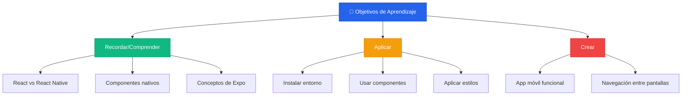

### 🎓 Resultados de Aprendizaje Esperados

| Nivel          | Acción                                        | Evidencia                             |
| -------------- | --------------------------------------------- | ------------------------------------- |
| **Básico**     | Explicar qué es React Native y para qué sirve | Participación en discusión inicial    |
| **Intermedio** | Crear componentes nativos y aplicar estilos   | App corriendo en emulador/dispositivo |
| **Avanzado**   | Construir una app con múltiples pantallas     | App completa con navegación           |

---

## 📱 ¿Qué es React Native?

### Definición

> **React Native es un framework de JavaScript que permite construir aplicaciones móviles nativas para iOS y Android usando React.**

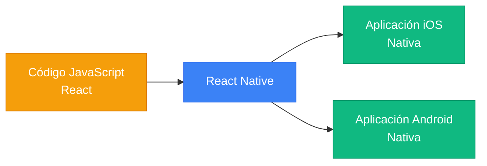

### 🔄 React vs React Native

| Aspecto         | React (Web)                       | React Native (Mobile)                    |
| --------------- | --------------------------------- | ---------------------------------------- |
| **Plataforma**  | Navegadores web                   | iOS y Android                            |
| **Elementos**   | HTML (`<div>`, `<p>`, `<button>`) | Componentes nativos (`<View>`, `<Text>`) |
| **Estilos**     | CSS tradicional                   | StyleSheet (similar a CSS)               |
| **Renderizado** | DOM del navegador                 | Componentes nativos del SO               |
| **Navegación**  | React Router                      | React Navigation                         |
| **Ejemplo**     | `<div>Hola</div>`                 | `<View><Text>Hola</Text></View>`         |

### 🎯 ¿Por qué React Native?

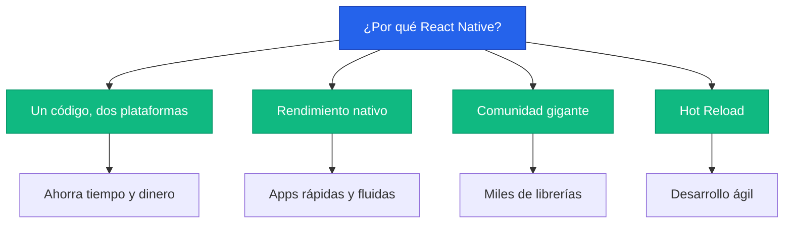

**Ventajas:**

✅ **Multiplataforma**: Escribe una vez, ejecuta en iOS y Android  
✅ **JavaScript**: Usa el lenguaje que ya conoces  
✅ **React**: Aprovecha tus conocimientos de React  
✅ **Performance**: Componentes nativos reales (no WebView)  
✅ **Hot Reload**: Ve cambios instantáneamente  
✅ **Comunidad**: Respaldado por Meta (Facebook)

**Aplicaciones famosas hechas con React Native:**

- 📷 Instagram
- 📘 Facebook
- 💬 Discord
- 🛒 Shopify
- 🎵 SoundCloud
- 📍 Uber Eats

---

## 🚀 Expo: La Forma Más Fácil

### ¿Qué es Expo?

> **Expo es una plataforma que simplifica el desarrollo con React Native. Es como "Create React App" pero para apps móviles.**

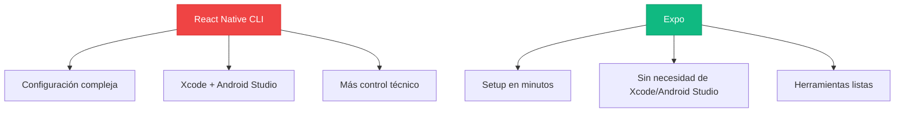

### Expo vs React Native CLI

| Aspecto                  | Expo                        | React Native CLI                 |
| ------------------------ | --------------------------- | -------------------------------- |
| **Instalación**          | ⚡ Rápida (minutos)         | 🐌 Lenta (horas)                 |
| **Configuración**        | ✅ Automática               | ❌ Manual                        |
| **Xcode/Android Studio** | ❌ No necesario             | ✅ Obligatorio                   |
| **Módulos nativos**      | ⚠️ Solo los de Expo         | ✅ Cualquiera                    |
| **Testing**              | ✅ Dispositivo físico fácil | ⚠️ Más complejo                  |
| **Ideal para**           | Aprendizaje, prototipos     | Apps con necesidades específicas |

### 📋 Requisitos

- ✅ Node.js 18+ instalado
- ✅ Smartphone con Expo Go app (iOS/Android)
- ✅ Editor de código (VS Code)
- ⚠️ Opcional: Android Studio o Xcode para emuladores

---

## 🛠️ Configuración del Entorno

### Paso 1: Instalar Expo CLI

```powershell
npm install -g expo-cli
```

Verifica la instalación:

```powershell
expo --version
```

### Paso 2: Crear Proyecto

```powershell
npx create-expo-app@latest mi-primera-app-mobile
```

```powershell
cd mi-primera-app-mobile
```

### Paso 3: Estructura del Proyecto

```
mi-primera-app-mobile/
├── 📁 assets/              ← Imágenes, fuentes
├── 📁 node_modules/        ← Dependencias
├── 📄 App.js              ← Componente principal
├── 📄 app.json            ← Configuración de Expo
├── 📄 package.json        ← Dependencias del proyecto
└── 📄 babel.config.js     ← Configuración de Babel
```

### Paso 4: Iniciar Servidor de Desarrollo

```powershell
npx expo start
```

Verás un QR en la terminal:

```
› Metro waiting on exp://192.168.1.10:8081
› Scan the QR code above with Expo Go (Android) or the Camera app (iOS)
```

### Paso 5: Abrir en tu Dispositivo

**Android:**

1. Descarga "Expo Go" desde Google Play
2. Abre Expo Go
3. Escanea el QR

**iOS:**

1. Descarga "Expo Go" desde App Store
2. Abre la app Cámara
3. Escanea el QR

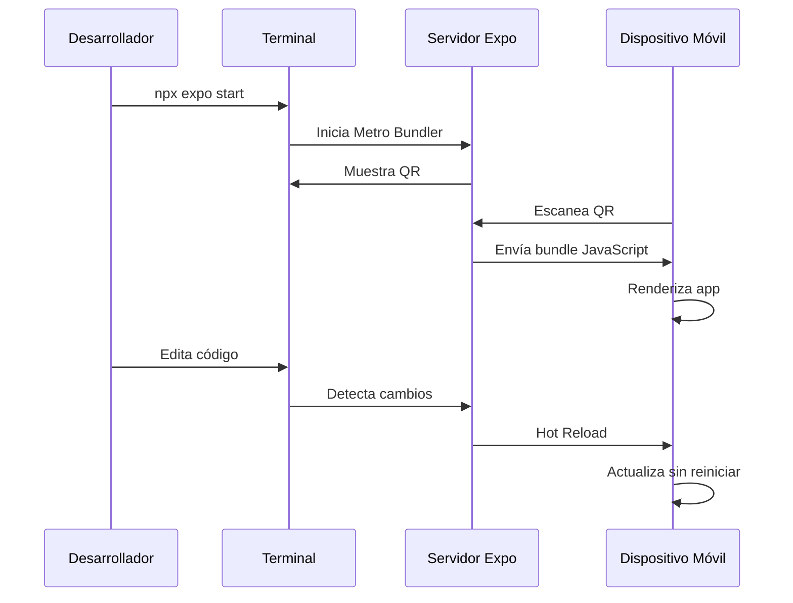

---

## 📦 Componentes Básicos de React Native

### View (Contenedor)

El equivalente a `<div>` en web:

```jsx
import { View } from "react-native";

<View>{/* Contenido aquí */}</View>;
```

### Text (Texto)

**Importante:** Todo texto DEBE estar dentro de `<Text>`:

```jsx
import { Text } from 'react-native';

<Text>Hola Mundo</Text>
<Text style={{ fontSize: 20, color: 'blue' }}>
  Texto con estilos
</Text>
```

### Image (Imagen)

```jsx
import { Image } from 'react-native';

// Imagen local
<Image source={require('./assets/logo.png')} />

// Imagen de internet
<Image
  source={{ uri: 'https://reactnative.dev/img/tiny_logo.png' }}
  style={{ width: 100, height: 100 }}
/>
```

### Button (Botón)

```jsx
import { Button, Alert } from "react-native";

<Button title="Presióname" onPress={() => Alert.alert("¡Hola!")} />;
```

### Comparación Web vs Mobile

```jsx
// ❌ React Web
<div>
  <p>Hola</p>
  <button onClick={handleClick}>Click</button>
</div>

// ✅ React Native
<View>
  <Text>Hola</Text>
  <Button title="Click" onPress={handleClick} />
</View>
```

---

## 🎨 Estilos en React Native

### StyleSheet

```jsx
import { StyleSheet, View, Text } from "react-native";

export default function App() {
  return (
    <View style={styles.container}>
      <Text style={styles.title}>Hola Mundo</Text>
    </View>
  );
}

const styles = StyleSheet.create({
  container: {
    flex: 1,
    backgroundColor: "#fff",
    alignItems: "center",
    justifyContent: "center",
  },
  title: {
    fontSize: 24,
    fontWeight: "bold",
    color: "#333",
  },
});
```

### Diferencias con CSS Web

| CSS Web                   | React Native StyleSheet        |
| ------------------------- | ------------------------------ |
| `background-color`        | `backgroundColor`              |
| `font-size`               | `fontSize`                     |
| `margin-top`              | `marginTop`                    |
| Unidades: `px`, `em`, `%` | Solo números (píxeles lógicos) |
| `display: flex`           | Flex por defecto               |

### Flexbox en React Native

```jsx
const styles = StyleSheet.create({
  container: {
    flex: 1, // Ocupa todo el espacio
    flexDirection: "column", // row | column (default)
    justifyContent: "center", // Eje principal
    alignItems: "center", // Eje cruzado
  },
});
```

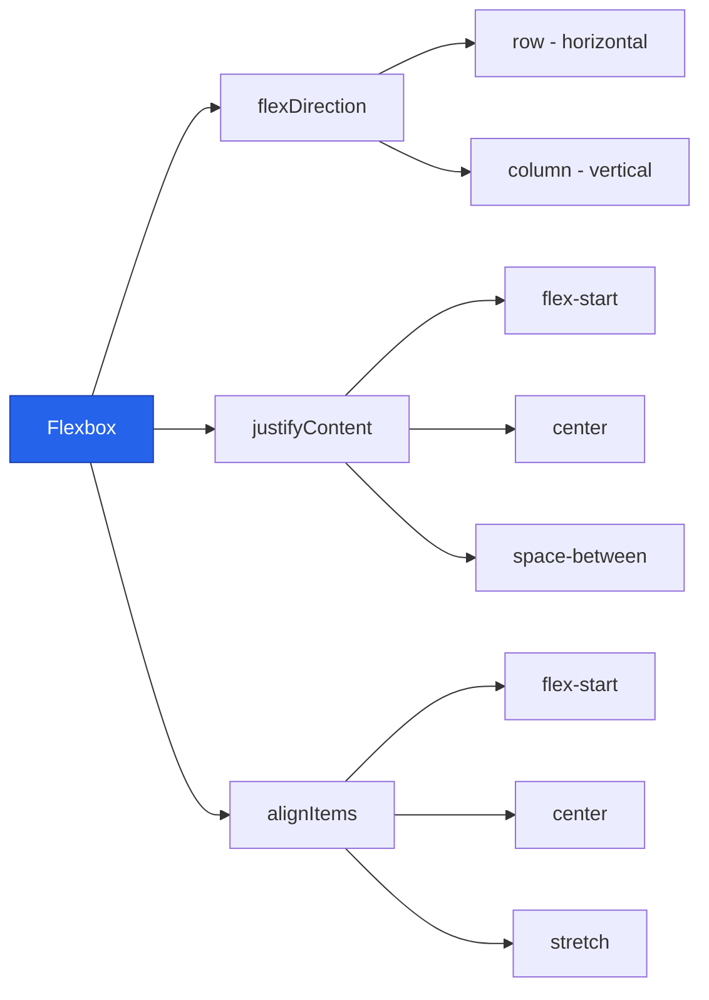

---

## 💭 Pregunta de Reflexión

> **Piensa:** ¿Por qué crees que React Native usa componentes como `<View>` y `<Text>` en lugar de `<div>` y `<p>`?
>
> _Pista: Piensa en cómo se renderiza en iOS vs Android_

---

## 📱 Ejercicio Práctico: Tarjeta de Perfil

Vamos a crear una tarjeta simple para entender cómo se combinan componentes.

```jsx
export default function App() {
  return (
    <View style={styles.card}>
      <Image
        source={{ uri: "https://i.pravatar.cc/100" }}
        style={styles.avatar}
      />
      <Text style={styles.name}>Diego Obando</Text>
      <Text style={styles.role}>Profesor 👨‍💻</Text>
    </View>
  );
}
```

**🎨 Estilos (sombras y bordes):**

```jsx
const styles = StyleSheet.create({
  card: {
    backgroundColor: "white",
    padding: 20,
    borderRadius: 15,
    shadowColor: "#000",
    shadowOpacity: 0.1,
    shadowRadius: 10,
    elevation: 5, // Android
  },
  avatar: { width: 100, height: 100, borderRadius: 50 },
  name: { fontSize: 24, fontWeight: "bold" },
  role: { fontSize: 16, color: "#666" },
});
```

> 💡 **Nota:** `elevation` es para Android, `shadow*` es para iOS.

---

## 🎯 Componentes Interactivos

### Botones Táctiles

En React Native hay 2 formas de hacer botones:

| Componente           | Cuándo usar                        |
| -------------------- | ---------------------------------- |
| `<Button>`           | Botones simples y rápidos          |
| `<TouchableOpacity>` | Botones personalizados con estilos |

**Ejemplo con TouchableOpacity:**

```jsx
<TouchableOpacity style={styles.btn} onPress={() => Alert.alert("¡Hola!")}>
  <Text style={styles.btnText}>Presióname</Text>
</TouchableOpacity>
```

### Entrada de Texto (TextInput)

```jsx
import { useState } from "react";

export default function App() {
  const [texto, setTexto] = useState("");

  return (
    <TextInput
      placeholder="Escribe aquí..."
      value={texto}
      onChangeText={setTexto}
      style={styles.input}
    />
  );
}
```

### ScrollView para Contenido Largo

```jsx
<ScrollView>
  <Text>Contenido 1</Text>
  <Text>Contenido 2</Text>
  {/* ... más contenido ... */}
</ScrollView>
```

> ⚠️ **Importante:** `ScrollView` carga TODO el contenido de una vez. Para listas largas usa `FlatList`.

---

## 🗺️ Navegación con Expo Router

### ¿Qué es Expo Router?

Es la forma **moderna y simple** de hacer navegación en apps Expo. Funciona como Next.js (basado en carpetas).

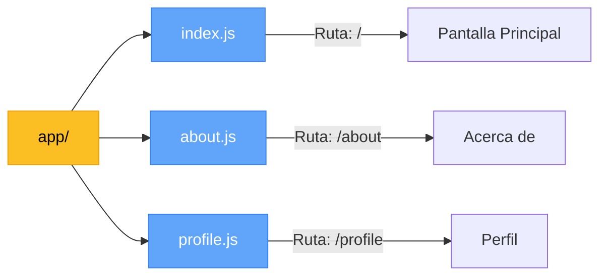

**🎯 Ventaja:** No necesitas configurar rutas manualmente, ¡el nombre del archivo ES la ruta!

---

## 🚀 Setup de Expo Router

### Paso 1: Instalar dependencias

```powershell
npx expo install expo-router react-native-safe-area-context react-native-screens expo-linking expo-constants expo-status-bar
```

### Paso 2: Configurar `package.json`

Agregar el entry point:

```json
{
  "main": "expo-router/entry"
}
```

### Paso 3: Estructura de Carpetas

```
mi-app/
├── app/
│   ├── _layout.js       <- Layout principal
│   ├── index.js         <- Pantalla principal (/)
│   └── details.js       <- Pantalla detalles (/details)
└── package.json
```

---

## 📂 Entendiendo la Estructura de `app/`

### Conceptos Clave

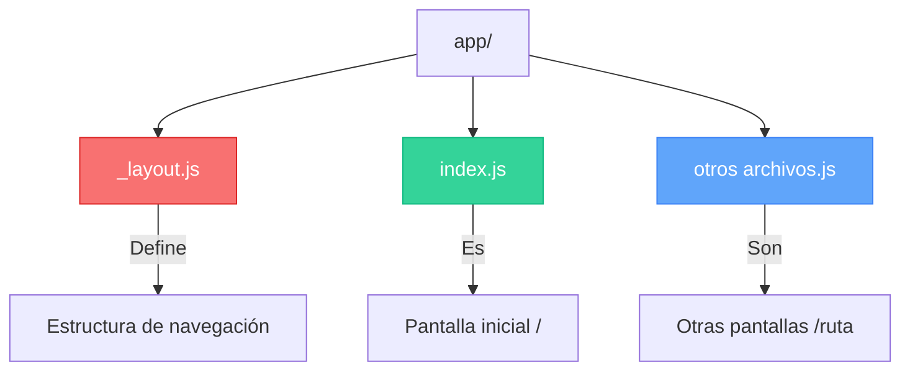

> 💡 **`_layout.js`** = Define CÓMO se navega (Stack, Tabs, etc.)  
> 💡 **`index.js`** = Pantalla principal (como index.html)  
> 💡 **Otros archivos** = Cada archivo = 1 pantalla

---

## 📝 Ejemplo: Navegación Básica

### app/\_layout.js

```jsx
import { Stack } from "expo-router";

export default function Layout() {
  return <Stack />;
}
```

> 🧠 **¿Qué hace `<Stack>`?**  
> Permite navegar entre pantallas con animación de "apilar" (como pilas de cartas).

### app/index.js

```jsx
import { View, Text, Button } from "react-native";
import { Link } from "expo-router";

export default function Home() {
  return (
    <View style={{ flex: 1, justifyContent: "center", alignItems: "center" }}>
      <Text style={{ fontSize: 24 }}>Pantalla Principal</Text>
      <Link href="/details" asChild>
        <Button title="Ir a Detalles" />
      </Link>
    </View>
  );
}
```

### app/details.js

```jsx
import { View, Text, Button } from "react-native";
import { useRouter } from "expo-router";

export default function Details() {
  const router = useRouter();

  return (
    <View style={{ flex: 1, justifyContent: "center", alignItems: "center" }}>
      <Text style={{ fontSize: 24 }}>Detalles</Text>
      <Button title="Volver" onPress={() => router.back()} />
    </View>
  );
}
```

---

## 🔗 Navegación: Componente Link vs Hook useRouter

### Opción 1: Con `<Link>` (Recomendado)

```jsx
import { Link } from "expo-router";

<Link href="/profile">
  <Text>Ir a Perfil</Text>
</Link>;
```

### Opción 2: Con `useRouter()` (Programático)

```jsx
import { useRouter } from "expo-router";

const router = useRouter();
<Button title="Ir" onPress={() => router.push("/profile")} />;
```

**📊 Comparación:**

| Método        | Cuándo usar                                      |
| ------------- | ------------------------------------------------ |
| `<Link>`      | Navegación simple, enlaces de texto              |
| `useRouter()` | Navegación después de validar datos, formularios |

---

## 📦 Pasar Datos entre Pantallas

### Enviar parámetros con Link

```jsx
<Link href={{ pathname: "/user", params: { id: 123, name: "Diego" } }}>
  <Text>Ver Usuario</Text>
</Link>
```

### Recibir parámetros con useLocalSearchParams

```jsx
// app/user.js
import { useLocalSearchParams } from "expo-router";

export default function User() {
  const { id, name } = useLocalSearchParams();

  return (
    <View>
      <Text>ID: {id}</Text>
      <Text>Nombre: {name}</Text>
    </View>
  );
}
```

**🔄 Flujo de datos:**

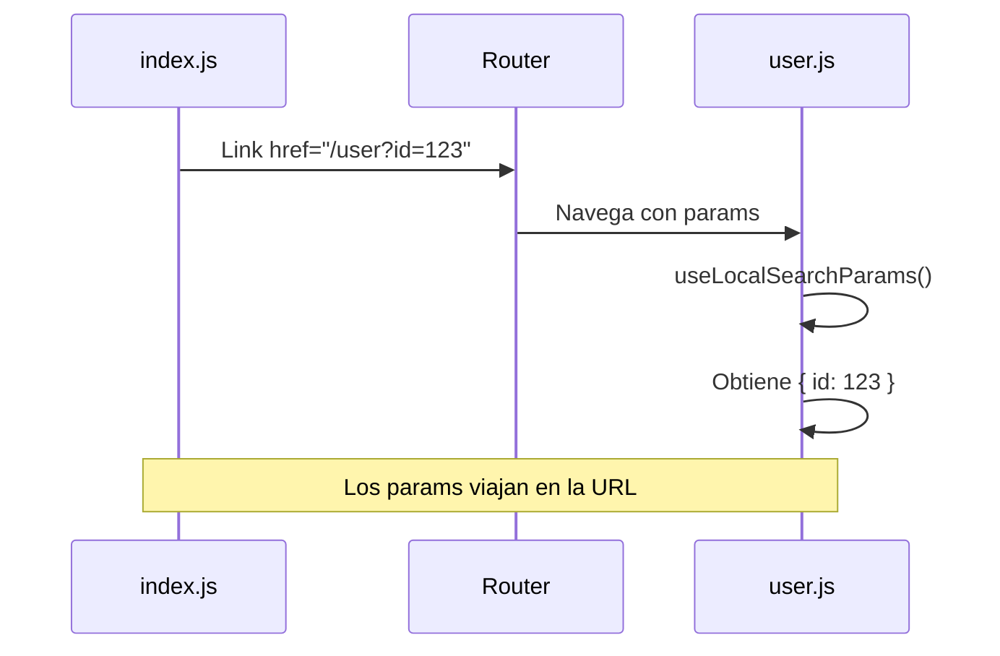

---

## 🧩 Mini Proyecto: App de Tareas

### Estructura

```
app/
├── _layout.js       <- Stack navigator
├── index.js         <- Lista de tareas
└── add-task.js      <- Agregar tarea
```

### app/index.js (Lista)

```jsx
import { View, Text, FlatList, Button } from "react-native";
import { Link } from "expo-router";
import { useState } from "react";

export default function Home() {
  const [tasks] = useState([
    { id: "1", title: "Estudiar React Native" },
    { id: "2", title: "Hacer ejercicios" },
  ]);

  return (
    <View style={{ flex: 1, padding: 20 }}>
      <FlatList
        data={tasks}
        keyExtractor={(item) => item.id}
        renderItem={({ item }) => (
          <Text style={{ padding: 10 }}>{item.title}</Text>
        )}
      />
      <Link href="/add-task" asChild>
        <Button title="+ Nueva Tarea" />
      </Link>
    </View>
  );
}
```

### app/add-task.js (Agregar)

```jsx
import { View, TextInput, Button } from "react-native";
import { useState } from "react";
import { useRouter } from "expo-router";

export default function AddTask() {
  const [title, setTitle] = useState("");
  const router = useRouter();

  const handleSave = () => {
    if (title.trim()) {
      // Aquí guardarías la tarea
      router.back();
    }
  };

  return (
    <View style={{ flex: 1, padding: 20 }}>
      <TextInput
        placeholder="Título de la tarea"
        value={title}
        onChangeText={setTitle}
        style={{ borderWidth: 1, padding: 10, marginBottom: 20 }}
      />
      <Button title="Guardar" onPress={handleSave} />
    </View>
  );
}
```

---

## 📚 Tabla de Componentes Esenciales

| Componente           | Uso                | Ejemplo           |
| -------------------- | ------------------ | ----------------- |
| `<View>`             | Contenedor         | Layout, cajas     |
| `<Text>`             | Texto              | Títulos, párrafos |
| `<Image>`            | Imágenes           | Fotos, avatares   |
| `<ScrollView>`       | Scroll simple      | Contenido mediano |
| `<FlatList>`         | Listas optimizadas | 100+ items        |
| `<TextInput>`        | Input              | Formularios       |
| `<TouchableOpacity>` | Botón táctil       | Botones custom    |
| `<Button>`           | Botón básico       | Acciones rápidas  |

---

## � Íconos y Fuentes Personalizadas

### ¿Por qué son importantes?

Los íconos y fuentes hacen que tu app se vea **profesional** y **moderna**.

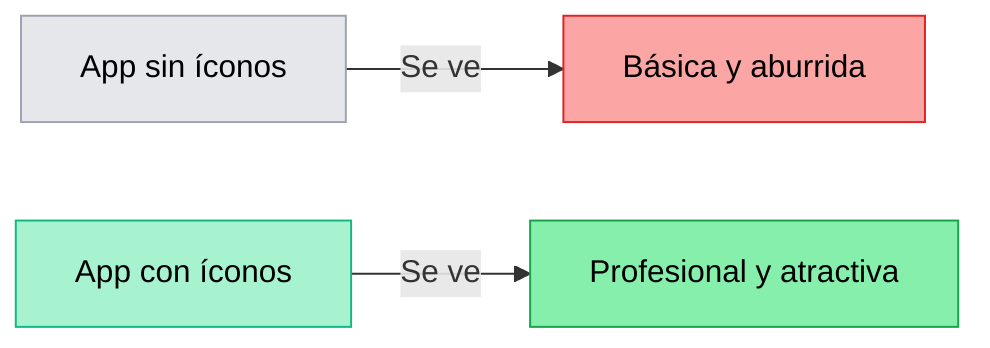

---

### 🎯 Íconos con Expo Vector Icons

Expo incluye **miles de íconos** sin instalar nada extra. Vienen de bibliotecas populares:

| Biblioteca        | Cantidad | Ejemplos               |
| ----------------- | -------- | ---------------------- |
| **Ionicons**      | 1000+    | home, person, settings |
| **FontAwesome**   | 1500+    | heart, star, user      |
| **MaterialIcons** | 2000+    | menu, search, delete   |
| **AntDesign**     | 800+     | check, close, plus     |

**🔍 Buscar íconos:** [https://icons.expo.fyi](https://icons.expo.fyi)

---

### 📝 Uso Básico de Íconos

```jsx
import { Ionicons } from "@expo/vector-icons";

export default function App() {
  return (
    <View style={styles.container}>
      <Ionicons name="home" size={32} color="blue" />
      <Ionicons name="heart" size={32} color="red" />
      <Ionicons name="star" size={32} color="gold" />
    </View>
  );
}
```

> 💡 **No necesitas instalar nada**, viene incluido con Expo.

---

### 🎨 Íconos en Botones

```jsx
import { TouchableOpacity, Text } from "react-native";
import { FontAwesome } from "@expo/vector-icons";

<TouchableOpacity style={styles.button}>
  <FontAwesome name="plus" size={20} color="white" />
  <Text style={styles.buttonText}>Agregar</Text>
</TouchableOpacity>;

const styles = StyleSheet.create({
  button: {
    flexDirection: "row",
    alignItems: "center",
    gap: 8,
    backgroundColor: "#3b82f6",
    padding: 12,
    borderRadius: 8,
  },
  buttonText: { color: "white", fontWeight: "bold" },
});
```

**Resultado visual:**

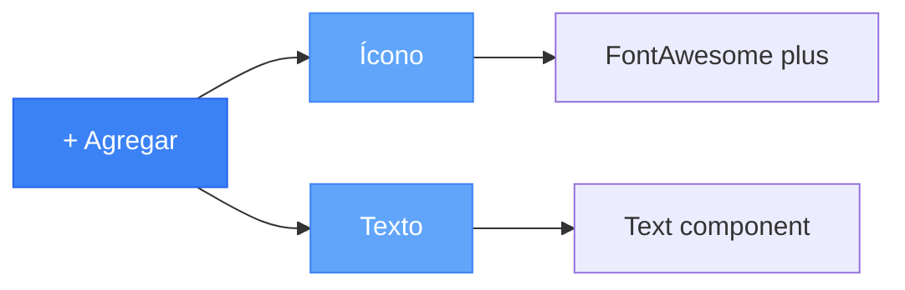

---

### 🔄 Cambiar Biblioteca de Íconos

Cada biblioteca tiene su propio estilo:

```jsx
// Material Design (Android style)
import { MaterialIcons } from "@expo/vector-icons";
<MaterialIcons name="favorite" size={24} color="red" />;

// iOS style
import { Ionicons } from "@expo/vector-icons";
<Ionicons name="heart" size={24} color="red" />;

// Font Awesome (web style)
import { FontAwesome } from "@expo/vector-icons";
<FontAwesome name="heart" size={24} color="red" />;
```

---

### 📱 Ejemplo Práctico: Menú con Íconos

```jsx
import { View, Text, TouchableOpacity, StyleSheet } from "react-native";
import { Ionicons } from "@expo/vector-icons";

export default function MenuScreen() {
  return (
    <View style={styles.container}>
      <MenuItem icon="home-outline" label="Inicio" />
      <MenuItem icon="person-outline" label="Perfil" />
      <MenuItem icon="settings-outline" label="Ajustes" />
      <MenuItem icon="log-out-outline" label="Salir" />
    </View>
  );
}

function MenuItem({ icon, label }) {
  return (
    <TouchableOpacity style={styles.menuItem}>
      <Ionicons name={icon} size={24} color="#333" />
      <Text style={styles.menuText}>{label}</Text>
    </TouchableOpacity>
  );
}

const styles = StyleSheet.create({
  container: { padding: 20 },
  menuItem: {
    flexDirection: "row",
    alignItems: "center",
    padding: 15,
    gap: 15,
  },
  menuText: { fontSize: 16 },
});
```

---

## 🔤 Fuentes Personalizadas con Google Fonts

### Paso 1: Instalar expo-font

```powershell
npx expo install expo-font
```

### Paso 2: Usar un Hook para Cargar Fuentes

```jsx
import { useFonts } from "expo-font";
import { useEffect } from "react";
import * as SplashScreen from "expo-splash-screen";

// Prevenir que desaparezca el splash screen
SplashScreen.preventAutoHideAsync();

export default function App() {
  const [fontsLoaded] = useFonts({
    "Roboto-Bold": require("./assets/fonts/Roboto-Bold.ttf"),
    "Roboto-Regular": require("./assets/fonts/Roboto-Regular.ttf"),
  });

  useEffect(() => {
    if (fontsLoaded) {
      SplashScreen.hideAsync();
    }
  }, [fontsLoaded]);

  if (!fontsLoaded) return null;

  return (
    <View>
      <Text style={{ fontFamily: "Roboto-Bold" }}>Hola Mundo</Text>
    </View>
  );
}
```

---

### 🚀 Forma Más Fácil: Google Fonts con Expo

```powershell
npx expo install expo-font @expo-google-fonts/inter
```

**Código simplificado:**

```jsx
import { useFonts, Inter_400Regular, Inter_700Bold } from '@expo-google-fonts/inter';

export default function App() {
  const [fontsLoaded] = useFonts({
    Inter_400Regular,
    Inter_700Bold,
  });

  if (!fontsLoaded) return null;

  return (
    <Text style={{ fontFamily: 'Inter_400Regular' }}>Texto normal</Text>
    <Text style={{ fontFamily: 'Inter_700Bold' }}>Texto en negrita</Text>
  );
}
```

---

### 📊 Proceso de Carga de Fuentes

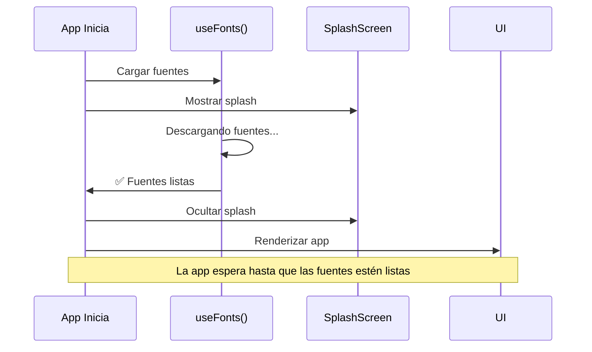

> 🧠 **¿Por qué esperar?** Si renderizas texto antes de cargar la fuente, se verá con fuente default y luego "saltará".

---

### 🎨 Fuentes Más Populares

| Fuente      | Paquete                      | Cuándo usar             |
| ----------- | ---------------------------- | ----------------------- |
| **Inter**   | `@expo-google-fonts/inter`   | Apps modernas y limpias |
| **Roboto**  | `@expo-google-fonts/roboto`  | Material Design         |
| **Poppins** | `@expo-google-fonts/poppins` | Títulos llamativos      |
| **Lato**    | `@expo-google-fonts/lato`    | Textos largos legibles  |

---

### 💼 Ejemplo Completo: App con Íconos y Fuentes

```jsx
import { View, Text, StyleSheet } from "react-native";
import { Ionicons } from "@expo/vector-icons";
import { useFonts, Poppins_600SemiBold } from "@expo-google-fonts/poppins";

export default function ProfileCard() {
  const [fontsLoaded] = useFonts({ Poppins_600SemiBold });
  if (!fontsLoaded) return null;

  return (
    <View style={styles.card}>
      <Ionicons name="person-circle" size={80} color="#3b82f6" />
      <Text style={styles.name}>Diego Obando</Text>

      <View style={styles.stats}>
        <Stat icon="heart" value="125" label="Likes" />
        <Stat icon="people" value="89" label="Seguidores" />
      </View>
    </View>
  );
}

function Stat({ icon, value, label }) {
  return (
    <View style={styles.stat}>
      <Ionicons name={icon} size={20} color="#666" />
      <Text style={styles.value}>{value}</Text>
      <Text style={styles.label}>{label}</Text>
    </View>
  );
}

const styles = StyleSheet.create({
  card: {
    backgroundColor: "white",
    padding: 20,
    borderRadius: 15,
    alignItems: "center",
  },
  name: {
    fontFamily: "Poppins_600SemiBold",
    fontSize: 24,
    marginTop: 10,
  },
  stats: {
    flexDirection: "row",
    gap: 30,
    marginTop: 20,
  },
  stat: { alignItems: "center" },
  value: { fontSize: 18, fontWeight: "bold", marginTop: 5 },
  label: { fontSize: 12, color: "#666" },
});
```

---

### 🎯 Tips Importantes

| Tip                                      | Explicación                                           |
| ---------------------------------------- | ----------------------------------------------------- |
| **Cargar solo lo necesario**             | No cargues 10 fuentes si solo usas 2                  |
| **Usar `if (!fontsLoaded) return null`** | Evita que la app se rompa                             |
| **Prefiere Expo Google Fonts**           | Más fácil que descargar archivos .ttf                 |
| **Cachear fuentes**                      | En producción, las fuentes se cachean automáticamente |

---

### 💡 Recursos para Íconos y Fuentes

- **Buscador de íconos:** [https://icons.expo.fyi](https://icons.expo.fyi)
- **Google Fonts para Expo:** [Directorio de fuentes](https://github.com/expo/google-fonts)
- **Documentación:** [Expo Font Docs](https://docs.expo.dev/versions/latest/sdk/font/)

---

## �🎓 Resumen de la Clase

### ✅ Conceptos Aprendidos

1. **Componentes básicos** de React Native
2. **Estilos con StyleSheet** y Flexbox
3. **Navegación moderna** con Expo Router
4. **Pasar datos** entre pantallas
5. **Componentes interactivos** (botones, inputs)

### 🔑 Diferencias Clave: React vs React Native

| Aspecto    | React Web       | React Native           |
| ---------- | --------------- | ---------------------- |
| Contenedor | `<div>`         | `<View>`               |
| Texto      | `<p>`, `<span>` | `<Text>` (obligatorio) |
| Estilos    | CSS files       | StyleSheet             |
| Navegación | React Router    | Expo Router            |
| Scroll     | CSS overflow    | `<ScrollView>`         |

---

---

## 💭 Pregunta Final

> **Reflexiona:** ¿Por qué crees que Expo Router usa carpetas para definir rutas en lugar de configurar rutas manualmente?
>
> _Pista: Piensa en la ventaja de "convención sobre configuración"_

---

## 📖 Recursos para Practicar

- [Expo Router Docs](https://docs.expo.dev/router/introduction/)
- [React Native Docs](https://reactnative.dev/)
- [Expo Snack](https://snack.expo.dev/) - Editor online para probar código

---
